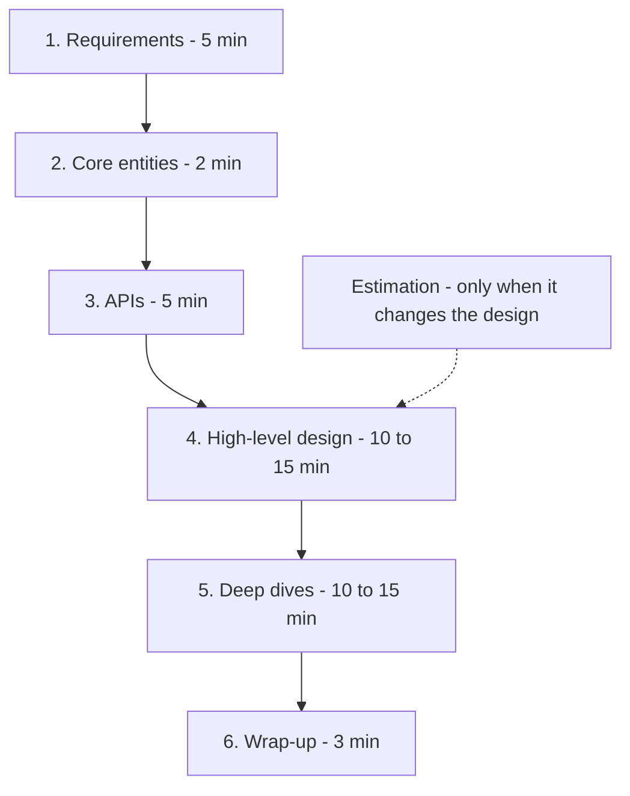

# Interview Framework

**In one line:** Run the 45-min HLD round on a fixed structure (requirements → entities → API → HLD → deep dives → wrap-up), so you drive the conversation and tick every box the interviewer scores.

> **Example:** The interviewer says "Design WhatsApp". A weak candidate starts drawing boxes right away and finds out 30 min later that group chat was never in scope. A strong candidate asks questions for the first 5 min, then designs in one clean flow, and spends the last 15 min on exactly the deep dive the interviewer wanted to see.

## 45-min flow

| Step | Time | What to do | Output (on the board) |
|---|---|---|---|
| **1. Requirements** | ~5 min | Functional (3–4 core features), non-functional (scale, latency, consistency vs availability), out of scope | Two lists: FR and NFR |
| **2. Core entities** | ~2 min | Main nouns: User, Tweet, Follow, Booking | Entity list (no columns yet) |
| **3. APIs** | ~5 min | One endpoint per FR. REST is enough | Lines like `POST /bookings` |
| **4. HLD** | 10–15 min | Client → gateway → services → DB/cache/queue. Walk each FR's flow through the diagram | One clean diagram |
| **5. Deep dives** | 10–15 min | Satisfy the NFRs: scale, contention, failure, hot keys | Solid solutions for 2–3 problems |
| **6. Wrap-up** | ~3 min | Bottlenecks, trade-offs, "if I had more time" | 3–4 bullet improvements |

**Estimation:** Don't do 10 min of math every time. Only work out the number that changes a decision ("it's 12 writes/sec, one Postgres is enough" or "it's 1M QPS of reads, we need a cache"). Ask the interviewer: "Should I do estimation now, or where it's needed?"

## What the interviewer scores (rubric)

| Step | What is scored | Red flag |
|---|---|---|
| Requirements | Scoping the problem, asking the right questions, stating NFRs in numbers | Starting the design without asking |
| Entities + API | Clean abstraction, good naming, thinking about pagination/idempotency | 20 endpoints, or forgetting the API |
| HLD | A working end-to-end design, every FR covered | Buzzwords without a flow ("put Kafka here") |
| Deep dives | Depth, trade-offs, comparing alternatives | Naming only one option, not explaining "why" |
| Communication (whole time) | Thinking out loud, catching the interviewer's hints | Thinking silently for 5 min, or cutting the interviewer off |

Remember the 4 big rubric buckets: **Problem navigation, Solution design, Technical depth, Communication**.

## How to drive the conversation

- Signpost at the start of each step: "Now I'll define the APIs, then the HLD."
- Check in at the end of each step: "Does this look right, or would you like to go deeper on any part?"
- Build a **simple working design** first, then scale it. Don't bring in sharding at the start.
- Propose the deep dive yourself: "I think the most interesting part is double booking. Shall we go there?"
- If the interviewer drops a hint ("what if a celebrity has 10M followers?"), that is the signal. Go in that direction right away.

## Ready phrases

- "Before I start the design, I'd like to ask a few questions."
- "I'm assuming the read:write ratio is ~100:1. Is that fine?"
- "There are two options here: A and B. A gives this benefit, B gives that. In this case I'll pick A because..."
- "This is a single point of failure. I'll handle it with replicas."
- "I'll keep it simple for now, and we'll scale it in the deep dive."

## How to handle "I don't know"

- Don't lie. The interviewer catches it immediately.
- Say: "I don't know the exact internals, but thinking from first principles..." and then reason it out.
- If you don't know a tool's name, describe the concept: "I need an append-only log that is partitioned and can be replayed, like Kafka."
- If you get stuck, simplify: "Let me first think about it on a single server, then distribute it."

## Junior vs senior: what changes

| Level | Expectation |
|---|---|
| **Junior / SDE-1** | A working HLD, basic components in the right place (LB, cache, DB). It's fine if the interviewer guides you |
| **Mid / SDE-2** | Drive it yourself, do 1–2 deep dives well, talk about trade-offs |
| **Senior / SDE-3+** | The interviewer should barely need to speak. Proactively cover bottlenecks, failure modes, consistency choices, cost and operational topics (monitoring, rollout). Deeper deep dives |

The biggest senior signal: **you say what can break yourself**, before the interviewer asks.

## Where it is used

Every question follows this flow. To practice, start with:
- [URL Shortener](../02-questions/t1-01-url-shortener.md): the simplest one for learning the flow
- [BookMyShow](../02-questions/t1-05-bookmyshow.md): deciding consistency from requirements
- [News Feed](../02-questions/t1-03-news-feed.md): the fan-out trade-off in the deep dive
- [WhatsApp](../02-questions/t1-04-whatsapp-chat.md), [Uber](../02-questions/t1-06-uber.md), [YouTube](../02-questions/t1-07-youtube.md), [Payment System](../02-questions/t1-11-payment-system.md)

Read alongside: [Numbers cheatsheet](21-numbers-cheatsheet.md), [Red flags](22-red-flags.md).

## Say this in the interview

> "I'll spend the first 5 min clearing up requirements, then entities and APIs, then a simple HLD that covers all functional requirements. After that we'll deep dive into the non-functional requirements, like scale and consistency. If you want more focus anywhere, just let me know."

## Common mistakes

- Skipping requirements and jumping straight to the diagram.
- Wasting 10 min on estimation and having no time left for the deep dive.
- Going for a complex design (sharding, multi-region) up front when a simple one would work.
- Picking a component without giving an alternative and the "why".
- Ignoring the interviewer's hint and sticking to your own plan.
- Skipping the wrap-up. Talking trade-offs in the last 3 min is free marks.

## Checklist

- [ ] I can tell the 6 steps of the 45 min and their time split without looking
- [ ] I can tell what the interviewer scores at each step
- [ ] I can use signposting and check-in phrases naturally
- [ ] I can handle an "I don't know" situation from first principles
- [ ] I can explain the difference between junior and senior expectations
