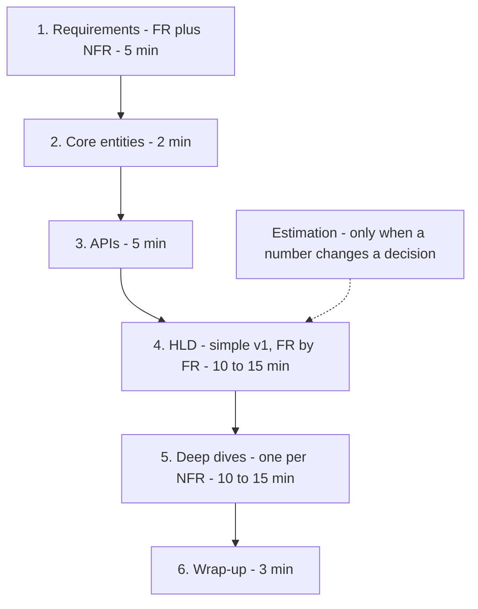

# Interview Framework

**In one line:** Run the 45-min HLD round in a fixed order: FR → quantified NFR → entities → API → HLD starting from a simple v1 → NFR-driven deep dives → wrap-up. You drive the conversation and tick every box the interviewer scores.

> **Example:** "Design WhatsApp". A weak candidate starts drawing boxes and finds out 30 min later that group chat was never in scope. A strong candidate fixes scope and numbers in 5 min, builds a simple v1, then does exactly the deep dives the NFRs call for.

## 45-min flow

| Step | Time | What to do | Output (on the board) |
|---|---|---|---|
| **1a. Functional req.** | ~2 min | 3–4 core "Users should be able to…" lines + an explicit **out of scope** | FR list |
| **1b. Non-functional req.** | ~3 min | In numbers: `p99 < 200 ms`, `99.99% reads`, `100M DAU, 10:1 read:write`. State the **CAP choice**: "strong consistency for booking, eventual for search" | Ranked NFR list |
| **2. Core entities** | ~2 min | Nouns only: User, Show, Seat, Booking. No columns yet | Entity list |
| **3. APIs** | ~5 min | One endpoint per FR. REST is enough | Lines like `POST /bookings` |
| **4. HLD** | 10–15 min | Simple v1 (client → service → one DB). Then satisfy the FRs one by one. Add a component only when a requirement or number demands it | One clean diagram |
| **5. Deep dives** | 10–15 min | Tie each deep dive to an NFR: "NFR: no double booking → seat lock". End with the trade-off | 2–3 solid solutions |
| **6. Wrap-up** | ~3 min | Bottlenecks, failure modes, "if I had more time" | 3–4 improvements |

Keep ~5 min aside for intro and buffer. Do **estimation** only where a number changes a decision ("12 writes/sec, one Postgres is enough" or "1M read QPS, we need a cache"). Skip the rest of the math.

## What the interviewer scores (rubric)

| Dimension | Strong signal | Red flag |
|---|---|---|
| **Requirements / scoping** | 3–4 FRs, out of scope, NFRs in numbers, CAP choice | Designing without asking, "fast and scalable" |
| **Design soundness** | A simple v1 that covers every FR, one request traced end to end | Boxes without a flow, an FR left out |
| **Technology justification** | Every component: requirement/number + why it beats the simpler option | "Put Kafka here" with no reason |
| **Deep-dive depth** | Deep dives tied to an NFR, alternatives compared | Deep dive on a random topic, only one option |
| **Trade-offs & failure handling** | What we sacrifice, what can break, how we recover | Calling every choice "best", leaving SPOFs |
| **Communication** | Signposting, thinking out loud, catching hints | 5 min of silence, cutting the interviewer off |

## How to drive the conversation

- Signpost at the start of each step: "Now APIs, then HLD." Check in at the end: "Does this look right?"
- Build a **simple working v1** first, then evolve it. Don't bring in sharding, Kafka or microservices at the start.
- Give every new box one line: "This cache is here because we have 100K read QPS, the DB alone won't handle it."
- Propose the deep dive yourself: "The riskiest NFR is no double booking. Shall we go there?"
- A hint ("what if a celebrity has 10M followers?") is the signal. Go in that direction right away.

## Ready phrases

- "Before I start the design, I'd like to ask a few questions."
- "I'm assuming read:write is ~100:1. Is that fine?"
- "There are two options: A and B. A gives this, B gives that. Here I'll pick A because... and what we sacrifice is X."
- "This is a single point of failure. I'll handle it with replicas."

## How to handle "I don't know"

- Don't lie. Say: "I don't know the exact internals, but from first principles..." and reason it out.
- If you don't know a tool's name, describe the concept: "I need a partitioned, replayable append-only log, like Kafka."
- If you get stuck, simplify: "Let me first think on a single server, then distribute."

## Junior vs senior: what changes

| Level | Expectation |
|---|---|
| **Mid-level (SDE-1/2)** | A working design that covers every FR + one request traced end to end. Some guidance from the interviewer is fine |
| **Senior (SDE-3)** | Raise bottlenecks, failure modes, consistency choices and trade-offs **yourself**, before being asked. Deeper deep dives, backed by numbers |
| **Staff+** | Drive scope and evolution: v1 → 10x → multi-region. Org constraints: team ownership, migration, cost, operability |

The biggest senior signal: **you say what can break yourself**, before the interviewer asks.

## Where it is used

Every question follows this flow. To practice, start with:
- [URL Shortener](../02-questions/t1-01-url-shortener.md): the simplest one for learning the flow
- [BookMyShow](../02-questions/t1-05-bookmyshow.md): deciding consistency from requirements
- [News Feed](../02-questions/t1-03-news-feed.md): the fan-out trade-off in the deep dive
- [WhatsApp](../02-questions/t1-04-whatsapp-chat.md), [Uber](../02-questions/t1-06-uber.md), [YouTube](../02-questions/t1-07-youtube.md), [Payment System](../02-questions/t1-11-payment-system.md)

Read alongside: [Numbers cheatsheet](21-numbers-cheatsheet.md), [Red flags](22-red-flags.md).

## Say this in the interview

> "First 5 min on requirements: core features and NFRs with numbers. Then entities and APIs, then a simple v1 that covers every functional requirement. After that, one deep dive per NFR, like scale and consistency. If you want more focus anywhere, just let me know."

## Common mistakes

- Skipping requirements and jumping straight to the diagram.
- Wasting 10 min on estimation and having no time left for the deep dive.
- Going for a complex design (sharding, multi-region) up front when a simple one would work.
- Picking a component without a requirement, a number and an alternative.
- Keeping NFRs vague ("fast", "scalable") and not tying deep dives to any NFR.
- Ignoring the interviewer's hint and sticking to your own plan.
- Skipping the wrap-up. Talking trade-offs in the last 3 min is free marks.

## Checklist

- [ ] I can tell the 6 steps of the 45 min and their time split without looking
- [ ] I can tell what the interviewer scores at each step
- [ ] I can use signposting and check-in phrases naturally
- [ ] I can handle an "I don't know" situation from first principles
- [ ] I can explain the difference between junior and senior expectations
