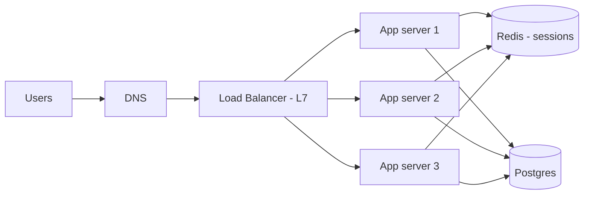

# Scaling Basics

**In one line:** When traffic grows, either make one machine bigger (vertical), or add more machines (horizontal) and spread traffic with a load balancer. For that, services must be stateless.

> **Example:** During the IPL final, traffic on Hotstar goes up 10x. One big server won't do it. You need hundreds of small servers, a load balancer in front, and if any server dies the user should not notice.

## Vertical vs horizontal

| | Vertical (scale up) | Horizontal (scale out) |
|---|---|---|
| What | A machine with bigger CPU/RAM | More machines |
| Pros | Simple, no code change, no network hops | Almost unlimited scale, fault tolerant |
| Cons | Hardware limit, expensive, SPOF | Must be stateless, needs an LB, distributed complexity |
| When | At the start, DB primary, small load | Web/app tier, high traffic |

Default in the interview: **app tier horizontal, DB vertical + replicas first, then sharding**.

## Load balancer

### L4 vs L7

| | L4 (transport) | L7 (application) |
|---|---|---|
| What it looks at | IP + port (TCP/UDP) | HTTP path, headers, cookies |
| Speed | Very fast, low CPU | A bit slower (TLS termination, parsing) |
| Routing | Connection level only | `/api/*` to one service, `/img/*` to another |
| Example | AWS NLB, HAProxy TCP mode | AWS ALB, Nginx, Envoy |
| When | WebSocket/TCP heavy, raw throughput | Microservices, path routing, auth, canary |

### Algorithms

| Algorithm | How | When |
|---|---|---|
| Round robin | One after another | Servers are the same and requests are similar |
| Weighted round robin | Bigger server gets more | Mixed hardware |
| Least connections | The one with fewest active connections | Long-lived requests (WebSocket, uploads) |
| IP hash / consistent hash | Same client → same server | When you need stickiness, or want to use a local cache |

The LB itself must not become a SPOF: use an **active-passive pair** or a managed LB (ALB). Use health checks to remove dead servers.

## Stateless services and session handling

Stateless means: the server keeps no user data in its own memory. Any request can go to any server.

| Session option | How | Problem |
|---|---|---|
| Sticky sessions | LB sends the same user to the same server | If the server dies the session is gone, uneven load |
| Central session store | Session in Redis, all servers read it | One extra hop (~1ms), Redis must be HA |
| JWT token | State lives in the client's token, server only verifies it | Hard to revoke, token size |

Default answer: **JWT for auth + Redis for the rest of the session state**.

## Autoscaling

- Scale on a metric: CPU > 70%, request latency, or queue depth (best for workers).
- Scale up fast, scale down slow (cooldown), otherwise you get flapping.
- Autoscaling takes minutes. For known spikes (IPL, Big Billion Day), **pre-warm**.
- The DB does not autoscale that easily. When the app tier scales up, DB connections can blow up, so use connection pooling (PgBouncer).

## SPOF (single point of failure)

Look at each box and ask: "What happens if this dies?"
- App server → multiple instances + LB
- LB → redundant pair / managed
- DB → replica + automatic failover
- Cache → Redis replica + Sentinel/Cluster
- Region → multi-AZ at minimum, multi-region if critical

## When to use what

- Small traffic, MVP: one vertical server + managed DB. Don't over-engineer.
- Read-heavy: horizontal app + cache + read replicas.
- Spiky traffic: autoscaling + queue as a buffer + pre-warm.

## Where it is used

- [URL Shortener](../02-questions/t1-01-url-shortener.md): stateless redirect servers behind LB
- [News Feed](../02-questions/t1-03-news-feed.md): horizontal feed service
- [WhatsApp](../02-questions/t1-04-whatsapp-chat.md): L4/least-connections for WebSocket
- [YouTube](../02-questions/t1-07-youtube.md): autoscaled transcoding workers
- [BookMyShow](../02-questions/t1-05-bookmyshow.md), [Flash Sale](../02-questions/t2-15-flash-sale.md): spike handling, pre-warm

## Say this in the interview

> "I'll keep all app services stateless, with sessions in Redis and auth through JWT. In front there will be an L7 load balancer that routes by path and runs health checks. The app tier will autoscale on CPU and latency, and we'll pre-warm for known spikes."

## Common mistakes

- Only one LB and one DB in the diagram, and no mention of SPOF at all.
- Making sticky sessions the default.
- Saying "we'll autoscale" as if it were instant.
- Scaling the app tier but ignoring DB connections.
- Saying round robin for WebSocket, when least connections is better.

## Checklist

- [ ] I can tell the vertical vs horizontal trade-off and the default choice
- [ ] I can explain the difference between L4 and L7 load balancers with examples
- [ ] I can tell the LB algorithms and when to use each
- [ ] I can explain a stateless service and the 3 options for session handling
- [ ] I can find the SPOF in any diagram and tell how to fix it
