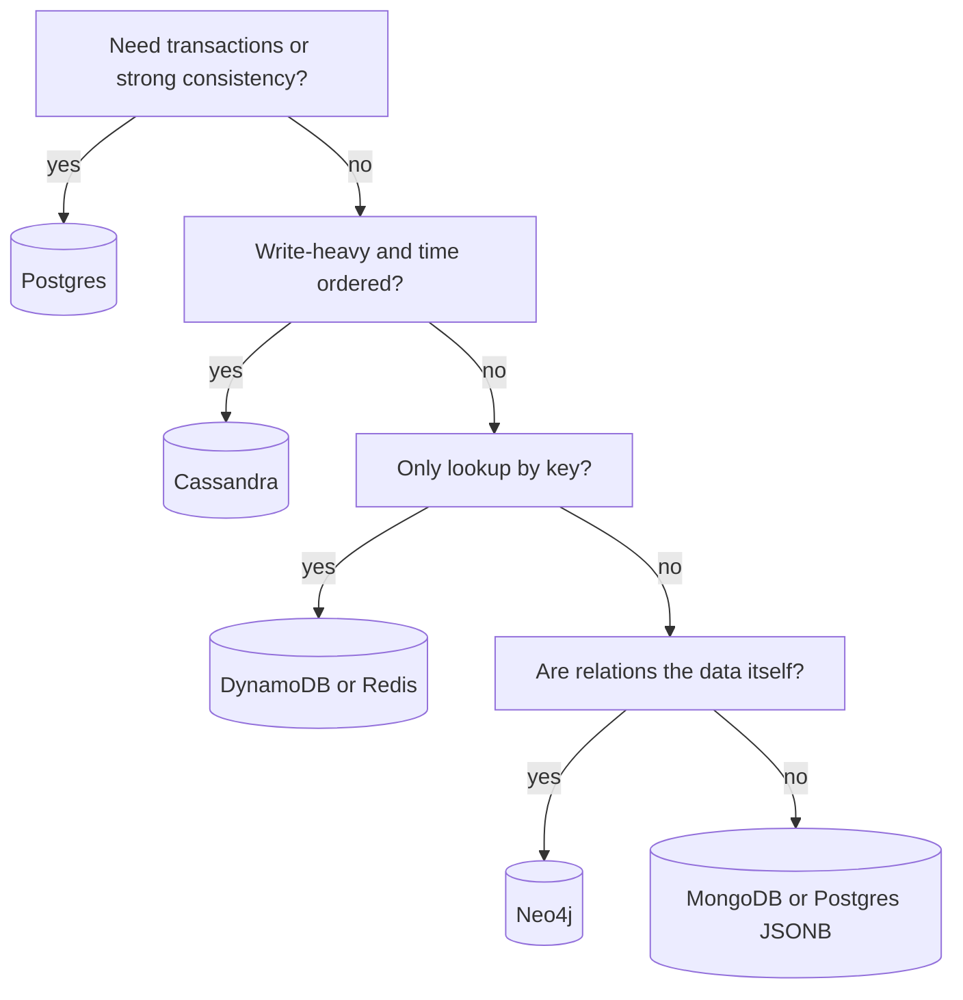

# SQL vs NoSQL

**In one line:** Pick SQL when you need relations, transactions and strong consistency. Pick NoSQL when you need very large scale, a simple access pattern or a flexible schema.

> **Go deeper (Databases section):** [Choosing a Database](../05-db/01-choosing-a-database.md), [SQL](../05-db/02-relational-sql.md), [Key-Value](../05-db/05-key-value.md), [Document](../05-db/06-document.md), [Wide-column](../05-db/07-wide-column.md)

> **Example:** Paytm wallet balances and transactions go in Postgres (money must never be wrong). WhatsApp's billions of messages go in Cassandra (you just write them and read them by chat_id in time order, no joins needed).

## SQL (relational)

- Tables, fixed schema, joins, **ACID transactions**.
- Examples: **Postgres, MySQL**.
- Scale: easy up to vertical + read replicas. Sharding is manual or done with tools like Vitess/Citus.
- Myth: "SQL doesn't scale". A tuned Postgres handles ~10K+ writes/sec and TBs of data.

## The 4 types of NoSQL

| Type | Data shape | Examples | Best for |
|---|---|---|---|
| **Key-value** | `key → value` blob | Redis, DynamoDB | Cache, sessions, counters, URL mapping |
| **Document** | JSON document, nested fields | MongoDB, DynamoDB | Product catalog, user profile, flexible schema |
| **Wide-column** | Partition key + sorted clustering key, columns inside rows | Cassandra, HBase, ScyllaDB | Heavy writes, time-series, chat messages |
| **Graph** | Nodes + edges | Neo4j, Neptune | Social graph, recommendations, fraud rings |

### Wide-column access pattern

In Cassandra, you design the table around the query, not around the data.

```sql
messages(chat_id, message_ts, sender, body, PRIMARY KEY (chat_id, message_ts))
-- chat_id = partition key (which node), message_ts = clustering key (sorted)
```

All messages of one chat sit in one partition in time order. "Last 50 messages" is one fast range read.

## When to use what (decision table)

| Situation | Choose | Why |
|---|---|---|
| Payments, orders, bookings, inventory | **Postgres / MySQL** | ACID, unique constraints, multi-row transactions |
| Simple lookup by key, massive scale | **DynamoDB** | Managed, auto-scale, single-digit ms |
| Write-heavy, append-only, time ordered | **Cassandra** | LSM writes, linear scale, multi-DC |
| Flexible/nested schema, catalog | **MongoDB** | Easy schema changes, rich queries on fields |
| Hot data, cache, counters, leaderboards | **Redis** | In-memory, sub-ms, sorted sets |
| Friends-of-friends, path queries | **Neo4j** | Fast multi-hop traversal |
| Full-text search | Elasticsearch | This is a search index, not a primary DB |



## Trade-offs at a glance

| | SQL | NoSQL (generally) |
|---|---|---|
| Schema | Fixed, migrations | Flexible |
| Joins | Yes | No, denormalize |
| Transactions | Full ACID | Up to a single item/partition (limited multi-item in DynamoDB/Mongo) |
| Scale | Vertical + replicas, sharding is hard work | Built-in horizontal |
| Consistency | Strong | Often eventual, tunable |
| Query flexibility | Ad-hoc SQL | Access pattern fixed up front |

## How to justify the DB choice in the interview

Say 3 things:
1. **Access pattern:** "We always read by `user_id`, with a range query on `timestamp`."
2. **Consistency need:** "This is money, so we need ACID" or "a stale feed is fine".
3. **Scale numbers:** "It's 50K writes/sec, which is tight for a single Postgres, so Cassandra."

And one "what I didn't pick" line: "MongoDB could also work, but here there are a lot of joins and transactions."

Polyglot persistence is normal: one system can have Postgres + Redis + Elasticsearch + Cassandra, each for its own job.

## Where it is used

- [Payment System](../02-questions/t1-11-payment-system.md), [BookMyShow](../02-questions/t1-05-bookmyshow.md): Postgres for ACID
- [WhatsApp](../02-questions/t1-04-whatsapp-chat.md): Cassandra for messages
- [URL Shortener](../02-questions/t1-01-url-shortener.md): DynamoDB / KV
- [News Feed](../02-questions/t1-03-news-feed.md), [Instagram](../02-questions/t2-13-instagram.md): Cassandra + Redis feed cache
- [Uber](../02-questions/t1-06-uber.md): Postgres for trips, Redis for live locations
- [Distributed KV Store](../02-questions/t2-20-distributed-kv-store.md): Dynamo/Cassandra internals

## Say this in the interview

> "For bookings I'll use Postgres because I need multi-row transactions and a `UNIQUE` constraint, and the write load is only ~100/sec. For messages, Cassandra, because it's write-heavy, the access pattern is fixed (chat_id + time), and we need linear scale."

## Common mistakes

- Saying "NoSQL because it will scale" without numbers.
- Expecting ad-hoc queries or joins in Cassandra.
- Using an eventually consistent store for money data.
- Making Redis the primary durable DB without persistence/replication.
- Making Elasticsearch the source of truth.

## Checklist

- [ ] I can tell the 4 types of NoSQL with examples
- [ ] I can pick a DB for any use case using the decision table
- [ ] I can explain Cassandra's partition key + clustering key
- [ ] I can justify a DB choice using access pattern, consistency and scale
- [ ] I can break the "SQL doesn't scale" myth with numbers
