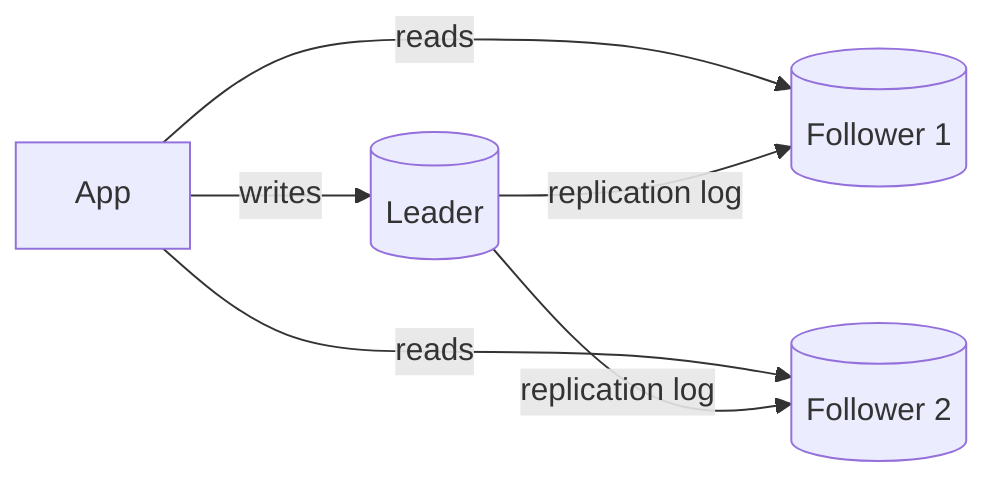

# Indexing & Replication

**In one line:** An index makes reads fast (no full table scan), and replication makes copies of the data so reads can scale and data is not lost when one machine dies.

> **Example:** On Swiggy, a "my last 10 orders" query will scan 500 million rows of the `orders` table if there is no index on `user_id`. Add an index and it takes milliseconds. And if the primary DB dies, a replica gets promoted, so no orders are lost.

## The 3 basic index structures

| Structure | How it works | Good for | Where you find it |
|---|---|---|---|
| **B-tree** | Sorted balanced tree, disk pages | Point lookup + range query (`BETWEEN`, `ORDER BY`) | Postgres, MySQL default |
| **Hash index** | `hash(key) → location` | Exact match only, O(1) | Redis, Postgres hash index, in-memory KV |
| **LSM tree** | Writes go to memory (memtable) first, then to sorted files (SSTables) on disk, with background compaction | Heavy writes | Cassandra, RocksDB, ScyllaDB |

- **B-tree:** read-optimized. Every write updates the tree (random I/O).
- **LSM:** write-optimized (sequential append). A read may have to check several SSTables, which is why **Bloom filters** are used.

### Cost of an index
- Every index slows down writes (each insert also updates the index).
- Extra storage.
- So only index the columns that appear in the query's `WHERE`/`ORDER BY`.

## Composite index

`INDEX (user_id, created_at)` is one sorted list: first by `user_id`, then by `created_at`.

| Query | Will the index be used? |
|---|---|
| `WHERE user_id = 5` | Yes (leftmost prefix) |
| `WHERE user_id = 5 ORDER BY created_at DESC LIMIT 10` | Yes, best case |
| `WHERE created_at > '2026-01-01'` | No, the leftmost column is missing |

Rule: **equality columns first, the range/sort column last**. With a covering index (all the query's columns are in the index), the table is not touched at all.

## Replication

### Leader-follower (single leader)

- All writes go to the leader, reads can also go to followers. Perfect for read-heavy systems.
- **Sync replication:** the leader waits until a follower acks. No data loss, but slow.
- **Async replication:** the leader acks immediately. Fast, but if the leader dies the last few writes can be lost.
- Common middle ground: **semi-sync**, one follower sync, the rest async.

### Multi-leader

- One leader per region, writes are local. Regions sync with each other.
- Pros: low write latency globally, writes keep working even if one region is down.
- Problem: **write conflicts** (the same row changed in two regions). Resolve with last-write-wins, CRDTs, or app-level merge.
- Use: multi-region apps, offline-first apps (collaborative editing like Google Docs).

### Leaderless (bonus)
- Dynamo/Cassandra style: write to any node, get consistency with a quorum (R + W > N). See [CAP & Consistency](06-cap-consistency.md).

## Replication lag and read-your-writes

With async, a follower is a little behind (ms to seconds). The problem:

> A user changed their profile photo, refreshed the page, the read went to a follower and showed the old photo. The user thinks it's a bug.

Fix:
- **Read-your-writes:** if the user wrote in the last ~10 sec, serve their reads from the leader.
- After a write, give the client a version/LSN, and a follower serves only once it has reached that version.
- Critical reads (balance, booking status) always from the leader.

**Monotonic reads:** always send a user to the same replica, so time doesn't go backwards (new data first, then old data).

## Failover

1. The leader's heartbeat stops → detect it (timeout ~10–30 sec).
2. Pick the most up-to-date follower as the new leader.
3. Route clients/proxy to the new leader.

Risks:
- **Data loss:** with async, the new leader did not have the last writes.
- **Split brain:** the old leader comes back and thinks it is still the leader. Fix: fencing token / epoch number, consensus (Raft, etcd, ZooKeeper).
- Timeout too short → false failovers. Too long → long downtime.

Managed options: AWS RDS Multi-AZ, Aurora, Patroni (Postgres).

## When to use what

| Need | Use |
|---|---|
| Read-heavy, single region | Leader-follower + read replicas |
| Zero data loss | Sync / semi-sync replica |
| Global low-latency writes | Multi-leader or leaderless |
| Write-heavy append | LSM store (Cassandra) |

## Where it is used

- [URL Shortener](../02-questions/t1-01-url-shortener.md): read replicas, index on short code
- [News Feed](../02-questions/t1-03-news-feed.md), [Instagram](../02-questions/t2-13-instagram.md): composite index `(user_id, created_at)`, read-your-writes
- [BookMyShow](../02-questions/t1-05-bookmyshow.md), [Payment System](../02-questions/t1-11-payment-system.md): critical reads from the leader, sync replica
- [Distributed KV Store](../02-questions/t2-20-distributed-kv-store.md): LSM + leaderless replication

## Say this in the interview

> "I'll use a Postgres leader-follower setup, with writes on the leader and reads on 2–3 replicas. Because of replication lag, reads from a user who just wrote will go to the leader (read-your-writes). Failover will be automatic with Patroni/RDS Multi-AZ, and I'll keep a semi-sync replica so there is no data loss."

## Common mistakes

- Indexing every column, which makes writes slow.
- Wrong column order in a composite index (range column first).
- Saying read replicas but not mentioning replication lag.
- Reading payment status from a replica.
- Saying failover without mentioning the split brain / data loss risk.

## Checklist

- [ ] I can tell the difference between B-tree, hash and LSM, and which DB uses what
- [ ] I can explain the leftmost prefix rule of a composite index
- [ ] I can tell the trade-offs of leader-follower vs multi-leader
- [ ] I can explain the replication lag problem and the read-your-writes fix
- [ ] I can tell the failover steps and the split brain risk
