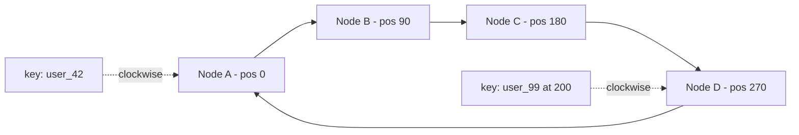

# Sharding & Consistent Hashing

**In one line:** When the data or writes don't fit on one DB machine, split the data across many machines (shards) based on a key. Consistent hashing makes sure the least data moves when you add or remove a shard.

> **Go deeper (Databases section):** [Scaling Databases](../05-db/14-scaling-databases.md), [Wide-column](../05-db/07-wide-column.md)

> **Example:** WhatsApp has 100 billion messages every day. That is impossible on one Postgres. Messages are split across 1000 shards by the hash of `chat_id`. All messages of one chat sit on the same shard, so opening a chat is fast.

## Why shard

- **Storage:** the data is bigger than one machine's disk (10 TB+).
- **Write throughput:** replicas scale reads, not writes. Writes still go to one leader.
- Try these first: vertical scale, read replicas, cache, archiving old data. Sharding is the last option because it adds a lot of complexity.

## 3 ways to shard

| Way | How | Pros | Cons |
|---|---|---|---|
| **Hash** | `shard = hash(key) % N` | Data spreads evenly | Range queries hit every shard, changing N reshuffles everything |
| **Range** | `A–F` on shard 1, `G–M` on shard 2, or date ranges | Fast range queries | Hot spots (the shard with today's date takes all writes) |
| **Directory** | Lookup table: `key → shard` | Full control, you can move anything | The lookup service adds a hop and is itself a SPOF |

## How to pick a shard key

A good shard key has:
1. **High cardinality:** many distinct values (`user_id`, not `country`).
2. **Even distribution:** no single value is very heavy.
3. **Match with the query:** the main query goes to only one shard.

| System | Shard key | Why |
|---|---|---|
| Chat | `chat_id` | One chat on one shard |
| Orders | `user_id` | "My orders" from one shard |
| URL shortener | `short_code` | Lookup is always by code |
| Uber trips | `city_id` + `trip_id` | Geo locality, but split big cities |

## Hot partitions

Too much traffic on one key: a Virat Kohli post, one product on Big Billion Day.
- **Key salting:** `post_123#0..#9`, spread writes across 10 shards, merge on read.
- Keep the hot key in a **cache** (for reads).
- Give a hot tenant a dedicated shard (with directory sharding).

## Resharding

- With `hash % N`, changing N moves almost all the data. So don't use it.
- **Fixed logical shards:** create 1024 logical shards at the start and map them to 8 machines. When you add a machine, just move a few logical shards.
- **Consistent hashing:** see below.
- While moving: double-write (old + new), backfill, verify, then switch reads.

## Consistent hashing with virtual nodes

Think of the hash space as a ring (0 to 2^32). Hash both servers and keys onto the ring. A key goes to the **first server clockwise**.

- A node is added (say E at 225) → only the keys between C and E move (~1/N of the data), everything else stays.
- A node is removed → its keys move to the next node.
- **Virtual nodes:** each physical server sits at 100–200 places on the ring (`A#1, A#2, ...`). This means:
  - Load is even (otherwise one node can get a big arc)
  - When a node dies, its load spreads across all nodes, not just one neighbour
  - You can give a bigger server more vnodes
- Replication: store a key on the next 3 distinct nodes clockwise.
- Used in: Cassandra, DynamoDB, Memcached clients, CDN and LB routing.

## Cross-shard queries

| Problem | Solution |
|---|---|
| Query without the shard key ("find a user by email") | Secondary index table: `email → user_id` (itself sharded by email) |
| Aggregate across shards ("total orders today") | Scatter-gather, or better: an analytics pipeline (Kafka → warehouse) |
| Join across shards | Denormalize, or join in the app |
| Transaction across shards | Avoid it. If needed, saga / 2PC, see [Distributed Transactions](16-distributed-transactions.md) |

Design it so that **95% of queries are single-shard**.

## Where it is used

- [WhatsApp](../02-questions/t1-04-whatsapp-chat.md): sharding by `chat_id`
- [URL Shortener](../02-questions/t1-01-url-shortener.md): `short_code` hash sharding
- [News Feed](../02-questions/t1-03-news-feed.md), [Instagram](../02-questions/t2-13-instagram.md): `user_id`, celebrity hot keys
- [Uber](../02-questions/t1-06-uber.md): geo/city based sharding
- [YouTube](../02-questions/t1-07-youtube.md): `video_id` sharding for metadata
- [Distributed KV Store](../02-questions/t2-20-distributed-kv-store.md): consistent hashing + vnodes is the core

## Say this in the interview

> "I'll hash-shard messages on `chat_id`, so all reads of one chat go to one shard. I'll use consistent hashing with virtual nodes, so adding a new node moves only ~1/N of the data. For hot keys like celebrities I'll add key salting and a cache."

## Common mistakes

- Saying sharding up front when replicas + cache were enough.
- Saying `hash % N` with no plan for resharding.
- A low cardinality shard key (`country`, `status`).
- Picking a shard key that sends the main query to every shard.
- Not mentioning virtual nodes.

## Checklist

- [ ] I can tell when sharding is needed and what to try first
- [ ] I can tell the trade-offs of hash vs range vs directory sharding
- [ ] I can pick and justify a shard key for any system
- [ ] I can explain the consistent hashing ring and virtual nodes on the board
- [ ] I can tell the solutions for hot partitions and cross-shard queries
