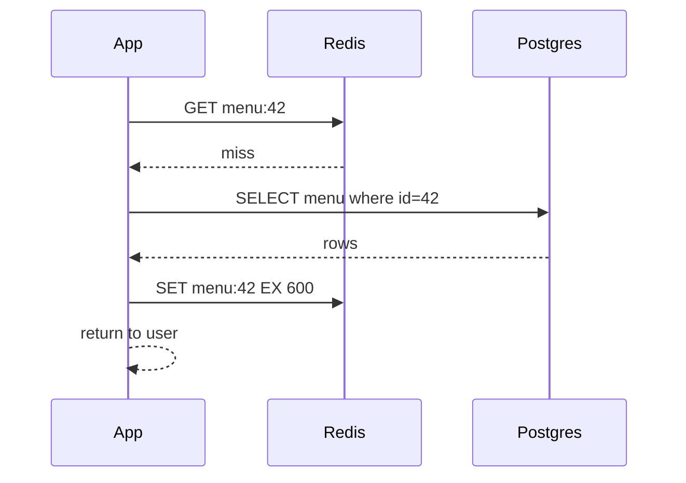

# Caching

**In one line:** Keep data that is read again and again in fast memory (Redis), so the DB load drops and latency goes below even a millisecond.

> **Example:** On Zomato, a popular restaurant's menu is opened lakhs of times a day, but it changes once a day. Reading it from the DB every time is a waste. Keep the menu in Redis with a 10 min TTL. 99% of requests are served from the cache, and the DB stays relaxed.

## Caching patterns

| Pattern | How reads/writes work | Pros | Cons | When |
|---|---|---|---|---|
| **Cache-aside (lazy)** | App checks the cache first. Miss → read from DB and put it in the cache. Write → update DB + delete cache | Simple, only needed data is cached | First request is slow, can be stale | Default, 90% of cases |
| **Write-through** | Write to cache + DB together | Cache is always fresh | Every write is slower, data that is never read is cached too | When read-after-write is required |
| **Write-back (write-behind)** | Write only to the cache, batch to DB later | Very fast writes | Data loss if the cache dies | Counters, likes, view counts |
| **Write-around** | Write straight to DB, skip the cache | No junk in the cache | Reads of recent writes miss | Data that is written but not read right away (logs, uploads) |

### Cache-aside flow

On write: **update the DB first, then DELETE the cache** (don't update it). Deleting lowers the chance of writing a stale value during a race condition.

## Eviction

| Policy | What it removes | When |
|---|---|---|
| **LRU** | The least recently used item | Default, when recency matters |
| **LFU** | The least frequently used item | When popular items are stable (top products) |
| **TTL** | Expires after a time | Always set it, as a safety net |

In Redis, `maxmemory-policy allkeys-lru` is common.

## TTL and invalidation

- TTL = how much staleness is OK. Menu: 10 min. Stock count: 5 sec. User profile: 1 hr.
- Invalidation options:
  1. Leave it to the TTL (simplest)
  2. Explicit delete on write (cache-aside)
  3. CDC / event: DB change → Kafka → cache delete (for multiple services)
- "There are only two hard things: cache invalidation and naming things." Accept this in the interview and mention TTL as the safety net.

## Cache stampede / thundering herd

A popular key expired, and 10,000 requests hit the DB at the same time. The DB goes down.

Fix:
- **Request coalescing (single flight):** only one request goes to the DB, the rest wait for it. Use a Redis lock `SET lock:key NX PX 5000`.
- **TTL jitter:** `TTL = 600 + random(0, 60)`, so all keys don't expire together.
- **Early refresh:** refresh in the background before expiry (stale-while-revalidate).
- Don't expire very hot keys at all, refresh them on update.

## Hot keys

So much traffic on one key that even one Redis node can't handle it (IPL score, celebrity profile).
- Put a **local in-process cache** in front (in each app server, for 1–5 sec).
- Replicate the key: `score:final#1..#10`, read a random one.
- Read replicas of Redis.

## CDN

- Static content (images, video, JS, CSS) is served from an edge server close to the user.
- Dynamic API responses can also be cached if they are the same for everyone (`Cache-Control: max-age=30`).
- Invalidation: versioned URLs (`app.v42.js`) are best, the purge API is slow and expensive.
- Details: [Blob Storage & CDN](12-blob-storage-cdn.md).

## Redis vs Memcached

| | Redis | Memcached |
|---|---|---|
| Data types | String, hash, list, set, sorted set, streams | String only |
| Persistence | RDB/AOF | No |
| Replication / cluster | Yes (Sentinel, Cluster) | Client-side sharding |
| Threading | Mostly single-threaded per shard | Multi-threaded |
| Extra | Locks, rate limiter, leaderboard, pub/sub | Pure simple cache |
| When | The default almost always | Very simple KV cache, multi-core efficiency |

## When not to cache

- The data changes on every request, or is unique per user and read only once.
- You need strong consistency (the final check of an account balance comes from the DB).
- The read:write ratio is low.

## Where it is used

- [URL Shortener](../02-questions/t1-01-url-shortener.md): cache-aside for hot short codes
- [News Feed](../02-questions/t1-03-news-feed.md), [Instagram](../02-questions/t2-13-instagram.md): precomputed feed in Redis
- [BookMyShow](../02-questions/t1-05-bookmyshow.md): seat map cache, stampede at launch
- [YouTube](../02-questions/t1-07-youtube.md): CDN for video
- [Typeahead](../02-questions/t1-10-typeahead.md): top prefixes cache
- [Leaderboard](../02-questions/t2-16-leaderboard.md): Redis sorted set
- [Flash Sale](../02-questions/t2-15-flash-sale.md): hot key, stock counter

## Say this in the interview

> "This is read-heavy, so I'll use cache-aside in Redis with a 10 min TTL plus jitter. On write, I'll delete the cache key after updating the DB. To stop stampedes on popular keys I'll use request coalescing, and for very hot keys a small local cache in the app servers."

## Common mistakes

- Saying "we'll add a cache" without naming the pattern, TTL and invalidation.
- Updating the cache on write (delete is better).
- Not mentioning stampede and hot keys.
- Treating the cache as the source of truth.
- The same TTL for all keys, so they expire together.

## Checklist

- [ ] I can tell the 4 caching patterns and when to use each
- [ ] I can draw the cache-aside read and write flow on the board
- [ ] I can tell 3 fixes for cache stampede (coalescing, jitter, early refresh)
- [ ] I can explain the hot key problem and its solution
- [ ] I can tell the difference between Redis vs Memcached and LRU vs LFU
