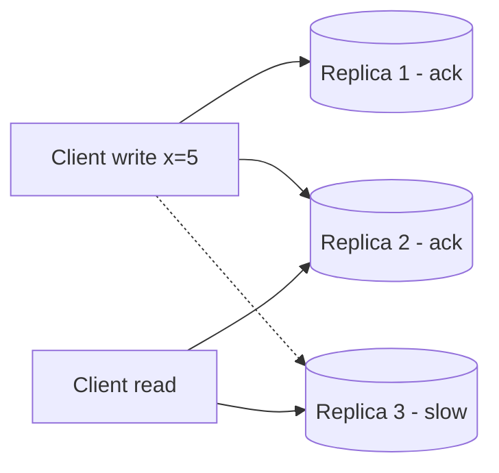

# CAP & Consistency

**In one line:** When the network breaks (a partition), a distributed system has to choose: either give everyone the same latest data (consistency), or answer every request even if the data is a little old (availability).

> **Example:** At Paytm, the link between the Mumbai and Delhi data centers broke. If both sides were allowed to deduct money from a wallet (availability), a ₹500 balance could get ₹500 deducted in two places. That is why payments choose **consistency**. On an Instagram feed, if a like count is 2 sec old nobody cares, so the feed chooses **availability**.

## CAP in plain words

- **C (Consistency):** every read sees the latest write.
- **A (Availability):** every request gets a response (not an error).
- **P (Partition tolerance):** the system keeps working even when the network breaks.

Network partitions do happen in real life, so **P is mandatory**. The real choice is: **C or A during a partition**.

| Choice | What happens during a partition | Examples |
|---|---|---|
| **CP** | Some requests are rejected/wait, but no wrong data | Postgres (single leader), Spanner, ZooKeeper, etcd, HBase |
| **AP** | Every request gets an answer, but it may be stale | Cassandra, DynamoDB (default), DNS, CDN |

## PACELC (briefly)

**If Partition → A or C. Else (normal time) → Latency or Consistency.**

There is a trade-off even in normal times: strong consistency means waiting for replicas, which adds latency.
- Cassandra / DynamoDB: **PA/EL** (fast and available, eventual)
- Spanner / Postgres sync: **PC/EC** (consistent, a bit slower)

## Consistency levels (strong to weak)

| Level | Meaning | Example |
|---|---|---|
| **Strong (linearizable)** | Right after a write, everyone sees the new data | Bank balance, seat booking |
| **Read-your-writes** | At least the writer sees their own write | Your own profile after a profile update |
| **Monotonic reads** | Once you have seen new data, you never see old data | Messages don't disappear while scrolling a chat |
| **Causal** | Things caused by something else show up in order | A reply to a comment shows only after the comment |
| **Eventual** | Everything becomes the same after a while | Like count, view count, feed |

Different features in the same system can use different levels. BookMyShow: search is eventual, booking is strong.

## Quorum (N, R, W)

In leaderless stores (Cassandra, Dynamo):
- **N** = number of replicas
- **W** = how many replicas must succeed for a write to be OK
- **R** = how many replicas to read from

**R + W > N** → the read and write sets overlap, so you get the latest value (strong-ish).

N=3, W=2, R=2: at least one replica in the read (here Replica 2) returns the new value. Pick the latest using a version/timestamp.

| Setting | Behavior |
|---|---|
| W=1, R=1 | Fastest, eventual |
| W=2, R=2 (N=3) | Balanced, quorum consistency |
| W=3, R=1 | Fast reads, writes fail when one node is down |
| W=1, R=3 | Fast writes, slow reads |

In Cassandra you set this per query with the `QUORUM`, `ONE`, `ALL` consistency levels.

## Who chooses what

| System | Choice | Why |
|---|---|---|
| Payments, wallet, ledger | **CP / strong** | Money must not be deducted twice |
| Seat / inventory booking | **Strong** on the booking path | No double booking |
| News feed, likes, views | **AP / eventual** | A bit stale is fine, downtime is not |
| Chat messages | **AP + per-chat ordering** | Messages must be delivered, order must be right within a chat |
| Shopping cart | **AP** (Amazon Dynamo paper) | A failed add-to-cart is lost sales |
| Leader election, config | **CP** (etcd, ZooKeeper) | There must never be two leaders |

## Where it is used

- [Payment System](../02-questions/t1-11-payment-system.md): strong consistency, CP
- [BookMyShow](../02-questions/t1-05-bookmyshow.md): booking strong, search eventual
- [News Feed](../02-questions/t1-03-news-feed.md): eventual
- [WhatsApp](../02-questions/t1-04-whatsapp-chat.md): availability + per-chat ordering
- [Google Docs](../02-questions/t2-19-google-docs.md): causal / convergence (OT, CRDT)
- [Distributed KV Store](../02-questions/t2-20-distributed-kv-store.md): tunable quorum

## Say this in the interview

> "On the booking path I choose consistency, because the cost of a double booking is higher than downtime. During a partition a booking will be rejected, but it will never be wrong. For search and browse I choose availability, where eventual consistency is fine."

> "In Cassandra I'll use N=3, and QUORUM reads/writes for critical reads, so that R + W > N."

## Common mistakes

- Saying "we'll build a CA system". In a distributed system you can't avoid P.
- Stating one consistency level for the whole system, not per feature.
- Mixing up CAP "consistency" and ACID "consistency" (they are different things).
- Saying eventual consistency without saying how stale and where it is OK.
- Remembering the quorum formula the wrong way round.

## Checklist

- [ ] I can explain CAP with a partition example, and tell why P is mandatory
- [ ] I can tell PACELC in one line
- [ ] I can tell the difference between strong, read-your-writes, causal and eventual with examples
- [ ] I can explain what quorum R + W > N means and its trade-offs
- [ ] I can justify the consistency choice for payments vs feed
