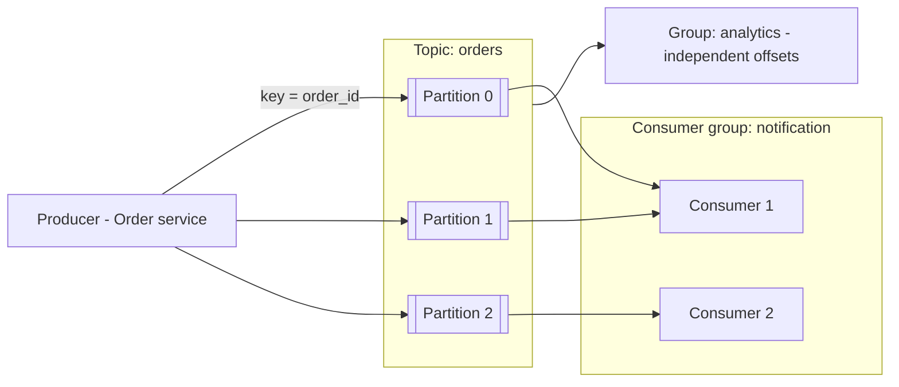

# Message Queues & Kafka

**In one line:** Instead of service A calling service B directly, it puts a message in a queue. B reads at its own speed. This decouples services, absorbs spikes, and makes slow work async.

> **Example:** An order is placed on Swiggy. Now the restaurant must be notified, a delivery partner found, an SMS sent, analytics updated. If the order API did all of this synchronously it would take 5 sec, and if the SMS provider is down the order itself fails. So the order service puts an `order_placed` event in Kafka and immediately tells the user "Order placed". The other services read the event and do their own work.

## Why a queue

- **Decouple:** the producer doesn't know about the consumer. Add a new consumer without changing the producer.
- **Buffer:** during an IPL spike 1 lakh events/sec come in, and workers process 20K/sec. The queue holds the backlog in between.
- **Async:** slow work (video transcode, email) runs in the background, and the user's response is fast.
- **Retry:** if a consumer fails the message goes back to the queue, it is not lost.

## Queue vs pub/sub vs log

| Model | How | What happens to the message | Example |
|---|---|---|---|
| **Queue (point-to-point)** | One message goes to only one consumer | Deleted after processing | SQS, RabbitMQ queue |
| **Pub/sub** | One message goes to all subscribers | Each subscriber gets a copy | SNS, RabbitMQ fanout, Redis pub/sub |
| **Log (stream)** | Append-only log, consumers track their own offset | Kept until retention ends, can be replayed | Kafka, Kinesis, Pulsar |

Kafka does both: queue-like inside a consumer group, pub/sub-like across different groups.

## Kafka basics

- **Topic:** a category of events (`orders`, `clicks`).
- **Partition:** a piece of a topic. Each partition is an ordered append-only log. The unit of parallelism.
- **Offset:** the message's number in the partition. The consumer says "I have read up to offset 1042".
- **Key:** `hash(key) % partitions` decides the partition. Same key → same partition → **order guaranteed**.
- **Consumer group:** inside a group, each partition goes to only one consumer. Different groups read the same data independently.
- **Retention:** messages stay for 7 days (configurable), even after they are read. Replay is possible.
- **Replication:** each partition has 3 copies on brokers (leader + followers).

### Ordering rule
- Order is guaranteed only **within one partition**, not across the whole topic.
- In chat the key = `chat_id`, in payments the key = `account_id`. This keeps one entity's events in order.
- Consumers > partitions → the extra consumers sit idle. Create enough partitions up front (like 50–100).

## SQS vs RabbitMQ vs Kafka

| | SQS | RabbitMQ | Kafka |
|---|---|---|---|
| Model | Managed queue | Broker with exchanges/routing | Distributed log |
| Retention | Max 14 days, deleted after consume | Deleted after ack | Time/size based, replay |
| Ordering | In FIFO queues (limited throughput) | Per queue | Per partition |
| Throughput | High, managed | Medium (~10K–50K/sec per node) | Very high (lakhs–millions/sec) |
| Replay | No | No | Yes |
| Best for | Simple task queue on AWS | Complex routing, priority, RPC-style | Event streaming, analytics, many consumers, event sourcing |

## Delivery guarantees

| Guarantee | Meaning | How |
|---|---|---|
| At-most-once | Can be lost, never duplicated | Commit offset first, then process |
| **At-least-once** | Never lost, may be duplicated | Process first, then commit offset. **Use this as the default** |
| Exactly-once | Neither lost nor duplicated | Kafka transactions, or in practice: at-least-once + **idempotent consumer** |

In the interview: "At-least-once + idempotent consumer (dedupe by `event_id`)". See [Idempotency & Retries](10-idempotency-retries.md).

## DLQ (dead letter queue)

- A message still fails after 3–5 retries (bad data, a bug) → put it in the DLQ.
- This way one "poison message" doesn't block the whole partition.
- Alert on the DLQ + manual/auto reprocess.
- Exponential backoff for retries: retry topics (`orders-retry-1m`, `orders-retry-10m`).

## Back-pressure

The consumer is slow and the queue keeps growing (consumer lag).
- **Monitor consumer lag**, alert on it and autoscale (up to the number of partitions).
- Producer side: rate limit, or return `429`.
- Drop/sample low-priority work (analytics), never drop critical work (payments).
- Don't keep an unbounded queue without an alert.

## When to use / when not

- **Use:** slow side effects, fan-out to many services, spikes, event-driven pipelines, analytics.
- **Don't use:** when the user needs the result right away (login, balance check). Use a sync call there.

### When NOT to use Kafka

In mocks ~60% of candidates add Kafka without a reason. Kafka has a cost: brokers, partitions, consumer lag, rebalancing ops. If none of the needs below apply, name the simpler option.

| Option | Pick it when | Example |
|---|---|---|
| **Kafka** | ~100K+ events/sec, replay/retention needed, multiple consumer groups on the same stream, per-key ordering at scale, stream processing | Ad clicks at 50K/sec, read by both billing and analytics, 7-day replay |
| **SQS / RabbitMQ** | Task queue: one job to one worker, retries, DLQ, routing, priorities. Less ops (SQS is fully managed) | Sending email/SMS, video transcode jobs |
| **Transactional outbox + worker** | The DB write and the event must be atomic, moderate volume | Payment status change → notification |
| **DB table + cron** | Low volume (a few thousand/day), delay is fine | Daily reminders, cleaning up expired holds |

### How to justify it in an interview

Template: **requirement → number → why this over alternatives → what we sacrifice**.

> "Click events are needed by both analytics and billing (requirement), ~50K events/sec at peak (number). Kafka, because we need two independent consumer groups and 7-day replay, which SQS doesn't give. We sacrifice: more ops and cost, and ordering only per `ad_id` partition."

## Where it is used

- [Notification System](../02-questions/t1-09-notification-system.md): priority queues, retries, DLQ
- [News Feed](../02-questions/t1-03-news-feed.md): fan-out on write workers
- [WhatsApp](../02-questions/t1-04-whatsapp-chat.md): offline message delivery, per-chat ordering
- [YouTube](../02-questions/t1-07-youtube.md): transcoding jobs
- [Payment System](../02-questions/t1-11-payment-system.md): ledger events, outbox
- [Web Crawler](../02-questions/t1-12-web-crawler.md): URL frontier
- [Ad Click Aggregator](../02-questions/t2-17-ad-click-aggregator.md): Kafka + stream processing
- [BookMyShow](../02-questions/t1-05-bookmyshow.md): async ticket notifications

## Say this in the interview

> "The order service will put an `order_placed` event in Kafka with key `order_id`, so the events of one order stay in order. Kafka because notification and analytics will be separate consumer groups and we need replay. Delivery is at-least-once, so consumers will dedupe by `event_id`, and after 5 retries a message will go to the DLQ. I'll set up alerts and autoscaling on consumer lag."

## Common mistakes

- Assuming ordering across the whole topic in Kafka.
- Claiming exactly-once without idempotency.
- Not having a DLQ, so one bad message blocks a partition.
- Too few partitions, so consumers can't scale.
- Putting everything in a queue, even where a sync response was needed.
- Kafka for 500 jobs/min. SQS or an outbox is enough there.

## Checklist

- [ ] I can tell the 3 benefits of a queue (decouple, buffer, async) with examples
- [ ] I can explain the difference between queue vs pub/sub vs log
- [ ] I can explain Kafka topic, partition, offset, consumer group and per-partition ordering on the board
- [ ] I can pick the right tool among SQS vs RabbitMQ vs Kafka and justify it
- [ ] I can explain at-least-once + idempotent consumer, DLQ and back-pressure
