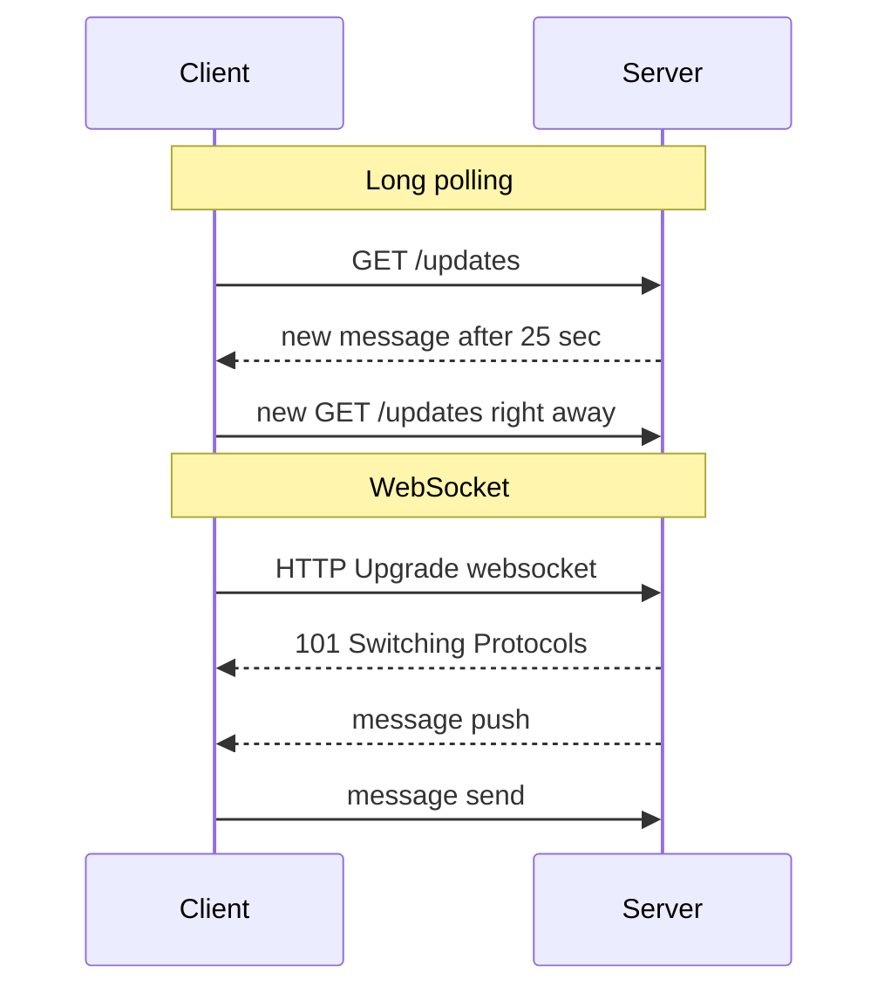
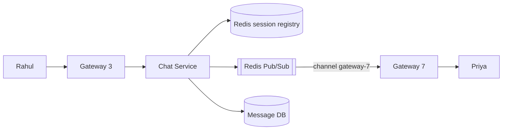

# Real-time Communication

**In one line:** How to get new data from the server to the client the moment it arrives, without the client asking again and again.

> **Example:** In the Swiggy app, "Delivery partner is 2 min away" updates live. On WhatsApp, a message shows up as soon as it arrives. In normal HTTP only the client sends requests, the server can't send anything on its own. That is why real-time needs different methods.

## 4 methods (simple to powerful)

| Method | How | Direction | Latency | When to use |
|---|---|---|---|---|
| **Short polling** | The client hits `GET /updates` every N sec | Client → Server | Up to N sec | Data changes rarely and you want it simple (order status every 10 sec) |
| **Long polling** | The request stays open until data arrives or a timeout (30 sec), then the client immediately sends a new request | Client → Server | Low | WebSocket not allowed, old clients |
| **SSE (Server-Sent Events)** | One HTTP connection stays open, the server keeps pushing events on `text/event-stream` | Server → Client only | Low | One-way push: live score, notifications, LLM token streaming |
| **WebSocket** | Upgrade HTTP to a full-duplex TCP connection | Both ways | Lowest | Chat, multiplayer games, collaborative editing |

**Which one to pick:**
- You only need push from the server → **SSE** (built-in auto-reconnect, it's normal HTTP, proxy friendly).
- Frequent messages both ways → **WebSocket**.
- Updates are rare and scale is small → **short polling** is enough. Don't over-engineer.
- Treat long polling as a fallback, not the default.

## Connection servers (gateway layer)

A WebSocket connection is **stateful**. User X's connection is open on one specific server. So build a separate layer in the architecture:
- **Connection/Gateway servers:** only hold connections, no business logic. One server holds ~50K–1M connections (depends on tuning).
- **App/Chat service:** stateless, the business logic lives here.
- **Session registry (Redis):** `user:X → gateway-7`. Set on connect, delete on disconnect, with a TTL.

## How a message reaches the right server

Problem: Rahul is on gateway-3, Priya is on gateway-7. How does Rahul's message reach Priya?

| Approach | How | Trade-off |
|---|---|---|
| **Registry + direct call** | Find the gateway from the registry, RPC to that gateway | Simple, but gateways need to be discovered |
| **Redis Pub/Sub** | Each gateway subscribes to its users' channels (or a channel with its own name). The sender publishes | Easy fan-out. Pub/Sub is fire-and-forget, so save the message to the DB first |
| **Consistent hashing** | `hash(user_id)` decides which gateway a user connects to | No registry lookup needed. When a gateway is added/removed, only a few users reconnect |

If the user is offline, keep the message in the DB and send a push notification (APNs/FCM). On reconnect, the client sends `last_seen_msg_id` and syncs missed messages.

## Presence and heartbeat

- The client sends a **heartbeat** (ping) every ~30 sec. The gateway refreshes `presence:X` in Redis with a 60 sec TTL.
- Heartbeat stops → TTL expires → user is offline. This works even on a crash, because whether or not a disconnect event arrives, the TTL handles it.
- Write a timestamp for "last seen". Fan out presence changes only to contacts/friends, not everyone.
- In big groups keep presence lazy: fetch it when someone opens the chat.

## Scaling to millions of connections

- **Scale gateways horizontally:** 10M concurrent users / 100K per server ≈ 100 gateway servers.
- Use an **L4 load balancer** (TCP level), since connections are long-lived. Sticky routing is required.
- Keep **memory per connection** low: epoll/event-loop servers (Netty, Go, Erlang). WhatsApp ran ~2M connections on one box with Erlang.
- **Reconnect storm:** when a gateway restarts, lakhs of clients reconnect at once. Add **exponential backoff + jitter** on the client side.
- **Deploys:** drain connections slowly, don't break them all at once.

## Where it is used

- [WhatsApp Chat](../02-questions/t1-04-whatsapp-chat.md): WebSocket, gateways, presence
- [Uber](../02-questions/t1-06-uber.md): driver location push, live map for the rider
- [Notification System](../02-questions/t1-09-notification-system.md): in-app push via SSE/WebSocket
- [Google Docs](../02-questions/t2-19-google-docs.md): collaborative editing, WebSocket
- [LLM Chat App](../02-questions/t2-22-llm-chat-app.md): token streaming via SSE
- [BookMyShow](../02-questions/t1-05-bookmyshow.md): live seat map, waiting room position
- [Food Delivery](../02-questions/t2-14-food-delivery.md): order tracking

## Say this in the interview

> "Chat is two-way, so I'll use WebSocket. Connections will live on a separate gateway layer with no business logic, and Redis will hold a `user → gateway` registry. Cross-gateway messages will be routed through Redis Pub/Sub, but the message will be persisted to the DB first, so an offline user can get it later."

> "For one-way push like an LLM response or a live score, SSE is enough. We don't need the complexity of WebSocket."

## Common mistakes

- Saying WebSocket for everything. For one-way push, SSE is simpler.
- Treating WebSocket servers as stateless. A connection is tied to one server, so you have to think about routing.
- Treating Redis Pub/Sub as durable. If the subscriber was down, the message is gone. Persist to the DB/Kafka.
- Relying on the disconnect event for presence, without heartbeat + TTL.
- Not mentioning the reconnect storm and backoff.

## Checklist

- [ ] I can tell the difference between short polling, long polling, SSE and WebSocket, and when to use each
- [ ] I can explain why a gateway layer + session registry is needed
- [ ] I can explain cross-server message routing (Pub/Sub or consistent hashing) with a diagram
- [ ] I can tell how presence works with heartbeat + TTL
- [ ] I can tell the estimation for millions of connections and how to handle a reconnect storm
