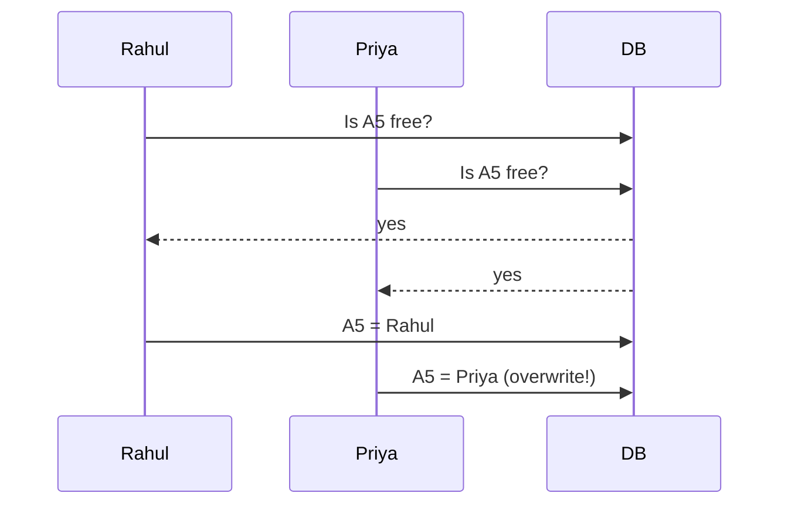
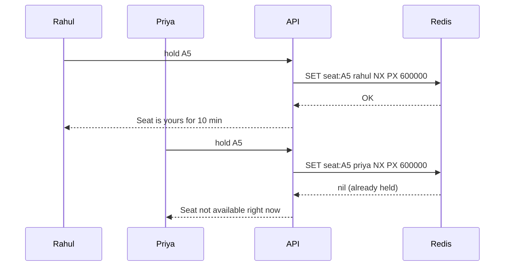

# Locks & Contention

**In one line:** When many people want the same thing at the same time (the last seat, the last iPhone, one driver), only one should win and the data must not go wrong.

> **Example:** A movie hall has seat A5. Rahul and Priya pressed "Book" in the same second. If there is no lock, both will get a ticket. This is called **double booking**, and it happens because of a race condition.

## Why the problem happens

Both requests read the DB at the same time ("Is A5 free?" → yes), then both write. The gap between the check and the write is the problem.

## 4 methods (simple to strong)

| Method | How | When to use | Downside |
|---|---|---|---|
| **DB unique constraint** | `UNIQUE(show_id, seat_id)` on bookings | Always, as the last line of defense | Only gives an error, doesn't hold |
| **Pessimistic lock** | `SELECT ... FOR UPDATE`. Take the lock first, then do the work | High conflict and short transactions | Slow, deadlock risk, the lock can't be held long |
| **Optimistic lock** | `version` column: `UPDATE ... WHERE id=? AND version=?` | Low conflict (profile edit, inventory count) | Many retries under high contention |
| **Redis distributed lock** | `SET seat:A5 rahul NX PX 600000` | Multiple servers and you need a temporary hold (10 min payment window) | If Redis goes down the holds are lost, so keep the DB constraint too |

### Redis lock flow

- `NX`: the key is set only if it doesn't already exist. This gives an atomic check-and-set.
- `PX 600000`: a 10 min TTL. If the user abandons the payment, the seat frees itself.
- When releasing the lock, check that the value is yours (with a Lua script). Otherwise you might delete someone else's lock.

## Very high contention (flash sale, Taylor Swift tickets)

When lakhs of people arrive at once, even the lock becomes a bottleneck. Then:
- **Virtual waiting queue:** put users in a line and let them in a few at a time.
- Make **inventory an atomic counter in Redis** (`DECR stock`, reject if `< 0`).
- **Serialize with a queue:** all requests go to Kafka with one partition per item, so requests for one item are processed in line.

## Where it is used

- [BookMyShow / Ticketmaster](../02-questions/t1-05-bookmyshow.md): seat hold
- [Flash Sale](../02-questions/t2-15-flash-sale.md): last item in stock
- [Uber](../02-questions/t1-06-uber.md): one driver gets only one ride
- [Payment System](../02-questions/t1-11-payment-system.md): one payment happens only once
- Auctions, coupon redemption, hotel/flight booking

## Say this in the interview

> "For the seat hold I'll use a Redis lock with a TTL, so if the user abandons the payment the seat frees itself. The final booking will be in the DB with a unique constraint, so even if Redis fails there is no double booking. This is defense in depth."

## Common mistakes

- **No TTL on the lock**: if the server crashes, the lock is never released.
- Relying only on the Redis lock, without a DB constraint.
- Holding a pessimistic lock for 10 min during the user's payment. DB connections will run out.
- Saying "distributed lock" without saying which tool and how.

## Checklist

- [ ] I can explain a race condition example (the check-then-write gap)
- [ ] I can tell the difference between pessimistic and optimistic locking, and when to use each
- [ ] I can tell what Redis `SET NX PX` means and why the TTL is required
- [ ] I can explain Redis lock + DB unique constraint (defense in depth)
- [ ] I can tell how a virtual queue / atomic counter handles extreme contention
