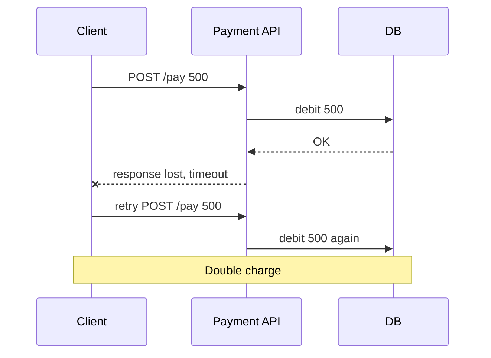

# Idempotency & Retries

**In one line:** Even if the same request arrives two or three times, the result should be the same as doing it once. Retries must be safe.

> **Example:** You sent ₹500 on Paytm, the network was slow, and the spinner kept spinning. The user pressed "Pay" again. If the server is not idempotent, ₹1000 will be deducted. With an idempotency key the server understands "this is the same old request" and does not deduct the money again.

## Why retries create duplicates

The client has no way to know whether the request failed or only the **response** was lost.



A timeout does not mean "failed", it means "unknown". So a retry is safe only when the server is idempotent.

## Delivery guarantees

| Guarantee | Meaning | How you get it | Example |
|---|---|---|---|
| **At-most-once** | 0 or 1 times. Can be lost | Don't retry | Metrics, logs where a little loss is fine |
| **At-least-once** | 1 or more times. Can be duplicated | Retry until ack | Kafka consumers, webhooks (default) |
| **Exactly-once** | Exactly 1 time | Not truly possible over a network | Just a marketing term, without dedup |
| **Effectively-once** | At-least-once delivery + idempotent processing | Retry + dedup | Payments, orders. **Say this in the interview** |

> Rule: "There is no exactly-once delivery. There is an exactly-once **effect**, from at-least-once + idempotency."

## How an idempotency key works

1. The client creates a unique key (UUID), one per logical operation. On retry it sends the **same key**.
2. Header: `Idempotency-Key: 7f3a...`
3. The server checks the dedup table:
   - Key not found → insert `(key, status=IN_PROGRESS)`, do the work, save the result.
   - Key found and `DONE` → return the saved response, don't do the work again.
   - Key found and `IN_PROGRESS` → `409 Conflict` or wait.

```sql
idempotency_keys(
  key        VARCHAR PRIMARY KEY,   -- UNIQUE also solves the race
  user_id    BIGINT,
  request_hash VARCHAR,             -- same key, different body? reject
  status     VARCHAR,               -- IN_PROGRESS / DONE
  response   JSONB,
  created_at TIMESTAMP              -- cleanup after 24h
)
```

- Do the key insert and the business write in **one DB transaction**. Otherwise a crash in between leaves the state half done.
- If two requests with the same key arrive together, the `PRIMARY KEY` constraint rejects one of them.
- For a fast path, Redis `SET key NX EX 86400` works, but keep the DB as the source of truth.

**Naturally idempotent operations:** `PUT /user/5 {name}`, `DELETE`, `SET balance = 100`. **Non-idempotent:** `POST /pay`, `balance = balance + 100`. Where you can, make the operation absolute.

**Dedup in consumers:** put an `event_id` in the Kafka message. The consumer checks `processed_events(event_id UNIQUE)`. Or upsert (`INSERT ... ON CONFLICT DO NOTHING`).

## How to retry: exponential backoff + jitter

| Strategy | Wait | Problem |
|---|---|---|
| Immediate retry | 0 | The server is already struggling, and you added more load |
| Fixed delay | 1s, 1s, 1s | All clients come back at the same time |
| Exponential | 1s, 2s, 4s, 8s | Better, but everyone stays in sync |
| **Exponential + jitter** | `random(0, min(cap, base * 2^n))` | Load spreads out over time. **This is the default** |

Also:
- **Max retries** (3–5) and a **cap** (30s). Then put it in the DLQ (dead letter queue).
- Retry only on **retryable errors**: timeout, 503, 429. Never on `400`, `401`.
- If a 429 comes with a `Retry-After` header, follow it.

## Retry storm

One service gets slow → every caller retries 3 times → load is 3x. If there are 3 layers and each layer retries 3 times, the load is **27x**. The service never recovers.

Protection:
- Retry at only **one layer** (usually the edge/client), not in the middle layers.
- **Retry budget:** at most 10% of total requests can be retries.
- **Circuit breaker:** when errors are high, stop calling for a while and fail fast.
- Always backoff + jitter.

## Outbox pattern (pointer)

You saved an order in the DB and need to send an event to Kafka. They are two separate systems. If one fails, you get inconsistency. Solution: write the event to an `outbox` table in the **same DB transaction**, and a relay/CDC (Debezium) publishes it to Kafka. The relay is at-least-once, so the consumer must be idempotent. Details: [Distributed Transactions](./16-distributed-transactions.md).

## Where it is used

- [Payment System](../02-questions/t1-11-payment-system.md): stopping double charges, the most important one
- [BookMyShow](../02-questions/t1-05-bookmyshow.md): Idempotency-Key on confirm booking
- [Notification System](../02-questions/t1-09-notification-system.md): one SMS must not go out twice
- [Flash Sale](../02-questions/t2-15-flash-sale.md): an order retry must not create a duplicate order
- [Ad Click Aggregator](../02-questions/t2-17-ad-click-aggregator.md): a click must not be counted twice
- [Job Scheduler](../02-questions/t2-18-job-scheduler.md): job retries must be safe
- [Food Delivery](../02-questions/t2-14-food-delivery.md): place order retry

## Say this in the interview

> "Exactly-once delivery is not possible over a network, so I'll do at-least-once delivery + idempotent processing. The client will send an Idempotency-Key with every payment, and the server will store it in a table with a unique constraint, in the same transaction as the business write. On retry, the saved response is returned."

> "Retries use exponential backoff with jitter, max 3, and only at one layer, so we don't get a retry storm."

## Common mistakes

- Saying "Kafka gives exactly-once" and skipping dedup. Side effects (DB, email) always need dedup.
- Generating the idempotency key on the server. The client creates the key, only then does it stay the same on retry.
- Doing the key check and the business write in separate transactions.
- Retrying without jitter, and retrying at every layer.
- Retrying even on non-retryable errors like `400`.

## Checklist

- [ ] I can explain with an example why a retry on timeout creates a duplicate
- [ ] I can tell the difference between at-most, at-least, exactly and effectively-once
- [ ] I can design the idempotency key flow and the dedup table schema
- [ ] I can tell exponential backoff + jitter and how to protect against a retry storm
- [ ] I can explain the outbox pattern in one line
