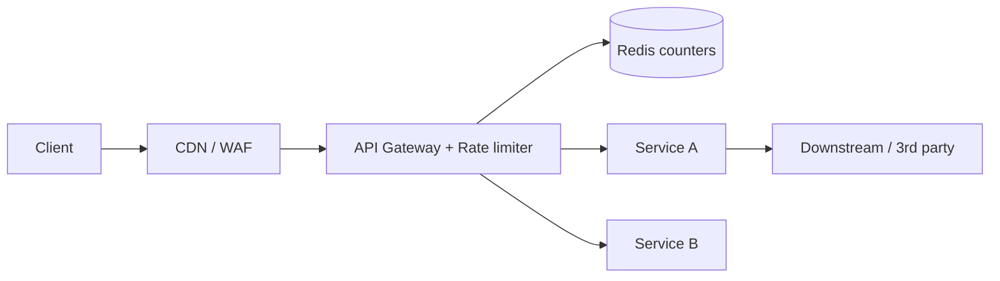

# Rate Limiting

**In one line:** Put a limit on how many requests a user/IP/API key can send in a given time, so the system is protected from abuse and overload.

> **Example:** IRCTC Tatkal opens at 10 am. Bots send a thousand requests a second. The rate limiter says "one user = 10 requests/min", and the rest get `429 Too Many Requests`. This gives real users a chance too, and the servers don't fall over.

## 5 algorithms

### Token bucket
The bucket holds max `N` tokens. `r` tokens are refilled every second. Each request takes one token. No token, reject.
- **Allows bursts** (up to N), while controlling the average rate at `r`. AWS and Stripe use this.
- What to store: just `tokens` and `last_refill_time`.

### Leaky bucket
Requests go into a queue, and the queue "leaks" (is processed) at a fixed rate. Queue full, drop.
- Output is a **smooth constant rate**. It doesn't let bursts through. Good for traffic shaping.

### Fixed window counter
`counter:user:10:05` (one key per minute). `INCR`, reject if > limit.
- Simple and cheap. **Problem:** boundary burst. 100 at 10:00:59 and 100 at 10:01:00 = 200 in 2 sec.

### Sliding window log
Keep each request's timestamp in a sorted set. On a new request, remove entries older than 60 sec and count.
- **Exact**. But high memory: one entry per request.

### Sliding window counter
A weighted mix of the current and previous windows: `count = curr + prev * (overlap fraction)`.
- Example: at 10:01:15, the previous window overlaps 75% → `curr + 0.75 * prev`.
- Low memory, almost accurate. **The production favourite** (Cloudflare).

| Algorithm | Burst | Memory | Accuracy | When to use |
|---|---|---|---|---|
| Token bucket | Yes, controlled | Very low | Good | API limits, general default |
| Leaky bucket | No, smooth | Low (queue) | Good | Downstream needs a fixed rate |
| Fixed window | 2x at the boundary | Very low | Low | Simple internal limits |
| Sliding log | No | High | Exact | Low volume, strict limits |
| Sliding counter | A little | Low | ~Approx (good) | High scale, public APIs |

## Where to put the limiter



- **Client side:** only a courtesy. You can't trust it.
- **CDN/WAF:** IP based, for DDoS.
- **API Gateway / middleware:** **the most common**. Per user / API key / endpoint limits.
- **Inside the service:** for expensive operations (OTP send, search).
- Which key to limit on: `user_id` (logged in), `IP` (anonymous), `api_key` (B2B), or a combo.

## Redis implementation

**Fixed window (INCR + EXPIRE):**
```text
key = "rl:user42:" + current_minute
count = INCR key
if count == 1: EXPIRE key 60
if count > 100: reject 429
```
Catch: `INCR` and `EXPIRE` are separate commands. If it crashes in between, the key stays without a TTL. So use a **Lua script** or `SET key 0 EX 60 NX` + `INCR`.

**Token bucket via Lua (atomic):**
```lua
local tokens = tonumber(redis.call('HGET', KEYS[1], 'tokens') or ARGV[1])
local last   = tonumber(redis.call('HGET', KEYS[1], 'ts') or ARGV[3])
local now, cap, rate = tonumber(ARGV[3]), tonumber(ARGV[1]), tonumber(ARGV[2])
tokens = math.min(cap, tokens + (now - last) * rate)
if tokens < 1 then return 0 end
redis.call('HSET', KEYS[1], 'tokens', tokens - 1, 'ts', now)
redis.call('EXPIRE', KEYS[1], 3600)
return 1
```
A Lua script runs atomically in Redis, so there is no race in the read-modify-write.

**Sliding log:** `ZREMRANGEBYSCORE key 0 now-60000`, `ZADD key now reqId`, `ZCARD key`. Also inside `MULTI` or Lua.

## Distributed limits

- There are multiple gateway servers → keep the counter in a **central Redis**, not in local memory. Otherwise 10 servers = 10x the limit.
- Redis adds a network hop (~1ms). At very high QPS: **local counter + periodic sync** (a bit inaccurate, but fast).
- In Redis Cluster the key is sharded by `user_id`, so the load spreads out.
- **What if Redis is down?** Usually **fail open** (allow the request) so the whole site doesn't go down. Fail closed on sensitive endpoints like payment/OTP.

## Response: 429 + headers

```http
HTTP/1.1 429 Too Many Requests
Retry-After: 30
X-RateLimit-Limit: 100
X-RateLimit-Remaining: 0
X-RateLimit-Reset: 1696320060
```
The client should know when to come back. A good client follows `Retry-After` + backoff.

## Where it is used

- [Rate Limiter](../02-questions/t1-02-rate-limiter.md): the whole question is about this
- [BookMyShow](../02-questions/t1-05-bookmyshow.md): stopping bots at the gateway
- [Flash Sale](../02-questions/t2-15-flash-sale.md): per-user purchase limit
- [Web Crawler](../02-questions/t1-12-web-crawler.md): politeness limit per domain
- [LLM Chat App](../02-questions/t2-22-llm-chat-app.md): tokens per minute limit
- [Notification System](../02-questions/t1-09-notification-system.md): don't spam the user

## Say this in the interview

> "I'll put a token bucket at the API gateway, per user_id. The state will be in Redis and updated atomically by a Lua script, so the limit stays correct across multiple gateway servers. When the limit is crossed, 429 with Retry-After. If Redis is down, fail open, with fail closed only for OTP and payment."

## Common mistakes

- Keeping the counter in each server's local memory. In a distributed setup the limit gets multiplied.
- Not spotting the boundary burst problem of the fixed window.
- Running `INCR` and `EXPIRE` non-atomically.
- Not saying what happens when Redis fails (fail open vs closed).
- Limiting only by IP. Behind an office/college NAT, a thousand users share one IP.

## Checklist

- [ ] I can tell all five algorithms in one line each, with their trade-offs
- [ ] I can explain the fixed window boundary problem and the sliding window counter formula
- [ ] I can write/explain an atomic token bucket with Redis + Lua
- [ ] I can tell where to put the limiter and the issue with distributed limits
- [ ] I can tell 429, Retry-After and fail open vs fail closed
