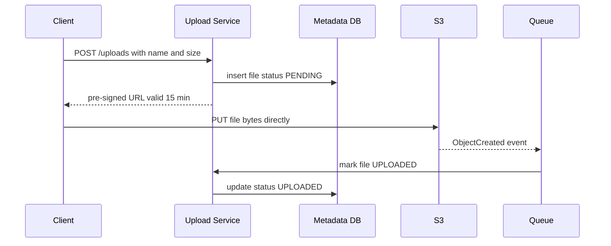
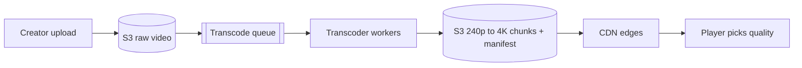

# Blob Storage & CDN

**In one line:** keep large binary data like images, videos and files in object storage (S3), and serve it through a CDN from a server close to the user.

> **Example:** 2 crore people are watching the IPL final on Hotstar at the same time. If the video came from one server in Mumbai, that server would melt. So the video chunks live in S3, and the CDN caches them on edge servers in every city. A user in Delhi watches from the Delhi edge.

## What is object storage (S3)

- Flat namespace: `bucket/key → bytes + metadata`. Folders are just part of the name (`users/42/avatar.jpg`).
- Practically infinite scale, **11 nines of durability** (data is replicated across multiple AZs).
- Cheap (~$0.023/GB/month), and cold tiers (Glacier) are even cheaper.
- Immutable objects: an update means writing a new object. There are no partial updates.

## Why we don't keep blobs in the DB

| Blob in the DB | Blob in S3 |
|---|---|
| DB size blows up, backups/replication get slow | DB holds only metadata + the S3 URL |
| DB connections stay stuck on large transfers | Client downloads/uploads directly from S3 |
| SSD storage is expensive | Storage is cheap, tiers are available |
| Does not work with a CDN | CDN can use S3 directly as its origin |

> Rule: **metadata in the DB, bytes in S3.** `files(id, owner_id, s3_key, size, content_hash, created_at)`.

## Pre-signed URLs

Sending a 2 GB file through the app server = wasted server bandwidth and memory. So:
1. The client tells the app server "I want to upload".
2. The server checks auth and returns an S3 **pre-signed URL** (signed, valid for 15 min, PUT only on that key).
3. The client uploads directly to S3.
4. Through an S3 event (or a client callback), the server marks the metadata as `UPLOADED`.

Downloads work the same way: for private files, give a pre-signed GET URL or a CDN signed URL.

## Multipart / chunked & resumable upload

- Split a large file (> 100 MB) into **5–10 MB chunks**. Each chunk uploads separately, even in parallel.
- If one chunk fails, retry only that chunk, not the whole file.
- **Resumable:** the server/S3 tracks which chunks have arrived. If the network drops, the client asks "which parts do you have?" and resumes from the rest.
- S3 multipart: `CreateMultipartUpload` → `UploadPart` x N → `CompleteMultipartUpload`.

## Dedup via content hash

- Compute a **SHA-256 hash** of each file (or chunk). Same hash = same content.
- The client sends the hash before uploading. If the server already has it, skip the upload ("instant upload"). Dropbox does this.
- Chunk-level dedup: only the changed chunk of a file gets uploaded. This saves bandwidth.
- Storage reference counting: track how many files point to a blob, and delete it only when the count hits 0.

## CDN

Edge servers all over the world. The edge nearest to the user serves the content. Latency drops from 200ms to ~20ms, and load on the origin drops by 90%+.

| | Pull CDN | Push CDN |
|---|---|---|
| How | On the first request, the edge fetches from the origin and caches it | You upload the content to the edges yourself |
| Pro | Easy setup, only popular content gets cached | Even the first request is fast, zero load on origin |
| Con | First request is slow (cache miss) | You must push all content, storage is expensive |
| When | Default. Images, user content | Large, predictable files: game patches, a new movie launch |

**Cache invalidation:**
- **Versioned URLs** (best): `logo.v42.png` or `app.a8f3c.js`. When content changes, the URL changes. The old one dies with its TTL.
- **TTL** via `Cache-Control: max-age=86400`.
- **Purge API:** if something wrong got published by mistake, remove it explicitly. Slow and expensive, not for regular use.

## Video: transcoding + adaptive bitrate

- **Transcoding:** convert the raw video into multiple resolutions (240p, 480p, 720p, 1080p) and codecs (H.264, VP9/AV1). It is CPU heavy, so use a queue + parallel workers (split the video into segments and process them in parallel).
- **Segments:** split each quality into 2–10 sec chunks.
- **Adaptive bitrate (HLS / DASH):** one manifest file (`.m3u8` for HLS, `.mpd` for DASH) lists all qualities and chunks. The player checks bandwidth and switches quality on every chunk. If Jio 4G gets slow, it drops to 480p; on WiFi it plays 1080p. Less buffering.
- HLS is from Apple and works everywhere. DASH is an open standard.

## Where it is used

- [YouTube](../02-questions/t1-07-youtube.md): upload, transcoding, HLS, CDN
- [Dropbox](../02-questions/t1-08-dropbox.md): chunked upload, dedup, sync
- [Instagram](../02-questions/t2-13-instagram.md): photos in S3 + CDN, pre-signed upload
- [Web Crawler](../02-questions/t1-12-web-crawler.md): crawled pages in S3
- [News Feed](../02-questions/t1-03-news-feed.md): post media from the CDN
- [LLM Chat App](../02-questions/t2-22-llm-chat-app.md): file attachments

## Say this in the interview

> "Media bytes will live in S3 and metadata in the DB. The client will upload directly to S3 with a pre-signed URL, so app servers don't get stuck on bandwidth. Large files will be multipart and resumable. Reads go through the CDN, with versioned URLs so we don't have to worry about invalidation."

> "For video, after upload there is an async transcoding pipeline: multiple resolutions, chunks, and an HLS manifest. The player will switch quality based on the network."

## Common mistakes

- Storing videos/images in a BLOB column in the DB.
- Proxying uploads through the app server.
- Doing transcoding synchronously inside the upload request. It takes minutes, so it needs an async queue.
- Saying "CDN" but not explaining the invalidation plan.
- Not thinking about resumable upload for large files (they fail a lot on mobile networks).

## Checklist

- [ ] I can explain why blobs don't go in the DB, and the metadata vs bytes split
- [ ] I can explain the pre-signed URL upload flow with a diagram
- [ ] I can explain multipart/resumable upload and content-hash dedup
- [ ] I can explain pull vs push CDN and invalidation with versioned URLs
- [ ] I can explain transcoding + HLS/DASH adaptive bitrate
