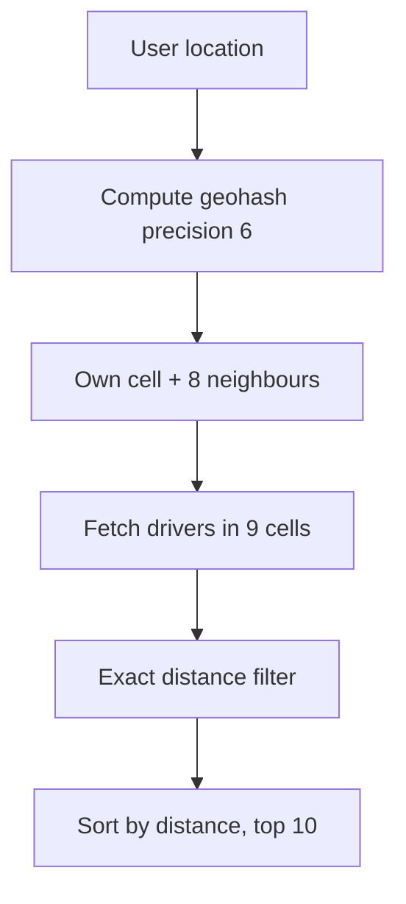

# Geospatial Indexing

**In one line:** how to quickly answer questions like "who is within 2 km of me", when there are lakhs of points and they keep moving.

> **Example:** You open the Uber app. Within 5 sec it should show 8 cabs nearby. Bangalore has 50,000 drivers online and every driver sends a location every 4 sec. Computing the distance to every driver on each request is impossible. That is why you need a geo index.

## Why a normal lat/lng query is slow

```sql
SELECT * FROM drivers
WHERE lat BETWEEN 12.90 AND 12.94
  AND lng BETWEEN 77.58 AND 77.62;
```

- A B-tree index works well on **only one dimension** at a time. The `lat` index gives a thin horizontal strip (everyone in the world at that latitude), then you filter by `lng`. Lots of rows get scanned.
- A composite `(lat, lng)` index does not help either, because the first column has a range.
- Solution: **map 2D to 1D** (geohash) or **split space into a tree** (quadtree).

## Geohash

Keep splitting the world into 4 (actually 32) parts. Each cell gets a string, like `tdr1y`. **Common prefix = close together.**

| Precision (chars) | Cell size approx | Use |
|---|---|---|
| 4 | ~39 km x 20 km | City level |
| 5 | ~4.9 km x 4.9 km | Area level |
| 6 | ~1.2 km x 0.6 km | Nearby drivers/restaurants |
| 7 | ~150 m x 150 m | Street level |

- Store it: a normal B-tree index on `drivers(id, geohash6)`. Query: `WHERE geohash6 = 'tdr1yx'` → fast.
- **Neighbours problem:** if the user is at the edge of a cell, a nearby driver may be in the next cell. So query **your own cell + 8 neighbours**, then filter and sort by exact distance.
- Pro: simple, works in any DB/Redis. Con: cells have a fixed size, the same in dense areas (Koramangala) and empty areas (highway).



## Quadtree

- Split the map into 4 quadrants. If a node has more points than a threshold (like 100), split it into 4 again.
- **Small cells in dense areas, big cells in empty areas.** Load stays balanced.
- Usually built **in-memory** (on each server). Perfect for static data (restaurants, places).
- Con: rebalancing the tree on frequent updates is expensive. Less suitable for moving drivers.

## S2 and H3 (you should know the names)

- **Google S2:** projects the sphere onto a cube to make hierarchical cells. 64-bit cell ID using a Hilbert curve. Google Maps, Foursquare.
- **Uber H3:** hexagon cells. All 6 neighbours of a hexagon are at the same distance, so it is good for surge pricing and demand heatmaps.

## Redis GEO and PostGIS

**Redis GEO** (geohash + sorted set under the hood):
```text
GEOADD drivers:blr 77.6101 12.9352 driver:42
GEOSEARCH drivers:blr FROMLONLAT 77.61 12.93 BYRADIUS 2 km ASC COUNT 10
```
- In-memory, very fast, best for frequent updates.

**PostGIS** (Postgres extension):
```sql
SELECT id FROM places
WHERE ST_DWithin(geom, ST_MakePoint(77.61, 12.93)::geography, 2000)
ORDER BY geom <-> ST_MakePoint(77.61, 12.93) LIMIT 20;
```
- GiST index (like an R-tree). Polygons, delivery zones, complex queries. Durable, but heavy at a high write rate.

## Frequent location updates (drivers every 4 sec)

50K drivers / 4 sec = **~12.5K writes/sec** in just one city. At India level, 1 lakh+/sec.
- **Don't write every update to the DB.** Keep the latest location in Redis GEO (overwrite). You don't need the old location.
- For location history (trip route, billing), send updates to Kafka and write them in batches to cold storage.
- **Shard by city/region:** `drivers:blr`, `drivers:mum`. Don't keep all of India on one Redis node.
- Remove stale drivers: keep a `last_seen` TTL for each driver. If no update comes for 30 sec, drop them from search.
- Client side: if the driver is not moving, send fewer updates (adaptive frequency).

## Comparison

| Option | How | Updates | When to use |
|---|---|---|---|
| Geohash in DB | String prefix + B-tree | OK | Simple setup, in any DB |
| Quadtree | In-memory adaptive tree | Expensive | Static places, uneven density |
| Redis GEO | Geohash on sorted set | Very fast | Moving objects: drivers, riders |
| PostGIS | GiST/R-tree | Moderate | Polygons, zones, rich queries |
| S2 / H3 | Hierarchical cells | Fast (cell ID) | Big scale, surge/heatmaps |

## Where it is used

- [Uber](../02-questions/t1-06-uber.md): nearby drivers, location update every 4 sec
- [Nearby Places / Yelp](../02-questions/t2-21-nearby-places.md): static places, quadtree/geohash
- [Food Delivery](../02-questions/t2-14-food-delivery.md): nearby restaurants + delivery partners, delivery zones

## Say this in the interview

> "I'll keep the drivers' latest location in Redis GEO, sharded by city. The update every 4 sec is just an overwrite, it doesn't go to the DB. History is stored async through Kafka. Search uses a 2 km radius, and stale drivers drop out via TTL."

> "Restaurants are static, so for them I'd use geohash or a quadtree, and PostGIS for polygons like zones."

## Common mistakes

- Getting by with a normal index on `lat BETWEEN` + `lng BETWEEN`.
- Forgetting the neighbouring geohash cells. A user standing at the edge won't see a nearby driver.
- Writing every location update to the SQL DB.
- Picking a quadtree for moving drivers without thinking about update cost.
- Handling static places and moving drivers with the same solution.

## Checklist

- [ ] I can explain why a normal lat/lng index is slow
- [ ] I can explain geohash precision and the neighbour cells problem
- [ ] I can explain the quadtree vs geohash trade-off
- [ ] I can tell the Redis GEO commands and when to use PostGIS
- [ ] I can explain the write path and estimation for a driver update every 4 sec
