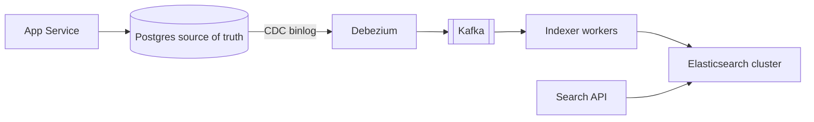
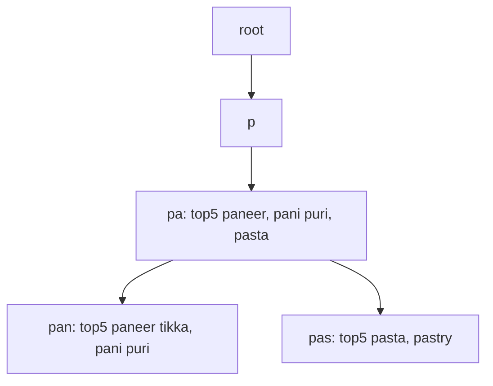

# Search & Indexing

**In one line:** how to find words in text fast: build a map from word to documents (inverted index), and use a trie for prefixes.

> **Example:** You type "paneer" on Swiggy. You need results from lakhs of dishes in 100ms, the typo "panner" should also work, and the most relevant results should be on top. `WHERE name LIKE '%paneer%'` will scan the whole table. That is why a search engine like Elasticsearch is used.

## Inverted index

Normal index: document → words. **Inverted:** word → list of documents (posting list).

| Term | Posting list (doc ids) |
|---|---|
| paneer | 3, 7, 19, 42 |
| tikka | 7, 11, 42 |
| butter | 3, 42 |

Query "paneer tikka" → intersection of both lists → `7, 42`. The lists are sorted, so the intersection is fast.

### Tokenization (before building the index)

"Paneer Tikka's Masala!" → pipeline (analyzer):
1. **Tokenize:** split into words → `Paneer`, `Tikka's`, `Masala`
2. **Lowercase:** `paneer`, `tikka's`, `masala`
3. **Remove stop words:** `the`, `a`, `is`
4. **Stemming:** `running → run`, `tikka's → tikka`
5. Optional: synonyms (`cottage cheese → paneer`), n-grams (for typo/partial match)

The **same analyzer** must run on the query too, or nothing will match.

## Ranking basics

- **TF-IDF:** the more times a word appears in a document (TF), the more relevant it is, but a word that is in every document (low IDF) is worth less.
- **BM25:** an improved TF-IDF, where TF saturates and document length is normalized. The Elasticsearch default.
- Real ranking = text score + business signals (rating, distance, popularity, freshness).

## Elasticsearch

- **Index** = a collection (like a table). An index is split into **shards** (primary shards). Each shard is a Lucene index.
- **Replicas:** a copy of each shard on another node. Read throughput goes up and data stays safe if a node fails.
- A query goes to all shards in parallel (scatter-gather), and the results are merged.
- Changing the number of primary shards later is hard (reindex). Think it through at the start, ~10–50 GB per shard.
- **Near real-time:** a new document becomes searchable in ~1 sec (refresh interval).
- **It is not the source of truth.** Keep ES rebuildable from the DB.

## DB → ES sync

| Approach | How | Problem |
|---|---|---|
| **Dual write** | App writes to the DB and to ES | If one fails, both go out of sync. Avoid it |
| **Periodic batch** | Every 10 min, `updated_at > last_run` | Stale data, deletes get missed |
| **CDC (best)** | Debezium reads the DB binlog/WAL → Kafka → indexer → ES | Some lag (seconds), but reliable and ordered |

With CDC, keep the indexer idempotent (upsert by doc id), so replays are safe.

## Trie: prefix and autocomplete

For typeahead ("pan" → "paneer tikka", "pani puri"), a **trie** is better than an inverted index.
- Each node is one character. The path from the root = the prefix.
- Naive: go to the prefix node, traverse the whole subtree and pick the top results. Slow on a big subtree.
- **Precompute top-K per prefix:** store the top 5–10 suggestions for that prefix on every node in advance. Query = O(prefix length). Just walk to the node and pick up the list.

- **How to update:** search logs go to Kafka → an hourly/daily batch job (Spark) counts frequencies → builds a new trie → swaps it on the servers. Don't update in real time on every keystroke.
- Keep the trie in memory, and shard by the first 1–2 characters of the prefix. Cache hot prefixes in Redis/CDN.
- Simple option: a `prefix → top10 list` key-value in Redis also works.

## When to use what

| Need | Use |
|---|---|
| Full-text, typo, filters, ranking | Elasticsearch / OpenSearch |
| Prefix autocomplete, ultra low latency | Trie with precomputed top-K (or the ES completion suggester) |
| Exact match by id/email | Normal DB index, not a search engine |
| Small scale, simple search | Postgres full-text (`tsvector` + GIN index) |

## Where it is used

- [Typeahead](../02-questions/t1-10-typeahead.md): trie + top-K per prefix
- [BookMyShow](../02-questions/t1-05-bookmyshow.md): movie/event search, ES sync via CDC
- [Web Crawler](../02-questions/t1-12-web-crawler.md): inverted index of crawled pages
- [Instagram](../02-questions/t2-13-instagram.md): search for users, hashtags
- [Food Delivery](../02-questions/t2-14-food-delivery.md): dish/restaurant search
- [Nearby Places](../02-questions/t2-21-nearby-places.md): text + geo filter

## Say this in the interview

> "For search I'll use Elasticsearch, but Postgres stays the source of truth. Sync happens through CDC: Debezium reads the binlog, puts it in Kafka, and the indexer upserts into ES. I won't do dual writes, because on a partial failure the data goes out of sync."

> "For autocomplete, a trie with top-K suggestions precomputed on each node, rebuilt by an offline batch. Lookup is O(prefix length)."

## Common mistakes

- Calling `LIKE '%term%'` a search solution.
- Making ES the primary database.
- Doing dual writes to the DB and ES.
- Traversing the subtree on every trie query instead of precomputing top-K.
- Updating the trie on every keystroke.

## Checklist

- [ ] I can explain the inverted index and posting list intersection
- [ ] I can explain the tokenization pipeline (lowercase, stop words, stemming)
- [ ] I can explain Elasticsearch shards, replicas and scatter-gather
- [ ] I can tell why CDC and not dual write for DB to ES sync
- [ ] I can explain trie + top-K per prefix and its offline update flow
