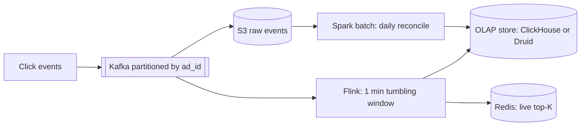

# Counting & Top-K

**In one line:** counting a huge number of events (likes, views, clicks) fast, and picking the "top 10" from them, sometimes exactly and sometimes approximately.

> **Example:** During the IPL final, Hotstar shows "2.5 crore people are watching" and Twitter shows "Trending: #CSKvsMI". Lakhs of events arrive every second. If you update a DB row on every event, the DB will die. That is why counting needs special techniques.

## Exact counters

**Redis INCR:** `INCR views:video:42`. Atomic, in-memory, ~100K ops/sec per node.
- Flush to the DB periodically (every 10 sec). Redis is the source of counting, the DB is the durable copy.

**Hot key problem:** on a viral video, all INCRs hit one key → one Redis shard gets overloaded.

**Sharded counters:** split one counter into N keys.
- Write: `INCR views:42:{random 0..N-1}`
- Read: `SUM` of the N keys (or a background job sums them and caches the result)
- Writes spread N times. Reads get a bit more expensive. Do this only for hot keys.

**Write batching:** the app server adds up counts in memory for 1 sec, then does one `INCRBY 350`. 100x fewer writes.

## Leaderboard: Redis sorted set

```text
ZINCRBY leaderboard:ipl2026 50 user:rahul
ZREVRANGE leaderboard:ipl2026 0 9 WITHSCORES   # top 10
ZREVRANK leaderboard:ipl2026 user:rahul         # my rank
```
- Based on a skip list. Both update and rank are **O(log N)**. Up to 10 crore users fit on one node (~10 GB).
- If it gets very big: shard by score range, or for top-K keep only a small set of top users and give an approximate rank for the rest ("top 5%").
- Time-based boards: a separate key like `leaderboard:daily:2026-10-03`, with a TTL.

## Approximate counting (when exact is not needed)

| Structure | What it tells you | Memory | Error | Use |
|---|---|---|---|---|
| **HyperLogLog** | Unique count (cardinality) | ~12 KB fixed, even for 1 billion items | ~0.81% | Unique visitors, unique viewers |
| **Count-Min Sketch** | How many times an item appeared (frequency) | Small fixed 2D array | Only over-estimates | Heavy hitters, trending hashtags |
| **Bloom filter** | Whether an item was seen before | Very little | False positives possible | Dedup, "already crawled?" |

**HyperLogLog:** hash each item, and estimate cardinality from the leading zeros in the hash. Redis: `PFADD uv:2026-10-03 user42`, `PFCOUNT uv:2026-10-03`. An exact set of 1 crore user IDs = ~100s of MB. HLL = 12 KB.

**Count-Min Sketch:** `d` hash functions, each with a row of `w` counters. On add, increment the `hash_i(x)` counter in each row by 1. On query, take the **minimum** across all rows. Because of collisions, the count is never lower than the truth, but it can be a bit higher.

## Top-K with heap

- **Exact, single machine:** a hashmap of counts + a **min-heap of size K**. If a new count is bigger than the heap top (min), replace it. O(N log K).
- **Distributed:** each shard computes its local top-K, then an aggregator merges them. Careful: merging local top-Ks does not give an exact global top-K (an item could be 11th on every shard). Fix: **partition by key** so an item's full count lives on one shard. Then merging local top-Ks is exact.
- **Streaming approx:** frequency from a Count-Min Sketch + a heap of K. Fixed memory, perfect for trending.

## Stream processing with windows



- **Kafka** keeps events durable and partitions them by key (`ad_id`). Same key → same partition → same Flink task.
- **Flink** counts inside a window and emits the result when the window closes.

| Window | How | Example |
|---|---|---|
| **Tumbling** | Fixed, non-overlapping | Clicks per 1 min |
| **Sliding / hopping** | Fixed size, overlapping | Trending over the last 5 min, updated every 1 min |
| **Session** | Ends after an inactivity gap | Activity in a user session |

- **Event time vs processing time:** an event can arrive late (the phone was offline). With **watermarks**, Flink decides when to close a window. Send very late events to a side output or to the batch reconcile.
- Flink checkpoints + Kafka offsets give exactly-once state. Keep the sink idempotent.

## Batch vs stream (lambda / kappa)

| | Batch (Spark, Hadoop) | Stream (Flink, Kafka Streams) |
|---|---|---|
| Latency | Minutes to hours | Seconds |
| Accuracy | Exact, all data at once | Slightly approximate because of late events |
| Use | Billing, daily reports, reconciliation | Live dashboards, trending, fraud alerts |

- **Lambda architecture:** both a stream layer (fast, approx) and a batch layer (slow, exact). The batch result later corrects the stream. Con: two codebases for the same logic.
- **Kappa architecture:** stream only. To fix a mistake, replay from Kafka. One codebase, simpler. This is more popular today.
- For billing cases like ad clicks, say: "stream for real-time, and a daily batch reconcile for billing." This is the practical version of lambda.

## Where it is used

- [Leaderboard](../02-questions/t2-16-leaderboard.md): Redis sorted set, rank queries
- [Ad Click Aggregator](../02-questions/t2-17-ad-click-aggregator.md): Kafka + Flink windows, reconciliation
- [Typeahead](../02-questions/t1-10-typeahead.md): query frequency, top-K per prefix
- [YouTube](../02-questions/t1-07-youtube.md): view counts, sharded counters
- [Instagram](../02-questions/t2-13-instagram.md): like counts, trending hashtags
- [News Feed](../02-questions/t1-03-news-feed.md): like/comment counters, trending

## Say this in the interview

> "The like count doesn't need to be exact every second, so Redis INCR with write batching, and sharded counters for viral posts. Flush to the DB every 10 sec. HyperLogLog for unique viewers, crores of users in 12 KB."

> "Ad clicks will be partitioned in Kafka by ad_id, and Flink will aggregate them in 1 min tumbling windows. For billing, raw events go to S3, and a daily Spark job reconciles."

## Common mistakes

- Running `UPDATE posts SET likes = likes + 1` on the DB for every like/view. Lock contention on the hot row.
- Keeping a big set for a unique count when HyperLogLog would do.
- Assuming that merging local top-Ks is exact in distributed top-K.
- Not mentioning late events and event time in stream processing.
- Using only approximate structures for an exact case like billing.

## Checklist

- [ ] I can explain the use of Redis INCR, sharded counters and write batching
- [ ] I can build a leaderboard (top 10, my rank) with a Redis sorted set
- [ ] I can tell the difference and use cases of HyperLogLog vs Count-Min Sketch
- [ ] I can explain top-K with a heap and the distributed top-K problem
- [ ] I can explain Kafka + Flink windows and lambda vs kappa
