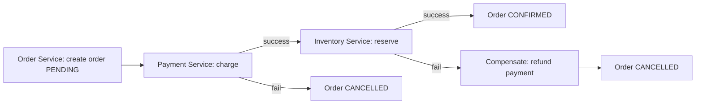
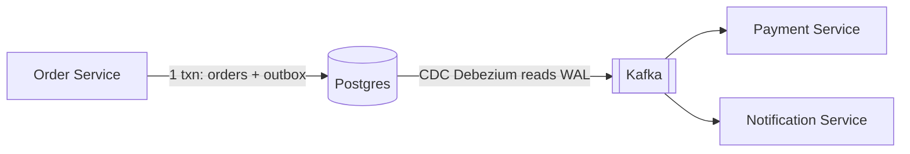

# Distributed Transactions

**In one line:** when one business action (placing an order) spreads across many services and many DBs, either everything happens or everything is undone. No half-finished state should be left behind.

> **Example:** You placed an order on Swiggy. Order Service created the order, Payment Service charged ₹500, but the Restaurant/Inventory Service said "item out of stock". Now the money is gone but the food won't come. Fixing this half-done work is exactly the distributed transaction problem.

## Why the problem is hard

Inside one DB, `BEGIN ... COMMIT` handles everything (ACID). But in microservices, each service has its own DB. There is no single global `COMMIT`.
- The network can fail in between. You don't know whether the request went through or not.
- Any service can be slow or down.
- Partial states like "money charged, but order failed" appear.

## 2PC (Two-Phase Commit), and why we avoid it

A **coordinator** asks all participants:
1. **Prepare phase:** "Can you commit?" Everyone takes locks and says "yes".
2. **Commit phase:** if everyone said yes, "commit", otherwise "abort".

| Problem | Why |
|---|---|
| **Blocking** | If the coordinator crashes after prepare, participants keep holding locks and waiting |
| **Slow** | 2 network round trips per transaction + locks on all services |
| **Lower availability** | If even one participant is down, the whole transaction stops |
| **Not supported** | Kafka, Stripe, third-party APIs don't take part in 2PC at all |

> 2PC can work inside one company, with few participants and the same DB vendor (like XA transactions). In microservices, almost never.

## Saga: the default interview answer

Saga = a **chain of small local transactions**. Each step commits in its own DB. If a step fails, the **compensating actions** of the earlier steps run (not an undo, but a reverse business action).

| Step | Action | Compensation |
|---|---|---|
| 1 | Create order (`PENDING`) | Order `CANCELLED` |
| 2 | Charge payment | Refund |
| 3 | Reserve inventory | Release inventory |
| 4 | Order `CONFIRMED` | (last step, no compensation) |

### Choreography vs Orchestration

| | Choreography | Orchestration |
|---|---|---|
| How | Each service publishes an event, the next service listens and does its work | A central **orchestrator** tells each step "now it's your turn" |
| Good | Loose coupling, no central component | The flow is visible in one place, easy to debug and change |
| Bad | Hard to follow the flow beyond 5+ steps, cyclic events | The orchestrator is an extra service (but you can keep it stateless + durable) |
| When | 2–3 simple steps | Critical multi-step flows like payment, order, booking |

Tools: Temporal, AWS Step Functions, Camunda (orchestration). Kafka events (choreography).

**Saga rules:**
- Every step and every compensation must be **idempotent**, because there will be retries.
- A saga has no isolation. Someone can see a "PENDING" order midway. So keep a status field.
- If a compensation fails, keep retrying. If it still fails, alert + manual queue.

## Transactional Outbox + CDC

Problem: Order Service has to write the order to the DB **and** send an event to Kafka. These are two separate systems. If the DB commits and the service crashes before the Kafka publish, the event is lost (the dual write problem).

Solution: write the event to an `outbox` table in the **same DB transaction**. A separate relay (or CDC like Debezium) reads the outbox and puts it into Kafka.

- If the DB commit happened, the event will definitely go out (at-least-once). Keep consumers idempotent.
- CDC = Change Data Capture: reading the DB's WAL/binlog and streaming the changes. The app code doesn't even know.

## Double-entry ledger (systems that handle money)

Money is never "updated", only **entries** are written. Every transaction has one debit and one credit, and the total is always zero.

| txn_id | account | debit | credit |
|---|---|---|---|
| T1 | user_rahul_wallet | 500 | |
| T1 | swiggy_merchant | | 500 |

- It is append-only, so you get an audit trail for free.
- Balance = sum of entries (or a cached balance verified against the entries).
- If there is a mistake, you don't delete the entry. You write a reverse entry (reversal).

## Reconciliation

No matter how good the design is, there will be mismatches with external systems (bank, payment gateway). So:
- **Periodic job** (every 5 min / daily): compare your ledger with the gateway/bank settlement report.
- If you find a mismatch, auto-fix (pull the status of a missed webhook) or send it to a manual review queue.
- For a `PENDING` stuck for 30 min, ask the gateway for its status.

> Reconciliation is the "safety net". Tell the interviewer you treat it as part of the design, not an afterthought.

## When to use what

| Situation | Use |
|---|---|
| All data is in one DB | A normal ACID transaction. Don't make it distributed |
| Multi-service business flow | Saga (orchestration for critical flows) |
| DB write + event publish | Transactional outbox + CDC |
| Money / wallet / balance | Double-entry ledger + idempotency + reconciliation |
| Strict atomicity across 2 DBs, low traffic | 2PC can work, but justify it |

## Where it is used

- [Payment System](../02-questions/t1-11-payment-system.md): ledger, saga, reconciliation
- [Food Delivery](../02-questions/t2-14-food-delivery.md): order → payment → restaurant saga
- [Flash Sale](../02-questions/t2-15-flash-sale.md): inventory reserve + payment, release on failure
- [BookMyShow](../02-questions/t1-05-bookmyshow.md): payment succeeded but the seat is gone, so auto refund

## Say this in the interview

> "Here order, payment and inventory are three separate services, so I won't use 2PC. It is blocking and the payment gateway doesn't take part in it. I'll use an orchestrated Saga. Each step will have a compensating action, like a refund for payment. Events will go through a transactional outbox, so the DB commit and the event never go out of sync."

> "For money: a double-entry ledger, an idempotency key, and a daily reconciliation job against the gateway."

## Common mistakes

- Proposing 2PC in microservices without stating the downsides.
- Saying "Saga" but not defining the **compensation** ("if payment fails, what gets undone?").
- Publishing to Kafka directly after the DB write (dual write). Forgetting the outbox.
- Not making steps idempotent. A retry will cause a double refund.
- Doing `UPDATE balance = balance - 500` directly on a balance column, without a ledger.
- Not mentioning reconciliation at all in a payment design.

## Checklist

- [ ] I can explain how 2PC works and why we avoid it in microservices
- [ ] I can draw the order → payment → inventory saga with compensations
- [ ] I can tell the difference between choreography and orchestration, and when to use which
- [ ] I can explain the dual write problem and transactional outbox + CDC
- [ ] I can explain why a double-entry ledger and reconciliation are needed
