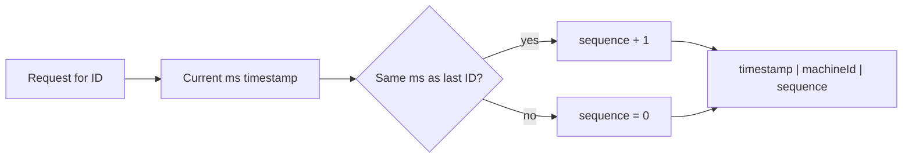

# Unique ID Generation

**In one line:** generating IDs on many servers, without them talking to each other, that never repeat, and ideally are also sorted by time.

> **Example:** Thousands of photos are uploaded to Instagram every second, across 100+ servers. Every photo needs an ID. If all servers ask one DB for an `AUTO_INCREMENT`, that DB becomes a bottleneck and a single point of failure.

## Why auto-increment breaks at scale

- **Single DB bottleneck:** every insert has to get its number from one place.
- **After sharding:** each shard will produce its own 1, 2, 3. Duplicate IDs.
- **Guessable:** after `/orders/1001`, someone can try `/orders/1002` and see another person's data. A competitor can also guess your order volume.
- **Hard to merge:** if you need to combine data from two DBs, the IDs will clash.

## Options

| Method | Size | Sorted? | Coordination | When to use |
|---|---|---|---|---|
| **UUID v4** | 128 bit | No (random) | No | Simple, low volume, ID is not the indexed primary key |
| **UUID v7** | 128 bit | Yes (time-first) | No | Modern default when 128 bit is OK |
| **Snowflake** | 64 bit | Yes (roughly) | Only machine ID assignment | High scale, sorted, short ID (tweets, messages) |
| **Ticket server / range** | 64 bit | Yes (per range) | To get a range | Short codes, sequential counters |
| **DB auto-increment** | 64 bit | Yes | Single DB | Small system, single DB |

### UUID v4 vs v7

- **v4:** fully random. A collision is practically impossible (2^122 combinations). But random inserts into a B-tree index cause **page splits**, so writes get slow and the index gets fat.
- **v7:** first 48 bits = Unix timestamp (ms), the rest is random. It grows with time, so it appends at the end of the index. All the benefits of v4 + sortable.

> 128 bit = a 36 char string. If you need a short ID in storage/URLs, Snowflake or Base62 is better.

## Snowflake (Twitter)

A 64-bit integer, in three parts:

| Bits | Field | Meaning |
|---|---|---|
| 1 | Sign | Always 0 (positive number) |
| 41 | Timestamp (ms) | ms since a custom epoch. 2^41 ms ≈ **69 years** |
| 10 | Machine ID | 2^10 = **1024 machines** (can also be split as 5 datacenter + 5 worker) |
| 12 | Sequence | 2^12 = **4096 IDs** per machine per ms |

- Each machine generates IDs **by itself**. No network call, so it is very fast.
- Capacity: 4096 × 1000 = ~4M IDs/sec per machine.
- Sorted by time, so for "latest 20 messages" just sort on the ID.
- **Clock skew risk:** if NTP moves the clock back, a duplicate ID can be created. Fix: if the clock goes back, wait or return an error.
- How to get the machine ID: from ZooKeeper/etcd, or from config/pod ordinal.

## Ticket server / range allocation

One central counter (DB or ZooKeeper), but instead of one ID each time, hand out a **range**.
- Server A says "give me 1000 IDs". The counter gives it `1,000,001–1,001,000`.
- Server A uses them one by one from memory. When they run out, it gets a new range.
- 1000x less load on the central system. If a server crashes, its leftover range is wasted, which is fine.
- Flickr used 2 ticket servers: one gives odd IDs, one gives even. If one is down, the other keeps working.

## Base62 for short codes (URL shortener)

Characters: `0-9a-zA-Z` = 62. Convert the number to Base62.

| Length | Combinations |
|---|---|
| 6 char | 62^6 ≈ **56 billion** |
| 7 char | 62^7 ≈ **3.5 trillion** |

- Get a unique number from a counter/range, then Base62 encode it. Zero collisions, because the number itself is unique.
- Problem: sequential codes are guessable (`abc124` after `abc123`). Fix: first shuffle/encrypt the number (bijective mapping), then encode.
- Alternative: generate a random 7 char code and insert it into the DB with a `UNIQUE` constraint. On collision, try again.

## Collision handling

- **Random IDs:** keep a `UNIQUE` constraint in the DB. If the insert fails, generate a new ID and retry. In a 3.5 trillion space, collisions are very rare.
- **Hash based (first 7 chars of the URL's MD5):** collisions can happen. Add a salt and hash again.
- **Snowflake / range:** no collisions by design, as long as the machine ID is unique and the clock doesn't go back.

## Why we need sortable IDs

- Feeds, chats and timelines need "latest first". Sorting by ID = sorting by time. Less need for a separate `created_at` index.
- Cursor pagination is easy: `WHERE id < last_seen_id LIMIT 20`.
- Append-only inserts in the B-tree index, so writes are fast.

## Where it is used

- [URL Shortener](../02-questions/t1-01-url-shortener.md): Base62 + range allocation
- [WhatsApp](../02-questions/t1-04-whatsapp-chat.md): message IDs, sorted per chat
- [Instagram](../02-questions/t2-13-instagram.md): photo IDs (Snowflake-like)
- [News Feed](../02-questions/t1-03-news-feed.md): timeline sorted by post IDs
- [Distributed KV Store](../02-questions/t2-20-distributed-kv-store.md): version IDs
- [Payment System](../02-questions/t1-11-payment-system.md): non-guessable transaction IDs

## Say this in the interview

> "I'll use Snowflake-style 64-bit IDs: 41 bit timestamp, 10 bit machine ID, 12 bit sequence. Each server generates IDs by itself, there is no central bottleneck, and the IDs are time-sorted, so we get cursor pagination for free."

> "For the short URL, I'll get a unique counter through range allocation and encode it in Base62. 7 chars give 3.5 trillion codes."

## Common mistakes

- Suggesting DB auto-increment in a sharded system.
- Making UUID v4 the primary key without mentioning index write performance.
- Saying "Snowflake" but not being able to explain the bit layout and clock skew.
- Suggesting a random short code without collision handling (UNIQUE + retry).
- Exposing sequential IDs in public URLs without thinking.

## Checklist

- [ ] I can tell 3 reasons why auto-increment fails at scale
- [ ] I can explain the difference between UUID v4 and v7 and the effect on the index
- [ ] I can tell the Snowflake bit layout (1 + 41 + 10 + 12) and capacity without looking
- [ ] I can explain range allocation and making short codes with Base62
- [ ] I can explain collision handling and the benefit of sortable IDs
