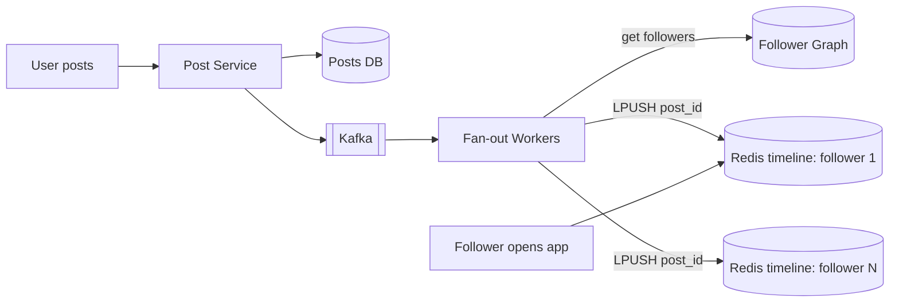
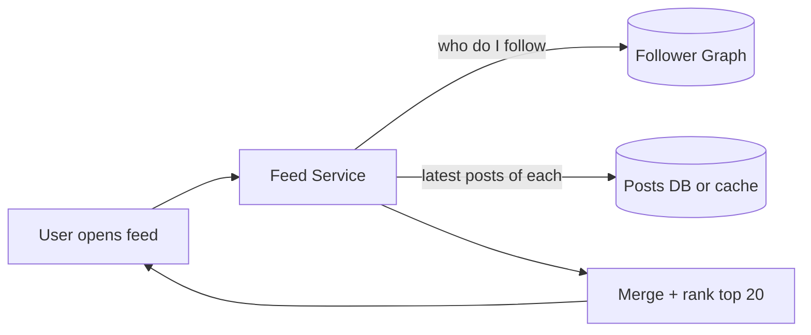

# Fan-out (Push vs Pull)

**In one line:** a user made a post, and now it must reach the feeds of all their followers. Either send it to everyone at write time (push), or collect from everyone at read time (pull).

> **Example:** You have 300 followers. You posted a photo on Instagram. In the push model, an entry goes into 300 people's feeds right away. But Virat Kohli has 27 crore followers. 27 crore writes for one of his posts? That is the real fan-out problem.

## Fan-out on write (Push)

As soon as a post is made, put the post ID into every follower's **pre-computed timeline** (Redis list). Reading the feed is just one Redis read.

- **Fast reads:** O(1), the feed is already ready.
- **Expensive writes:** as many writes as there are followers.
- Timelines of inactive users also get filled, which wastes memory.

## Fan-out on read (Pull)

Nothing is pre-computed. When a user opens the feed, fetch the latest posts of everyone they follow and merge them.

- **Cheap writes:** the post is written in just one place.
- **Expensive reads:** if you follow 500 people, that is 500 lookups + a merge on every feed open.
- Latency goes up, and in a read-heavy system this is costly.

## Comparison

| | Push (on write) | Pull (on read) |
|---|---|---|
| Write cost | Equal to follower count | 1 |
| Read cost | 1 Redis read | Equal to following count + merge |
| Feed latency | Very low | Higher |
| Celebrity problem | Yes, crores of writes | No |
| Inactive users | Memory waste | No waste |
| Best for | Normal users, read-heavy | Celebrities, less active users |

## Hybrid: the best interview answer

- **Normal users (< ~10K followers):** push. Put their posts into followers' timelines in advance.
- **Celebrities (> ~10K followers):** don't push. Keep their posts in a separate "celebrity posts" cache.
- **At feed read time:** the user's pre-computed timeline (from push) + the latest posts of the celebrities they follow (pull) → merge → rank.
- Skip push for inactive users (no login for 30 days). When they come back, build the feed with pull.

Twitter and Instagram both do roughly this.

## Timeline cache in Redis

- Key: `timeline:{userId}`, value: a **list of post IDs** (not the full post). Post content comes from a separate cache.
- `LPUSH` + `LTRIM 0 799`: keep only the latest ~800 IDs. Older feed is pulled from the DB.
- Memory: 8 byte ID × 800 = ~6.4 KB per user. 100M active users × 6.4 KB ≈ **640 GB**. Shard by userId in a Redis cluster.
- Removing a deleted post from timelines is expensive. Filter at read time instead (skip it if the post no longer exists).

## Cost math example

Assume: 200M DAU, each user makes ~2 posts/day, 200 followers on average. One celebrity has 50M followers.

| | Calculation | Result |
|---|---|---|
| Posts/day | 200M × 2 | 400M ≈ 4,600 posts/sec |
| Push writes/day | 400M × 200 followers | 80B timeline writes ≈ **~1M writes/sec** |
| One celebrity post (push) | 50M writes | Workers busy for minutes, everyone else's posts are late |
| One celebrity post (hybrid) | 1 write | Followers pull at read time |

> **Say:** "Normal fan-out is ~1M Redis writes/sec, which a sharded Redis cluster can handle. But one celebrity's 50M fan-out will block the queue. That is why I keep celebrities on pull."

## When to use

| Situation | Model |
|---|---|
| Read >> write, small follower counts | Push |
| Very large follower counts | Pull |
| A real social network (both types of users) | Hybrid |
| Group chat (WhatsApp, 256 members) | Push (into every member's inbox) |
| Notification to lakhs of users | Push via a queue, in batches |

## Where it is used

- [News Feed](../02-questions/t1-03-news-feed.md): hybrid fan-out, timeline cache
- [Instagram](../02-questions/t2-13-instagram.md): celebrity problem
- [Notification System](../02-questions/t1-09-notification-system.md): one event, crores of users, batched push
- [WhatsApp](../02-questions/t1-04-whatsapp-chat.md): group message fan-out

## Say this in the interview

> "I'll use hybrid fan-out. For normal users, fan-out workers will push the post through Kafka into the followers' Redis timelines. Posts from celebrities (10K+ followers) won't be pushed. I'll pull them at read time and merge. This keeps reads fast, and a celebrity post doesn't cause a write storm."

## Common mistakes

- Saying only push and missing the celebrity problem. The interviewer will surely ask.
- Storing the full post object in the timeline instead of just the ID.
- Doing fan-out synchronously in the post API. Do it async with Kafka + workers.
- Not limiting the timeline size (`LTRIM`), so memory blows up.
- Continuing to push for inactive users too.

## Checklist

- [ ] I can tell the read/write cost of push vs pull without looking
- [ ] I can draw the diagram of both models in 2 min
- [ ] I can explain the hybrid model and the celebrity threshold
- [ ] I can explain the Redis timeline (IDs only, LTRIM) and estimate its memory
- [ ] I can calculate the fan-out cost math (writes/sec)
