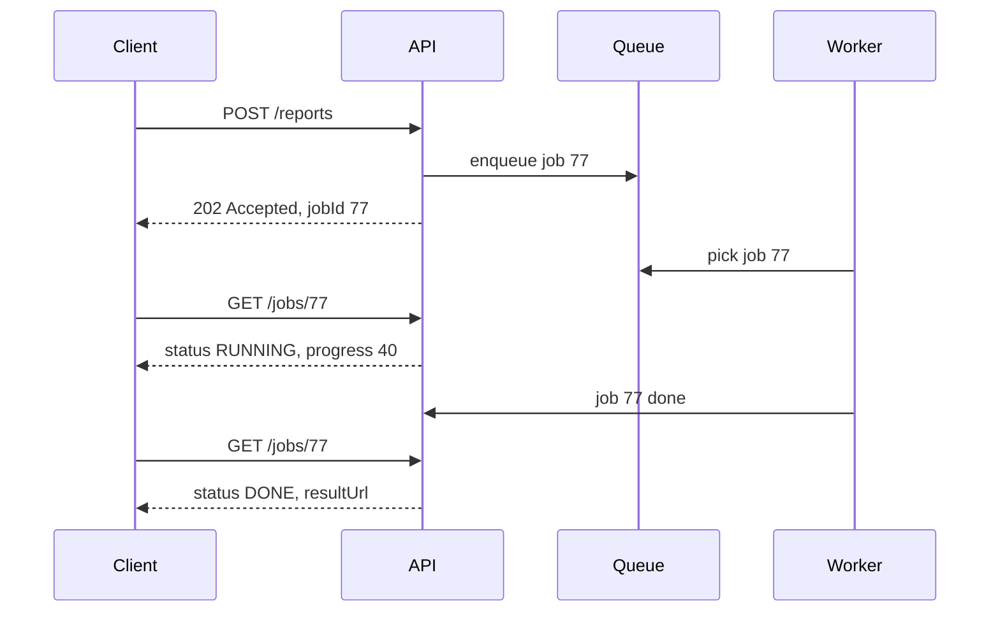

# API Design

**In one line:** the contract between client and server. Clear names, the right HTTP method, pagination, idempotency and versioning, so the API scales and can't be misused.

> **Example:** On the Paytm app you tap "Pay ₹500". The network was slow, so the app retried. If the API is not idempotent, ₹1000 gets deducted. Good API design stops mistakes like this at the design level itself.

## REST vs gRPC vs GraphQL

| | REST | gRPC | GraphQL |
|---|---|---|---|
| Format | JSON over HTTP | Protobuf (binary) over HTTP/2 | JSON, one endpoint, the client writes the query |
| Speed | OK | Fastest, small payload | OK |
| Streaming | No (SSE/WebSocket separately) | Yes, bi-directional | Subscriptions |
| Caching | HTTP/CDN caching is easy | Hard | Hard (everything is POST) |
| Best for | Public APIs, mobile/web clients | Internal service-to-service | Many screens with different data needs (mobile + web) |
| Downside | Over-fetching, many calls | Weak browser support, hard to debug | N+1 queries, complex server, rate limiting is hard |

> Default in the interview: **client → REST, internal services → gRPC**. Mention GraphQL when clients need flexible data.

## Resource naming

- Nouns, plural: `/users/{id}/orders`, not verbs (`/getOrders` is wrong).
- Use hierarchy only when there is a real relation: `/shows/{showId}/seats`.
- For an action that doesn't fit CRUD: `POST /payments/{id}/refund` is fine.

```http
GET    /users/42/orders?status=paid&limit=20     → list
GET    /orders/981                               → one order
POST   /orders                                   → new order (201 Created)
PATCH  /orders/981   {address}                   → partial update
DELETE /orders/981                               → cancel (204)
```

## HTTP methods and idempotency

| Method | Job | Idempotent? | Safe (read-only)? |
|---|---|---|---|
| GET | Read | Yes | Yes |
| PUT | Full replace | Yes | No |
| DELETE | Delete | Yes | No |
| PATCH | Partial update | Depends | No |
| POST | Create / action | **No** | No |

To make POST idempotent, the client sends an `Idempotency-Key: <uuid>` header. The server stores the key + response (24 hr TTL). If the same key comes again, return the old response.

## Pagination: offset vs cursor

| | Offset | Cursor |
|---|---|---|
| Request | `?offset=1000&limit=20` | `?cursor=eyJpZCI6OTgxfQ&limit=20` |
| DB query | `LIMIT 20 OFFSET 1000` | `WHERE id < 981 ORDER BY id DESC LIMIT 20` |
| Deep pages | Slow (DB skips 1000 rows) | Always fast (index seek) |
| When new data arrives | Duplicates / skipped items | Stable |
| Jump to page number | Yes | No |
| When | Admin tables, small data | Feeds, chat, infinite scroll |

Send `next_cursor` in the response. Keep the cursor opaque (base64), so you can change its internal format later.

## Versioning

- **In the URL:** `/v1/orders`. Simple, the most common. Say this in the interview.
- In a header: `Accept: application/vnd.app.v2+json`. Clean, but harder to debug.
- Rule: adding a new optional field is not breaking. Removing/renaming a field is breaking, so it needs a new version.
- Deprecate the old version with a timeline, don't shut it down overnight.

## Auth (in short)

- **API key:** server-to-server / third-party developers. `X-API-Key` in the header. Simple, but it doesn't tell you the user identity.
- **JWT:** a signed token after login. The server verifies it without a DB call (stateless). Short expiry (15 min) + refresh token. Revoking is hard, so keep the expiry short.
- **OAuth 2.0:** "Login with Google", or giving a third party limited access to your user's data.
- Auth always happens at the **API Gateway**, not separately in every service.

## Webhooks

The server calls the client itself when something happens (payment success, video processed). Cheaper than polling.
- The receiver should return `200` quickly and do the work async.
- Verify with a **signature** (HMAC header) that the webhook is genuine.
- Duplicates can arrive: dedupe on `event_id`.
- Some can also be missed: the sender retries with exponential backoff, and the receiver pulls status through reconciliation.

## Long-running job API (202 + job id + polling)

Video transcode, report generation, LLM batch: these take seconds/minutes. You can't keep an HTTP request open that long.



- `202 Accepted` + `jobId` + a `Location: /jobs/77` header.
- The client polls (with backoff), or you notify it via webhook/SSE.
- Job status: `QUEUED → RUNNING → DONE / FAILED`.

## When to use what

| Situation | Choice |
|---|---|
| Public / mobile API | REST + JSON, `/v1/` |
| High QPS between microservices | gRPC |
| Infinite scroll, feed | Cursor pagination |
| Payment, order create | POST + Idempotency-Key |
| Work > 2-3 sec | 202 + job id + polling/webhook |
| Telling third parties about events | Webhooks with signature + retry |

## Where it is used

- [URL Shortener](../02-questions/t1-01-url-shortener.md): simple REST, 301 vs 302
- [BookMyShow](../02-questions/t1-05-bookmyshow.md): hold/confirm APIs, idempotency key
- [Payment System](../02-questions/t1-11-payment-system.md): idempotency, webhooks
- [YouTube](../02-questions/t1-07-youtube.md): async processing after upload (202)
- [Job Scheduler](../02-questions/t2-18-job-scheduler.md): job status API
- [LLM Chat App](../02-questions/t2-22-llm-chat-app.md): streaming response (SSE)

## Say this in the interview

> "REST APIs for the client with `/v1/` versioning, and gRPC between internal services. Cursor pagination for the feed, because offset is slow on deep pages and gives duplicates when new posts arrive. Order create is a POST, so I'll use an Idempotency-Key header."

> "Transcoding is long work, so the upload API will return 202 Accepted and a jobId. The client will poll the status or get a webhook."

## Common mistakes

- Verbs in URLs: `/createUser`, `/getAllOrders`.
- Offset pagination for a feed.
- A POST payment API without idempotency.
- Keeping long work synchronous: on timeout the client retries and the work happens twice.
- Webhooks without signature verification and dedupe.
- Spending 10 min writing APIs. In the interview, 3–5 main APIs are enough.

## Checklist

- [ ] I can tell when to use REST vs gRPC vs GraphQL without looking at the table
- [ ] I can tell which HTTP methods are idempotent and how to make POST idempotent
- [ ] I can explain offset vs cursor pagination and write the SQL query
- [ ] I can draw the 202 + job id + polling flow for a long-running job
- [ ] I can explain how to make webhooks safe (signature, dedupe, retry)
- [ ] I can tell the basic difference between JWT and an API key
