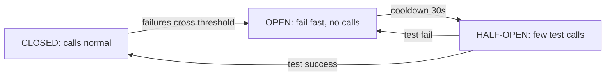

# Reliability & Observability

**In one line:** reliability = things will fail, but the system keeps running. Observability = when something breaks, you quickly find out what, where and why.

> **Example:** On IPL final day, Hotstar's recommendation service became slow. If the video page keeps waiting for it, the whole app hangs. Good design says: skip recommendations, let the video play. Users won't even notice.

## SPOF and redundancy

**SPOF (Single Point of Failure):** the one component that takes everything down when it falls. Look at every box on the diagram and ask "what if this dies?"

| Component | How to remove the SPOF |
|---|---|
| App server | Multiple stateless instances behind a load balancer |
| Load balancer | Active-passive pair or a managed LB (AWS ALB) |
| DB | Primary + replicas, auto failover |
| Redis | Replica + Sentinel / Redis Cluster |
| Kafka | Replication factor 3 |
| Whole datacenter/AZ | Multi-AZ deployment |

## Protection patterns

| Pattern | What it does | Example |
|---|---|---|
| **Health checks** | The LB hits `/health` every few sec, stops traffic on failure | Liveness (is it alive?) vs readiness (can it take traffic?) |
| **Timeouts** | Never wait forever on a call | 500ms timeout on a downstream call, otherwise threads get stuck |
| **Retries + backoff + jitter** | Try again on a temporary failure, but slowly | 100ms, 200ms, 400ms + random. Only for idempotent calls |
| **Circuit breaker** | If downstream keeps failing, stop calling it for a while | 50% fail in 10s → OPEN, test request after 30s |
| **Bulkhead** | Split resources into separate pools | Separate threads for payment and for recommendations. If one sinks, the other survives |
| **Graceful degradation** | Turn off non-critical features, keep the core running | Recommendations off, checkout on |
| **Load shedding** | On overload, reject some requests right away (429/503) | Rejecting 10% is better than a full crash |

### Circuit breaker states

In the OPEN state, give a fallback: cached data, a default value, or "not available right now".

## Backups and data safety

- **Replication is not a backup.** A wrong `DELETE` goes to the replica too.
- Daily snapshot + continuous WAL/binlog archive → **point-in-time recovery**.
- Keep backups in another region. And practice restoring, otherwise the backup is useless.
- **RPO** = how much data you can lose (e.g. 5 min). **RTO** = how long it takes to come back (e.g. 1 hr).

## Multi-AZ vs multi-region

| | Multi-AZ | Multi-region |
|---|---|---|
| What it protects against | One datacenter failing | A whole region failing (rare) |
| Latency | ~1–2 ms between AZs, sync replication works | 50–150 ms, usually async replication |
| Complexity | Low, do it by default | High: data conflicts, routing, 2x cost |
| When | Every production system | Global users, 99.99%+ SLA, compliance |

Multi-region modes: **active-passive** (one region serves, the other is on standby) is simple. **Active-active** is faster, but you have to handle write conflicts.

## Observability: 3 pillars

| Pillar | What it is | Tool | Which question it answers |
|---|---|---|---|
| **Metrics** | Numbers over time | Prometheus, Grafana, Datadog | "Is something wrong?" (latency spike) |
| **Logs** | A text record of every event | ELK, Loki | "What exactly happened?" (error message) |
| **Traces** | The full journey of one request across services | Jaeger, OpenTelemetry | "Where did it get slow?" (which service) |

What to monitor: **RED** (Rate, Errors, Duration) for every service. For infra: CPU, memory, disk, queue lag. Alert on symptoms (p99 latency, error rate), not on causes.

## SLI, SLO, SLA

| Term | Meaning | Example |
|---|---|---|
| **SLI** (Indicator) | What you measure | Successful requests %, p99 latency |
| **SLO** (Objective) | Internal target | 99.9% of requests < 300ms |
| **SLA** (Agreement) | Contract with the customer, penalty if broken | 99.5% uptime or credits |

Keep SLA < SLO so you have a buffer. **Error budget:** 99.9% = ~43 min of downtime allowed per month. When the budget runs out, stop new risky deploys.

| Availability | Downtime / year |
|---|---|
| 99% | ~3.65 days |
| 99.9% | ~8.8 hours |
| 99.99% | ~52 min |
| 99.999% | ~5 min |

## How to answer "What if X fails?"

Use this 4-step formula every time:
1. **What will happen:** state the impact ("if Redis is down, seat holds will be lost").
2. **How we'll know:** health check / alert ("Sentinel will detect it, an alert will fire").
3. **What happens right away:** failover / fallback ("promote the replica; until then, the DB constraint prevents double booking").
4. **Data loss / recovery:** ("with async replication, a few seconds of holds may be lost, which is acceptable").

## Where it is used

- [Payment System](../02-questions/t1-11-payment-system.md): timeouts, retries, reconciliation
- [Notification System](../02-questions/t1-09-notification-system.md): fallback provider when a provider is down, circuit breaker
- [Distributed KV Store](../02-questions/t2-20-distributed-kv-store.md): replication, failure detection
- [BookMyShow](../02-questions/t1-05-bookmyshow.md): DB constraint when Redis fails
- [Job Scheduler](../02-questions/t2-18-job-scheduler.md): job retry on worker crash

## Say this in the interview

> "Every service is stateless and runs in multiple AZs. DB is primary-replica with auto failover. Downstream calls have timeouts, retries with backoff, and a circuit breaker. If the recommendation service is down, I'll do graceful degradation: the feed keeps working, only the personalised section goes away."

> "For observability: RED metrics, centralized logs, and OpenTelemetry tracing. SLO of 99.9% with p99 < 300ms, and alerts on error rate and latency."

## Common mistakes

- One DB and one LB on the diagram, and no answer to "what if this fails?".
- Retries without backoff/jitter. They kill the downstream with a retry storm.
- Retrying a non-idempotent call.
- Treating replication as a backup.
- Suggesting multi-region active-active for everything. That is over-engineering, so justify it.
- Mixing up SLA, SLO and SLI.

## Checklist

- [ ] I can find the SPOF in any diagram and explain how to remove it
- [ ] I can explain the difference between timeout, retry+backoff, circuit breaker and bulkhead
- [ ] I can explain multi-AZ vs multi-region and RPO/RTO
- [ ] I can tell the difference between metrics, logs, traces and SLI/SLO/SLA
- [ ] I can give the 4-step answer to "What if X fails"
