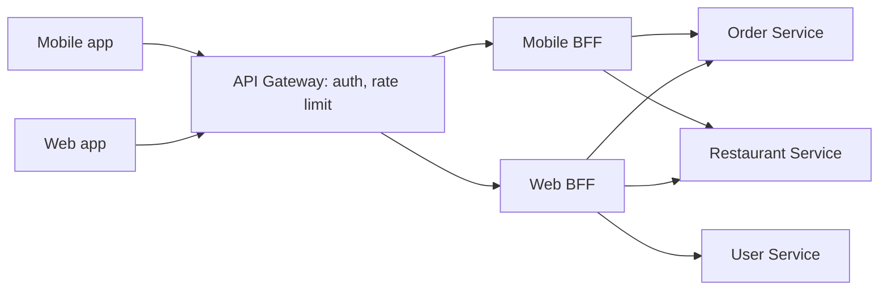
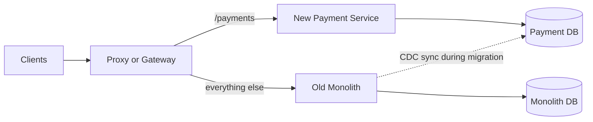

# Microservices Patterns

**In one line:** microservices = splitting an app into small, independently deployed services that own their own data. Patterns (gateway, discovery, mesh, strangler) handle the pain that this split brings.

> **Example:** At Swiggy, Order, Payment, Restaurant, Delivery and Notification are separate services. On IPL final night, Order Service needs 50 pods while the restaurant menu needs 5. Separate services mean separate scaling, separate deploys, separate teams.

## Monolith vs Microservices

| | Monolith | Microservices |
|---|---|---|
| Deploy | One unit, one pipeline | Each service deploys on its own |
| Scale | The whole app scales | Only the hot service scales |
| Data | One DB, ACID transactions are easy | One DB per service, distributed transactions |
| Debug | One stack trace | Network calls, you need tracing |
| Team | Fast for a small team | Large org, team-per-service |

**When NOT to split:**
- The team is small (< 10–15 people). The ops burden will outweigh the features.
- The domain is not clear yet. A wrong boundary = a "distributed monolith" (every change deploys 5 services).
- Every request needs strong consistency across modules.
- Start with a **modular monolith**. Pull a service out once the boundary is stable and its load is different.

## Database-per-service

- Each service owns its DB. Another service never reads its tables directly, only via API or events.
- Benefit: independent schema changes, and you can pick the right DB (Postgres for Payment, Elasticsearch for catalog).
- Cost: no cross-service joins. If you need the data, make an API call, or build your own local copy (read model) from events.
- For a multi-service write, use [Saga + Outbox](../01-topics/16-distributed-transactions.md).

## API Gateway and BFF

**API Gateway** = one entry point for all clients. Jobs: routing, auth (JWT verify), rate limiting, TLS termination, request aggregation. Tools: Kong, AWS API Gateway, NGINX, Envoy.

**BFF (Backend for Frontend)** = a small separate backend per client type. Mobile needs fewer fields and a single call. Web needs more data. One generic API does not serve both well.

- Don't put business logic in the gateway. Only cross-cutting work.
- It works best when the frontend team owns the BFF.

## Service discovery

Pods come and go, and their IPs change. How does a caller know where Order Service is right now?

| | Client-side discovery | Server-side discovery |
|---|---|---|
| How | The client gets the instance list from a registry and load balances itself | The client calls an LB/DNS name, and the LB picks the instance |
| Example | Eureka + Ribbon, Consul client | K8s Service (DNS + kube-proxy), AWS ALB |
| Good | One hop fewer, smart LB | Simple client, language-agnostic |
| Bad | A client library in every language | Extra hop, the LB itself must scale |

- **Registry:** Consul, Eureka, etcd. Instances register and send heartbeats. If heartbeats stop, the entry is removed.
- **Kubernetes:** the DNS name `order-service.default.svc.cluster.local`. In an interview, saying "K8s Service DNS" is enough.

## Service mesh & sidecar

Every pod runs a **sidecar proxy** (Envoy) next to it. All of the service's traffic goes through it. A control plane (Istio) pushes config to all sidecars.

- **mTLS:** service-to-service encryption and identity, with no app code changes.
- **Retries, timeouts, circuit breaking:** set by config, the same for every language.
- **Observability:** latency, error rate and traces for every call, automatically.
- **Traffic shifting:** canary (5% of traffic to the new version).

Cost: a little latency on every hop (~1 ms), and one more complex system to run. At 10–20 services, a library (Resilience4j) is often enough.

## Strangler fig migration

Don't rewrite the monolith in one go. Move one feature at a time into a new service, with a routing layer in front. Slowly the monolith "withers away".

Steps: 1) put a proxy in front, 2) build one module as a new service, 3) shift traffic (shadow → canary → 100%), 4) delete that code from the monolith. Repeat.

## Sync vs Async communication

| | Sync (REST / gRPC) | Async (events via Kafka / SQS) |
|---|---|---|
| When | You need an answer now (price check, auth) | You announce "done", the rest happens later (order placed → email, analytics) |
| Coupling | The caller depends on the callee being up | Loose, the producer doesn't know the consumers |
| Failure | One down, the chain fails (cascading) | The queue buffers, retry later |
| Consistency | Read-your-write is easy | Eventual consistency |

- **REST:** public APIs, simple. **gRPC:** internal, binary (protobuf), fast, streaming.
- Avoid long sync chains (A → B → C → D). Latency adds up and availability multiplies (0.99⁴ ≈ 0.96).
- To survive failures use timeouts, retry with backoff, **circuit breaker** and **bulkhead**: [Reliability & Observability](../01-topics/20-reliability-observability.md).

## When to use / when not

| Situation | Choice |
|---|---|
| New product, small team | Modular monolith |
| Different scale/deploy needs, 50+ engineers | Microservices |
| Many client types (app, web, TV) | Gateway + BFF |
| Many services, polyglot, mTLS needed | Service mesh |
| Breaking up an old monolith | Strangler fig |
| Multi-service write | Saga + outbox |

## Where it is used

- [Payment System](../02-questions/t1-11-payment-system.md): payment, ledger, notification as separate services, saga
- [Food Delivery](../02-questions/t2-14-food-delivery.md): order, restaurant, delivery services, gateway + mobile BFF
- [E-commerce Inventory](../02-questions/t2-24-ecommerce-inventory.md): the inventory service owns its DB, synced through events
- [Notification System](../02-questions/t1-09-notification-system.md): async consumer service
- [BookMyShow](../02-questions/t1-05-bookmyshow.md): booking and payment are separate, sync vs async choice

## Say this in the interview

> "I'll start with a modular monolith. Once order and restaurant have different load and different teams, I'll pull them out with database-per-service. In front there will be an API Gateway for auth and rate limiting, and a BFF for mobile."

> "Work after order placed (email, analytics) goes through async events. Only payment authorization is a sync gRPC call, with a timeout and a circuit breaker."

## Common mistakes

- Jumping to 20 microservices in every design without saying why you split.
- Two services sharing one DB. That brings the coupling right back.
- Stuffing business logic into the API Gateway.
- Long sync call chains with no timeout or circuit breaker.
- Proposing a "big bang rewrite" of the monolith instead of a strangler fig.
- Treating a service mesh as free. Mention the latency and ops cost too.

## Checklist

- [ ] I can explain the monolith vs microservices trade-off and when not to split
- [ ] I can explain the benefits of database-per-service and the cross-service data problem
- [ ] I can explain the difference between API Gateway and BFF with a diagram
- [ ] I can explain client-side vs server-side discovery and service mesh/sidecar
- [ ] I can tell the steps to migrate a monolith with the strangler fig pattern
- [ ] I can tell when to use sync (REST/gRPC) vs async (events)
