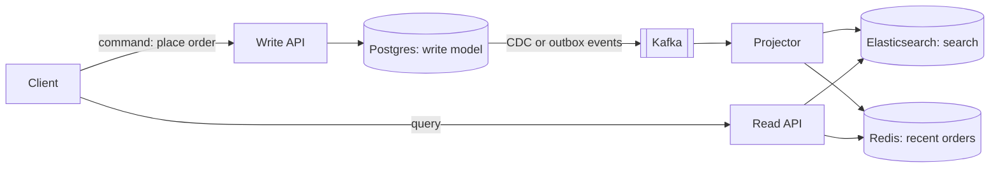
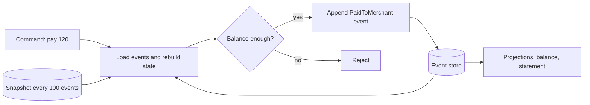

# CQRS & Event Sourcing

**In one line:** CQRS = separate models for writing (command) and reading (query). Event Sourcing = store the events of "what happened" instead of the current state, and build the state by replaying them.

> **Example:** Paytm wallet. Instead of overwriting a balance column, write every event: `MoneyAdded 500`, `PaidToMerchant 120`, `Refunded 120`. Balance = sum of all events. If someone asks tomorrow "what was the balance on 15 August?", replay the events up to that day. You have the answer.

## CQRS (Command Query Responsibility Segregation)

Using one model for both writing and reading is hard. The write side needs validation and consistency. The read side needs fast, denormalized, differently shaped data (list, search, dashboard).

- **Write model:** normalized, checks business rules. For example, an `orders` table in Postgres.
- **Read model(s):** built for specific queries. For example, order search in Elasticsearch, "user's last 10 orders" in Redis.
- Changes on the write side reach the read side through **events or CDC** (Debezium). A projector reads those events and updates the read models.

**Eventual consistency:** after a write, the read model can lag by a few ms to seconds. How to handle it:
- Return the new data in the write response itself (the UI shows it right away).
- Read critical things (like "did my order go through?") from the write DB.
- Keep a `version` in the read model so the client knows the data is stale.

## Event Sourcing

Don't store state. Store **events**, append-only. Current state = replay of the events.

| seq | stream (account) | event | data |
|---|---|---|---|
| 1 | wallet_rahul | MoneyAdded | 500 |
| 2 | wallet_rahul | PaidToMerchant | 120 |
| 3 | wallet_rahul | Refunded | 120 |

Balance = 500 − 120 + 120 = 500.

- **Replay:** need a new read model (like a monthly statement)? Replay the whole event log from the start. You get a new view for free.
- **Snapshots:** replaying 100,000 events every time is slow. Save a snapshot of the state every N events. Load = latest snapshot + events after it.
- **Concurrency:** check `expected_version` when appending (optimistic lock). If two writers append at the same version, one fails.
- **Schema evolution / upcasting:** events never change (immutable). If a new field comes, create `MoneyAdded v2`. When reading old v1 events, an **upcaster** converts them to the v2 shape. Don't rewrite old events.
- Store: EventStoreDB, Kafka (as a log, but per-entity queries are hard), or a Postgres table `(stream_id, version, type, data)` with a unique `(stream_id, version)`.

## How it fits with Saga and Outbox

- In event sourcing, **the event store is the outbox**. Once an event is appended, it can be published. No dual write problem.
- [Saga](../01-topics/16-distributed-transactions.md) steps run on these same events: `OrderPlaced` → Payment Service listens → `PaymentCaptured` or `PaymentFailed` → compensation.
- CQRS read models are also built from these events. One event, three jobs: state, saga step, read view.
- CQRS also works without event sourcing: a normal DB + read models via outbox/CDC.

## Zerodha order book example

- Write side: `OrderPlaced`, `OrderModified`, `PartiallyFilled`, `Filled`, `Cancelled` events, one stream per order.
- Read side: the "Orders" tab (Redis/Postgres projection), trade history, P&L report, SEBI audit report. All separate projections.
- When a dispute comes ("why didn't my order fill at 9:15:02?"), replay the events and show the exact timeline.

## When to use / when not

| Use it | Don't use it |
|---|---|
| Audit is required: payments ledger, wallet, trading orders | Simple CRUD (profile, settings, blog) |
| "What happened when" history is a business feature (order timeline) | Small team, tight deadline |
| Read and write loads are very different (100:1), with different shapes | You need strong read-after-write everywhere |
| You will build new views later from past data | You must delete data (GDPR) and have no plan for it |

- CQRS and event sourcing are different things. CQRS alone is quite common. Use event sourcing only where history is the product.
- GDPR: events are immutable, so encrypt personal data with a per-user key and throw the key away on delete (crypto-shredding).

## Where it is used

- [Payment System](../02-questions/t1-11-payment-system.md): ledger events, audit, read models for statements
- [E-commerce Inventory](../02-questions/t2-24-ecommerce-inventory.md): stock events, a separate search read model
- [Food Delivery](../02-questions/t2-14-food-delivery.md): order status timeline from events
- [Ad Click Aggregator](../02-questions/t2-17-ad-click-aggregator.md): replay raw click events to rebuild counts

## Say this in the interview

> "For the wallet I won't overwrite the balance. Every change is an immutable event appended to the event store. Balance and statement are projections, and I'll keep a snapshot every 100 events so loading stays fast."

> "Reads and writes scale differently, so CQRS: writes go to Postgres, then through outbox/CDC to Kafka, and from there to Elasticsearch and Redis read models. The read model is slightly eventual, so the order confirmation screen uses the write response."

## Common mistakes

- Putting event sourcing on every CRUD app. Complexity goes way up.
- Treating CQRS and event sourcing as the same thing.
- Not mentioning eventual consistency ("the user placed an order but it doesn't show in the list").
- Forgetting snapshots. Replaying millions of events on every request.
- Editing old events for a schema change. Use upcasting.
- No concurrency check (`expected_version`), which leads to double spend.

## Checklist

- [ ] I can explain with a diagram why CQRS separates the write model and the read model
- [ ] I can explain how read models are built from events/CDC and how to handle eventual consistency
- [ ] I can explain replay, snapshots and expected_version in event sourcing
- [ ] I can explain event schema evolution and upcasting
- [ ] I can tell how CQRS/event sourcing fit with Saga and outbox
- [ ] I can tell when to use it (ledger, order history) and when not (simple CRUD)
