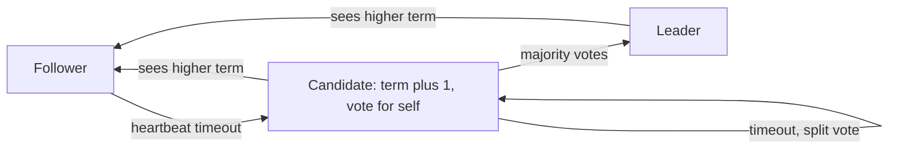
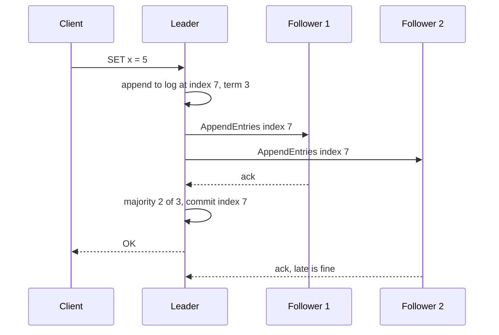

# Consensus & Leader Election

**In one line:** consensus = many machines agreeing on one value (or one leader), even when some machines crash or the network breaks.

> **Example:** Zerodha's order matching engine runs on 3 machines. Only **one** leader should process orders. If two machines both think they are the leader, the same order could execute twice. Consensus makes sure there is only one leader at a time and everyone agrees on one order log.

## Why we need consensus

- **Replication:** 3 replicas need the same writes in the same order (KV store, config store).
- **Leader election:** in a cron/job scheduler, only one node should trigger a job.
- **Locks & config:** "which shard lives on which node" must look the same to everyone.

The problem: machines crash, messages arrive late or get lost, clocks don't match. "Whoever speaks first is the leader" does not work.

## Quorum and majority (2f + 1)

- To survive `f` failures you need **2f + 1** nodes. Every decision needs a yes from a **majority** (f + 1).
- Two majorities always overlap on at least one node. So two different decisions can never both be "committed".

| Nodes | Majority | Failures it can survive |
|---|---|---|
| 3 | 2 | 1 |
| 5 | 3 | 2 |
| 4 | 3 | 1 (no gain from having 4) |

- Use an odd number. More nodes = more safety, but every write is slower (more acks).

## Raft (explained simply)

Each node is in one of three states: **Follower**, **Candidate**, **Leader**. Time is split into **terms** (term 1, 2, 3...). Each term has at most one leader.



**1. Leader election**
- The leader sends a heartbeat every ~50–100 ms.
- If a follower gets no heartbeat within a **randomized timeout** (like 150–300 ms), it becomes a candidate, increases the term, and asks everyone for votes.
- Each node gives only one vote per term, and only to a candidate whose log is at least as up to date as its own.
- Majority votes = leader. The timeout is random so that everyone doesn't become a candidate at once (fewer split votes).

**2. Log replication**



- An entry is **committed** once it is in the log of a majority. Then it is applied to the state machine.
- If the leader crashes, only a node with all committed entries can become the new leader. Committed data is never lost.
- If a follower's log does not match the leader's, the leader overwrites it.

## Paxos (one paragraph)

Paxos is the older algorithm (Lamport), from before Raft. Proposers send a numbered proposal, a majority of acceptors promise not to accept older numbers, and then the value is accepted. It agrees on a single value, and you need **Multi-Paxos** for a log. It is correct and proven, but hard to understand and implement. That is why Raft was built as "understandable consensus". Google Chubby and Spanner use Paxos. In an interview, explain Raft and say "Paxos gives the same guarantees".

## ZooKeeper / etcd: consensus as a service

Don't write your own Raft. Use ZooKeeper (ZAB protocol) or etcd (Raft), and build leader election/locks from their primitives.

| Primitive | What it is | Use |
|---|---|---|
| **Ephemeral node** (ZK) | Deleted automatically when the session ends (client died) | The leader creates an ephemeral `/leader` node. If it dies, the node goes away |
| **Sequential node** (ZK) | An increasing number in the node name | Smallest number = leader, fair queue |
| **Lease** (etcd) | A key with a TTL that the client must keep renewing | Renewal stops = lease expires = leadership ends |
| **Watch** | A notification when a key changes | Followers watch `/leader` and start an election as soon as it goes away |

## Leader election with a lease in a DB

For small systems, a DB row can do the job instead of ZK/etcd:

```sql
UPDATE leader_lease
SET owner = 'node-2', expires_at = now() + interval '10 seconds', token = token + 1
WHERE name = 'scheduler' AND (expires_at < now() OR owner = 'node-2');
```

- 1 row updated = you are the leader. Renew every 3 sec. If the leader dies, the lease expires in 10 sec and someone else takes it.
- The DB itself is a single point of failure, and watch out for clock skew.

## Split brain and fencing tokens

**Split brain:** during a network partition, two nodes both think they are the leader. Or an old leader wakes up from a GC pause (20 sec), doesn't know its lease has expired, and starts writing.

- A quorum prevents the first case: the minority side has no majority, so it can't become leader.
- But for the old leader's "late write" you need a **fencing token**: a number that increases with every new leader/lease (Raft term, ZK zxid, the `token` above).
- Storage checks the token on every write. If token 33 has already been seen, a write with token 32 is rejected.

## Gossip protocols (membership)

Consensus is expensive for everything. For info like "who is alive", **gossip** is enough.
- Every second, each node sends its membership list + heartbeat counters to 1–3 random nodes. The info reaches everyone in O(log N) rounds.
- Cassandra uses gossip for membership and failure detection (phi accrual detector). It has no leader at all (leaderless).
- It is eventually consistent. Not for strong agreement (leader, commit).

## Real systems that use it

| System | What it uses |
|---|---|
| Kubernetes | The whole cluster state in etcd (Raft). Controllers pick a leader with leases |
| Kafka | Earlier ZooKeeper, now a **KRaft** (Raft) controller quorum for metadata. Partition leaders are picked from the ISR |
| CockroachDB, TiDB | Each range/shard has its own Raft group |
| Google Spanner | A Paxos group per split + TrueTime |
| Cassandra, DynamoDB-style | Gossip + quorum reads/writes, leaderless |

## Where it is used

- [Distributed KV Store](../02-questions/t2-20-distributed-kv-store.md): Raft per shard, or gossip + quorum
- [Job Scheduler](../02-questions/t2-18-job-scheduler.md): only one scheduler leader, lease + fencing token
- [Distributed Logging](../02-questions/t2-26-distributed-logging.md): Kafka KRaft, partition leaders

## Say this in the interview

> "The scheduler will have 3 replicas, but only the leader triggers jobs. I'll do leader election with an etcd lease. The leader renews the lease every few seconds. If it dies, the lease expires and another node becomes leader. Every write carries a fencing token, so an old leader waking up from a GC pause can't break anything."

> "For replication, Raft: 5 nodes, majority 3, so it survives 2 failures. A write commits once it is in the log of a majority."

## Common mistakes

- Proposing a 2- or 4-node cluster. A quorum needs an odd number (3, 5).
- Deciding the leader only from timeouts/heartbeats, without a quorum. You get split brain.
- Using a lease but no fencing token.
- Using consensus for everything (even membership). Gossip is enough there.
- Talking about writing your own consensus algorithm. Use etcd/ZooKeeper.
- Saying more nodes = faster writes. It's the opposite: more acks = slower.

## Checklist

- [ ] I can explain why consensus is needed and the 2f + 1 / majority quorum math
- [ ] I can explain terms, election with randomized timeouts and majority commit in Raft
- [ ] I can explain Paxos in one line and how it differs from Raft
- [ ] I can design leader election with ZooKeeper/etcd ephemeral nodes, leases and watches
- [ ] I can explain what split brain is and how fencing tokens prevent it
- [ ] I can tell when gossip is enough and where consensus sits in Kafka KRaft, etcd and CockroachDB
