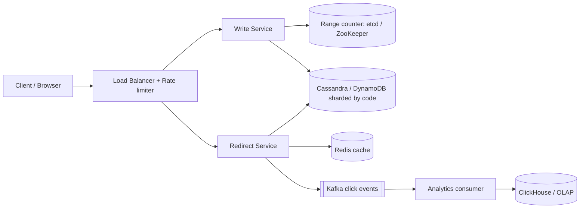
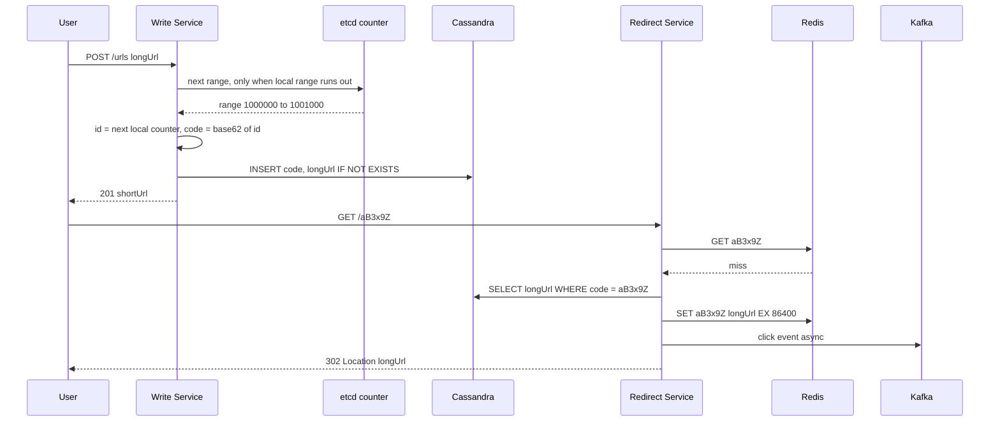

# Design URL Shortener (TinyURL / Bitly)

**In one line:** you give a long URL and get a short code back (`bit.ly/aB3x9Z`). When someone clicks the short link, they are redirected to the original URL. The core challenges are **generating unique short codes fast** and **redirecting a huge read load within milliseconds**.

**What the interviewer checks in this question:** the trade-offs of ID generation (hash vs counter vs pre-generated keys), caching in a read-heavy system, what 301 vs 302 means, and sharding at scale.

---

## Step 1: Clarify with the interviewer (3–5 min)

Ask these questions before you start the design:

| You ask | Typical answer | Effect on design |
|---|---|---|
| "What is the scale? How many new URLs and how many clicks per day?" | 100M new URLs/day, read:write ~100:1 | Cache on the read path matters most |
| "How short should the code be?" | 7 characters is fine | 7 Base62 chars = 3.5 trillion codes |
| "Do we need custom aliases? (`bit.ly/ipl2026`)" | Yes, optional | Separate uniqueness check, same table |
| "Do links expire?" | Yes, optional expiry, default is never | TTL column + lazy delete |
| "Do we need analytics? Click count, country, device?" | Yes, but not real-time | Async pipeline, redirect path stays fast |
| "If the same long URL comes twice, must it get the same code?" | Not required | We can skip dedup, simpler design |
| "Are login/users and link edit/delete in scope?" | Basic delete yes, the rest no | Say it is out of scope |

> **Say:** "I will design 2 core flows: create a short URL and redirect. I will keep the redirect path very fast and highly available, because it gets 100x more traffic. Analytics will be async."

## Step 2: Requirements

**Functional**
1. Users should be able to turn a long URL into a short URL (optional custom alias and expiry), and delete their link
2. Users should be able to open a short URL and get redirected to the original URL
3. Users should be able to see basic analytics for their link: click count, country, referrer

**Out of scope:** login/account UI, link edit, dedup of the same long URL, ML spam detection.

**Non-functional (in priority order)**
1. **Latency:** redirect p99 < 50 ms
2. **Availability:** redirect 99.99%, create 99.9%
3. **Uniqueness:** two long URLs never get the same code
4. **Scale:** 100M new URLs/day, 100:1 read/write, 10-year retention
5. **Analytics:** eventual, ~1 min delay is fine
6. **Non-guessable:** codes should not look sequential (optional, ask about it)

**CAP choice:** availability (AP) on the redirect path. A slightly stale cache is fine. Consistency is needed only on create (uniqueness), and it comes from range allocation + a conditional insert.

## Step 3: Estimation (only what changes the design)

- Writes: 100M/day ≈ **1,200 writes/sec**, peak ~5K/sec. Even one DB could handle this.
- Reads: 100x ≈ **120K reads/sec**, peak ~500K/sec. **A cache is a must for this.**
- Storage: one row is ~500 bytes. 100M × 365 × 10 years ≈ 365B rows ≈ **~180 TB**. It will not fit on one machine, so we need sharding.
- Clicks: every redirect is a click event = **~10B events/day**, peak ~500K/sec. The analytics pipeline must take this volume.
- Code length: 62^7 ≈ 3.5 trillion. That is enough for 365B rows.

> **Say:** "Reads are 120K QPS and storage is ~180 TB over 10 years. So two decisions are clear: heavy caching and a key-value store sharded on the short code."

## Step 4: Core entities

- **URL mapping**: short_code, long_url, user_id, created_at, expires_at
- **User** (optional): id, api_key, plan
- **Click event**: short_code, timestamp, ip/country, user_agent, referrer

## Step 5: APIs

```http
POST /urls   {longUrl, customAlias?, expiresAt?}   → 201 {shortUrl, shortCode}
     Header: Authorization: Bearer <apiKey>
GET  /{shortCode}                                  → 302 Location: <longUrl>
DELETE /urls/{shortCode}                           → 204
GET  /urls/{shortCode}/stats                       → {clicks, byCountry, byDay}
```

> **Say:** "Redirect is a plain GET that returns 302 with a `Location` header. The browser then goes to the original URL by itself."

## Step 6: High-level design

**Start with a simple v1:** one service + one Postgres table `urls(short_code PK, long_url)`. On create, Base62 a DB sequence; on redirect, do a PK lookup. This meets all three FRs. Now the numbers break it: 120K–500K reads/sec → cache; 180 TB → sharded KV store; many write servers needing unique ids without per-write coordination → range allocation; ~10B clicks/day → async log + OLAP.



**FR mapping:** FR1 → Write Service + range counter + DB. FR2 → Redirect Service + Redis + DB. FR3 → Kafka + Analytics consumer + ClickHouse.

**Why each component:**
- **Separate Write and Redirect services:** 100:1 traffic, they scale differently. Redirect stays isolated from create bugs (99.99%). One service was fine for v1.
- **Range counter (etcd/ZooKeeper):** an allocator library inside the Write Service fetches the `next range` once per 1000 ids. Peak 5K writes/sec = only ~5 calls/sec, so **we do not build a separate Key Generation Service**. Not Redis `INCRBY`, because on an async replica failover increments can be lost and the same range can be handed out twice (duplicate codes). A DB sequence on every write (simpler) becomes a single-node bottleneck.
- **Redis cache:** 120K–500K reads/sec, and 20% of links bring 80% of traffic, so a 90%+ hit ratio. Only DB replicas (simpler) would need many machines at this QPS and give a higher p99.
- **Cassandra / DynamoDB:** ~180 TB, key lookups only. Postgres (simpler) would need manual sharding.
- **Kafka:** ~120K click events/sec (peak 500K), two consumer groups (analytics loader + abuse detection), and 7-day replay so we can rerun after an aggregation bug. SQS (simpler) has no replay/multiple consumer groups, and is expensive at 10B msgs/day.
- **ClickHouse:** aggregations like "clicks per day per country" over 10B rows/day. The main KV store cannot run these queries.

## Step 7: Main flow: create and redirect



## Step 8: Data model & DB choice

```sql
urls(short_code PK, long_url, user_id, created_at, expires_at)
-- custom alias also lives in this table, short_code = alias
```

- There is only one access pattern: **lookup by short_code**. No joins/transactions, so **DynamoDB or Cassandra**, partition key = `short_code`.
- A conditional write (`IF NOT EXISTS` / `attribute_not_exists`) guarantees custom alias uniqueness.
- Analytics goes to a separate OLAP store (ClickHouse), so there are no aggregation queries on the main DB.

## Step 9: Deep dives (the interviewer will push here)

### 9.1 How will you generate the short code? (most important)

**NFR:** uniqueness + non-guessable, without coordination on every write.

| Option | How | Problem |
|---|---|---|
| **Hash (MD5/SHA) + first 7 chars** | `base62(md5(longUrl))[0:7]` | Collisions are possible. Every write needs a DB check + retry with salt. Retries grow as load grows |
| **Global counter + Base62** | DB/Redis `INCR`, convert the id to Base62 | A single counter is a bottleneck and a SPOF. Codes are sequential and easy to guess |
| **Range allocation (chosen)** | A central counter (etcd/ZooKeeper) gives each server a block of 1000 ids. The server runs a counter in local memory | If a server crashes, some ids in its range are wasted. With 3.5T codes this is fine |
| **Pre-generated keys** | Create random codes offline and keep them in an `unused_keys` table. Servers pick them up in batches | Extra table + marking a key as "used" must be atomic |

- To make codes non-guessable: apply a **bijective shuffle** (like XOR with a secret, or a Feistel cipher) to the id before Base62. There will still be no collisions.

> **Say:** "With hashing we have to handle collisions, and a single counter is a bottleneck. Range allocation solves both: it is collision-free, and coordination happens only once every 1000 writes."

**Trade-off:** a few ids wasted on crash and codes are roughly time-ordered, in exchange for zero collisions and almost zero coordination.

### 9.2 301 vs 302 redirect

**NFR:** accurate analytics and immediate delete/expiry, within the latency budget.

- **301 (Permanent):** the browser caches it. The next click never reaches the server. Lower server load, but **analytics are missed** and changing/deleting the link has no effect.
- **302 (Temporary):** every click reaches the server. Analytics are accurate, and expiry/delete work immediately.
- Chosen: **302** (Bitly does the same), because analytics is a requirement.

**Trade-off:** every click hits our servers (more load and cost), in exchange for analytics and control.

### 9.3 How will you take the read path to 500K QPS?

**NFR:** redirect p99 < 50 ms, 99.99% availability.

- **Redis cache** (LRU, TTL 24h), sharded into a cluster with consistent hashing.
- For a viral link (like the IPL final link), add an **in-process local cache** (Caffeine, 60 sec), so a single Redis node does not get hot.
- Negative caching: cache codes that do not exist for 5 min too, otherwise random codes will hammer the DB.

**Trade-off:** after a delete, the local cache/CDN can serve the old link for up to 60 sec, in exchange for ~10x less DB load.

### 9.4 Custom alias, expiry and analytics

**NFR:** alias uniqueness (strong), analytics eventual.

- **Custom alias:** `INSERT ... IF NOT EXISTS`. If it fails, return 409 Conflict. To avoid clashing with generated codes, check a minimum length or reserved words for aliases.
- **Expiry:** `expires_at` column. Check it on redirect, and if expired return 410 Gone. Use the Cassandra/DynamoDB **TTL** for cleanup. Cache TTL = `min(24h, expires_at - now)`.
- **Analytics:** the Redirect Service puts click events into Kafka in batches (async). A consumer enriches them (IP → country) and writes to ClickHouse.

**Trade-off:** click counts are ~1 min late and approximate (at-least-once), in exchange for zero extra latency on the redirect path.

## Step 10: Decision table (what we chose, why, and what we did not)

| Decision | Why we chose it | What we did not choose, and why |
|---|---|---|
| **Range allocation + Base62**, counter in etcd/ZooKeeper | Collision-free, coordination once every 1000 writes (~5 calls/sec) | **Hash + collision check:** extra read on every write, retries. **Redis INCRBY:** a range can repeat after failover. **Separate KGS service:** an extra service for tiny load. Sacrifice: ids wasted on crash |
| **302 redirect** | Every click reaches the server, so analytics and expiry work | **301:** browser caches it, analytics are missed. Sacrifice: more server load |
| **DynamoDB / Cassandra** | Simple key lookup, 180 TB, built-in sharding | **Postgres:** manual sharding, and we need no joins. Sacrifice: no ad-hoc queries or multi-row transactions |
| **Redis cache + local cache** | 120K–500K reads/sec, few hot links | **Only DB replicas:** many machines, higher p99. Sacrifice: ~60 sec staleness after delete + Redis cluster ops cost |
| **Kafka** for clicks | ~120K events/sec, 2 consumer groups, 7-day replay | **SQS:** no replay/multi-consumer, expensive at 10B msgs/day. **Sync DB counter:** hot key contention. Sacrifice: running a Kafka cluster |
| **ClickHouse** for analytics | Fast aggregations over 10B rows/day | **Aggregates on the main DB:** slows the redirect path. Sacrifice: one more store, eventual counts |
| **Sharding by short_code** | Lookup is always by code, uniform distribution | **Shard by user_id:** at redirect time we do not know the user, so scatter-gather. Sacrifice: "all links of a user" becomes a scatter query |

## Step 11: Failures & bottlenecks

| What failed | What happens | How to handle |
|---|---|---|
| Redis down | All reads go to the DB | DB replicas absorb it, local cache acts as a buffer. Redis cluster with replicas |
| etcd / ZooKeeper down | No new ranges | Servers keep 1–2 ranges in buffer in advance. 3–5 node quorum cluster |
| Viral link | Lakhs of hits on one Redis key | Local in-memory cache + CDN |
| Spam / malicious URLs | Phishing links get created | Rate limit per API key, async Google Safe Browsing check |
| Kafka lag | Analytics are late | No effect on redirect, scale the consumers |

## Step 12: How to make it better (say this yourself at the end)

> "If I had more time, I would improve these:"
- **Multi-region:** redirect service + read replicas in every region, writes in one home region or with region-prefixed ranges
- **CDN edge redirects:** serve the top 1% of links on Cloudflare Workers/Lambda@Edge, latency < 10ms
- **Dedup option:** for paid users, the same long URL gets the same code (`hash(longUrl) → code` index)
- 1-min aggregates with Kafka Streams / Flink for a real-time click dashboard

## Step 13: Likely follow-up questions

- "If you used a hash, how would you handle collisions?" → Conditional insert in the DB, and if it fails, hash the long URL + a salt again. Or check a bloom filter first
- "Why exactly 7 chars?" → 62^7 ≈ 3.5T, which is 10x headroom for 365B rows over 10 years
- "Why should codes not be guessable?" → People could scrape private links using sequential codes. Apply a bijective shuffle
- "What if someone deleted a link but it is still in the cache?" → On delete, also delete the cache key. Since we use 302, browser caching is not an issue
- "Do analytics need to be exactly accurate?" → Kafka at-least-once + event_id dedup on the consumer side. Usually approximate is fine
- **Senior signal:** raise it yourself: when a viral link's cache entry expires, lakhs of requests hit the DB at once (cache stampede). Fix: request coalescing (single-flight) per key, local cache, and jitter on TTLs.

## 2-minute recap

> A URL shortener is 100:1 read-heavy. Two flows: create and redirect. Simple v1 is one service + Postgres, but 500K reads/sec and 180 TB break it. For the short code we use range allocation: the Write Service takes a block of 1000 ids from an etcd/ZooKeeper counter and converts its local counter to Base62 (7 chars = 3.5T codes). No collisions, coordination is ~5 calls/sec, so no separate KGS service. Data goes in DynamoDB/Cassandra with short_code as the partition key. Redirect uses 302 so that analytics and expiry work. Read path: local cache → Redis → DB, with negative caching too. Custom aliases use a conditional insert, expiry uses `expires_at` + DB TTL. Clicks (~120K/sec, 2 consumers, replay) go async through Kafka into ClickHouse.

## Checklist

- [ ] I can ask the clarifying questions (scale, alias, expiry, analytics) without notes
- [ ] I can tell 3–4 options for code generation and their trade-offs
- [ ] I can explain how range allocation works
- [ ] I can explain the difference between 301 and 302 and justify my choice
- [ ] I can do the storage and QPS estimation in 2 min
- [ ] I can explain read path caching (local + Redis + negative cache)
- [ ] I can tell why we shard on short_code
- [ ] I can say 3 trade-offs from the decision table without notes
