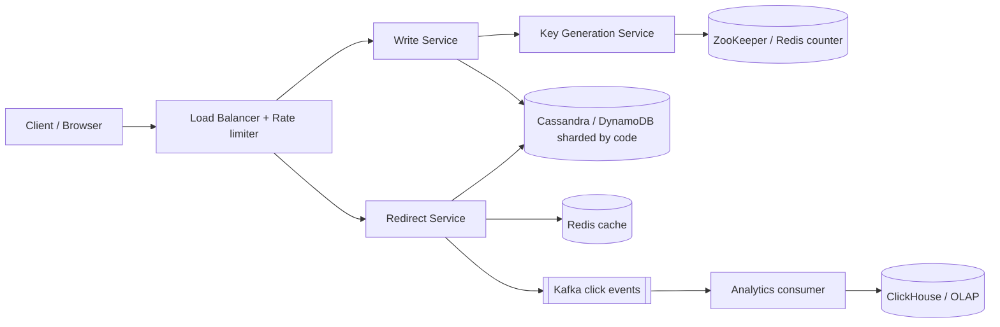
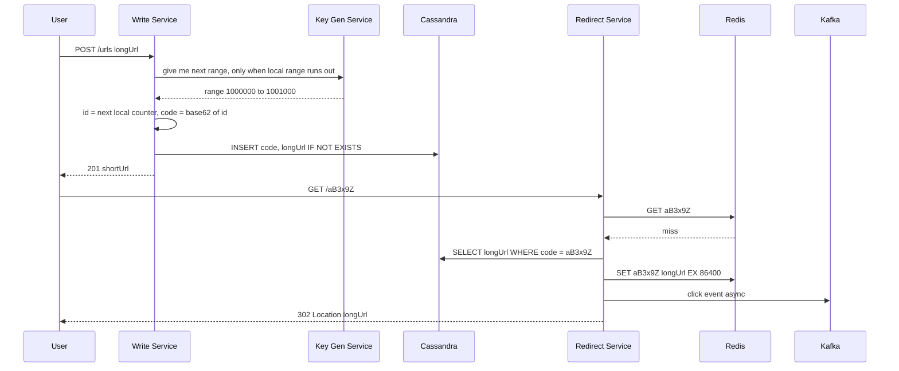

# Design URL Shortener (TinyURL / Bitly)

**In one line:** you give a long URL and get a short code back (`bit.ly/aB3x9Z`). When someone clicks the short link, they are redirected to the original URL. The core challenges are **generating unique short codes fast** and **redirecting a huge read load within milliseconds**.

**What the interviewer checks in this question:** the trade-offs of ID generation (hash vs counter vs pre-generated keys), caching in a read-heavy system, what 301 vs 302 means, and sharding at scale.

---

## Step 1: Clarify with the interviewer (3–5 min)

Ask these questions before you start the design:

| You ask | Typical answer | Effect on design |
|---|---|---|
| "What is the scale? How many new URLs and how many clicks per day?" | 100M new URLs/day, read:write ~100:1 | Cache on the read path matters most |
| "How short should the code be?" | 7 characters is fine | 7 Base62 chars = 3.5 trillion codes |
| "Do we need custom aliases? (`bit.ly/ipl2026`)" | Yes, optional | Separate uniqueness check, same table |
| "Do links expire?" | Yes, optional expiry, default is never | TTL column + lazy delete |
| "Do we need analytics? Click count, country, device?" | Yes, but not real-time | Async through Kafka, redirect path stays fast |
| "If the same long URL comes twice, must it get the same code?" | Not required | We can skip dedup, simpler design |
| "Are login/users and link edit/delete in scope?" | Basic delete yes, the rest no | Say it is out of scope |

> **Say:** "I will design 2 core flows: create a short URL and redirect. I will keep the redirect path very fast and highly available, because it gets 100x more traffic. Analytics will be async."

## Step 2: Requirements

**Functional**
1. Give a long URL, get a unique short URL
2. Opening the short URL redirects to the original URL
3. Optional custom alias and expiry time
4. Basic analytics: click count, country, referrer

**Non-functional**
- **Low latency:** redirect < 50ms (p99)
- **High availability:** redirect must never go down (99.99%)
- **Uniqueness:** two long URLs must never get the same code
- **Non-guessable:** codes should not look sequential (optional, ask about it)
- **Scale:** read-heavy, 100:1

## Step 3: Estimation (only what changes the design)

- Writes: 100M/day ≈ **1,200 writes/sec**, peak ~5K/sec.
- Reads: 100x ≈ **120K reads/sec**, peak ~500K/sec. **A cache is a must for this.**
- Storage: one row is ~500 bytes. 100M × 365 × 10 years ≈ 365B rows ≈ **~180 TB**. It will not fit on one machine, so we need sharding.
- Code length: 62^7 ≈ 3.5 trillion. That is enough for 365B rows.
- Hot links: 20% of links bring 80% of traffic. A small cache gives a high hit ratio.

> **Say:** "Reads are 120K QPS and storage is ~180 TB over 10 years. So two decisions are clear: heavy caching and a key-value store sharded on the short code."

## Step 4: Core entities

- **URL mapping**: short_code, long_url, user_id, created_at, expires_at
- **User** (optional): id, api_key, plan
- **Click event**: short_code, timestamp, ip/country, user_agent, referrer

## Step 5: APIs

```http
POST /urls   {longUrl, customAlias?, expiresAt?}   → 201 {shortUrl, shortCode}
     Header: Authorization: Bearer <apiKey>
GET  /{shortCode}                                  → 302 Location: <longUrl>
DELETE /urls/{shortCode}                           → 204
GET  /urls/{shortCode}/stats                       → {clicks, byCountry, byDay}
```

> **Say:** "Redirect is a plain GET that returns 302 with a `Location` header. The browser then goes to the original URL by itself."

## Step 6: High-level design



**Why each component:**
- **Load Balancer + Rate limiter:** stops spam bots that create lakhs of URLs
- **Write Service:** validates the URL, checks the custom alias, assigns a code and saves it in the DB
- **Key Generation Service (KGS):** gives each write server a range of codes, so a collision never happens
- **Redirect Service:** stateless, read-only. Cache → DB fallback → 302
- **Redis cache:** for hot links, 90%+ hit ratio
- **Kafka → Analytics:** click event is fire-and-forget, no effect on redirect latency
- **ClickHouse:** aggregated analytics queries (clicks per day, per country)

## Step 7: Main flow: create and redirect



## Step 8: Data model & DB choice

```sql
urls(short_code PK, long_url, user_id, created_at, expires_at)
-- custom alias also lives in this table, short_code = alias
```

- There is only one access pattern: **lookup by short_code**. No joins, no transactions.
- So we use a **key-value / wide-column store (DynamoDB or Cassandra)**. Partition key = `short_code`, and data spreads across shards automatically.
- A conditional write (`IF NOT EXISTS` / `attribute_not_exists`) guarantees custom alias uniqueness.
- Analytics goes to a separate OLAP store (ClickHouse), so there are no aggregation queries on the main DB.

## Step 9: Deep dives (the interviewer will push here)

### 9.1 How will you generate the short code? (most important)

| Option | How | Problem |
|---|---|---|
| **Hash (MD5/SHA) + first 7 chars** | `base62(md5(longUrl))[0:7]` | Collisions are possible. Every write needs a DB check + retry with salt. Retries grow as load grows |
| **Global counter + Base62** | DB/Redis `INCR`, convert the id to Base62 | A single counter is a bottleneck and a SPOF. Codes are sequential and easy to guess |
| **Range allocation (chosen)** | KGS gives each server a block of 1000 ids. The server runs a counter in local memory | If a server crashes, some ids in its range are wasted. With 3.5T codes this is fine |
| **Pre-generated keys** | Create random codes offline and keep them in an `unused_keys` table. Servers pick them up in batches | Extra table + marking a key as "used" must be atomic |

- Chosen: **range allocation**. The range comes from ZooKeeper or Redis `INCRBY 1000`. Only one network call per 1000 writes.
- To make codes non-guessable: apply a **bijective shuffle** (like XOR with a secret, or a Feistel cipher) to the id before Base62. There will still be no collisions.

> **Say:** "With hashing we have to handle collisions, and a single counter is a bottleneck. Range allocation solves both: it is collision-free, and coordination happens only once every 1000 writes."

### 9.2 301 vs 302 redirect

- **301 (Permanent):** the browser caches it. The next click never reaches the server. Lower server load, but **analytics are missed** and changing/deleting the link has no effect.
- **302 (Temporary):** every click reaches the server. Analytics are accurate, and expiry/delete work immediately.
- Chosen: **302** (Bitly does the same), because analytics is a requirement. Cache + CDN will handle the load.

### 9.3 How will you take the read path to 500K QPS?

- **Redis cache** (LRU, TTL 24h). 20% hot links in cache = 90%+ hit ratio.
- Shard Redis into a cluster with **consistent hashing**.
- For a viral link (like the IPL final link), also add an **in-process local cache** (Caffeine, 60 sec), so a single Redis node does not get hot.
- Negative caching: also cache codes that do not exist for 5 min, otherwise attackers will hammer the DB with random codes.
- Optional: cache the 302 response at the CDN edge with a short TTL.

### 9.4 Custom alias, expiry and analytics

- **Custom alias:** `INSERT ... IF NOT EXISTS`. If it fails, return 409 Conflict. To avoid a namespace clash between generated codes and aliases, check a minimum length or reserved words for aliases.
- **Expiry:** `expires_at` column. Check it on redirect, and if expired return 410 Gone. For cleanup, use the Cassandra/DynamoDB **TTL** feature, or a low-priority batch job. Set the cache TTL to `min(24h, expires_at - now)`.
- **Analytics:** the Redirect Service puts a click event into Kafka (async, batched). A consumer enriches it (IP → country) and writes to ClickHouse. Click counts are eventually consistent, which is fine.

## Step 10: Decision table (what we chose, why, and what we did not)

| Decision | Why we chose it | What we did not choose, and why |
|---|---|---|
| **Range allocation + Base62** for codes | Collision-free, no DB check, coordination once every 1000 writes | **Hash + collision check:** extra read on every write, retries. **Single counter:** bottleneck + SPOF |
| **302 redirect** | Every click reaches the server, so analytics and expiry work | **301:** the browser caches it, analytics are missed, deleting a link has no effect |
| **DynamoDB / Cassandra** | Simple key lookup, 180 TB, built-in sharding by partition key | **Postgres:** manual sharding at this data size, and we do not need joins/transactions at all |
| **Redis cache + local cache** | 100:1 read-heavy, very few hot links | **Only DB replicas:** many machines at 500K QPS, and higher latency too |
| **Kafka** for click analytics | Redirect path stays fast, events are safe even if the consumer is down | **Sync DB counter update:** a write on every click, contention on hot keys |
| **Sharding by short_code** | Lookup is always by code, uniform distribution | **Shard by user_id:** at redirect time we do not know the user, so we would need scatter-gather |

## Step 11: Failures & bottlenecks

| What failed | What happens | How to handle |
|---|---|---|
| Redis down | All reads go to the DB | DB replicas absorb it, local cache acts as a buffer. Redis cluster with replicas |
| KGS / ZooKeeper down | No new ranges | Servers keep 1–2 ranges in buffer in advance. Run KGS as a 3-node cluster |
| Write server crash | Unused ids in its range are wasted | Acceptable, we have 3.5T codes |
| Viral link | Lakhs of hits on one Redis key | Local in-memory cache + CDN |
| Spam / malicious URLs | Phishing links get created | Rate limit per API key, async Google Safe Browsing check |
| Kafka lag | Analytics are late | No effect on redirect, scale the consumers |

## Step 12: How to make it better (say this yourself at the end)

> "If I had more time, I would improve these:"
- **Multi-region:** redirect service + read replicas in every region, writes in one home region or with region-prefixed ranges
- **CDN edge redirects:** serve the top 1% of links on Cloudflare Workers/Lambda@Edge, latency < 10ms
- **Malicious URL scanning** as an async pipeline, with a warning page for flagged links
- **Dedup option:** for paid users, the same long URL gets the same code (`hash(longUrl) → code` index)
- **Cold storage:** move links not clicked for 2 years to cheaper storage
- 1-min aggregates with Kafka Streams / Flink for a real-time click dashboard

## Step 13: Likely follow-up questions

- "If you used a hash, how would you handle collisions?" → Conditional insert in the DB, and if it fails, hash the long URL + a salt again. Or check a bloom filter first
- "Why exactly 7 chars?" → 62^7 ≈ 3.5T, which is 10x headroom for 365B rows over 10 years
- "Why should codes not be guessable?" → People could scrape private links using sequential codes. Apply a bijective shuffle
- "What if someone deleted a link but it is still in the cache?" → On delete, also delete the cache key. Since we use 302, browser caching is not an issue
- "Do analytics need to be exactly accurate?" → Kafka at-least-once + event_id dedup on the consumer side. Usually approximate is fine
- "When would you use 301?" → When we do not need analytics and want minimum server load

## 2-minute recap

> A URL shortener is 100:1 read-heavy. Two flows: create and redirect. For the short code we use range allocation: KGS (ZooKeeper/Redis) gives each write server a block of 1000 ids, and the server converts its local counter to Base62 (7 chars = 3.5T codes). This avoids collisions and needs very little coordination. Data goes in DynamoDB/Cassandra with short_code as the partition key, because it is only key lookups and ~180 TB over 10 years. Redirect uses 302 so that analytics and expiry work. Read path: local cache → Redis → DB, with negative caching too. Custom aliases use a conditional insert, expiry uses `expires_at` + DB TTL. Clicks go async through Kafka into ClickHouse.

## Checklist

- [ ] I can ask the clarifying questions (scale, alias, expiry, analytics) without notes
- [ ] I can tell 3–4 options for code generation and their trade-offs
- [ ] I can explain how range allocation works
- [ ] I can explain the difference between 301 and 302 and justify my choice
- [ ] I can do the storage and QPS estimation in 2 min
- [ ] I can explain read path caching (local + Redis + negative cache)
- [ ] I can tell why we shard on short_code
- [ ] I can say 3 trade-offs from the decision table without notes
