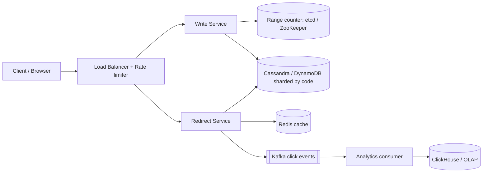
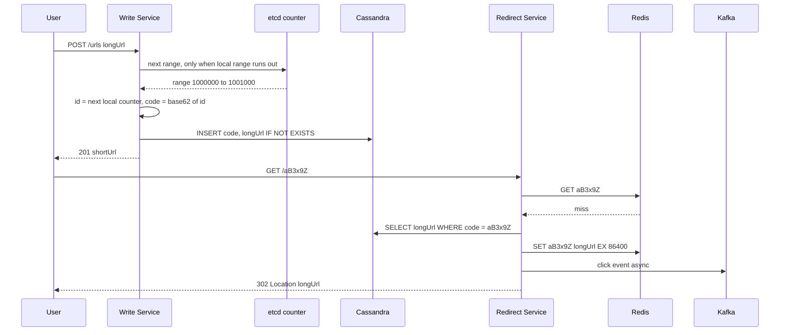

# Design URL Shortener (TinyURL / Bitly)

**In one line:** long URL → short code (`bit.ly/aB3x9Z`), click → redirect. Core challenges: **generating unique codes fast** and **redirecting a huge read load in ms**.

**What the interviewer checks in this question:** ID generation trade-offs (hash vs counter vs pre-generated keys), read-heavy caching, 301 vs 302, sharding at scale.

---

## Step 1: Clarify with the interviewer (3–5 min)

| You ask | Typical answer | Effect on design |
|---|---|---|
| "How many new URLs, clicks per day?" | 100M URLs/day, read:write ~100:1 | Cache on the read path matters most |
| "How short should the code be?" | 7 characters | Base62: 3.5 trillion codes |
| "Custom aliases (`bit.ly/ipl2026`)?" | Yes, optional | Separate uniqueness check, same table |
| "Do links expire?" | Optional expiry, default never | TTL column + lazy delete |
| "Analytics: clicks, country, device?" | Yes, not real-time | Async pipeline |
| "Same long URL → same code?" | Not required | Skip dedup, simpler design |
| "Login, link edit/delete?" | Basic delete yes, rest no | Out of scope |

> **Say:** "2 core flows: create and redirect. Redirect gets 100x more traffic, so I keep it fast and highly available. Analytics is async."

## Step 2: Requirements

**Functional**
1. Long URL → short URL (optional custom alias + expiry); delete own link
2. Short URL → redirect to the original URL
3. Basic analytics: click count, country, referrer

**Out of scope:** login UI, link edit, long URL dedup, spam ML.

**Non-functional (in priority order)**
1. **Latency:** redirect p99 < 50 ms
2. **Availability:** redirect 99.99%, create 99.9%
3. **Uniqueness:** two long URLs never get the same code
4. **Scale:** 100M new URLs/day, 100:1 read/write, 10-year retention
5. **Analytics:** eventual, ~1 min delay is fine
6. **Non-guessable:** codes should not look sequential (optional, ask)

**CAP choice:** AP on redirect, slightly stale cache is fine. Consistency only on create (uniqueness): range allocation + conditional insert.

## Step 3: Estimation (only what changes the design)

- Writes: 100M/day ≈ **1,200/sec**, peak ~5K/sec. Even one DB could handle it.
- Reads: 100x ≈ **120K/sec**, peak ~500K/sec → **cache is a must**.
- Storage: ~500 bytes/row × 100M × 365 × 10 years ≈ 365B rows ≈ **~180 TB** → sharding.
- Clicks: **~10B events/day**, peak ~500K/sec → analytics pipeline volume.
- Code length: 62^7 ≈ 3.5T, enough for 365B rows.

> **Say:** "120K read QPS and ~180 TB → heavy caching + a KV store sharded on the short code."

## Step 4: Core entities

- **URL mapping**: short_code, long_url, user_id, created_at, expires_at
- **User** (optional): id, api_key, plan
- **Click event**: short_code, timestamp, ip/country, user_agent, referrer

## Step 5: APIs

```http
POST /urls   {longUrl, customAlias?, expiresAt?}   → 201 {shortUrl, shortCode}
     Header: Authorization: Bearer <apiKey>
GET  /{shortCode}                                  → 302 Location: <longUrl>
DELETE /urls/{shortCode}                           → 204
GET  /urls/{shortCode}/stats                       → {clicks, byCountry, byDay}
```

> **Say:** "Redirect is a plain GET returning 302 with a `Location` header. The browser goes to the original URL itself."

## Step 6: High-level design

**Simple v1:** one service + Postgres `urls(short_code PK, long_url)`, DB sequence → Base62, PK lookup. Meets all three FRs, but the numbers break it: 500K reads/sec → cache; 180 TB → sharded KV; many write servers without per-write coordination → range allocation; ~10B clicks/day → async log + OLAP.



**FR mapping:** FR1 → Write Service + range counter + DB. FR2 → Redirect Service + Redis + DB. FR3 → Kafka + Analytics consumer + ClickHouse.

**Why each component** (alternatives in Step 10):
- **Separate Write and Redirect:** 100:1 traffic, scale differently; redirect isolated from create bugs (99.99%).
- **Range counter:** allocator library in the Write Service fetches `next range` once per 1000 ids → peak ~5 calls/sec.
- **Redis:** 20% of links = 80% of traffic → 90%+ hit ratio.
- **Kafka:** 2 consumer groups (analytics loader + abuse detection), 7-day replay (rerun after an aggregation bug).

## Step 7: Main flow: create and redirect



## Step 8: Data model & DB choice

```sql
urls(short_code PK, long_url, user_id, created_at, expires_at)
-- custom alias also lives in this table, short_code = alias
```

- One access pattern: **lookup by short_code**, no joins/transactions → **DynamoDB/Cassandra**, partition key `short_code`.
- Conditional write (`IF NOT EXISTS` / `attribute_not_exists`) → custom alias uniqueness.

## Step 9: Deep dives (the interviewer will push here)

### 9.1 How will you generate the short code? (most important)

**NFR:** uniqueness + non-guessable, without per-write coordination.

| Option | How | Problem |
|---|---|---|
| **Hash (MD5/SHA) + first 7 chars** | `base62(md5(longUrl))[0:7]` | Collision → DB check + salt retry, grows with load |
| **Global counter + Base62** | DB/Redis `INCR` → Base62 | Bottleneck + SPOF; sequential, guessable |
| **Range allocation (chosen)** | etcd/ZooKeeper gives each server 1000 ids; local counter | A few ids wasted on crash; fine with 3.5T |
| **Pre-generated keys** | Offline random codes in `unused_keys` table | Extra table; "used" mark must be atomic |

- Non-guessable: **bijective shuffle** (XOR with secret / Feistel cipher) before Base62. Still no collisions.
- Not Redis `INCRBY`: async failover can lose increments → same range twice → duplicate codes. Per-write DB sequence = single-node bottleneck.

> **Say:** "Hashing needs collision handling, a single counter is a bottleneck. Range allocation is collision-free with coordination once per 1000 writes."

**Trade-off:** ids wasted on crash, codes roughly time-ordered ↔ zero collisions, almost zero coordination.

### 9.2 301 vs 302 redirect

**NFR:** accurate analytics, immediate delete/expiry.

- **301 (Permanent):** browser caches → less load, but **analytics missed**, change/delete has no effect.
- **302 (Temporary):** every click reaches the server → accurate analytics, immediate expiry/delete.
- Chosen: **302** (Bitly too), analytics is a requirement.

**Trade-off:** more server load/cost ↔ analytics and control.

### 9.3 How will you take the read path to 500K QPS?

**NFR:** redirect p99 < 50 ms, 99.99% availability.

- **Redis cache** (LRU, TTL 24h), sharded with consistent hashing.
- Viral link (IPL final) → **in-process local cache** (Caffeine, 60 sec) so one Redis node does not get hot.
- Negative caching: cache missing codes for 5 min too, else random codes hammer the DB.

**Trade-off:** old link served up to 60 sec after delete (local cache/CDN) ↔ ~10x less DB load.

### 9.4 Custom alias, expiry and analytics

**NFR:** alias uniqueness (strong), analytics eventual.

- **Custom alias:** `INSERT ... IF NOT EXISTS`, fail → 409. Avoid clashes with generated codes: min length / reserved words.
- **Expiry:** check `expires_at` on redirect, expired → 410 Gone. Cleanup: Cassandra/DynamoDB **TTL**. Cache TTL = `min(24h, expires_at - now)`.
- **Analytics:** Redirect Service → Kafka in batches (async) → consumer enriches (IP → country) → ClickHouse.

**Trade-off:** counts ~1 min late, approximate (at-least-once) ↔ zero extra latency on redirect.

## Step 10: Decision table (what we chose, why, and what we did not)

| Decision | Why we chose it | What we did not choose, and why |
|---|---|---|
| **Range allocation + Base62** (etcd/ZooKeeper) | Collision-free, ~5 calls/sec | **Hash:** retries. **Redis INCRBY:** range repeat. **Separate KGS:** overkill. Sacrifice: ids wasted on crash |
| **302 redirect** | Analytics and expiry work | **301:** browser cache, analytics missed. Sacrifice: more load |
| **DynamoDB / Cassandra** | Key lookup, 180 TB, built-in sharding | **Postgres:** manual sharding. Sacrifice: no ad-hoc queries, multi-row txns |
| **Redis + local cache** | 120K–500K reads/sec, hot links | **Only DB replicas:** many machines, higher p99. Sacrifice: ~60 sec stale + Redis ops |
| **Kafka** for clicks | ~120K events/sec, 2 consumer groups, replay | **SQS:** no replay/multi-consumer, expensive. **Sync DB counter:** hot key. Sacrifice: Kafka ops |
| **ClickHouse** for analytics | Fast aggregations on 10B rows/day | **Aggregates on main DB:** slows redirect. Sacrifice: one more store, eventual counts |
| **Sharding by short_code** | Lookup always by code, uniform | **By user_id:** scatter-gather on redirect. Sacrifice: "user's links" query scatters |

## Step 11: Failures & bottlenecks

| What failed | What happens | How to handle |
|---|---|---|
| Redis down | All reads hit the DB | DB replicas + local cache; Redis cluster with replicas |
| etcd / ZooKeeper down | No new ranges | Servers buffer 1–2 ranges; 3–5 node quorum |
| Viral link | Lakhs of hits on one Redis key | Local cache + CDN |
| Spam / malicious URLs | Phishing links | Rate limit per API key, async Safe Browsing |
| Kafka lag | Analytics late | No effect on redirect; scale consumers |

## Step 12: How to make it better (say this yourself at the end)

- **Multi-region:** redirect + read replicas per region; writes in a home region or region-prefixed ranges
- **CDN edge redirects:** top 1% of links on Cloudflare Workers/Lambda@Edge, latency < 10ms
- **Dedup option:** for paid users, same long URL → same code (`hash(longUrl) → code` index)
- Real-time dashboard: 1-min aggregates with Kafka Streams / Flink

## Step 13: Likely follow-up questions

- "Hash collisions?" → conditional insert, on fail rehash with a salt; or bloom filter pre-check
- "Why 7 chars?" → 62^7 ≈ 3.5T, 10x headroom over 365B rows
- "Why non-guessable?" → sequential codes let people scrape private links; bijective shuffle
- "Deleted but still cached?" → delete the cache key too; with 302 there is no browser cache
- "Exact analytics?" → at-least-once + consumer event_id dedup; usually approximate is fine
- **Senior signal:** viral link's cache entry expires → lakhs of requests hit the DB (cache stampede). Fix: per-key single-flight, local cache, TTL jitter.

## 2-minute recap

> 100:1 read-heavy; v1 (service + Postgres) breaks at 500K reads/sec and 180 TB. Code: range allocation (block of 1000 ids from etcd/ZooKeeper → Base62, 7 chars = 3.5T), no collisions, no separate KGS. DynamoDB/Cassandra, key short_code. 302 so analytics/expiry work. Read: local cache → Redis → DB + negative caching. Alias: conditional insert; expiry: `expires_at` + DB TTL. Clicks (~120K/sec) Kafka → ClickHouse async.

## Checklist

- [ ] I can ask the clarifying questions (scale, alias, expiry, analytics) without notes
- [ ] I can tell 3–4 options for code generation and their trade-offs
- [ ] I can explain how range allocation works
- [ ] I can explain the difference between 301 and 302 and justify my choice
- [ ] I can do the storage and QPS estimation in 2 min
- [ ] I can explain read path caching (local + Redis + negative cache)
- [ ] I can tell why we shard on short_code
- [ ] I can say 3 trade-offs from the decision table without notes
