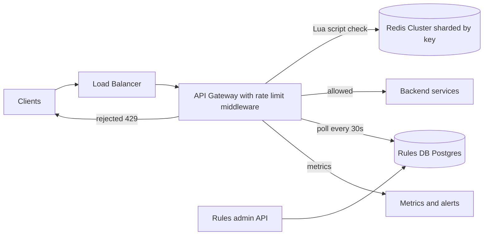
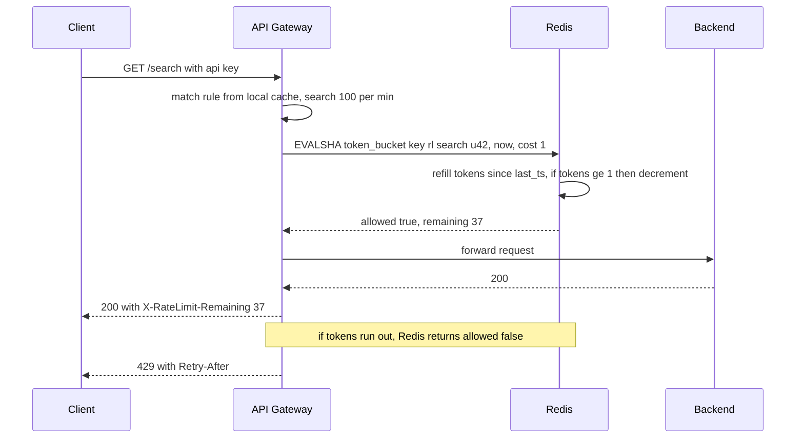

# Design a Rate Limiter

**In one line:** limit how many requests a client (user, IP, API key) can send in a time window. If the limit is crossed, return `429 Too Many Requests`. The core challenge is **keeping one counter fast and correct across many servers**, without slowing down every request.

**What the interviewer checks in this question:** the trade-offs between algorithms, race conditions in a distributed counter (atomicity), the latency budget, and what you do when the limiter itself fails (fail-open vs fail-closed).

---

## Step 1: Clarify with the interviewer (3–5 min)

Ask these questions before you start the design:

| You ask | Typical answer | Effect on design |
|---|---|---|
| "Client-side or server-side limiter? Where do we put it?" | Server-side, at the API gateway | Gateway middleware, no separate code in each service |
| "What do we limit on? User, IP, API key, endpoint?" | User/API key + endpoint, IP for unauthenticated | Key = `rule_id:client_id` |
| "Should we allow bursts? (10 in 1 sec, but avg 100/min)" | Yes, a small burst is fine | Token bucket |
| "How strict? Is it OK if a few extra get through?" | Slight inaccuracy is fine | Opens the option of eventual sync / local cache |
| "What is the scale?" | 1M requests/sec, 100M users | Redis cluster sharded by key |
| "Is it multi-region?" | Yes, 3 regions | Per-region limits or async sync |
| "If the limiter is down, do we block traffic or let it through?" | Usually let it through | Fail-open by default |

> **Say:** "I will design a distributed, server-side rate limiter that sits at the API gateway. I will use a token bucket, keep state in Redis, and keep rules in Postgres that gateways cache locally. The latency budget is ~1–2ms per request."

## Step 2: Requirements

**Functional**
1. Admins should be able to create rules per user / IP / API key / endpoint (like "100 req/min per user on /search"), without a deploy
2. A client that crosses the limit should get its request rejected with `429` + `Retry-After`
3. Clients should be able to see their remaining quota in headers

**Out of scope:** L3/L4 DDoS protection (the CDN/WAF's job), monthly billing quotas, per-client usage dashboard.

**Non-functional (in priority order)**
1. **Latency:** limiter check p99 < 2 ms, otherwise every API gets slow
2. **Availability:** the API keeps working even if the limiter is down (99.99%)
3. **Accuracy:** atomic check per key; ~1–5% over the limit is fine for multi-region/hot keys
4. **Scale:** 1M QPS, ~300M keys, small state per key

**CAP choice:** availability (AP). On a Redis or network partition, allowing the request (fail-open) is better; we give up a little exactness. Exception: fail-closed for login/OTP.

## Step 3: Estimation (only what changes the design)

- 1M req/sec → **1M Redis ops/sec** (each check is one Lua call). One Redis node does ~100K ops/sec → we need **~10–20 shards**.
- Keys: 100M users × ~3 rules = 300M keys. Token bucket state = 2 fields (~50 bytes) → **~15 GB**. Fits easily in a Redis cluster.
- Latency: gateway → Redis in the same AZ is ~0.5ms. So the work must be done in a single round trip.

> **Say:** "Every request makes one Redis round trip, so I will do the check in one atomic Lua script. For 1M QPS, I will split Redis into ~15 shards with consistent hashing."

## Step 4: Core entities

- **Rule**: id, match (endpoint, method, client tier), key_type (user/ip/api_key), capacity, refill_rate, window
- **Bucket state** (Redis): key = `rl:{rule_id}:{client_id}`, fields `tokens`, `last_refill_ts`
- **Client identity**: user_id / api_key / IP (comes from gateway auth)

## Step 5: APIs

The limiter is internal. The client only sees response headers.

```http
# Response to the client
HTTP/1.1 429 Too Many Requests
X-RateLimit-Limit: 100
X-RateLimit-Remaining: 0
X-RateLimit-Reset: 1760000060
Retry-After: 12

# Internal (gateway → limiter library / sidecar)
POST /check  {ruleKey, clientId, cost: 1}  → {allowed, remaining, resetAt}

# Admin
PUT  /rules/{ruleId}  {endpoint, keyType, capacity, refillPerSec}
```

> **Say:** "Always send a `Retry-After` header with 429, so well-behaved clients back off and we do not get a retry storm."

## Step 6: High-level design

**Start with a simple v1:** one gateway, a token bucket per key in its memory, rules in a config file. On one machine this meets all three FRs. The problem: 1M QPS needs many gateways, and if each gateway keeps its own count, N gateways = N x the limit. So we need shared state (Redis). "Rules without a deploy" moves the rules from a file to a DB.



**FR mapping:** FR1 → Rules admin API + Postgres + gateway poll. FR2 + FR3 → gateway middleware + Redis.

**Why each component:**
- **API Gateway middleware:** limits in one place, bad traffic never reaches the backend. The simpler option (a library in every service) duplicates logic and lets rules drift out of sync
- **Redis Cluster:** shared state for 1M checks/sec, ~0.5 ms, atomic with Lua. Local memory (simpler) does not share the count; Postgres counters mean a disk write per request
- **Rules DB + admin API, gateways poll:** only a few thousand rules that rarely change. Poll every 30 sec + local cache, zero extra calls on the check path. **We do not build a separate push-based config service**: a 30 sec delay is fine for rules
- **Metrics:** how many 429s are going out, and from which rule. If a wrong rule blocks genuine users, we know right away

## Step 7: Main flow: checking one request



## Step 8: Data model & DB choice

```text
Redis HASH  rl:{rule_id}:{client_id}
  tokens          = 37.5
  last_refill_ms  = 1760000048123
  EXPIRE          = 2 x window   (inactive keys clean themselves up)

Rules table (Postgres)
  rules(id PK, endpoint, method, key_type, tier, capacity, refill_per_sec, enabled, updated_at)
```

- **Redis**, because the state is small, hot, and updated on every request. Durability is not needed. If counters reset on a Redis restart, the limit is just loose for a few seconds.
- **Postgres** for rules, because there are few rules, they rarely change, and we need an audit trail.

## Step 9: Deep dives (the interviewer will push here)

### 9.1 Which algorithm? (always show the comparison)

**NFR:** allow bursts, small state (300M keys), check in one round trip.

| Algorithm | How | Plus | Minus |
|---|---|---|---|
| **Fixed window counter** | `INCR key:minute`, compare with the limit | Simplest, 1 counter | 2x burst at the window boundary (59th sec + 0th sec) |
| **Sliding window log** | Timestamp of every request in a sorted set | Exact | Memory heavy, stores every request |
| **Sliding window counter** | Weighted count of the current + previous window | Low memory, almost exact | Approximate |
| **Token bucket (chosen)** | Tokens refill in a bucket, each request uses 1 token | Allows bursts, smooth avg, 2 fields | Two params to tune |
| **Leaky bucket** | Drain a queue at a fixed rate | Perfectly smooth output | During a burst, requests wait in the queue |

> **Say:** "I will choose the token bucket. It allows bursts, keeps the average rate under control, and the state is just 2 numbers. Stripe and AWS API Gateway use it too."

**Trade-off:** two params (capacity, refill rate) to tune, in exchange for burst + smooth average in 2 fields.

### 9.2 Race condition: atomicity with Redis + Lua

**NFR:** per-key accuracy, check p99 < 2 ms.

- Problem: two gateways read `GET tokens = 1` at the same time and both allow the request. The limit is broken.
- Solution: put the whole "refill + check + decrement" in **one Lua script**. Redis is single-threaded, so the script runs atomically.
- Script logic:
  1. `tokens, last = HMGET key`
  2. `tokens = min(capacity, tokens + (now - last) * rate)`
  3. If `tokens >= cost`, decrement, `allowed = 1`
  4. `HSET` + `PEXPIRE`, return `allowed, tokens`
- Take `now` from Redis `TIME`. Do not trust gateway clocks (clock skew).
- `MULTI/WATCH` also works, but causes retries under contention. Lua is better.

**Trade-off:** business logic lives in a Redis script (mind deploys/versioning), in exchange for an atomic check in one round trip.

### 9.3 Distributed consistency and scale

**NFR:** 1M QPS and multi-region without adding latency.

- **Sharding:** consistent hashing on the key `rl:{rule}:{client}`. All state for one client is on one shard, so no cross-shard coordination.
- **Hot key:** one big client (1 lakh req/sec) will make one shard hot. Fix: a **local token bucket** at the gateway that takes tokens from the central bucket in batches (like 100 tokens at once). A little inaccuracy, but 100x less Redis load.
- **Multi-region:** each region has its own Redis. Two options:
  - Split the global limit across regions (US 50%, EU 30%, India 20%). Simple, no cross-region call.
  - Or count locally + sync async every 1 sec. Going slightly over the limit is possible, tell the interviewer.
- Do not do a synchronous cross-region check, that adds 100ms+ to every request.

**Trade-off:** local batching and per-region quotas allow ~1–5% over the limit, in exchange for 100x less Redis load and no cross-region calls.

### 9.4 What if the limiter itself fails? Fail-open vs fail-closed

**NFR:** 99.99% API availability; the limiter must not become a SPOF.

- **Fail-open (default):** if Redis times out (> 5ms), let the request through. The business keeps running. The backend should also have its own capacity protection (load shedding, circuit breaker).
- **Fail-closed:** for security-sensitive endpoints like `/login`, OTP, payment. Here stopping brute force matters more.
- Use a **strict timeout + circuit breaker** on the Redis call. If Redis is slow, every request should not wait 5ms. Open the breaker and run a local fallback limiter (per-gateway, approximate).

**Trade-off:** fail-open opens an abuse window during an outage, in exchange for the API not going down.

## Step 10: Decision table (what we chose, why, and what we did not)

| Decision | Why we chose it | What we did not choose, and why |
|---|---|---|
| **API Gateway middleware** | Enforcement in one place, bad traffic never reaches the backend | **Library in every service:** duplicate logic, rules out of sync. **Client-side:** cannot be trusted. Sacrifice: one more dependency on the gateway's critical path |
| **Token bucket** | Burst + smooth average, state of 2 fields | **Fixed window:** 2x burst at the boundary. **Sliding log:** stores every request. Sacrifice: 2 params to tune |
| **Redis Cluster + Lua** | 1M checks/sec, sub-ms, the script is atomic | **Postgres counters:** a disk write per request. **Local memory only:** N gateways = N x the limit. Sacrifice: running a ~10–20 shard cluster, counters reset on restart |
| **Rules in Postgres, gateways poll + cache** | Change rules without a deploy, no extra call on the check path | **Hardcoded rules:** a deploy for every change. **Push-based config service:** an extra service. Sacrifice: a rule change takes ~30 sec to apply |
| **Fail-open default, fail-closed for auth** | Availability > strictness for normal APIs, security endpoints stay safe | **Always fail-closed:** a Redis blip = the whole API is down. Sacrifice: abuse window during an outage |
| **Per-region limits** | No cross-region latency | **Global synchronous counter:** 100ms+ on every request. Sacrifice: the global limit is approximate |

## Step 11: Failures & bottlenecks

| What failed | What happens | How to handle |
|---|---|---|
| Redis shard down | Keys on that shard cannot be checked | Replica failover (Sentinel/Cluster), fail-open + local limiter in between |
| Redis slow | Every API gets slow | 5ms timeout + circuit breaker |
| Hot client key | One shard overloaded | Local token batching, or split the key into sub-keys |
| Rules DB down | New rule changes do not arrive | Gateway keeps the last known rules in memory |
| Wrong rule deployed | Genuine users get 429 | Shadow mode first (only log, do not block), then enforce. Alert on 429 rate |
| Clients retry right away on 429 | Retry storm | `Retry-After` header + exponential backoff with jitter in the client SDK |

## Step 12: How to make it better (say this yourself at the end)

> "If I had more time, I would improve these:"
- **Shadow mode** for new rules: first only log, check the impact, then enforce
- **Tiered limits:** different capacity for free / pro / enterprise plans, updated right away on plan change
- **Adaptive limiting:** if backend latency goes up, tighten limits automatically (load shedding)
- **Cost-based limits:** a heavy endpoint (export, search) uses 10 tokens per request
- **Abuse detection:** block IPs that keep getting 429 at the WAF level

## Step 13: Likely follow-up questions

- "What is the boundary problem with a fixed window?" → 100 at 0:59 and 100 at 1:00, so 200 in 2 sec. Fix with a sliding window or token bucket
- "Why not INCR + EXPIRE instead of Lua?" → That works for a fixed window, but a token bucket does read-compute-write, which must be atomic
- "Why not local memory instead of Redis?" → Each gateway keeps its own count, so N gateways = N x the limit. Sticky routing helps a bit, but it breaks when you scale
- "What about clock skew?" → Take the timestamp from Redis `TIME`, not from the gateway
- "Distributed DoS?" → A rate limiter alone is not enough. You need IP reputation and L3/L4 protection at the CDN/WAF level
- "What if we need an exact limit, not even one extra?" → Central Redis + Lua, turn off local batching. Accept the cost in latency and hot keys
- **Senior signal:** raise it yourself: the limiter is now on the critical path of every request, so a slow Redis ruins the p99 of the whole API. Hence a strict 5 ms timeout, a circuit breaker, a local fallback, and an alert on Redis latency from day one.

## 2-minute recap

> The rate limiter sits as middleware at the API gateway. The algorithm is a token bucket: capacity + refill rate, bursts allowed, and the state is just `tokens` and `last_refill`. State lives in a Redis Cluster with key `rl:{rule}:{client}`, sharded with consistent hashing. Refill + check + decrement run in one Lua script so there is no race condition, and time comes from Redis `TIME`. Rules live in Postgres; gateways poll every 30 sec and cache them locally (no separate config service). On reject, return 429 + `Retry-After` + `X-RateLimit-*` headers. If Redis is down, fail-open with a local fallback, but fail-closed for login/OTP. For multi-region, use a per-region quota, no cross-region sync check. For hot clients, use local token batching.

## Checklist

- [ ] I can ask the clarifying questions (where to put it, which key, burst, fail behavior)
- [ ] I can compare the 5 algorithms and justify choosing the token bucket
- [ ] I can tell the token bucket Lua logic step by step
- [ ] I can explain why the race condition happens and how Lua fixes it
- [ ] I can tell when to use fail-open vs fail-closed
- [ ] I can explain 429, `Retry-After` and the rate limit headers
- [ ] I can tell the approach for multi-region and hot keys
- [ ] I can say 3 trade-offs from the decision table without notes
