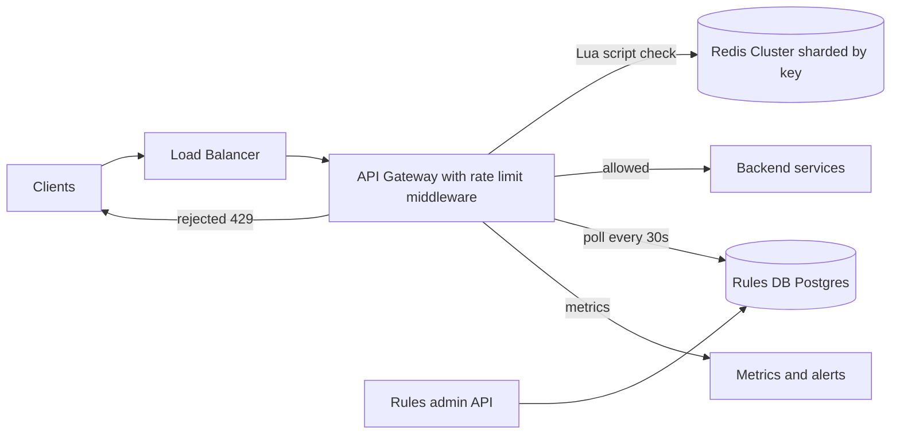
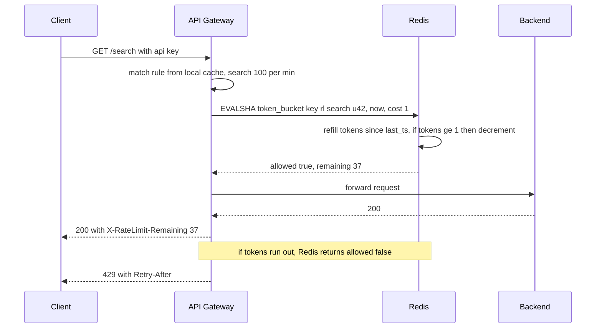

# Design a Rate Limiter

**In one line:** cap how many requests a client (user, IP, API key) can send in a time window; over the limit → `429 Too Many Requests`. Core challenge: **keeping one counter fast and correct across many servers**, without slowing requests.

**What the interviewer checks in this question:** algorithm trade-offs, race conditions (atomicity), latency budget, fail-open vs fail-closed.

---

## Step 1: Clarify with the interviewer (3–5 min)

| You ask | Typical answer | Effect on design |
|---|---|---|
| "Client or server-side? Where?" | Server-side, API gateway | Gateway middleware |
| "Limit on what? User, IP, API key, endpoint?" | User/API key + endpoint; IP if unauth | Key = `rule_id:client_id` |
| "Bursts? (10 in 1 sec, avg 100/min)" | Yes, small | Token bucket |
| "How strict?" | Slight inaccuracy is fine | Eventual sync / local cache possible |
| "Scale?" | 1M requests/sec, 100M users | Redis cluster sharded by key |
| "Multi-region?" | Yes, 3 regions | Per-region limits or async sync |
| "Limiter down → block or allow?" | Usually allow | Fail-open by default |

> **Say:** "A distributed limiter at the gateway: token bucket, state in Redis, rules in Postgres (cached by gateways). Budget ~1–2ms per request."

## Step 2: Requirements

**Functional**
1. Admins create rules per user / IP / API key / endpoint ("100 req/min per user on /search"), without a deploy
2. Over the limit → `429` + `Retry-After`
3. Clients see remaining quota in headers

**Out of scope:** L3/L4 DDoS (CDN/WAF), billing quotas, usage dashboard.

**Non-functional (in priority order)**
1. **Latency:** check p99 < 2 ms, else every API slows down
2. **Availability:** API keeps working even if the limiter is down (99.99%)
3. **Accuracy:** atomic per key; ~1–5% over the limit is fine for multi-region/hot keys
4. **Scale:** 1M QPS, ~300M keys, small state per key

**CAP choice:** AP. On a Redis/network partition, allow (fail-open), give up a little exactness. Exception: fail-closed for login/OTP.

## Step 3: Estimation (only what changes the design)

- 1M req/sec → **1M Redis ops/sec** (one Lua call per check). ~100K ops/sec per node → **~10–20 shards**.
- Keys: 100M users × ~3 rules = 300M; state 2 fields (~50 bytes) → **~15 GB**, fits easily in a Redis cluster.
- Latency: gateway → Redis in the same AZ ~0.5ms → one round trip only.

> **Say:** "One Redis round trip → one atomic Lua script. 1M QPS → ~15 shards, consistent hashing."

## Step 4: Core entities

- **Rule**: id, match (endpoint, method, client tier), key_type (user/ip/api_key), capacity, refill_rate, window
- **Bucket state** (Redis): key = `rl:{rule_id}:{client_id}`, fields `tokens`, `last_refill_ts`
- **Client identity**: user_id / api_key / IP (from gateway auth)

## Step 5: APIs

The limiter is internal; the client only sees headers.

```http
# Response to the client
HTTP/1.1 429 Too Many Requests
X-RateLimit-Limit: 100
X-RateLimit-Remaining: 0
X-RateLimit-Reset: 1760000060
Retry-After: 12

# Internal (gateway → limiter library / sidecar)
POST /check  {ruleKey, clientId, cost: 1}  → {allowed, remaining, resetAt}

# Admin
PUT  /rules/{ruleId}  {endpoint, keyType, capacity, refillPerSec}
```

> **Say:** "Send `Retry-After` with 429 so clients back off and we avoid a retry storm."

## Step 6: High-level design

**Simple v1:** one gateway, in-memory token buckets, rules in a config file; meets all three FRs. 1M QPS = many gateways → N gateways = N x the limit → shared state (Redis). "Without a deploy" → rules in a DB.



**FR mapping:** FR1 → Rules admin API + Postgres + gateway poll. FR2 + FR3 → gateway middleware + Redis.

**Why each component** (gateway, Redis: see Step 10):
- **Rules DB, gateways poll:** a few thousand rules, rarely change; 30 sec poll + local cache → zero extra calls on the check path.
- **Metrics:** how many 429s, from which rule → catch a wrong rule fast.

## Step 7: Main flow: checking one request



## Step 8: Data model & DB choice

```text
Redis HASH  rl:{rule_id}:{client_id}
  tokens          = 37.5
  last_refill_ms  = 1760000048123
  EXPIRE          = 2 x window   (inactive keys clean themselves up)

Rules table (Postgres)
  rules(id PK, endpoint, method, key_type, tier, capacity, refill_per_sec, enabled, updated_at)
```

- **Redis:** small, hot state updated every request; no durability needed (restart → limit loose for a few sec).
- **Postgres** for rules: few, rarely change, need an audit trail.

## Step 9: Deep dives (the interviewer will push here)

### 9.1 Which algorithm? (always show the comparison)

**NFR:** allow bursts, small state (300M keys), one round trip.

| Algorithm | How | Plus | Minus |
|---|---|---|---|
| **Fixed window counter** | `INCR key:minute` | Simplest, 1 counter | 2x burst at boundary (59th + 0th sec) |
| **Sliding window log** | Timestamps in a sorted set | Exact | Memory heavy |
| **Sliding window counter** | Weighted current + previous window | Low memory, almost exact | Approximate |
| **Token bucket (chosen)** | Tokens refill, each request uses 1 | Bursts, smooth avg, 2 fields | 2 params to tune |
| **Leaky bucket** | Drain a queue at a fixed rate | Perfectly smooth output | Requests wait during bursts |

> **Say:** "Token bucket: bursts allowed, average under control, state is just 2 numbers. Stripe and AWS API Gateway use it too."

**Trade-off:** tune capacity + refill rate ↔ burst + smooth average in 2 fields.

### 9.2 Race condition: atomicity with Redis + Lua

**NFR:** per-key accuracy, check p99 < 2 ms.

- Problem: two gateways read `tokens = 1` at once → both allow.
- Fix: refill + check + decrement in **one Lua script**; Redis is single-threaded → atomic.
- Script logic:
  1. `tokens, last = HMGET key`
  2. `tokens = min(capacity, tokens + (now - last) * rate)`
  3. `tokens >= cost` → decrement, `allowed = 1`
  4. `HSET` + `PEXPIRE`, return `allowed, tokens`
- Take `now` from Redis `TIME`, not gateway clocks (clock skew).
- `MULTI/WATCH` also works but retries under contention; Lua is better.

**Trade-off:** business logic in a Redis script (mind deploys/versioning) ↔ atomic check in one round trip.

### 9.3 Distributed consistency and scale

**NFR:** 1M QPS and multi-region without adding latency.

- **Sharding:** consistent hashing on `rl:{rule}:{client}`; one client = one shard, no cross-shard coordination.
- **Hot key:** big client (1 lakh req/sec) → hot shard. Fix: **local token bucket** at the gateway, taking batches of 100 tokens from the central one. Slight inaccuracy, 100x less Redis load.
- **Multi-region:** Redis per region. Split the global limit (US 50%, EU 30%, India 20%), or count locally + async sync every 1 sec (slight over-limit, say so). No sync cross-region check: 100ms+ per request.

**Trade-off:** ~1–5% over the limit ↔ 100x less Redis load, no cross-region calls.

### 9.4 What if the limiter itself fails? Fail-open vs fail-closed

**NFR:** 99.99% API availability; the limiter must not be a SPOF.

- **Fail-open (default):** Redis timeout (> 5ms) → allow. Backend keeps its own protection (load shedding, circuit breaker).
- **Fail-closed:** `/login`, OTP, payment; stopping brute force matters more.
- **Strict timeout + circuit breaker**; breaker open → per-gateway approximate local limiter.

**Trade-off:** abuse window during an outage ↔ the API never goes fully down.

## Step 10: Decision table (what we chose, why, and what we did not)

| Decision | Why we chose it | What we did not choose, and why |
|---|---|---|
| **API Gateway middleware** | One enforcement point, bad traffic stops early | **Per-service library:** duplicated, drifts. **Client-side:** untrusted. Sacrifice: critical path dependency |
| **Token bucket** | Burst + smooth average, 2 fields | **Fixed window:** 2x burst at boundary. **Sliding log:** stores every request. Sacrifice: 2 params to tune |
| **Redis Cluster + Lua** | 1M checks/sec, sub-ms, atomic | **Postgres:** disk write per request. **Local memory:** N x limit. Sacrifice: ~10–20 shards, reset on restart |
| **Rules in Postgres, poll + cache** | Change without deploy, no extra call | **Hardcoded:** deploy per change. **Push config service:** extra service. Sacrifice: ~30 sec delay |
| **Fail-open, fail-closed for auth** | Availability; security endpoints safe | **Always fail-closed:** Redis blip = API down. Sacrifice: abuse window |
| **Per-region limits** | No cross-region latency | **Global sync counter:** 100ms+ per request. Sacrifice: approximate global limit |

## Step 11: Failures & bottlenecks

| What failed | What happens | How to handle |
|---|---|---|
| Redis shard down | Its keys cannot be checked | Replica failover (Sentinel/Cluster); fail-open + local limiter meanwhile |
| Redis slow | Every API slows | 5ms timeout + circuit breaker |
| Hot client key | One shard overloaded | Local token batching, or split into sub-keys |
| Rules DB down | No new rule changes | Last known rules in memory |
| Wrong rule deployed | Genuine users get 429 | Shadow mode first; alert on 429 rate |
| Instant retry on 429 | Retry storm | `Retry-After` + exponential backoff with jitter in SDK |

## Step 12: How to make it better (say this yourself at the end)

- **Shadow mode** for new rules: log only first, then enforce
- **Tiered limits:** free / pro / enterprise capacity, updated right away on plan change
- **Adaptive limiting:** backend latency rises → tighten limits (load shedding)
- **Cost-based limits:** heavy endpoint (export, search) = 10 tokens
- **Abuse detection:** block IPs that keep hitting 429 at the WAF

## Step 13: Likely follow-up questions

- "Fixed window boundary problem?" → 100 at 0:59 + 100 at 1:00 = 200 in 2 sec; fix with sliding window / token bucket
- "INCR + EXPIRE instead of Lua?" → fine for fixed window; token bucket is read-compute-write, must be atomic
- "Local memory instead of Redis?" → N gateways = N x limit; sticky routing helps a bit, breaks when scaling
- "Clock skew?" → timestamp from Redis `TIME`
- "Distributed DoS?" → also need IP reputation + L3/L4 protection at CDN/WAF
- "Exact limit?" → central Redis + Lua, no local batching; accept latency + hot key cost
- **Senior signal:** the limiter is on every request's critical path: slow Redis → the whole API's p99 suffers. Hence 5 ms timeout, circuit breaker, local fallback, Redis latency alert from day one.

## 2-minute recap

> Gateway middleware + token bucket (`tokens`, `last_refill`). Redis Cluster, key `rl:{rule}:{client}`. Refill + check + decrement in one Lua script, time from Redis `TIME`. Rules in Postgres, 30 sec poll. Reject → 429 + `Retry-After`. Redis down → fail-open + local fallback; login/OTP fail-closed. Multi-region: per-region quota. Hot clients: local token batching.

## Checklist

- [ ] I can ask the clarifying questions (where to put it, which key, burst, fail behavior)
- [ ] I can compare the 5 algorithms and justify choosing the token bucket
- [ ] I can tell the token bucket Lua logic step by step
- [ ] I can explain why the race condition happens and how Lua fixes it
- [ ] I can tell when to use fail-open vs fail-closed
- [ ] I can explain 429, `Retry-After` and the rate limit headers
- [ ] I can tell the approach for multi-region and hot keys
- [ ] I can say 3 trade-offs from the decision table without notes
