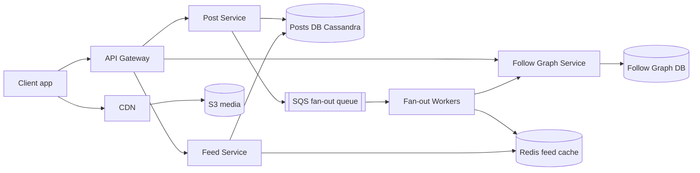
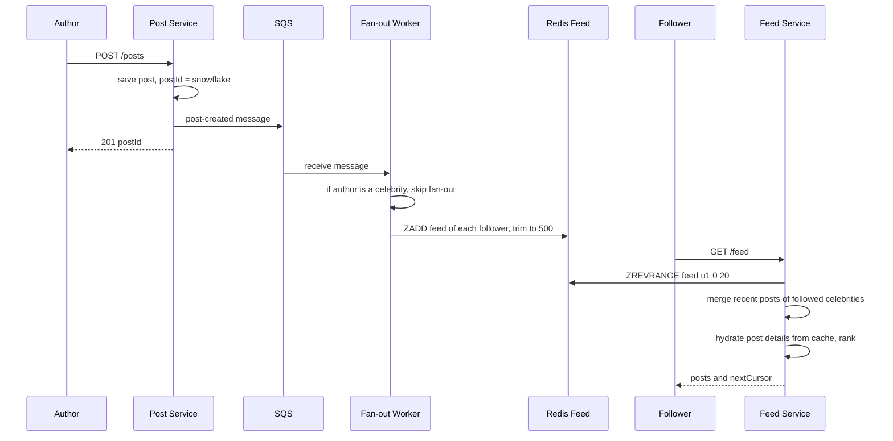
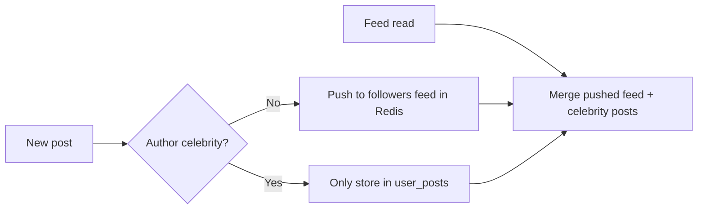

# Design News Feed (Twitter / Facebook)

**In one line:** a user posts, and the post shows up in the home feed of their followers, in newest-first or ranked order. The core challenges are **loading the feed fast** when a user follows 500 people, and **delivering a celebrity's post (100 million followers) to everyone** without breaking the system.

**What the interviewer checks in this question:** the trade-off between fan-out on write and fan-out on read, the hybrid solution for the celebrity problem, feed cache design, and cursor pagination.

---

## Step 1: Clarify with the interviewer (3–5 min)

Ask these questions before you start the design:

| You ask | Typical answer | Effect on design |
|---|---|---|
| "Is follow one-way (Twitter) or is friendship two-way (Facebook)?" | One-way follow | Follower graph is asymmetric, celebrities are possible |
| "Is the feed chronological or ranked?" | Chronological first, ranking briefly | We keep ranking as a separate layer |
| "Scale? DAU, posts/day, avg follows?" | 300M DAU, 50M posts/day, avg 200 follows | We must calculate the fan-out load |
| "Max followers? Are there celebrities?" | Yes, some accounts have 100M+ followers | Hybrid fan-out is needed |
| "Media in posts? Images/videos?" | Yes | S3 + CDN, only the URL in the feed |
| "How fresh must the feed be? How soon after posting should it show?" | A few seconds is fine | Async fan-out via a queue is OK |
| "Are likes, comments, notifications in scope?" | Show counts, nothing else | Counters are a separate service, out of scope |

> **Say:** "I will design 2 core flows: create post and get home feed. Feed reads are very high, so I will precompute the feed and keep it in Redis, and use a hybrid model for celebrities."

## Step 2: Requirements

**Functional**
1. Users should be able to post text + media
2. Users should be able to follow/unfollow other users
3. Users should be able to see a home feed: posts from followed users, newest first, infinite scroll

**Out of scope:** the likes/comments write path, notifications, search, ML ranking details.

**Non-functional (in priority order)**
1. **Latency:** feed load p99 < 200 ms
2. **Availability:** feed reads 99.99%, slightly stale is fine
3. **Freshness:** a post reaches followers' feeds in p95 ~5 sec (eventual)
4. **Scale:** 300M DAU, ~35K feed reads/sec vs 600 posts/sec

**CAP choice:** availability (AP). A post showing up 5 sec late is fine; a feed that does not open is not.

## Step 3: Estimation (only what changes the design)

- Posts: 50M/day ≈ **600 posts/sec**, peak ~3K/sec.
- Feed reads: 300M DAU × 10 opens ≈ 3B/day ≈ **35K reads/sec**, peak ~150K. We cannot compute the feed every time.
- Fan-out writes: 600 posts/sec × 200 followers avg = **120K feed inserts/sec**. Manageable.
- Queue: only 600 post events/sec (peak 3K). Even if big authors' fan-out is split into 1K-follower batches, it is a few thousand msgs/sec. That is not Kafka-level throughput.
- Celebrity: one post × 100M followers = 100M writes. **This is the real problem.**
- Feed cache: 300M users × 500 post ids × 8 bytes ≈ **1.2 TB** of Redis. Keep it only for active users.

> **Say:** "Average fan-out is manageable at 120K writes/sec. The problem is celebrities, where one post becomes 100 million writes. That is why we need a hybrid."

## Step 4: Core entities

- **User**: id, name, follower_count, is_celebrity
- **Post**: post_id (Snowflake, time-sortable), author_id, text, media_urls, created_at
- **Follow**: follower_id, followee_id, created_at
- **Feed entry** (cache): user_id → list of post_ids sorted by time

## Step 5: APIs

```http
POST /posts                {text, mediaIds[]}          → {postId}
POST /media/upload-url     {contentType}               → {uploadUrl, mediaId}
POST /users/{id}/follow                                → 204
DELETE /users/{id}/follow                              → 204
GET  /feed?cursor=<lastPostId>&limit=20                → {posts[], nextCursor}
```

> **Say:** "Pagination is cursor-based, not offset. With offset, new posts cause duplicates or skips, and large offsets are slow."

## Step 6: High-level design

**Start with a simple v1:** one service + Postgres (`posts`, `follows`). Feed = a pull query that merges the latest posts of followed authors. This meets all three FRs. The numbers break it: 35K–150K feed reads/sec × a 200-author merge → precomputed Redis feed; 120K feed inserts/sec → async queue + workers; 100M-follower celebrities → hybrid; 50M posts/day for years → Cassandra.



**FR mapping:** FR1 → Post Service + Cassandra + S3/CDN. FR2 → Follow Graph Service. FR3 → Feed Service + Redis feed (filled by the queue + Fan-out Workers).

**Why each component:**
- **Post Service:** saves the post and puts an event on the queue, without waiting for fan-out. Sync fan-out (simpler) would take seconds for a post with 10K followers
- **SQS + Fan-out Workers:** ~600 events/sec, and the job is "distribute tasks, retry, DLQ on failure". A managed queue is enough for that. **Not Kafka**, because there is only one consumer now and no need for replay
- **Follow Graph Service:** both direction tables (follows + followers) must be written consistently, and both Feed and Fan-out read from it
- **Redis feed cache:** 35K–150K reads/sec, p99 < 200 ms. A DB merge of 200 authors on every read (simpler) will not work
- **Feed Service:** ids from Redis, merge celebrity posts, hydrate post details, rank, return
- **S3 + CDN:** images/videos go directly client → S3 (pre-signed URL), served from the CDN. Serving media from app servers (simpler) eats their bandwidth

## Step 7: Main flow: posting and reading the feed



## Step 8: Data model & DB choice

```sql
posts(post_id PK, author_id, text, media_urls, created_at)
  -- Cassandra, partition by post_id. Extra table user_posts(author_id, post_id DESC) for profile + celebrity pull
follows(follower_id, followee_id, created_at)   -- PK(follower_id, followee_id)
followers(followee_id, follower_id)             -- reverse index, for fan-out
```

```text
Redis ZSET       feed:{user_id}  → member = post_id, score = post_id (time)  max 500
Redis HASH       post:{post_id}  → post details cache
```

- **Posts → Cassandra:** write-heavy, simple lookups, horizontal scale. The `user_posts` table is partitioned by author_id and clustered by post_id desc.
- **Follow graph → sharded MySQL/Cassandra** with tables for both directions. No need for a graph DB, there are only 1-hop queries.
- **Feed → Redis**, because it is derived data. If it is lost, it can be rebuilt.

## Step 9: Deep dives (the interviewer will push here)

### 9.1 Fan-out on write vs fan-out on read

**NFR:** feed p99 < 200 ms without breaking the write path.

| | Fan-out on write (push) | Fan-out on read (pull) |
|---|---|---|
| How | As soon as someone posts, put it in every follower's feed | When the feed opens, fetch + merge posts of followed users |
| Read | Super fast, one Redis read | Slow, merge posts of 200 users |
| Write | Heavy, 100M writes for a celebrity | Light, only save the post |
| Waste | Feeds are built even for inactive users | No waste |
| Best for | Normal users | Celebrities |

**Trade-off:** push costs storage and writes (even feeds of inactive users), in exchange for a feed in one Redis read.

### 9.2 Celebrity problem: hybrid model

**NFR:** ~5 sec freshness, even for celebrity posts.

- Normal users (< 10K followers): **push**. Fan-out workers write into followers' feeds.
- Celebrities (> 10K–100K followers, `is_celebrity` flag): **pull**. Their posts do not go into anyone's feed.
- On feed read: Redis feed (pushed posts) + latest posts of the celebrities the user follows (from `user_posts`, heavily cached) → merge by time.
- Skip fan-out for inactive users (no login for 30 days). When they come back, rebuild the feed with pull.



> **Say:** "In the hybrid, normal users use push and celebrities use pull. A user follows at most a few dozen celebrities, so merging at read time is cheap."

**Trade-off:** feed reads get a bit more complex and slower (merge step), in exchange for no 100M-write explosion.

### 9.3 Feed cache and hydration

**NFR:** latency + Redis memory (~1.2 TB) under control.

- Keep only **post_ids** in the Redis feed, not the full post. On post edit/delete, you update only one place.
- Hydration: `MGET post:{id}` from the post cache for the ids. On a miss, go to Cassandra.
- Like/comment counts come from a separate counter service, cached with a short TTL.
- Feed size is capped at 500. For older posts, fetch from the DB with the pull model.
- Unfollow: an async job removes that author's posts from the feed. Or filter at read time (cheap).

**Trade-off:** one extra `MGET` for hydration on every read, in exchange for 500x less memory and edit/delete in one place.

### 9.4 Pagination and ranking

**NFR:** infinite scroll without duplicates, stable latency.

- **Cursor:** `nextCursor = last post_id`. Next request: `post_id < cursor`. Snowflake ids are time-sortable, so this is stable, and new posts do not shift the page.
- **Ranking (briefly):** first get candidates (latest ~500), then a ranking service scores them: recency, interaction with the author, likes velocity, media type. Return the top 20. Say the ML model details are out of scope.
- "N new posts" banner for new posts: client polls every 30 sec, or SSE.

**Trade-off:** a cursor cannot "jump to page 7", in exchange for stable and fast pages.

## Step 10: Decision table (what we chose, why, and what we did not)

| Decision | Why we chose it | What we did not choose, and why |
|---|---|---|
| **Hybrid fan-out** | Fast reads for normal users, no write explosion for celebrities | **Pure push:** a celebrity post = 100M writes, minutes of lag. **Pure pull:** 200 queries on every feed open. Sacrifice: merge logic on the read path |
| **SQS async fan-out** | ~600 events/sec, built-in retries + DLQ, workers autoscale on queue depth | **Kafka:** one consumer, no replay needed, extra ops. **Sync fan-out:** posting takes seconds. Sacrifice: no per-author ordering or replay |
| **Redis feed with post_ids only** | 35K+ reads/sec, small memory, edit/delete in one place | **Full post in feed:** 500x duplicate data. **Pull from DB:** breaks p99. Sacrifice: ~1.2 TB of RAM cost, hydration step |
| **Cassandra for posts** | Write-heavy, time-ordered per author, horizontal scale | **Single Postgres:** 50M posts/day for years, manual sharding. Sacrifice: no joins/transactions |
| **Cursor pagination** | Stable pages, fast `post_id < cursor` | **Offset:** duplicates when new posts arrive, large offsets are slow. Sacrifice: no random page jump |
| **S3 + CDN for media** | No bandwidth on app servers, low latency globally | **Media in the DB or from app servers:** costly and slow. Sacrifice: CDN cost, URL signing |

## Step 11: Failures & bottlenecks

| What failed | What happens | How to handle |
|---|---|---|
| Fan-out workers lag | Posts reach feeds late | Autoscale workers on queue depth, alert on oldest-message age |
| Redis feed shard down | Some users see an empty feed | Replica failover, or rebuild the feed on the fly with the pull model |
| Celebrity post goes viral | Heavy reads on their `user_posts` row | Local/Redis cache of celebrity recent posts, short TTL |
| Duplicate message (at-least-once) | Same post twice in the feed | ZSET with post_id as member, duplicates are ignored automatically |
| Post deleted | Feeds still have the id | Skip deleted posts during hydration, async cleanup |
| Hot user's feed key | Load on one Redis node | Sharding by user_id, read replicas |

## Step 12: How to make it better (say this yourself at the end)

> "If I had more time, I would improve these:"
- **ML ranking** with a feature store, and an A/B testing framework
- **Real-time "new posts" push** via SSE/WebSocket for active users
- **Kafka when needed:** once moderation, search indexing and notifications also read post-created (3+ consumers, replay needed), replace SQS with a Kafka stream

## Step 13: Likely follow-up questions

- "How will you decide the celebrity threshold?" → Follower count (~10K–100K), plus how often they post. Tune it with config
- "A user just followed someone. How do that person's old posts get into the feed?" → On follow, an async job merges their last 20 posts into the feed
- "What if the whole feed cache is lost?" → It is derived data. Rebuild on demand with the pull model and warm it gradually
- "How does the cursor work with ranking?" → Cache the ranked candidate list for the session, cursor = position/score
- "How do you count likes on a post?" → A separate counter service, Redis INCR + periodic DB flush
- **Senior signal:** raise it yourself: at peak, fan-out becomes 3K posts/sec × 200 = 600K Redis writes/sec. If queue lag grows, the 5 sec freshness breaks: alert on oldest-message age, skip inactive users, and serve active users' feeds first.

## 2-minute recap

> A news feed is read-heavy, so we precompute the feed and keep it in Redis (only post_ids, max 500). The Post Service saves the post in Cassandra and puts an event on SQS (only ~600/sec and one consumer, so no Kafka). Fan-out workers get the follower list from the Follow Graph and push the post_id into their Redis feeds. There is no fan-out for celebrities: their posts are pulled and merged at read time (hybrid). Fan-out is skipped for inactive users. The Feed Service takes the ids, hydrates them from the post cache, optionally ranks them, and returns them with a cursor (last post_id, Snowflake). Media goes to S3 with a pre-signed URL and is served from the CDN.

## Checklist

- [ ] I can ask the clarifying questions (follow type, ranking, celebrities, media)
- [ ] I can build the fan-out on write vs read table without notes
- [ ] I can explain the celebrity problem and the hybrid model
- [ ] I can draw the HLD diagram in 5 min
- [ ] I can tell why the feed cache holds only ids, and how hydration works
- [ ] I can explain why cursor pagination is better than offset
- [ ] I can tell the basic ranking flow (candidates → score → top N)
- [ ] I can say 3 trade-offs from the decision table without notes
