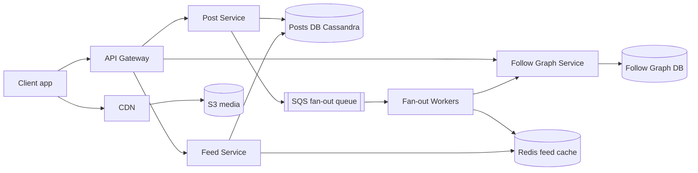
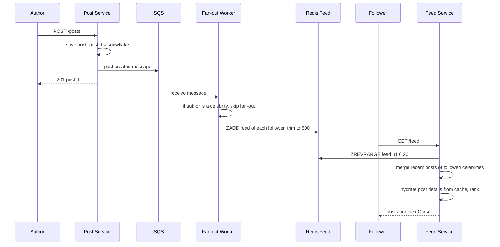
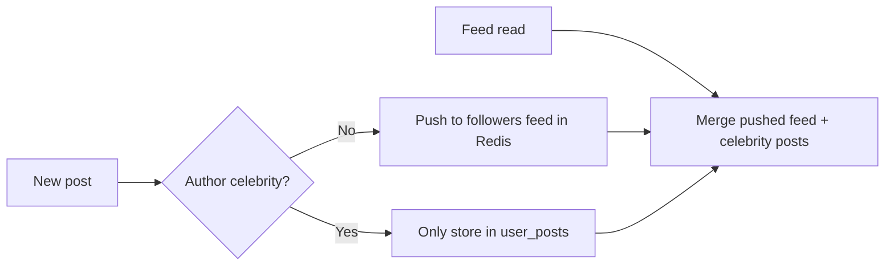

# Design News Feed (Twitter / Facebook)

**In one line:** a user posts → it shows in followers' home feeds, newest-first or ranked. Core challenges: **fast feed load** when a user follows 500 people, and **delivering a celebrity's post (100 million followers)** without breaking the system.

**What the interviewer checks in this question:** fan-out on write vs read, hybrid fix for the celebrity problem, feed cache design, cursor pagination.

---

## Step 1: Clarify with the interviewer (3–5 min)

| You ask | Typical answer | Effect on design |
|---|---|---|
| "One-way (Twitter) or two-way (Facebook)?" | One-way | Asymmetric graph, celebrities |
| "Chronological or ranked?" | Chronological first, ranking briefly | Ranking as a separate layer |
| "DAU, posts/day, avg follows?" | 300M DAU, 50M posts/day, avg 200 follows | Calculate fan-out load |
| "Celebrities?" | Yes, some have 100M+ followers | Hybrid fan-out needed |
| "Media?" | Yes, images/videos | S3 + CDN, only URL in feed |
| "How fresh?" | A few seconds is fine | Async fan-out via queue |
| "Likes, comments, notifications?" | Counts only | Counter service, out of scope |

> **Say:** "2 flows: create post and get feed. Reads dominate, so I precompute feeds in Redis, with a hybrid model for celebrities."

## Step 2: Requirements

**Functional**
1. Users post text + media
2. Follow/unfollow
3. Home feed: posts from followed users, newest first, infinite scroll

**Out of scope:** likes/comments write path, notifications, search, ML ranking details.

**Non-functional (in priority order)**
1. **Latency:** feed load p99 < 200 ms
2. **Availability:** feed reads 99.99%, slightly stale is fine
3. **Freshness:** post reaches followers' feeds in p95 ~5 sec (eventual)
4. **Scale:** 300M DAU, ~35K feed reads/sec vs 600 posts/sec

**CAP choice:** AP. A post 5 sec late is fine; a feed that does not open is not.

## Step 3: Estimation (only what changes the design)

- Posts: 50M/day ≈ **600/sec**, peak ~3K/sec.
- Feed reads: 300M × 10 opens ≈ 3B/day ≈ **35K/sec**, peak ~150K → cannot compute each time.
- Fan-out: 600 × 200 avg = **120K feed inserts/sec**, manageable.
- Queue: ~600 events/sec (peak 3K), big authors split into 1K-follower batches → a few thousand msgs/sec; not Kafka-level.
- Celebrity: 1 post × 100M followers = 100M writes. **The real problem.**
- Feed cache: 300M × 500 ids × 8 bytes ≈ **1.2 TB** Redis; active users only.

> **Say:** "Average fan-out is 120K writes/sec, manageable. A celebrity post = 100M writes, hence hybrid."

## Step 4: Core entities

- **User**: id, name, follower_count, is_celebrity
- **Post**: post_id (Snowflake, time-sortable), author_id, text, media_urls, created_at
- **Follow**: follower_id, followee_id, created_at
- **Feed entry** (cache): user_id → list of post_ids sorted by time

## Step 5: APIs

```http
POST /posts                {text, mediaIds[]}          → {postId}
POST /media/upload-url     {contentType}               → {uploadUrl, mediaId}
POST /users/{id}/follow                                → 204
DELETE /users/{id}/follow                              → 204
GET  /feed?cursor=<lastPostId>&limit=20                → {posts[], nextCursor}
```

> **Say:** "Cursor pagination, not offset: offsets duplicate/skip when new posts arrive, and large offsets are slow."

## Step 6: High-level design

**Simple v1:** service + Postgres (`posts`, `follows`), feed = pull merge query. Meets the FRs, but: 150K reads/sec × 200 authors → precomputed Redis feed; 120K inserts/sec → queue + workers; celebrities → hybrid; 50M posts/day → Cassandra.



**FR mapping:** FR1 → Post Service + Cassandra + S3/CDN. FR2 → Follow Graph Service. FR3 → Feed Service + Redis feed (filled by the queue + Fan-out Workers).

**Why each component** (alternatives in Step 10):
- **Post Service:** save + queue event, does not wait for fan-out.
- **Follow Graph Service:** writes both directions (follows + followers) consistently; Feed and Fan-out both read it.
- **Feed Service:** Redis ids + celebrity posts merge → hydrate → rank.
- **S3 + CDN:** client → S3 via pre-signed URL, served from CDN.

## Step 7: Main flow: posting and reading the feed



## Step 8: Data model & DB choice

```sql
posts(post_id PK, author_id, text, media_urls, created_at)
  -- Cassandra, partition by post_id. Extra table user_posts(author_id, post_id DESC) for profile + celebrity pull
follows(follower_id, followee_id, created_at)   -- PK(follower_id, followee_id)
followers(followee_id, follower_id)             -- reverse index, for fan-out
```

```text
Redis ZSET       feed:{user_id}  → member = post_id, score = post_id (time)  max 500
Redis HASH       post:{post_id}  → post details cache
```

- **Posts → Cassandra:** write-heavy, simple lookups. `user_posts`: partition author_id, cluster post_id desc.
- **Follow graph → sharded MySQL/Cassandra**, both directions. No graph DB: only 1-hop queries.
- **Feed → Redis:** derived data, rebuildable if lost.

## Step 9: Deep dives (the interviewer will push here)

### 9.1 Fan-out on write vs fan-out on read

**NFR:** feed p99 < 200 ms without breaking the write path.

| | Fan-out on write (push) | Fan-out on read (pull) |
|---|---|---|
| How | Post → every follower's feed | Fetch + merge on open |
| Read | Very fast, one Redis read | Slow, merge 200 users |
| Write | Heavy, celebrity = 100M writes | Light, just save |
| Waste | Feeds for inactive users too | None |
| Best for | Normal users | Celebrities |

**Trade-off:** storage + write cost (inactive users too) ↔ feed in one Redis read.

### 9.2 Celebrity problem: hybrid model

**NFR:** freshness ~5 sec, even for celebrity posts.

- Normal users (< 10K followers): **push** via fan-out workers.
- Celebrities (> 10K–100K, `is_celebrity`): **pull**, post goes into no feed.
- Read: Redis feed + latest posts of followed celebrities (`user_posts`, cached) → merge by time.
- Skip fan-out for inactive users (30 days); rebuild via pull when they return.



> **Say:** "Push for normal users, pull for celebrities. A user follows only a few dozen celebrities, so the read-time merge is cheap."

**Trade-off:** merge step on read (a bit more complex/slower) ↔ no 100M-write explosion.

### 9.3 Feed cache and hydration

**NFR:** latency + Redis memory (~1.2 TB) under control.

- Feed holds only **post_ids**; edit/delete updates one place.
- Hydration: `MGET post:{id}` from the post cache, miss → Cassandra.
- Like/comment counts from a separate counter service, short TTL cache.
- Feed capped at 500; older posts pulled from the DB.
- Unfollow: async cleanup, or filter at read time (cheap).

**Trade-off:** one extra `MGET` per read ↔ 500x less memory, edit/delete in one place.

### 9.4 Pagination and ranking

**NFR:** infinite scroll without duplicates, stable latency.

- **Cursor:** `nextCursor = last post_id`, next: `post_id < cursor`. Snowflake is time-sortable → new posts do not shift pages.
- **Ranking:** ~500 candidates → score (recency, author interaction, likes velocity, media type) → top 20. ML details out of scope.
- "N new posts" banner: client polls every 30 sec or SSE.

**Trade-off:** no "jump to page 7" ↔ stable, fast pages.

## Step 10: Decision table (what we chose, why, and what we did not)

| Decision | Why we chose it | What we did not choose, and why |
|---|---|---|
| **Hybrid fan-out** | Fast read, no celebrity write explosion | **Pure push:** 100M writes, minutes of lag. **Pure pull:** 200 queries/open. Sacrifice: merge logic |
| **SQS async fan-out** | ~600 events/sec, retries + DLQ, autoscale | **Kafka:** one consumer, no replay, extra ops. **Sync:** 10K followers = seconds. Sacrifice: ordering, replay |
| **Redis feed, post_ids only** | 35K–150K reads/sec, little memory | **Full post:** 500x duplicate. **DB pull:** breaks p99. Sacrifice: ~1.2 TB RAM, hydration |
| **Cassandra for posts** | Write-heavy, time-ordered per author | **Single Postgres:** manual sharding. Sacrifice: no joins/txns |
| **Cursor pagination** | Stable pages, fast `post_id < cursor` | **Offset:** duplicates, slow. Sacrifice: no random page jump |
| **S3 + CDN for media** | No app server bandwidth, low latency | **DB/app servers:** costly, slow. Sacrifice: CDN cost, URL signing |

## Step 11: Failures & bottlenecks

| What failed | What happens | How to handle |
|---|---|---|
| Fan-out workers lag | Posts arrive late | Autoscale on queue depth, alert on oldest-message age |
| Redis feed shard down | Some feeds empty | Replica failover, or rebuild via pull |
| Celebrity post goes viral | Heavy reads on `user_posts` | Cache recent posts locally/Redis, short TTL |
| Duplicate message (at-least-once) | Same post twice | ZSET member = post_id, duplicate ignored |
| Post deleted | Id still in feeds | Skip on hydration, async cleanup |
| Hot user feed key | Load on one Redis node | Shard by user_id, read replicas |

## Step 12: How to make it better (say this yourself at the end)

- **ML ranking** with a feature store + A/B testing
- **Real-time "new posts" push** via SSE/WebSocket for active users
- **Switch to Kafka** when moderation, search, notifications also read post-created (3+ consumers, replay)

## Step 13: Likely follow-up questions

- "Celebrity threshold?" → follower count (~10K–100K) + posting frequency, tuned via config
- "New follow, old posts?" → async job merges their last 20 posts into the feed
- "Whole feed cache lost?" → derived data; rebuild on demand via pull, warm gradually
- "Ranking + cursor?" → cache the ranked list per session, cursor = position/score
- "Like counts?" → counter service, Redis INCR + periodic DB flush
- **Senior signal:** peak 3K posts/sec × 200 = 600K Redis writes/sec. Queue lag breaks 5 sec freshness: alert on oldest-message age, skip inactive users, active feeds first.

## 2-minute recap

> Precompute feeds in Redis (post_ids, max 500). Post → Cassandra + SQS event (no Kafka). Workers push into followers' feeds; celebrities are pulled + merged (hybrid); inactive users skipped. Feed Service: ids → hydrate → rank → cursor (last Snowflake post_id). Media: pre-signed URL → S3 → CDN.

## Checklist

- [ ] I can ask the clarifying questions (follow type, ranking, celebrities, media)
- [ ] I can build the fan-out on write vs read table without notes
- [ ] I can explain the celebrity problem and the hybrid model
- [ ] I can draw the HLD diagram in 5 min
- [ ] I can tell why the feed cache holds only ids, and how hydration works
- [ ] I can explain why cursor pagination is better than offset
- [ ] I can tell the basic ranking flow (candidates → score → top N)
- [ ] I can say 3 trade-offs from the decision table without notes
