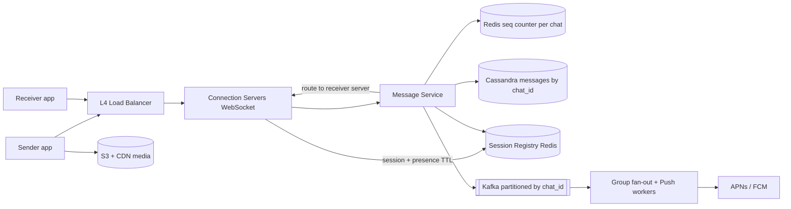
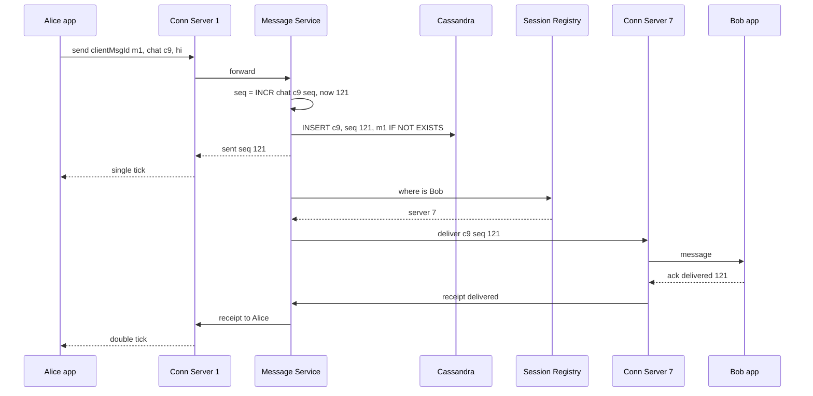

# Design WhatsApp / Messenger

**In one line:** 1:1 and group real-time messages, delivered later if offline, with sent/delivered/read ticks. Core challenges: **reaching the right user across crores of open connections**, **correct order**, and **never losing a message**.

**What the interviewer checks in this question:** WebSocket connections, server-to-server routing, ordering, at-least-once + dedup, offline, group fan-out.

---

## Step 1: Clarify with the interviewer (3–5 min)

| You ask | Typical answer | Effect on design |
|---|---|---|
| "1:1 and group? Max group size?" | Both, max 1000 | Group fan-out on write is fine |
| "Delivery and read receipts?" | Yes, sent/delivered/read | Receipts flow like messages |
| "Offline users?" | Store on server, deliver when online + push | Storage + push service |
| "How long on the server?" | For multi-device sync, or until delivered | Cassandra retention |
| "Media?" | Yes | S3 + CDN, only URL in message |
| "Scale?" | 500M DAU, 50B msgs/day | Lakhs of conns/server, sharded storage |
| "Online/last seen?" | Yes | Heartbeat + Redis TTL |
| "E2E encryption?" | Just mention | Server stores ciphertext, Signal protocol |

> **Say:** "1:1 + group over persistent WebSockets, at-least-once delivery, per-chat ordering, receipts, offline delivery, presence. E2E only mentioned."

## Step 2: Requirements

**Functional**
1. Real-time send/receive in 1:1 and groups (max 1000)
2. Offline users get pending messages when back online, push notification meanwhile
3. Sent / delivered / read ticks and online / last seen
4. Send media (image, video, document)

**Out of scope:** voice/video calls, status/stories, payments, E2E key exchange details.

**Non-functional (in priority order)**
1. **Durability:** never lose a message after the "sent" tick
2. **Ordering:** correct within a chat (not global)
3. **Latency:** online-to-online p99 < 200 ms
4. **Availability:** 99.99%
5. **Scale:** 500M DAU, ~200M concurrent connections, 600K msgs/sec (peak 1.5M)

**CAP choice:** per-chat consistency on message write (sent tick only after a quorum write). Presence, last seen, receipts are AP.

## Step 3: Estimation (only what changes the design)

- Messages: 50B/day ≈ **600K/sec**, peak ~1.5M (Diwali/New Year midnight) → write-heavy store.
- Connections: ~200M online, ~100K–500K per server → **~1,000 connection servers**.
- Storage: 50B × 200 bytes ≈ **10 TB/day** (media separate) → horizontal scale is a must.
- Media: 5% of messages × avg 200 KB → ~500 TB/day → S3 + CDN.
- Async (offline push + group fan-out): ~every other message → **~300K events/sec**, peak ~750K.

> **Say:** "600K msgs/sec + 10 TB/day → Cassandra. 200M open connections → stateful connection servers + routing."

## Step 4: Core entities

- **User**: id, phone, name, devices
- **Chat**: chat_id, type (1:1 / group), members
- **Message**: chat_id, seq_no, message_id (client generated UUID), sender_id, content/ciphertext, media_url, created_at
- **Receipt**: chat_id, user_id, last_delivered_seq, last_read_seq
- **Session**: user_id → connection server id (registry)

## Step 5: APIs

Real-time over WebSocket, the rest REST.

```http
WS   /connect  (auth token)                             → persistent connection

# WebSocket frames (client → server)
send     {clientMsgId, chatId, content, mediaUrl?}
ack      {chatId, seqNo, type: delivered | read}

# WebSocket frames (server → client)
message  {chatId, seqNo, messageId, senderId, content}
sent     {clientMsgId, seqNo}          # server has persisted it, single tick
receipt  {chatId, userId, seqNo, type}

GET  /chats/{chatId}/messages?afterSeq=120&limit=50     → sync after reconnect
POST /media/upload-url   {contentType, size}            → {uploadUrl, mediaUrl}
```

> **Say:** "Every message carries a `clientMsgId`; on retry the same id → server does not store a duplicate (idempotency)."

## Step 6: High-level design

**Simple v1:** one server (WebSockets + Postgres + in-memory `user → connection` map), meets all four FRs. The numbers break it: 200M conns → ~1,000 servers → session registry; 600K writes/sec → Cassandra; 300K async events/sec → Kafka; 500 TB/day media → S3 + CDN.



**FR mapping:** FR1 → Connection Servers + Message Service + Cassandra + registry. FR2 → Kafka + Push workers + `afterSeq` sync. FR3 → receipts table + presence keys in Redis. FR4 → S3 + CDN.

**Why each component** (alternatives in Step 10):
- **L4 LB:** long-lived WebSockets, least-connections.
- **Connection Servers vs Message Service:** connection servers are stateful (deploy = 2 lakh disconnects) → logic lives in the stateless Message Service, deployed without reconnects.
- **Session Registry (Redis):** `user_id → server_id` + presence (TTL 30s), ~200M keys. No separate Presence Service: heartbeat refreshes the key.
- **Redis seq counter:** 600K `INCR`/sec; Cassandra LWT = 4 Paxos round trips.
- **Kafka:** 2 consumer groups (group fan-out, push), replay after a push outage.

## Step 7: Main flow: sending a 1:1 message



Bob offline (not in registry) → message already safe in DB; Kafka event → Push worker → FCM/APNs. When online, `afterSeq` sync.

## Step 8: Data model & DB choice

```sql
-- Cassandra
messages(
  chat_id      PARTITION KEY,
  bucket       PARTITION KEY,   -- month, so one partition does not get too big
  seq_no       CLUSTERING DESC,
  message_id, sender_id, content, media_url, created_at
)
user_chats(user_id PARTITION KEY, last_activity CLUSTERING DESC, chat_id, unread_count)
chat_members(chat_id PARTITION KEY, user_id)
receipts(chat_id PARTITION KEY, user_id, last_delivered_seq, last_read_seq)
```

```text
Redis: session:{user_id} → {server_id, device}  TTL 60s, refreshed by heartbeat
Redis: seq:{chat_id}     → INCR counter
Redis: presence:{user_id} → last_seen  TTL 30s
```

- **Cassandra:** write-heavy; "latest N of a chat" = one sequential read on partition + clustering key. No joins.
- **Redis** for session/presence: ephemeral, TTL, fast.

## Step 9: Deep dives (the interviewer will push here)

### 9.1 How does a message go from one server to another?

**NFR:** delivery p99 < 200 ms, zero message loss.

Alice on server 1, Bob on server 7:
- **Registry + direct RPC (chosen):** Redis `bob → server 7` → direct gRPC. Fast, targeted.
- **Redis Pub/Sub:** each server subscribes to its users' channels (`user:bob`), publisher needs no server info. Fire-and-forget (subscriber down = lost) → persist to DB first.
- Server crash: reconnect to another server, registry updates, `afterSeq` sync.

> **Say:** "Routing is best-effort; durability comes from the DB. If push fails, the client pulls everything after its last seq on reconnect."

**Trade-off:** extra registry hop + stale-entry risk ↔ message goes only to the right server.

### 9.2 Ordering and exactly-once-like behavior

**NFR:** per-chat ordering + durability.

- Each chat has a **monotonic seq_no** (Redis `INCR seq:{chat_id}`, or a counter on the chat's owner shard). No global ordering needed.
- Do not trust client timestamps (clocks differ).
- **At-least-once + dedup:** server does `IF NOT EXISTS` on `clientMsgId`, receiver ignores duplicate `message_id` → looks exactly-once.
- Seq gap (122 after 120) → receiver fetches 121.

**Trade-off:** `INCR` + conditional insert per message ↔ simple ordering + gap detection.

### 9.3 Receipts, offline users and push

**NFR:** offline messages durable, receipts cheap (AP).

- **Sent (1 tick):** persisted in DB.
- **Delivered (2 ticks):** receiver device acks → `receipts.last_delivered_seq`.
- **Read (blue):** chat opened → `last_read_seq`. No per-message row, just "read up to seq", cheap.
- **Offline:** Kafka → Push worker → FCM/APNs. When online, unread chats from `user_chats` + `afterSeq` sync.
- **Multi-device:** registry has every device, deliver to all; each device keeps its own last seq.

**Trade-off:** no per-message receipt history ↔ ~1 row per user per chat.

### 9.4 Group chat fan-out, presence, media

**NFR:** group delivery latency + presence fan-out under control.

- **Group (max 1000):** store one copy (chat_id = group_id), **fan-out on write** delivery: Kafka worker (by chat_id → order) pushes to online members, notifies offline ones. 1 lakh+ channels: pull.
- Group read receipts: "read by 45 of 120", each member's last_read_seq.
- **Presence:** heartbeat 20–30 sec → `presence:{user}` TTL 30s. Push only to open chats, not the whole contact list (fan-out explosion).
- **Media:** pre-signed URL → S3, message has `mediaUrl` + thumbnail, download via CDN.
- **E2E:** Signal protocol, keys only on devices; server only stores/routes ciphertext.

**Trade-off:** 1000-member group = 1000 deliveries ↔ one copy in storage.

## Step 10: Decision table (what we chose, why, and what we did not)

| Decision | Why we chose it | What we did not choose, and why |
|---|---|---|
| **WebSocket** | Bidirectional, low latency, one connection | **Long polling:** request per message. **SSE:** server → client only. Sacrifice: stateful servers, reconnect storms |
| **Session registry + direct routing** | Targeted delivery, presence lives here too | **Broadcast:** 1000x waste. **Pub/Sub only:** no durability. Sacrifice: stale entry → push fallback |
| **Cassandra by chat_id** | 600K writes/sec, history sorted in one partition | **Postgres:** hard to shard. **MongoDB:** works, wide-column more natural. Sacrifice: no joins, separate chat list table |
| **Per-chat seq_no via Redis INCR** | Ordering + gap detection, 600K/sec | **Client timestamps:** skew. **Global seq:** bottleneck. **LWT:** slow. Sacrifice: seq can repeat on failover |
| **At-least-once + clientMsgId dedup** | Never lost, duplicates hidden | **At-most-once:** loss. **True exactly-once:** expensive. Sacrifice: dedup logic on both sides |
| **Kafka (by chat_id) for fan-out + push** | 300K events/sec, per-chat order, replay | **SQS:** no ordering. **Sync fan-out:** slow sender ack. Sacrifice: Kafka ops |
| **S3 + CDN for media** | 500 TB/day off chat servers | **Media over WebSocket:** servers choke. Sacrifice: extra upload step |

## Step 11: Failures & bottlenecks

| What failed | What happens | How to handle |
|---|---|---|
| Connection server crash | 2 lakh disconnects | Backoff + jitter reconnect, `afterSeq` sync |
| Reconnect storm | All clients at once | Jitter, gradual drain, LB conn limits |
| Stale session registry | Message to wrong server | "User not here" → treat as offline, send push |
| Cassandra node down | Writes on that partition | RF=3, QUORUM writes |
| Push provider slow | Notification late | Kafka retry; message safe in DB |
| Hot group (1000, very active) | Load on fan-out workers | Partition by chat_id, scale workers, batch delivery |

## Step 12: How to make it better (say this yourself at the end)

- **Multi-region:** home region, connect at nearest edge, async cross-region replication
- **Retention tiers:** delivered + 30-day-old messages to cold storage (or deleted from server in E2E mode)
- **Large channels** (1 lakh+): pull model + CDN-cached messages
- **Graceful drain** on deploys to avoid reconnect storms

## Step 13: Likely follow-up questions

- "Can a message get lost?" → persist to DB first, then sent tick; delivery fails → reconnect sync
- "Ordering?" → server assigns per-chat seq_no, client sorts by seq
- "3 devices?" → all three in registry, deliver to all, each keeps its last seq
- "Redis seq counter down?" → replica failover, or seq from Cassandra LWT / chat shard owner
- "Read receipt per message?" → no, only `last_read_seq` per user per chat
- "E2E groups?" → sender keys, an encrypted key per member; details out of scope
- **Senior signal:** on async replica failover some `INCR`s can be lost → same seq again. If `IF NOT EXISTS` on (chat_id, seq) fails, take a new seq, else overwrite.

## 2-minute recap

> WebSockets → stateful connection servers; Redis registry: which user is on which server. Message Service: per-chat seq_no → Cassandra (`chat_id` + `seq_no`, clientMsgId dedup) → sent tick → receiver's server. Ack → delivered, open → read (last seq only). Offline: Kafka → FCM/APNs, `afterSeq` sync on reconnect. Groups: one copy, fan-out on write. Presence: heartbeat + TTL. Media S3 + CDN. E2E: server sees only ciphertext.

## Checklist

- [ ] I can ask the clarifying questions (group size, receipts, offline, media, scale)
- [ ] I can draw the HLD diagram (connection servers, registry, message service, Cassandra) in 5 min
- [ ] I can tell 2 options for routing from one server to another
- [ ] I can explain ordering and gap detection with per-chat seq_no
- [ ] I can explain at-least-once + clientMsgId dedup
- [ ] I can tell the sent / delivered / read and offline + push flow
- [ ] I can justify the Cassandra partition/clustering key
- [ ] I can say 3 trade-offs from the decision table without notes
