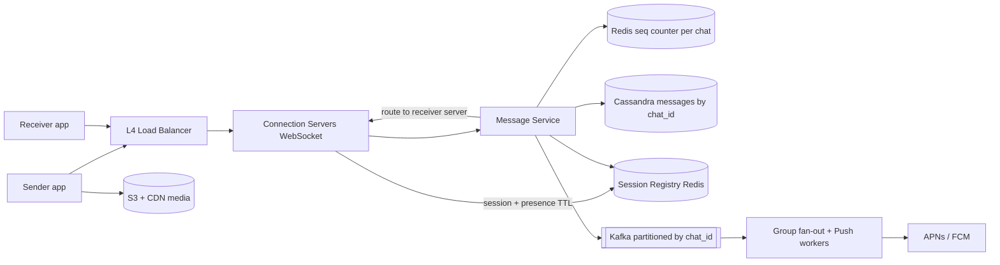
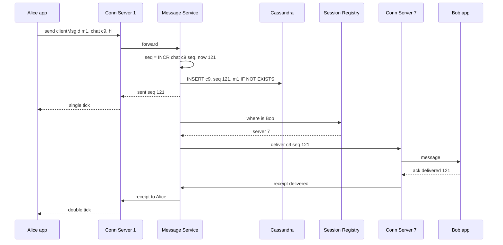

# Design WhatsApp / Messenger

**In one line:** users send real-time messages 1:1 and in groups, get them later if they were offline, and see sent/delivered/read ticks. The core challenges are **delivering a message to the right user across crores of open connections**, **keeping the order correct**, and **never losing a message**.

**What the interviewer checks in this question:** WebSocket connection management, routing between servers, message storage + ordering, delivery guarantees (at-least-once + dedup), offline handling, and group fan-out.

---

## Step 1: Clarify with the interviewer (3–5 min)

Ask these questions before you start the design:

| You ask | Typical answer | Effect on design |
|---|---|---|
| "Both 1:1 and group? Max group size?" | Both, group max 1000 | Group fan-out on write is fine |
| "Do we need delivery receipts and read receipts?" | Yes, sent/delivered/read | Receipts also flow like messages |
| "How does an offline user get the message?" | Stored on the server, delivered as soon as they come online + push notification | Persistent storage + push service |
| "Do messages stay on the server forever?" | Yes for multi-device sync, or until delivered | Retention policy in Cassandra |
| "Sending media (photo/video)?" | Yes | S3 + CDN, only the URL in the message |
| "Scale?" | 500M DAU, 50B messages/day | Lakhs of connections per server, sharded storage |
| "Online/last seen presence?" | Yes | Heartbeat + Redis TTL |
| "Do we need to design E2E encryption?" | Only mention it | Server stores ciphertext, Signal protocol |

> **Say:** "I will design 1:1 and group messaging with persistent WebSocket connections, at-least-once delivery, per-chat ordering, receipts, offline delivery and presence. I will only mention E2E encryption."

## Step 2: Requirements

**Functional**
1. Users should be able to send and receive real-time messages in 1:1 and group (max 1000) chats
2. Offline users should get all pending messages when they come online, plus a push notification in between
3. Users should be able to see sent / delivered / read ticks and online / last seen
4. Users should be able to send media (image, video, document)

**Out of scope:** voice/video calls, status/stories, payments, E2E key exchange details.

**Non-functional (in priority order)**
1. **Durability:** once the "sent" tick shows, the message must never be lost
2. **Ordering:** correct order within a chat (not global)
3. **Latency:** online-to-online delivery p99 < 200 ms
4. **Availability:** 99.99%
5. **Scale:** 500M DAU, ~200M concurrent connections, 600K msgs/sec (peak 1.5M)

**CAP choice:** per-chat consistency on message write (sent tick only after a quorum write). Presence, last seen and receipts are AP: slightly stale is fine.

## Step 3: Estimation (only what changes the design)

- Messages: 50B/day ≈ **600K msgs/sec**, peak ~1.5M/sec (Diwali/New Year midnight). We need write-heavy storage.
- Concurrent connections: ~200M online. One server holds ~100K–500K WebSocket connections → **~1,000 connection servers**.
- Storage: 50B × 200 bytes ≈ **10 TB/day** (media separate). Years of data, so horizontal scale is a must.
- Media: 5% of messages are media, avg 200 KB → ~500 TB/day. S3 + CDN is the only option.
- Async work (offline push + group fan-out): assume ~every second message → **~300K events/sec**, peak ~750K.

> **Say:** "600K messages/sec and 10 TB/day means a write-optimized, horizontally scalable store, so Cassandra. And for 200M open connections we need stateful connection servers with routing between them."

## Step 4: Core entities

- **User**: id, phone, name, devices
- **Chat**: chat_id, type (1:1 / group), members
- **Message**: chat_id, seq_no, message_id (client generated UUID), sender_id, content/ciphertext, media_url, created_at
- **Receipt**: chat_id, user_id, last_delivered_seq, last_read_seq
- **Session**: user_id → connection server id (registry)

## Step 5: APIs

Everything real-time goes over WebSocket, the rest is REST.

```http
WS   /connect  (auth token)                             → persistent connection

# WebSocket frames (client → server)
send     {clientMsgId, chatId, content, mediaUrl?}
ack      {chatId, seqNo, type: delivered | read}

# WebSocket frames (server → client)
message  {chatId, seqNo, messageId, senderId, content}
sent     {clientMsgId, seqNo}          # server has persisted it, single tick
receipt  {chatId, userId, seqNo, type}

GET  /chats/{chatId}/messages?afterSeq=120&limit=50     → sync after reconnect
POST /media/upload-url   {contentType, size}            → {uploadUrl, mediaUrl}
```

> **Say:** "The client sends a `clientMsgId` with every message. If the same id comes again on a network retry, the server does not store a duplicate. This is idempotency."

## Step 6: High-level design

**Start with a simple v1:** one server holding all WebSockets, a Postgres `messages` table, and an in-memory `user → connection` map. At small scale this meets all four FRs. The numbers break it: 200M connections → ~1,000 connection servers, hence a session registry; 600K writes/sec → Cassandra; ~300K async events/sec with per-chat order → Kafka; 500 TB/day of media → S3 + CDN.



**FR mapping:** FR1 → Connection Servers + Message Service + Cassandra + registry. FR2 → Kafka + Push workers + `afterSeq` sync. FR3 → receipts table + presence keys in Redis. FR4 → S3 + CDN.

**Why each component:**
- **L4 Load Balancer:** for long-lived TCP/WebSocket connections. Least-connections routing
- **Separate Connection Servers + Message Service:** connection servers are stateful, and a deploy disconnects 2 lakh users, so they hold no business logic. Logic lives in the stateless Message Service, which deploys without reconnects
- **Session Registry (Redis):** `user_id → server_id`, and presence keys live here too (TTL 30s). ~200M keys, a lookup on every message. **We do not build a separate Presence Service**: the connection server refreshes the key on each heartbeat
- **Redis seq counter:** 600K `INCR`/sec. Cassandra LWT (simpler, one store) takes 4 Paxos round trips and will not keep up at this rate
- **Cassandra:** 600K writes/sec, 10 TB/day, and the query is always "latest N of one chat". Postgres (simpler) is a sharding nightmare at this rate
- **Kafka:** ~300K events/sec (peak 750K), group delivery needs per-chat order (partition by chat_id), two consumer groups (group fan-out, push), and replay after a push provider outage. SQS (simpler) does not give ordering at this throughput
- **S3 + CDN:** direct media upload, only a link in the message

## Step 7: Main flow: sending a 1:1 message



If Bob is offline (no entry in the registry), the message is already safe in the DB. The Message Service puts an event on Kafka, and a Push worker sends a notification via FCM/APNs. When Bob comes online, he syncs with `afterSeq`.

## Step 8: Data model & DB choice

```sql
-- Cassandra
messages(
  chat_id      PARTITION KEY,
  bucket       PARTITION KEY,   -- month, so one partition does not get too big
  seq_no       CLUSTERING DESC,
  message_id, sender_id, content, media_url, created_at
)
user_chats(user_id PARTITION KEY, last_activity CLUSTERING DESC, chat_id, unread_count)
chat_members(chat_id PARTITION KEY, user_id)
receipts(chat_id PARTITION KEY, user_id, last_delivered_seq, last_read_seq)
```

```text
Redis: session:{user_id} → {server_id, device}  TTL 60s, refreshed by heartbeat
Redis: seq:{chat_id}     → INCR counter
Redis: presence:{user_id} → last_seen  TTL 30s
```

- **Cassandra** because: very high writes, and the query is always "latest N messages of one chat", which is one sequential read with the partition + clustering key. No joins/transactions needed.
- **Redis** for session and presence: ephemeral, TTL based, fast.

## Step 9: Deep dives (the interviewer will push here)

### 9.1 How does a message go from one server to another?

**NFR:** delivery p99 < 200 ms, and zero message loss.

Alice is on server 1, Bob is on server 7. Two options:
- **Session registry + direct RPC (chosen):** Redis has `bob → server 7`. The Message Service makes a gRPC call directly to server 7. Fast and targeted.
- **Redis Pub/Sub:** each connection server subscribes to the channels of its users (`user:bob`). The publisher does not need to know the server. Simple, but Pub/Sub is fire-and-forget (subscriber down = message lost), so the DB persist must happen first.
- Server crash: its users reconnect to another server and the registry gets updated. Missed messages come back through `afterSeq` sync.

> **Say:** "Routing is best-effort, and durability comes from the DB. Even if the real-time push fails, the client pulls messages after its last seq on reconnect. So a message is never lost."

**Trade-off:** one extra hop for the registry lookup and a risk of stale entries, in exchange for sending the message only to the right server.

### 9.2 Ordering and exactly-once-like behavior

**NFR:** per-chat ordering + durability.

- Each chat has its own **monotonic seq_no** (Redis `INCR seq:{chat_id}`, or a counter on the chat's owner shard). We do not need global ordering, only per chat.
- Do not trust client timestamps, clocks differ.
- **At-least-once delivery + dedup:** the client sends `clientMsgId`, and the server dedups with `IF NOT EXISTS`. The receiver ignores duplicates by `message_id`. Result: the user sees exactly-once-like behavior.
- If the receiver sees a seq gap (122 after 120), it fetches 121.

**Trade-off:** the cost of one Redis `INCR` + a conditional insert per message, in exchange for simple ordering and gap detection.

### 9.3 Receipts, offline users and push

**NFR:** offline users' messages are durable, receipts are cheap (AP).

- **Sent (1 tick):** the server persisted it in the DB.
- **Delivered (2 ticks):** the receiver device sent an ack. Update `receipts.last_delivered_seq`.
- **Read (blue ticks):** the receiver opened the chat. Update `last_read_seq`. No separate row per message, only "read up to this seq", so it is cheap.
- **Offline:** user not in the registry → Kafka → Push worker → FCM/APNs notification ("Alice: hi"). As soon as they come online, the client syncs unread chats from `user_chats` and `afterSeq` for each chat.
- **Multi-device:** the registry has an entry per device, and we deliver to all. Each device remembers its own last seq.

**Trade-off:** no per-message receipt history, in exchange for receipt writes of ~1 row per user per chat.

### 9.4 Group chat fan-out, presence, media

**NFR:** group delivery latency and presence fan-out under control.

- **Group (max 1000):** the message is stored once in the `messages` table (chat_id = group_id). Then delivery is **fan-out on write**: a Kafka worker (partitioned by chat_id, so group order holds) takes the member list, pushes to the server of each online member, and sends notifications to offline ones. One copy in storage, N deliveries.
- For very large groups/channels (1 lakh+), use a pull model: members fetch by themselves.
- Group read receipts: aggregate "read by 45 of 120", from each member's last_read_seq.
- **Presence:** the client sends a heartbeat every 20–30 sec, and the connection server sets Redis `presence:{user}` with TTL 30s. Push presence only to users who have that chat open right now, not the whole contact list (otherwise fan-out explodes).
- **Media:** the client uploads directly to S3 with a pre-signed URL, and the message has only `mediaUrl` + a thumbnail. Download from the CDN.
- **E2E encryption:** Signal protocol, keys only on devices. The server only stores and routes ciphertext, it cannot read the content.

**Trade-off:** a 1000-member group = 1000 deliveries per message, in exchange for a single copy in storage.

## Step 10: Decision table (what we chose, why, and what we did not)

| Decision | Why we chose it | What we did not choose, and why |
|---|---|---|
| **WebSocket** | Bidirectional, low latency, send + receive on one connection | **Long polling:** a new request per message. **SSE:** server → client only. Sacrifice: stateful servers, reconnect storms to handle |
| **Session registry (Redis) + direct routing** | Targeted delivery, presence lives here too | **Broadcast to all servers:** 1000x waste. **Pub/Sub only:** no durability. Sacrifice: a miss on a stale entry, push fallback |
| **Cassandra by chat_id** | 600K writes/sec, chat history sorted in one partition | **Postgres:** sharding is hard at this rate. **MongoDB:** could work, but the wide-column pattern is natural. Sacrifice: no joins/transactions, chat list in a separate table |
| **Per-chat seq_no via Redis INCR** | Simple ordering, gap detection, 600K/sec | **Client timestamps:** clock skew. **Global sequence:** bottleneck. **Cassandra LWT:** slow. Sacrifice: a seq can repeat on failover, checked at insert |
| **At-least-once + clientMsgId dedup** | A message is never lost, duplicates are hidden | **At-most-once:** messages can be lost. **True exactly-once:** very expensive. Sacrifice: dedup logic on both client and server |
| **Kafka (by chat_id) for group fan-out + push** | ~300K events/sec, per-chat order, 2 consumer groups, replay | **SQS:** no ordering at this rate. **Sync fan-out in Message Service:** slows the sender's ack. Sacrifice: Kafka cluster ops |
| **S3 + CDN for media** | 500 TB/day of bandwidth stays off chat servers | **Media over WebSocket:** connection servers choke. Sacrifice: an extra upload step |

## Step 11: Failures & bottlenecks

| What failed | What happens | How to handle |
|---|---|---|
| Connection server crash | Its 2 lakh users disconnect | Client reconnects with exponential backoff + jitter, missed messages via `afterSeq` sync |
| Reconnect storm (server restart) | All clients come back at once | Jitter, gradual drain before deploy, LB connection limits |
| Session registry stale | Message goes to the wrong server | If the server says "user not here", treat as offline and send a push notification |
| Cassandra node down | Writes on that partition | RF=3, QUORUM writes, one node down makes no difference |
| Push provider slow | Notification is late | Kafka retry, the message is safe in the DB anyway |
| Hot group (1000 members, very active) | Load on fan-out workers | Kafka partition by chat_id, scale workers, batch delivery |

## Step 12: How to make it better (say this yourself at the end)

> "If I had more time, I would improve these:"
- **Multi-region:** each user has a home region, connections go to the nearest edge, cross-region messages are replicated async
- **Message retention tiers:** delivered messages older than 30 days go to cold storage (or are deleted from the server in E2E mode)
- **Large channels** (1 lakh+): a pull-based model and CDN-cached messages
- Deploy connection servers with **graceful drain**, so there is no reconnect storm

## Step 13: Likely follow-up questions

- "Will a message ever get lost?" → Persist in the DB first, then send the sent tick. If delivery fails, reconnect sync covers it
- "How do you guarantee ordering?" → The server assigns a per-chat seq_no, and the client sorts by seq
- "A user is on 3 devices?" → All three are in the registry, deliver to all, each device has its own last seq
- "What if the Redis seq counter is down?" → Replica failover. Or assign seq with Cassandra LWT / the chat's shard owner
- "Will you store a read receipt for every message?" → No, only `last_read_seq` per user per chat
- "How do groups work with E2E?" → Sender keys, an encrypted key for each member. Details are out of scope
- **Senior signal:** raise it yourself: if the Redis seq counter fails over to an async replica, some `INCR`s can be lost and the same seq can be handed out again. If the insert `IF NOT EXISTS` on (chat_id, seq) fails, take a new seq, otherwise two messages overwrite each other on one seq.

## 2-minute recap

> Clients stay connected over WebSocket to stateful connection servers (L4 LB, ~2 lakh connections per server). The session registry (Redis) tells which user is on which server. When a message arrives, the Message Service assigns a per-chat seq_no, persists it in Cassandra with `chat_id` partition + `seq_no` clustering (dedup by clientMsgId), sends the sent tick to the sender, then routes it to the receiver's server. When the receiver acks, it is delivered, and when they open the chat, it is read (only the last seq is stored). For offline users: Kafka → push worker → FCM/APNs, and `afterSeq` sync on reconnect. Kafka because there are ~300K async events/sec, per-chat order (partition by chat_id) and two consumers. Groups store one copy, delivery is fan-out on write. Presence uses heartbeat + Redis TTL, no separate service. Media goes to S3 + CDN. E2E uses the Signal protocol, and the server only routes ciphertext.

## Checklist

- [ ] I can ask the clarifying questions (group size, receipts, offline, media, scale)
- [ ] I can draw the HLD diagram (connection servers, registry, message service, Cassandra) in 5 min
- [ ] I can tell 2 options for routing from one server to another
- [ ] I can explain ordering and gap detection with per-chat seq_no
- [ ] I can explain at-least-once + clientMsgId dedup
- [ ] I can tell the sent / delivered / read and offline + push flow
- [ ] I can justify the Cassandra partition/clustering key
- [ ] I can say 3 trade-offs from the decision table without notes
