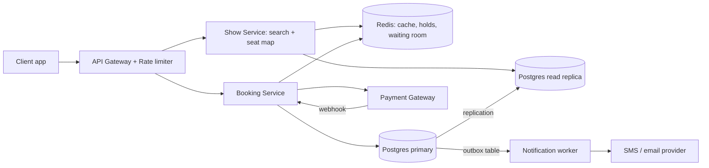
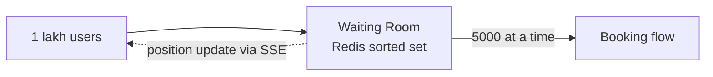

# Design BookMyShow / Ticketmaster

**In one line:** find a movie/event, pick seats, pay. Core challenge: **one seat must never sell to two people**, and big launches must not crash the system.

**What the interviewer checks in this question:** contention (locks), consistency vs availability, peak traffic (Avengers first-day-first-show).

---

## Step 1: Clarify with the interviewer (3–5 min)

| You ask | Typical answer | Effect on design |
|---|---|---|
| "Search, seats, booking in scope? Payment third-party?" | Yes | No payment internals |
| "How long is a seat hold? 10 min?" | Yes, 10 min | Redis TTL = 10 min |
| "Zero double booking → consistency > availability?" | Yes | SQL + locks |
| "Slightly stale search/browse OK?" | Yes | Read replica + cache, eventual |
| "Scale? Peak?" | ~10M DAU, 1 lakh+ at once on a popular show | Virtual waiting queue |
| "Recommendations, reviews, food?" | No | Out of scope |

> **Say:** "3 flows: search, seat map, book seats. Strong consistency for booking, availability + low latency for search."

## Step 2: Requirements

**Functional**
1. Search shows by city/movie/date
2. See a show's seat map (which seats are free)
3. Hold seats for 10 min → confirm with payment → ticket notification

**Out of scope:** payment internals, recommendations, reviews, food, dynamic pricing.

**Non-functional (in priority order)**
1. **No double booking:** one seat = one booking (strong consistency)
2. **Availability:** search and browse 99.99%
3. **Latency:** search p99 < 500 ms, hold p99 < 200 ms
4. **Scale:** 10M DAU, ~100:1 read/write, 1 lakh users/min on one show at launch

**CAP choice:** booking is CP: Postgres primary down → error, better than double booking. Search + seat map AP; final check at booking.

## Step 3: Estimation (only what changes the design)

- Reads: 10M DAU × ~10 = **100M/day ≈ 1,200 QPS**, peak 10x ≈ 12K → cache needed.
- Bookings: ~1M/day ≈ **12/sec** → one SQL DB is enough.
- Launch: 1 lakh users, one show, one minute. **This is the real problem**, not the average.
- Small catalog (a few thousand movies, ~1 lakh shows/day), structured filters → Postgres index + cache.

> **Say:** "The problem is not throughput; it is contention on one seat and a sudden spike."

## Step 4: Core entities

- **Event/Movie**: id, name, duration, language
- **Venue**: id, city, screens
- **Show**: id, event_id, venue_id, start_time
- **Seat**: show_id, seat_id, price_tier, status
- **Booking**: id, user_id, show_id, seat_ids, status (`PENDING`, `CONFIRMED`, `CANCELLED`), payment_id, idempotency_key

## Step 5: APIs

```http
GET  /shows?city=pune&movie=123&date=2026-10-10     → list of shows
GET  /shows/{showId}/seats                          → seat map + status
POST /bookings/hold   {showId, seatIds}             → {holdId, expiresAt}
POST /bookings/confirm {holdId, paymentToken}       → {bookingId, status}
     Header: Idempotency-Key: <uuid>
```

> **Say:** "Separate hold and confirm APIs: blocking a seat and paying are two steps, up to 10 min apart."

## Step 6: High-level design

**Simple v1:** one service + Postgres (indexed query, seat status column, booking in one txn); meets the FRs at 12 bookings/sec. It breaks on: 12K peak reads → Redis + read replica; 1 lakh users on one show → Redis holds + waiting room (no row lock contention); sending tickets must not slow booking → outbox + worker.



**FR mapping:** FR1 + FR2 → Show Service + Redis + read replica. FR3 → Booking Service + Redis holds + Postgres primary + outbox worker.

**Why each component** (alternatives in Step 10):
- **API Gateway:** auth, rate limit, bots.
- **Show vs Booking Service:** reads ~100x + AP, booking CP (all consistency lives here); scale separately.
- **`pg_trgm`:** handles typos like "avengr".
- **Redis:** holds + waiting room + cache.
- **Outbox + worker:** outbox row in the booking txn, worker sends SMS/email with retries; solves dual-write.

## Step 7: Main flow: booking a seat


## Step 8: Data model & DB choice

```sql
bookings(id PK, user_id, show_id, status, payment_id, idempotency_key UNIQUE, created_at)
booking_seats(booking_id, show_id, seat_id, UNIQUE(show_id, seat_id))
```

```sql
outbox(id PK, booking_id, type, payload, status, created_at)   -- written in the same transaction
```

`UNIQUE(show_id, seat_id)` is the most important line: the DB itself blocks double booking.

## Step 9: Deep dives (the interviewer will push here)

### 9.1 How will you stop double booking?

**NFR:** no double booking (strong consistency).

Two layers:
1. **Redis hold** (`SET NX PX`): fast, temporary, auto-expires in 10 min.
2. **DB unique constraint:** final truth. Even if Redis crashes or a late payment arrives after hold expiry, no two bookings.

> Payment succeeds but DB insert fails (seat taken) → **auto refund**. Raise this edge case yourself, strong signal.

**Trade-off:** state in two places + rare refund path ↔ fast holds + guaranteed correctness in the DB.

### 9.2 Avengers launch: 1 lakh people, 1 minute

**NFR:** availability and hold p99 < 200 ms even in a spike.

- **Virtual waiting queue:** token + Redis sorted set; ~5,000 let in at a time, rest see "you are #2,341 in line".
- Seat map from **CDN/Redis cache**, not the DB.
- Per-user rate limit + CAPTCHA at the gateway (bots).



**Trade-off:** users wait ↔ no crash + fair FIFO.

### 9.3 How does the seat map stay live?

**NFR:** availability, slightly stale is fine (AP).

- Simple: 5 sec polling, cheap from cache.
- Better: **SSE/WebSocket** push on hold, only for popular shows.

**Trade-off:** 5 sec stale map ↔ simple, cheap.

### 9.4 No double charge on payment

**NFR:** exactly-once-like charge, even after retries.

- **Idempotency-Key** on every confirm; key seen before → return the old result.
- Webhooks can duplicate too → `payment_id` unique.

**Trade-off:** store idempotency keys ↔ safe retries.

## Step 10: Decision table (what we chose, why, and what we did not)

| Decision | Why we chose it | What we did not choose, and why |
|---|---|---|
| **Postgres** for bookings | ACID + unique constraint, ~12 writes/sec | **Cassandra/DynamoDB:** weak multi-row txns. Sacrifice: single primary, failover pauses booking a few sec |
| **Redis TTL** for seat hold | Thousands of holds/sec, atomic `NX`, auto-release | **DB `held_until`:** lock contention on same rows. Sacrifice: Redis down = holds lost (DB safe) |
| **No pessimistic lock** | Cannot hold a DB lock for 10 min | `SELECT FOR UPDATE` → connections run out. Sacrifice: rare refund |
| **Postgres + `pg_trgm` + cache** for search | Structured filters, small catalog | **Elasticsearch:** CDC + extra cluster, lag. **LIKE:** no typos. Sacrifice: basic ranking |
| **Outbox + worker** for notifications | ~12/sec, atomic with booking, retries | **Kafka:** overkill, one consumer. **Sync call:** slow SMS = slow booking. Sacrifice: polling delay |
| **Virtual queue** at peak | Load control, fair FIFO | **Autoscaling only:** slow, DB/locks still bottleneck. Sacrifice: users wait |

## Step 11: Failures & bottlenecks

| What failed | What happens | How to handle |
|---|---|---|
| Redis down | Holds lost | DB constraint still blocks; Redis replica + sentinel |
| Payment webhook missed | Money taken, booking PENDING | Reconciliation job asks gateway every 5 min |
| Booking service crash | In-flight fail | Stateless replicas; retry safely with idempotency key |
| Hot show | All load on one show | Waiting room + cache |
| Notification worker down | Ticket SMS late | Outbox rows stay pending, retried later; booking safe |

## Step 12: How to make it better (say this yourself at the end)

- Fully live seat map via **WebSocket**
- **Multi-region:** search in every region, booking in one primary region (consistency)
- **Elasticsearch when** full-text + relevance ranking over events, artists, venues is needed

## Step 13: Likely follow-up questions

- "Redis lock vs DB lock, why both?" → Step 9.1
- "No payment in 10 min?" → TTL expires, seat free, booking `CANCELLED`
- "Payment succeeded, seat taken?" → auto refund
- "Group of 6 seats?" → hold all atomically in one Lua script; one fails → release all
- "Stale search?" → acceptable, final check at booking
- **Senior signal:** hold TTL vs payment race: slow gateway → hold expires → seat goes to someone else → late payment. DB constraint blocks it, but auto refund + payment window < hold TTL are needed.

## 2-minute recap

> Read-heavy, booking strongly consistent. Show Service (replica + Redis, `pg_trgm`, no ES) + Booking Service. Hold (Redis `SET NX PX 10min`) → confirm (Postgres txn, `UNIQUE(show_id, seat_id)`), safe even if Redis fails. Payment: idempotency key + reconciliation. Peak: virtual queue + rate limit + cached seat map. Notifications: outbox + worker (no Kafka).

## Checklist

- [ ] I can ask the interviewer the clarifying questions without notes
- [ ] I can explain the 2-step hold + confirm flow
- [ ] I can draw the HLD diagram in 5 min
- [ ] I can explain both layers against double booking (Redis + DB constraint)
- [ ] I can explain the virtual queue for peak traffic
- [ ] I can tell how the idempotency key and payment reconciliation work
- [ ] I can say 3 trade-offs from the decision table without notes
