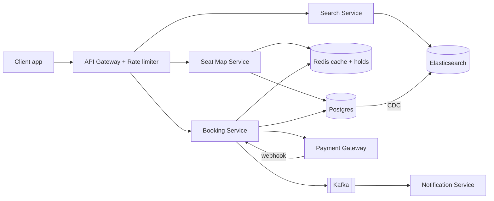
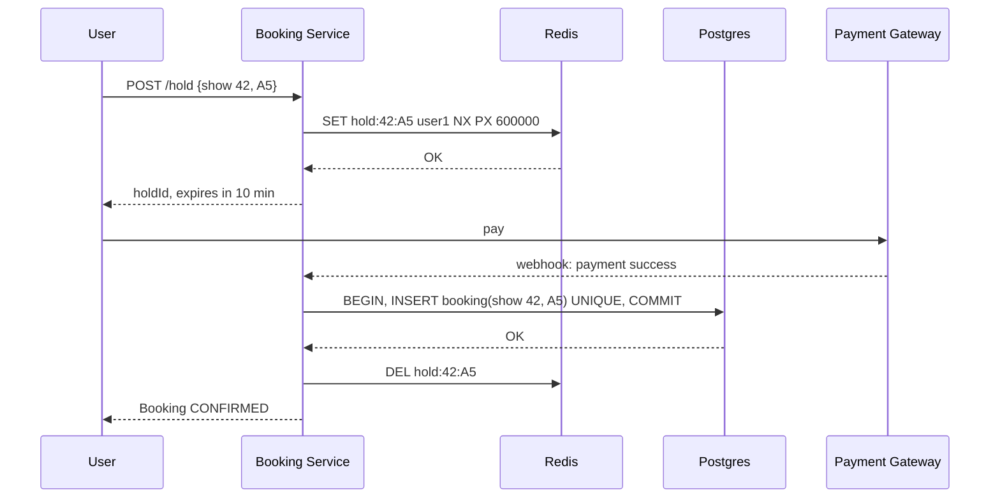
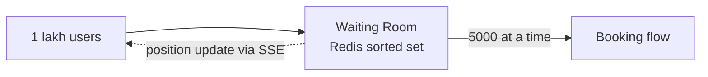

# Design BookMyShow / Ticketmaster

**In one line:** users search for a movie/event, pick seats, and pay. The core challenge is that **one seat must never be sold to two people**, and the system must not crash during big launches.

**What the interviewer checks in this question:** handling contention (locks), the consistency vs availability trade-off, and peak traffic (the first-day-first-show of Avengers).

---

## Step 1: Clarify with the interviewer (3–5 min)

Ask these questions before you start the design:

| You ask | Typical answer | Effect on design |
|---|---|---|
| "Are search, seat selection and booking in scope? Can I assume payment is a third-party gateway?" | Yes | No need to design payment internals |
| "How long is a seat hold? 10 min?" | Yes, 10 min | Redis TTL = 10 min |
| "Double booking is never allowed, so consistency > availability on the booking path?" | Yes | Strong consistency for booking (SQL + locks) |
| "Is slightly stale data OK in search and browse?" | Yes | Cache/Elasticsearch for search, eventual consistency |
| "What is the scale? Peak traffic?" | ~10M DAU, 1 lakh+ people at once on a popular show | We need a virtual waiting queue |
| "Are recommendations, reviews, food ordering in scope?" | No | Say they are out of scope |

> **Say:** "So I will design 3 core flows: search events, view seat map, and book seats. I will keep strong consistency for booking, and availability + low latency for search."

## Step 2: Requirements

**Functional**
1. A user can search shows by city/movie/date
2. A user can see the seat map of a show (which seats are free)
3. A user can select seats and hold them for 10 min
4. After payment the booking is confirmed, and a ticket notification is sent

**Non-functional**
- **Consistency:** one seat, only one booking (most important)
- **Availability:** search and browse must always work (99.99%)
- **Low latency:** search < 500ms
- **Scale:** read-heavy (100 people look, 1 books), and spiky traffic

## Step 3: Estimation (only what changes the design)

- 10M DAU, each user does ~10 searches/browses → **100M reads/day ≈ 1,200 QPS** avg, peak 10x ≈ 12K QPS. So a cache is needed.
- Bookings: ~1M/day ≈ **12 bookings/sec** avg. The write load is small, one SQL DB can handle it.
- Popular launch: 1 lakh users on the same show in one minute. **This is the real problem**, not the average.

> **Say:** "The average write load is small, so throughput is not the problem. The problem is contention on the same seat and the sudden spike."

## Step 4: Core entities

- **Event/Movie**: id, name, duration, language
- **Venue**: id, city, screens
- **Show**: id, event_id, venue_id, start_time
- **Seat**: show_id, seat_id, price_tier, status
- **Booking**: id, user_id, show_id, seat_ids, status (`PENDING`, `CONFIRMED`, `CANCELLED`), payment_id, idempotency_key

## Step 5: APIs

```http
GET  /shows?city=pune&movie=123&date=2026-10-10     → list of shows
GET  /shows/{showId}/seats                          → seat map + status
POST /bookings/hold   {showId, seatIds}             → {holdId, expiresAt}
POST /bookings/confirm {holdId, paymentToken}       → {bookingId, status}
     Header: Idempotency-Key: <uuid>
```

> **Say:** "Hold and confirm are separate APIs, because blocking a seat and paying are two separate steps, and there can be a 10 min gap between them."

## Step 6: High-level design



**Why each component:**
- **API Gateway:** auth, rate limiting, stopping bots
- **Search Service + Elasticsearch:** text search (even a typo like "avengr" works), filters. Stays in sync with the DB through CDC.
- **Seat Map Service:** read-heavy. Combines seats from the DB + holds from Redis and shows them.
- **Booking Service:** hold + confirm. All the consistency work happens here.
- **Kafka → Notification:** ticket SMS/email goes async, so the booking response is not slowed down.

## Step 7: Main flow: booking a seat



## Step 8: Data model & DB choice

```sql
bookings(id PK, user_id, show_id, status, payment_id, idempotency_key UNIQUE, created_at)
booking_seats(booking_id, show_id, seat_id, UNIQUE(show_id, seat_id))
```

`UNIQUE(show_id, seat_id)` is the most important line. With it, the DB itself stops double booking.

## Step 9: Deep dives (the interviewer will push here)

### 9.1 How will you stop double booking?
Two layers:
1. **Redis hold** (`SET NX PX`): fast, temporary, auto-expires after 10 min.
2. **DB unique constraint:** the final truth. Even if Redis crashes, or a late payment arrives after the hold expired, the DB will not allow two bookings.

> If the payment succeeded but the DB insert failed (someone else took the seat), trigger an **auto refund**. This is a rare edge case, and mentioning it sends a strong signal.

### 9.2 Avengers launch: 1 lakh people, 1 minute
- **Virtual waiting queue:** give users a token and put them in line in a Redis sorted set. Let ~5,000 users in at a time. Show the rest "you are #2,341 in line".
- Serve the seat map from a **CDN/Redis cache**, so every request does not hit the DB.
- Per-user rate limit + CAPTCHA at the gateway, so bots stay out.



### 9.3 How does the seat map stay live?
- Simple: poll every 5 sec. It is read-heavy, but cheap with a cache.
- Better: push seat status over **SSE/WebSocket** when someone places a hold. Turn it on only for popular shows.

### 9.4 No double charge on payment
- The client sends an **Idempotency-Key** with every confirm request. The server first checks if this key came before. If yes, it returns the old result.
- The payment webhook can also come twice. Keep `payment_id` unique.

## Step 10: Decision table (what we chose, why, and what we did not)

| Decision | Why we chose it | What we did not choose, and why |
|---|---|---|
| **Postgres** for bookings | ACID transactions + unique constraint. Small write load (~12/sec) | **Cassandra/DynamoDB:** weak multi-row transactions, and we do not need that much write scale |
| **Redis TTL** for seat hold | Atomic `NX`, and auto-release with TTL | **`HELD` status in DB + cron cleanup:** cron can run late, seats stay blocked for nothing, extra writes on the DB |
| **No pessimistic lock** | We cannot hold a DB lock for the 10 min payment window | Holding `SELECT FOR UPDATE` that long will use up all connections |
| **Elasticsearch** for search | Full-text, typo tolerance, filters | **Postgres LIKE:** slow and does not understand typos |
| **Kafka** for notifications | Async, retries possible, fast booking response | **Synchronous call:** if the SMS provider is slow, booking is slow too |
| **Virtual queue** at peak | Keeps load under control, fair FIFO | **Only autoscaling:** it does not scale that fast, and DB/locks would still be the bottleneck |

## Step 11: Failures & bottlenecks

| What failed | What happens | How to handle |
|---|---|---|
| Redis down | Holds are gone | The DB constraint stops double booking. Run Redis with replica + sentinel |
| Payment webhook missed | Money is deducted, booking is PENDING | A reconciliation job asks the gateway for the status every 5 min |
| Booking service crash | In-flight requests fail | Stateless service + multiple instances. Safe retry with the idempotency key |
| Hot show | All load on one show | Waiting room + cache |

## Step 12: How to make it better (say this yourself at the end)

> "If I had more time, I would improve these:"
- Make the seat map fully live with **WebSocket**
- **Multi-region:** search in every region, booking in one primary region (for consistency)
- A **reminder** to the user 2 min before the hold expires
- Send a Kafka stream of bookings to the data warehouse for analytics
- Fraud detection: block a user who is holding 50 seats

## Step 13: Likely follow-up questions

- "What is the difference between a Redis lock and a DB lock? Why both?" → Step 9.1
- "What if the user does not pay within 10 min?" → TTL expires, the seat is free, booking is `CANCELLED`
- "Payment succeeded but the seat went to someone else?" → Auto refund
- "What if a group takes 6 seats together?" → Hold all seats atomically in one Lua script. If even one fails, release all
- "What if search results are stale?" → That is acceptable. The final check happens at booking time

## 2-minute recap

> BookMyShow is read-heavy, but booking needs strong consistency. Three services: Search (Elasticsearch, synced with CDC), Seat Map (cache), Booking. Booking happens in two steps: hold and confirm. Hold uses Redis `SET NX PX 10min`, and confirm runs in a Postgres transaction with `UNIQUE(show_id, seat_id)`. So even if Redis fails, there is no double booking. Idempotency key on payment, and a reconciliation job for webhooks. For peak launches: virtual waiting queue + rate limit + cached seat map. Notifications go async through Kafka.

## Checklist

- [ ] I can ask the interviewer the clarifying questions without notes
- [ ] I can explain the 2-step hold + confirm flow
- [ ] I can draw the HLD diagram in 5 min
- [ ] I can explain both layers against double booking (Redis + DB constraint)
- [ ] I can explain the virtual queue for peak traffic
- [ ] I can tell how the idempotency key and payment reconciliation work
- [ ] I can say 3 trade-offs from the decision table without notes
