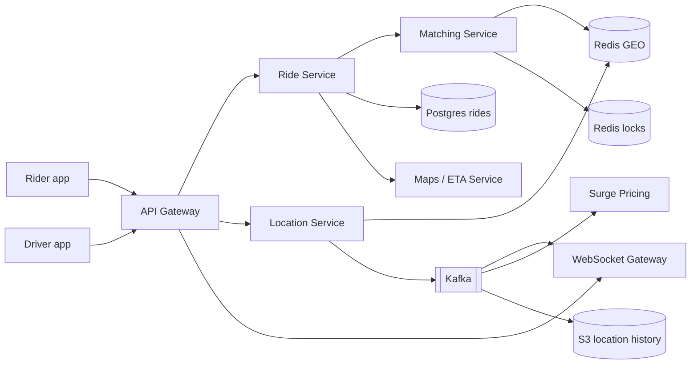
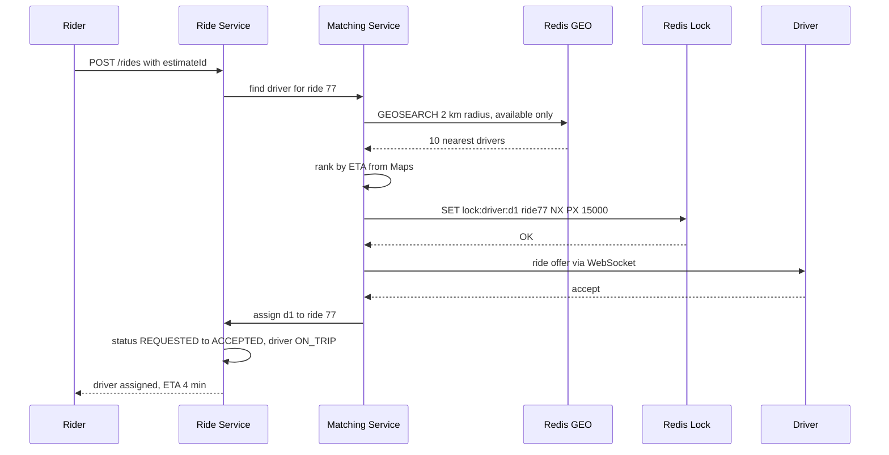
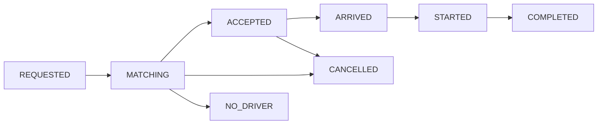

# Design Uber / Ola

**In one line:** the rider enters pickup and drop, the system finds and matches a nearby free driver, and during the ride the rider sees the driver's live location. The core challenge is that **lakhs of drivers send their location every 4 sec**, and **one driver must get only one ride**.

**What the interviewer checks in this question:** where you keep write-heavy location data (geospatial index), how you make nearby search fast, contention in matching (lock), the ride state machine, and real-time updates.

---

## Step 1: Clarify with the interviewer (3–5 min)

Ask these questions before you start the design:

| You ask | Typical answer | Effect on design |
|---|---|---|
| "Are ride request, matching, live tracking and fare in scope? Can I assume payment is third-party?" | Yes | No need to design payment internals |
| "How often does a driver send location?" | Every ~4 sec | Very write-heavy, we need an in-memory geo store |
| "How many active drivers and riders?" | ~1M online drivers at peak, 10M rides/day | Location writes ~250K/sec |
| "Is it strict that one driver gets only one ride offer at a time?" | Yes | Distributed lock on the driver |
| "Are pool/shared rides and scheduled rides in scope?" | No | Out of scope |
| "Can we use a service like Google Maps for ETA and routes?" | Yes | Treat Maps as a black box |

> **Say:** "I will design 3 core flows: driver location update, the rider's ride request + matching, and live tracking during the ride. The priority is latency and throughput on the location path, and consistency (one driver, one ride) in matching."

## Step 2: Requirements

**Functional (users should be able to)**
1. A rider should be able to enter pickup/drop and see a fare estimate + ETA
2. A rider should be able to request a ride, and the system matches a nearby driver
3. A driver should be able to accept/decline an offer, and start/end the ride
4. A rider should be able to see the driver's live location during the ride

**Out of scope:** payment internals, pool/shared rides, scheduled rides, ratings.

**Non-functional (in priority order)**
1. **Consistency for matching:** one driver, one ride at a time (zero double assigns)
2. **Scale:** 1M online drivers, location writes ~250K/sec, peak ~1K ride requests/sec
3. **Latency:** match p95 < 10 sec, live location reaches the rider in < 2 sec, nearby search p99 < 100 ms
4. **Availability:** 99.99% for location + matching. Location data is eventual (4 sec old is fine)

**CAP choice:** consistency for driver assignment (lock + DB conditional update; if it fails, try the next driver). Availability for location and tracking: a slightly stale location is fine, the system going down is not.

## Step 3: Estimation (only what changes the design)

- 1M online drivers, one update every 4 sec → **~250K writes/sec**. Postgres cannot handle this. We need an in-memory store (Redis GEO).
- Each update is ~100 bytes → 25 MB/sec. We keep only the **latest location**, and history goes to a separate async pipeline.
- Rides: 10M/day ≈ **~120 ride requests/sec** avg, peak ~1K/sec. The load on the ride DB is small.

> **Say:** "The real load is not ride booking, it is driver location updates: 250K writes/sec. So I will keep location separate from the main DB, in an in-memory geo index, and keep rides in a normal SQL DB."

## Step 4: Core entities

- **Rider**: id, name, phone, rating
- **Driver**: id, vehicle, city, status (`OFFLINE`, `AVAILABLE`, `ON_TRIP`), rating
- **DriverLocation**: driver_id, lat, lng, updated_at (only the latest, in Redis)
- **Ride**: id, rider_id, driver_id, pickup, drop, status, fare, surge_multiplier, created_at
- **FareEstimate**: id, rider_id, pickup, drop, price, expires_at

## Step 5: APIs

```http
POST  /fare-estimate   {pickup, drop}                 → {estimateId, price, eta, expiresAt}
POST  /rides           {estimateId}                   → {rideId, status: REQUESTED}
      Header: Idempotency-Key: <uuid>
POST  /drivers/location {lat, lng}                    → 200   (every 4 sec)
POST  /rides/{rideId}/accept                          → {status: ACCEPTED}
PATCH /rides/{rideId}  {status: STARTED | COMPLETED}  → ride
WS    /rides/{rideId}/track                           → driver location stream
```

> **Say:** "Fare estimate is a separate API because the rider sees the price first, and the ride request uses the same estimateId, so the surge price stays locked."

## Step 6: High-level design

**Start with a simple v1:** apps → one Ride Service → Postgres (lat/lng in the drivers table). For a small city (1K drivers) this is enough. But Postgres cannot take 250K location writes/sec → Redis GEO and a separate Location Service. Multiple matching instances race for the same driver → a lock. We need server push (offers + tracking) → a WebSocket Gateway. One location stream with 3 consumers → Kafka.



**FR mapping:** FR1 → Ride Service + Maps + Surge, FR2 → Matching + Redis GEO + locks, FR3 → Ride Service + Postgres, FR4 → Location Service → Kafka → WS Gateway.

**Why each component:**
- **Location Service + Redis GEO:** 250K writes/sec, only the latest location (`GEOADD` overwrites). The simpler option, Postgres/PostGIS, writes index + WAL on every row update and cannot keep up at this rate.
- **Matching Service:** separate because its load is location reads + Maps calls, not ride CRUD; it scales differently. In v1 it can be a module inside the Ride Service.
- **Redis locks:** multiple matching instances, one driver one ride. The simpler option, `SELECT FOR UPDATE`, would hold a DB connection during the 15 sec driver wait.
- **Ride Service + Postgres:** state machine and fare. Peak ~1K writes/sec, needs ACID. No need for NoSQL.
- **WebSocket Gateway:** pushes offers to the driver and location to the rider in < 2 sec. The simpler option, polling every 2 sec, means millions of useless requests.
- **Kafka:** ~250K events/sec, 3 independent consumers (tracking, surge, history) and replay for history. In a queue like SQS one message goes to one consumer; fan-out would need 3 queues and 3x writes.
- **S3 location history:** route replay, disputes. Append-only and cheap. Cassandra only if per-ride routes must be read at high QPS.
- **Maps / ETA Service:** road + traffic ETA. Straight-line distance picks the wrong driver.

## Step 7: Main flow: ride request and matching



If the driver does not accept within 15 sec, or declines, release the lock and move to the next driver in the list.

## Step 8: Data model & DB choice

```sql
rides(id PK, rider_id, driver_id, status, pickup_lat, pickup_lng, drop_lat, drop_lng,
      fare, surge_multiplier, idempotency_key UNIQUE, created_at, updated_at)
drivers(id PK, city, vehicle_type, status, rating)
```

```text
Redis GEO:   GEOADD drivers:pune:available <lng> <lat> d1
Redis hash:  driver:d1 → {status, lastSeen, rideId}
Redis lock:  lock:driver:d1 → ride77  (TTL 15s)
```

- **Rides → Postgres:** state transitions in a transaction, ~1K writes/sec easily. You can shard by city.
- **Live location → Redis GEO:** in-memory, fast `GEOSEARCH`. Old locations are of no use, so durability is not needed.
- **Location history → Kafka → S3:** for trip routes, disputes and analytics. Append-only, written in batches (files per ride/hour).

## Step 9: Deep dives (the interviewer will push here)

### 9.1 Where will you keep 250K location writes/sec?
**NFR:** 250K writes/sec, nearby search p99 < 100 ms.
- **Why not Postgres:** every update is a row update + index update. At 250K/sec, the B-tree index and WAL will choke.
- **Redis GEO:** internally it uses the geohash as a sorted set score. `GEOADD` is O(log N), and `GEOSEARCH` is fast within a radius.
- **City-wise sharding:** `drivers:pune`, `drivers:mumbai` are separate keys on separate Redis nodes. Load from one city does not touch another.
- **Client-side throttle:** if the driver is standing still, send fewer updates (every 10–15 sec).
- **Stale driver:** if no update for 30 sec, remove them from the available set (hash with TTL, or cleanup).
- **Trade-off:** a Redis crash can lose the last few seconds of location; acceptable, drivers resend within 4 sec.

### 9.2 How will you find nearby drivers?
**NFR:** match p95 < 10 sec, with the right (road-wise nearest) driver.
- **Geohash:** converts lat/lng into a string (`tdr1v`). Same prefix = close to each other. In search, look at your own cell + 8 neighbour cells, because a nearby driver at the boundary can be in another cell.
- **Alternatives:** Quadtree (smaller cells in dense areas), Uber's **H3** (hexagons, all neighbours are at equal distance).
- Take 10–20 candidates in the radius, then get the **road ETA from the Maps service** and rank. A driver across the river is close in a straight line but 20 min away.
- **Trade-off:** Maps calls add latency and cost, so only for the top 10–20 candidates.

### 9.3 One driver must not get two rides
**NFR:** zero double assigns (consistency).
- The Matching Service runs as multiple instances. Two riders' requests can pick the same driver d1.
- **Distributed lock:** `SET lock:driver:d1 ride77 NX PX 15000`. Whoever gets the lock sends the offer. The other moves to the next driver.
- The TTL is there so that if the driver does not respond or the service crashes, the lock is released by itself.
- **Final safety in the DB:** when assigning, run `UPDATE drivers SET status='ON_TRIP' WHERE id=d1 AND status='AVAILABLE'`. If 0 rows are updated, the assign fails.
- **Trade-off:** the Redis lock is fast but not 100% safe (a lock can be lost on failover), so the DB check is the final guard.

### 9.4 Ride state machine
**NFR:** ride state is always correct (ACID), no wrong transitions.

- Every transition uses `UPDATE rides SET status=? WHERE id=? AND status=<expected>`. A wrong transition (COMPLETED to STARTED) is rejected.
- An event on every transition (from an outbox table, on the same Kafka cluster): notifications, billing. This is only ~1K/sec; we reuse Kafka because it already exists, otherwise SQS would be enough.
- **Trade-off:** every transition is a conditional update, so clients must handle a 409 on retries.

### 9.5 Live tracking and surge
**NFR:** live location reaches the rider in < 2 sec.
- During the ride, the driver's location comes on Kafka. The WebSocket Gateway finds the rider's connection by `rideId` and pushes it.
- Keep which gateway node the rider's WS is on in Redis: `conn:rider1 → node7`.
- **Surge (brief):** every 1 min, compute the demand (requests) / supply (available drivers) ratio for each geohash cell. If the ratio > threshold, the multiplier is 1.5x. The multiplier is locked on the estimate, valid for 2 min.
- **Trade-off:** the Kafka hop adds ~100s of ms, but it fits in the 2 sec budget and keeps consumers decoupled.

## Step 10: Decision table (what we chose, why, and what we did not)

| Decision | Why we chose it | What we did not choose, and why |
|---|---|---|
| **Redis GEO** for live location | In-memory, 250K writes/sec, built-in radius search | **Postgres + PostGIS:** row update + index every 4 sec, cannot take that many writes. **Sacrifice:** durability (a crash can lose the last location) and RAM cost |
| **Geohash / H3 cells** | Simple prefix match, easy sharding | **Distance to every driver:** scanning 1M, slow. **Quadtree:** better in dense areas but the tree rebalances on updates. **Sacrifice:** at cell boundaries we must also check 8 neighbours |
| **Redis lock with TTL** on driver | Fast, atomic `NX`, auto release on crash | **`SELECT FOR UPDATE`:** blocks a DB connection for up to 15 sec. **ZooKeeper:** safer but slower and one more system. **Sacrifice:** a lock can be lost on failover, so we need the DB check |
| **Postgres** for rides | ACID for state machine + fare, ~1K writes/sec | **Cassandra/DynamoDB:** weak conditional transitions and transactions. **Sacrifice:** at very large scale we shard by city ourselves |
| **WebSocket** for offers + tracking | Server push, < 2 sec | **Polling every 2 sec:** millions of useless requests, battery drain. **Sacrifice:** stateful connections, a connection registry and reconnect logic |
| **Kafka** for location stream | 250K events/sec, 3 consumer groups (tracking, surge, history), replay | **SQS/RabbitMQ:** one message, one consumer, fan-out needs 3 queues. **Direct calls:** tight coupling. **Sacrifice:** running a Kafka cluster and an extra ~100 ms hop |
| **S3** for location history | Append-only, cheap, route replay | **Cassandra:** fast per-ride reads but one more cluster. **Sacrifice:** history queries are slow (batch/Athena) |
| **ETA from Maps service** | Road + traffic aware | **Haversine:** ignores rivers/flyovers, wrong driver. **Sacrifice:** latency + cost of an external call per match |

## Step 11: Failures & bottlenecks

| What failed | What happens | How to handle |
|---|---|---|
| Redis GEO node down | Drivers in that city do not show in search | Replica + failover. Within 4 sec, drivers send their location again and the index is rebuilt |
| Driver loses network | Stale location, wrong match | If `lastSeen` > 30 sec, remove from the available set |
| Matching service crashes after lock | Driver stays locked | Lock TTL is 15 sec, it is released by itself |
| WebSocket gateway down | Rider does not see live location | Client reconnects to another node, fetches the last location via REST |
| Hot area (after a stadium match) | Too many requests in one cell | Surge pricing reduces demand, and split the cell into smaller cells |
| Double ride request (rider tapped twice) | Two rides could be created | Idempotency-Key, `UNIQUE` constraint |

## Step 12: How to make it better (say this yourself at the end)

> "If I had more time, I would improve these:"
- **Batch matching:** match all requests and drivers in a 2 sec window together (global optimum), instead of greedy nearest-first
- **Predict the driver's next location** (speed + direction), to reduce the effect of stale locations on matching
- **Multi-region, city-wise cells:** the full stack for each city in its own region, so an outage in one city does not touch another
- **Offer the next ride before the trip ends** (chaining), less driver idle time
- **Fraud detection:** catch GPS spoofing (impossible speed jumps)
- Compress location history (polyline encoding) to cut S3 cost

## Step 13: Likely follow-up questions

- "Why not keep location in Postgres?" → 250K writes/sec, and we only need the latest. Redis GEO is in-memory → Step 9.1
- "What if a driver at a geohash boundary is missed?" → Search your own cell + 8 neighbours
- "What if two matching instances pick the same driver?" → Redis lock `NX` + DB conditional update → Step 9.3
- "What if the driver does not accept?" → 15 sec timeout, release the lock, next driver. After 3 failures, increase the radius
- "How does the rider see the driver's location?" → driver → Location Service → Kafka → WS Gateway → rider
- "Data loss if Redis crashes?" → Acceptable, drivers send a fresh location within 4 sec
- "Why Kafka and not SQS?" → 250K events/sec, 3 independent consumers + replay. In a queue one message goes to one consumer
- **Senior signal:** raise it yourself: a hot city (Mumbai at peak) makes its Redis GEO shard and matching a hotspot; split the city into geohash cells and shard by cell. Also say that losing a Redis lock on failover is covered by the DB conditional update.

## 2-minute recap

> In Uber, the real load is driver location: 1M drivers × every 4 sec = 250K writes/sec. So the latest location goes in Redis GEO (geohash based, sharded by city), not Postgres. When a rider request comes, the Matching Service gets 10–20 nearby available drivers with `GEOSEARCH`, ranks them by road ETA from Maps, takes a Redis lock on the driver (`SET NX PX 15s`) and sends the offer over WebSocket. The lock + a DB conditional update make sure one driver gets only one ride. Rides live in Postgres with a state machine (REQUESTED → ACCEPTED → STARTED → COMPLETED). During the ride, location goes through Kafka (250K events/sec, 3 consumers: tracking, surge, S3 history) to the WebSocket Gateway and is pushed to the rider. Surge = cell-wise demand/supply ratio, locked on the estimate.

## Checklist

- [ ] I can work out the 250K writes/sec estimate and tell why not Postgres
- [ ] I can explain nearby search with Redis GEO and geohash (with neighbour cells)
- [ ] I can tell how a distributed lock on the driver + DB conditional update stops double assign
- [ ] I can draw the ride state machine
- [ ] I can explain the live location path (driver → Kafka → WS → rider)
- [ ] I can tell the basic logic of surge pricing and ETA
- [ ] I can draw the HLD diagram in 5 min
- [ ] I can say 3 trade-offs from the decision table without notes
