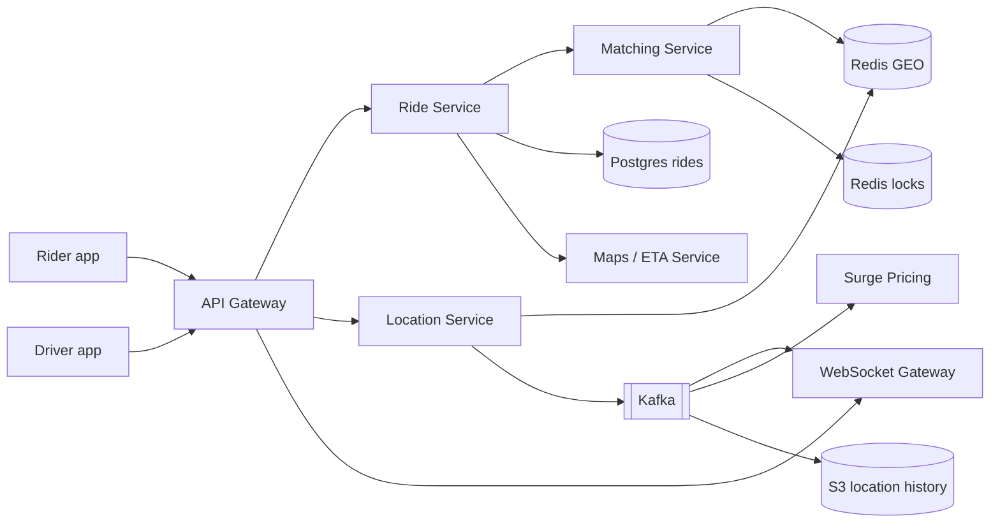
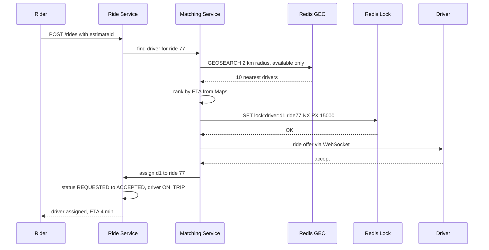
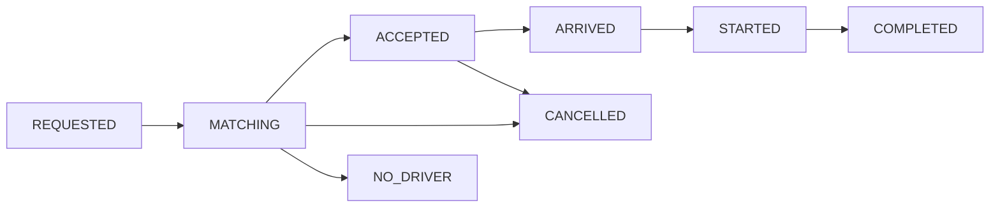

# Design Uber / Ola

**In one line:** the rider enters pickup/drop, the system matches a nearby free driver, and the rider sees the driver's live location during the ride. Core challenge: **lakhs of drivers send location every 4 sec**, and **one driver gets only one ride**.

**What the interviewer checks:** geospatial index for write-heavy location, nearby search, matching lock, state machine, real-time push.

---

## Step 1: Clarify with the interviewer (3–5 min)

| You ask | Typical answer | Effect on design |
|---|---|---|
| "Scope: request, matching, tracking, fare? Payment third-party?" | Yes | No payment internals |
| "How often does a driver send location?" | Every ~4 sec | Write-heavy, in-memory geo store |
| "How many active drivers and riders?" | ~1M online drivers at peak, 10M rides/day | Location writes ~250K/sec |
| "Strictly one ride offer per driver at a time?" | Yes | Distributed lock on the driver |
| "Pool/shared or scheduled rides in scope?" | No | Out of scope |
| "Can we use something like Google Maps for ETA/routes?" | Yes | Maps as a black box |

> **Say:** "3 flows: location update, request + matching, live tracking. Throughput on location, consistency on matching."

## Step 2: Requirements

**Functional**
1. Rider enters pickup/drop and sees a fare estimate + ETA
2. Rider requests a ride, system matches a nearby driver
3. Driver accepts/declines an offer, starts/ends the ride
4. Rider sees the driver's live location during the ride

**Out of scope:** payment internals, pool/shared rides, scheduled rides, ratings.

**Non-functional (in priority order)**
1. **Matching consistency:** one driver, one ride at a time (zero double assigns)
2. **Scale:** 1M online drivers, ~250K location writes/sec, peak ~1K ride requests/sec
3. **Latency:** match p95 < 10 sec, live location < 2 sec, nearby search p99 < 100 ms
4. **Availability:** 99.99% for location + matching; location eventual (4 sec old OK)

**CAP:** assignment → consistency (lock + DB conditional update). Location/tracking → availability.

## Step 3: Estimation (only what changes the design)

- 1M drivers × every 4 sec → **~250K writes/sec** → in-memory (Redis GEO), not Postgres.
- ~100 bytes/update → 25 MB/sec. Keep only the **latest**; history async.
- 10M rides/day ≈ **~120/sec** avg, peak ~1K/sec → small ride DB load.

> **Say:** "The real load is location updates (250K writes/sec), not booking. Location goes in an in-memory geo index, rides in SQL."

## Step 4: Core entities

- **Rider**: id, name, phone, rating
- **Driver**: id, vehicle, city, status (`OFFLINE`, `AVAILABLE`, `ON_TRIP`), rating
- **DriverLocation**: driver_id, lat, lng, updated_at (only the latest, in Redis)
- **Ride**: id, rider_id, driver_id, pickup, drop, status, fare, surge_multiplier, created_at
- **FareEstimate**: id, rider_id, pickup, drop, price, expires_at

## Step 5: APIs

```http
POST  /fare-estimate   {pickup, drop}                 → {estimateId, price, eta, expiresAt}
POST  /rides           {estimateId}                   → {rideId, status: REQUESTED}
      Header: Idempotency-Key: <uuid>
POST  /drivers/location {lat, lng}                    → 200   (every 4 sec)
POST  /rides/{rideId}/accept                          → {status: ACCEPTED}
PATCH /rides/{rideId}  {status: STARTED | COMPLETED}  → ride
WS    /rides/{rideId}/track                           → driver location stream
```

> **Say:** "Fare estimate is a separate API; the ride is requested with that estimateId so the surge price stays locked."

## Step 6: High-level design

**v1:** Ride Service → Postgres (lat/lng column), fine up to 1K drivers. Then:
- 250K writes/sec → Redis GEO + a separate Location Service
- Matching instances race for one driver → lock
- Server push (offers + tracking) → WebSocket Gateway
- One location stream, 3 consumers → Kafka



**FR mapping:** FR1 → Ride Service + Maps + Surge, FR2 → Matching + Redis GEO + locks, FR3 → Ride Service + Postgres, FR4 → Location Service → Kafka → WS Gateway.

**Why each component** (alternatives in Step 10):
- **Location Service + Redis GEO:** 250K writes/sec, `GEOADD` overwrites.
- **Matching Service:** location reads + Maps calls, scales separately; a module in v1.
- **Redis locks:** one driver, one ride across instances.
- **Ride Service + Postgres:** state machine + fare, ACID.
- **WebSocket Gateway:** pushes offers + location in < 2 sec.
- **Kafka:** one stream, 3 consumers (tracking, surge, history) + replay. SQS fan-out = 3 queues, 3x writes.
- **S3 history:** route replay, disputes. Cassandra only if per-ride routes are read at high QPS.
- **Maps / ETA:** road + traffic ETA.

## Step 7: Main flow: ride request and matching



No accept in 15 sec / decline → release the lock, next driver in the list.

## Step 8: Data model & DB choice

```sql
rides(id PK, rider_id, driver_id, status, pickup_lat, pickup_lng, drop_lat, drop_lng,
      fare, surge_multiplier, idempotency_key UNIQUE, created_at, updated_at)
drivers(id PK, city, vehicle_type, status, rating)
```

```text
Redis GEO:   GEOADD drivers:pune:available <lng> <lat> d1
Redis hash:  driver:d1 → {status, lastSeen, rideId}
Redis lock:  lock:driver:d1 → ride77  (TTL 15s)
```

- **Rides → Postgres:** transitions in a transaction; can shard by city.
- **Live location → Redis GEO:** durability not needed.
- **History → Kafka → S3:** batch files (per ride/hour).

## Step 9: Deep dives (the interviewer will push here)

### 9.1 Where will you keep 250K location writes/sec?
**NFR:** 250K writes/sec, nearby search p99 < 100 ms.
- **Not Postgres:** every update = row + B-tree index + WAL.
- **Redis GEO:** geohash = sorted set score. `GEOADD` O(log N), `GEOSEARCH` fast.
- **City-wise sharding:** `drivers:pune`, `drivers:mumbai` on separate keys/nodes.
- **Throttle:** stationary driver → every 10–15 sec. **Stale:** no update for 30 sec → remove from the available set.
- **Trade-off:** Redis crash → last few seconds lost; drivers resend in 4 sec.

### 9.2 How will you find nearby drivers?
**NFR:** match p95 < 10 sec, road-wise nearest driver.
- **Geohash:** lat/lng → string (`tdr1v`); same prefix = close. Own cell + 8 neighbours (boundary case).
- **Alternatives:** Quadtree (smaller cells in dense areas), Uber's **H3** (hexagons, equidistant neighbours).
- 10–20 candidates → rank by **Maps road ETA** (the driver across the river is 20 min away).
- **Trade-off:** Maps latency + cost, so only the top 10–20.

### 9.3 One driver must not get two rides
**NFR:** zero double assigns.
- **Distributed lock:** `SET lock:driver:d1 ride77 NX PX 15000`. Lock holder sends the offer, the other moves to the next driver. TTL → auto release on crash/no reply.
- **DB final guard:** `UPDATE drivers SET status='ON_TRIP' WHERE id=d1 AND status='AVAILABLE'`; 0 rows → assign fails.
- **Trade-off:** Redis lock can be lost on failover, hence the DB check.

### 9.4 Ride state machine
**NFR:** ride state always correct (ACID).

- Every transition: `UPDATE rides SET status=? WHERE id=? AND status=<expected>`. Wrong transition (COMPLETED → STARTED) rejected.
- Event on every transition (outbox → same Kafka): notifications, billing. ~1K/sec; SQS would also do.
- **Trade-off:** clients must handle 409 on retries.

### 9.5 Live tracking and surge
**NFR:** live location < 2 sec.
- Location → Kafka → WS Gateway; rider's node from a Redis registry (`conn:rider1 → node7`).
- **Surge:** per geohash cell, every 1 min, demand/supply ratio. > threshold → multiplier 1.5x. Locked on the estimate, valid 2 min.
- **Trade-off:** Kafka hop ~100s of ms, fits the 2 sec budget; consumers decoupled.

## Step 10: Decision table (what we chose, why, and what we did not)

| Decision | Why we chose it | What we did not choose, and why |
|---|---|---|
| **Redis GEO** for live location | In-memory, 250K writes/sec, built-in radius search | **PostGIS:** can't take that many row + index updates. **Sacrifice:** durability, RAM cost |
| **Geohash / H3 cells** | Simple prefix match, easy sharding | **Distance to every driver:** 1M scan. **Quadtree:** rebalances on update. **Sacrifice:** must check 8 neighbour cells |
| **Redis lock with TTL** on driver | Fast, atomic `NX`, auto release on crash | **`SELECT FOR UPDATE`:** blocks a DB connection 15 sec. **ZooKeeper:** safer but slow. **Sacrifice:** lock loss on failover, DB check |
| **Postgres** for rides | ACID for state machine + fare, ~1K writes/sec | **Cassandra/DynamoDB:** weak conditional transitions. **Sacrifice:** shard by city ourselves at scale |
| **WebSocket** for offers + tracking | Server push, < 2 sec | **Polling:** useless requests, battery. **Sacrifice:** stateful conns, reconnect |
| **Kafka** for location stream | 250K events/sec, 3 consumer groups, replay | **SQS/RabbitMQ:** 3 queues. **Direct calls:** coupling. **Sacrifice:** cluster ops, ~100 ms hop |
| **S3** for location history | Append-only, cheap, route replay | **Cassandra:** fast reads but one more cluster. **Sacrifice:** slow history queries (Athena) |
| **ETA from Maps service** | Road + traffic aware | **Haversine:** ignores rivers/flyovers. **Sacrifice:** external call latency + cost |

## Step 11: Failures & bottlenecks

| What failed | What happens | How to handle |
|---|---|---|
| Redis GEO node down | City's drivers missing from search | Replica + failover; drivers rebuild the index within 4 sec |
| Driver loses network | Stale location, wrong match | `lastSeen` > 30 sec → remove from available set |
| Matching crashes after lock | Driver stays locked | Lock TTL 15 sec, auto release |
| WebSocket gateway down | No live location | Reconnect to another node, last location via REST |
| Hot area (after a stadium match) | Too many requests in one cell | Surge + split the cell into smaller cells |
| Rider tapped twice | Two rides | Idempotency-Key, `UNIQUE` constraint |

## Step 12: How to make it better (say this yourself at the end)

- **Batch matching:** global optimal match in a 2 sec window, instead of greedy nearest-first
- **Predict next location** (speed + direction) → less effect of stale locations
- **Multi-region, city-wise stack:** one city's outage does not touch another
- **Trip chaining:** offer the next ride before the trip ends, less idle time
- **Fraud:** GPS spoofing (impossible speed jumps)

## Step 13: Likely follow-up questions

- "Why not location in Postgres?" → 250K writes/sec, only latest needed → Redis GEO (9.1)
- "Driver missed at a geohash boundary?" → own cell + 8 neighbours
- "Two instances pick the same driver?" → Redis lock `NX` + DB conditional update (9.3)
- "Driver does not accept?" → 15 sec timeout, release lock, next driver; after 3 failures, increase the radius
- "Why Kafka, not SQS?" → 250K events/sec, 3 independent consumers + replay
- **Senior signal:** raise it yourself: a hot city (Mumbai at peak) makes its Redis GEO shard and matching a hotspot; split the city into geohash cells and shard by cell. Also say that losing a Redis lock on failover is covered by the DB conditional update.

## 2-minute recap

> Load = driver location: 1M × every 4 sec = 250K writes/sec → Redis GEO (geohash, city shards). Matching: `GEOSEARCH` 10–20 drivers → rank by Maps ETA → Redis lock (`SET NX PX 15s`) → WebSocket offer. Lock + DB conditional update = one driver, one ride. Ride = Postgres state machine. Location → Kafka (tracking, surge, S3) → WS → rider. Surge = cell demand/supply, locked on the estimate.

## Checklist

- [ ] I can work out the 250K writes/sec estimate and tell why not Postgres
- [ ] I can explain nearby search with Redis GEO and geohash (with neighbour cells)
- [ ] I can tell how a distributed lock on the driver + DB conditional update stops double assign
- [ ] I can draw the ride state machine
- [ ] I can explain the live location path (driver → Kafka → WS → rider)
- [ ] I can tell the basic logic of surge pricing and ETA
- [ ] I can draw the HLD diagram in 5 min
- [ ] I can say 3 trade-offs from the decision table without notes
