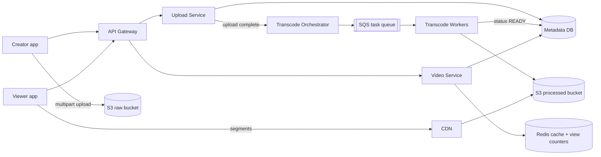
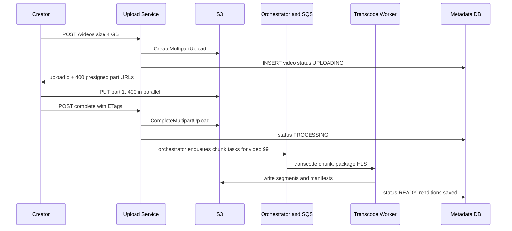
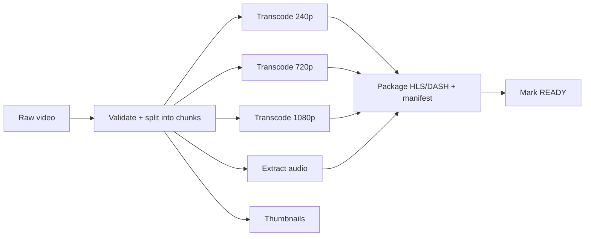

# Design YouTube / Netflix

**In one line:** a creator uploads a video, the system converts it into many resolutions, and viewers around the world watch it without buffering. The core challenge is **uploading big files, heavy transcoding, and delivering petabytes of video fast**.

**What the interviewer checks in this question:** correct use of blob storage + CDN, an async processing pipeline (queue + workers), adaptive streaming (HLS/DASH), and a caching strategy at read-heavy scale.

---

## Step 1: Clarify with the interviewer (3–5 min)

Ask these questions before you start the design:

| You ask | Typical answer | Effect on design |
|---|---|---|
| "Is upload, processing and watch in scope? Search, comments, recommendations?" | Upload + watch are core, the rest is out of scope | Focus on three flows |
| "What is the max video size?" | Up to 10 GB | Multipart + resumable upload |
| "How many uploads and views?" | 500 hours of video uploaded per min, 1B views/day | Very read-heavy, CDN is a must |
| "Should the video go live right after upload?" | A few minutes of delay is fine | Transcoding is async |
| "Is live streaming in scope?" | No | Only VOD (video on demand) |
| "Must the view count be exact and real-time?" | Some delay and an approximate number is fine | Async counting |

> **Say:** "I will design 2 core flows: upload + processing, and watch/streaming. Video bytes will never pass through my app servers. Upload goes directly to S3, and watch is served from the CDN."

## Step 2: Requirements

**Functional (users should be able to)**
1. A creator should be able to upload a big video (up to 10 GB) that resumes if the network drops
2. A few minutes after upload, the video should be watchable in multiple resolutions (240p–4K)
3. A viewer should be able to watch, with quality changing on its own based on the network
4. A viewer should be able to see metadata (title, thumbnail) and an approximate view count

**Out of scope:** search, comments, recommendations, live streaming, monetization.

**Non-functional (in priority order)**
1. **Durability:** an uploaded video is never lost (S3, 11 nines)
2. **Playback latency:** video start p95 < 2 sec, rebuffering < 1% of watch time
3. **Availability:** 99.99% for the watch path; upload/processing may degrade a little
4. **Scale:** 1B views/day, 500 hours uploaded/min, read:write > 100:1, global users

**CAP choice:** availability on the watch path. A new video or the view count may show up seconds/minutes late (eventual). Only the video status (`READY`) and the upload record need strong consistency, and those live in one SQL row.

## Step 3: Estimation (only what changes the design)

- Upload: 500 hours/min. 1 hour of raw video ≈ 1–2 GB → **~1 PB raw/day**. Transcoded copies (5–6 resolutions) take ~3x storage. So we use a blob store like S3, and move old raw files to cold storage.
- Watch: 1B views/day ≈ **~12K video starts/sec**. 1B views × ~5 min avg ≈ ~3.5M concurrent viewers × 5 Mbps = **~15+ Tbps of bandwidth**. Only a CDN can provide this.
- Metadata reads: metadata on every view → ~12K QPS avg, and one row gets hot for a viral video. Hence a cache.
- Transcode tasks: 500 hours/min ÷ 10 sec chunks × ~6 resolutions ≈ **~18K tasks/sec**. A job for a managed queue (SQS) and autoscaling workers.

> **Say:** "The bottleneck is bandwidth and storage, not QPS. So the centre of the architecture is blob storage + CDN, and app servers only return metadata and URLs."

## Step 4: Core entities

- **User/Channel**: id, name, subscribers
- **Video**: id, channel_id, title, description, status (`UPLOADING`, `PROCESSING`, `READY`, `FAILED`), duration, created_at
- **VideoFile/Rendition**: video_id, resolution, codec, manifest_url, segment_prefix
- **Upload**: upload_id, video_id, parts_done, total_parts
- **ViewCount**: video_id, count (aggregated)

## Step 5: APIs

```http
POST /videos                {title, description, size}   → {videoId, uploadId, partUrls[]}
PUT  <presigned S3 part URL>                             → ETag   (client goes directly to S3)
POST /videos/{id}/complete  {uploadId, parts[{n, etag}]} → {status: PROCESSING}
GET  /videos/{id}                                        → metadata + manifestUrl
GET  <cdn>/videos/{id}/master.m3u8                       → HLS manifest
POST /videos/{id}/view      {watchedSec}                 → 202 Accepted
```

> **Say:** "The upload API only hands out pre-signed URLs. Passing a 10 GB file through an app server just wastes server bandwidth and memory."

## Step 6: High-level design

**Start with a simple v1:** one API service + a SQL DB (metadata) + S3 (video files). The client uploads to S3 with a pre-signed URL, one worker runs ffmpeg, the viewer reads the file from S3. Then the numbers break it: ~15 Tbps of bandwidth → CDN. 18K transcode tasks/sec + retries → SQS + a worker fleet + an orchestrator. The hot metadata row of a viral video and 12K views/sec → Redis.



**FR mapping:** FR1 → Upload Service + S3 raw (pre-signed multipart), FR2 → Orchestrator + SQS + Workers + S3 processed, FR3 → CDN + HLS, FR4 → Video Service + Redis + Metadata DB.

**Why each component:**
- **Upload Service:** video row + starts the S3 multipart upload + pre-signed URL per part. Bytes never pass through it.
- **S3 raw / processed:** durability NFR (11 nines), cheap at PB/day. No blobs in the DB and no home-made file servers.
- **Orchestrator + SQS + Workers:** ~18K chunk tasks/sec, each task needs retry, a visibility timeout and a DLQ. This is task distribution, so SQS. Not Kafka: we need no replay or multiple consumer groups, and per-message retry/DLQ is built into SQS.
- **CDN:** ~15 Tbps of bandwidth and start < 2 sec. The simpler option (serve from S3/origin) fails on both bandwidth cost and latency.
- **Video Service + Redis:** 12K metadata reads/sec, the hot row of a viral video. The simpler option is read replicas, but only a cache saves a single hot key.
- **View counts (Redis `INCR` + flush):** 12K views/sec avg is easy for a sharded Redis (~100K ops/sec per node). Batch-flush to the DB every 30 sec. Kafka only when view events must feed analytics, fraud ML and recommendations, with replay.
- **Upload vs Video Service split:** uploads are rare and heavy, watches are 100x more and latency-sensitive; they scale differently. In v1 one service is fine.

## Step 7: Main flow: upload and processing



The watch flow is simple: the client gets the manifest URL from `GET /videos/{id}`, then all segments come from the CDN. No video bytes reach the app server.

## Step 8: Data model & DB choice

```sql
videos(id PK, channel_id, title, description, status, duration_sec,
       raw_s3_key, created_at)
renditions(video_id, resolution, bitrate, codec, manifest_key,
           PRIMARY KEY(video_id, resolution))
uploads(upload_id PK, video_id, total_parts, status, expires_at)
view_counts(video_id PK, count, updated_at)
```

- **Metadata → MySQL/Postgres (sharded by video_id):** structured data with relations (channel, video, renditions). YouTube used Vitess (sharded MySQL).
- **Video bytes → S3:** never keep blobs in the DB.
- **View counts → Redis counters + a batch flush every 30 sec** to `view_counts`. A Redis crash loses a few seconds of views, acceptable for an approximate count.

## Step 9: Deep dives (the interviewer will push here)

### 9.1 Big upload: pre-signed URL, multipart, resumable
**NFR:** durability + a 10 GB upload without restarting.
- Split the file into **5–10 MB parts**. Each part gets its own pre-signed URL and parts upload in parallel. If one part fails, only that part is retried.
- **Resumable:** if the network drops, the client asks `GET /uploads/{id}` which parts are done (S3 `ListParts`) and sends the rest.
- The pre-signed URL has a short TTL (15–60 min) and allows PUT on only one key. Security stays intact.
- For unfinished uploads, add an S3 lifecycle rule: abort after 7 days.
- **Trade-off:** the client logic gets complex (parts, ETags, resume), but server bandwidth is zero.

### 9.2 Transcoding pipeline: DAG of tasks
**NFR:** video live within minutes of upload, ~18K tasks/sec.

- Split the video into **chunks (e.g. 10 sec)**. Each chunk × resolution is a separate task. Thousands of workers run in parallel, so a 1-hour video is ready in minutes.
- An orchestrator (like Temporal/Step Functions) tracks the DAG and puts ready tasks into SQS. A worker deletes the message only after writing its output to S3. After 3 failures, DLQ.
- Every task is **idempotent**: the same input gives the same output key. If a worker crashes, the task goes back to the queue, and overwriting is safe.
- Make 360p/720p ready first and put the video live, 4K can come later.
- **Trade-off:** encoding is a bit less efficient at chunk boundaries and the orchestrator is one more system, but it is minutes vs hours.

### 9.3 Adaptive bitrate: HLS/DASH
**NFR:** start < 2 sec, rebuffering < 1%.
- Each resolution is cut into **2–6 sec segments**. The master manifest (`master.m3u8`) lists all qualities.
- The player measures bandwidth and picks a quality for each segment. 1080p on the metro, 240p in a tunnel, with no stopping.
- Segments are static files, so they cache perfectly on the CDN.
- **Trade-off:** 5–6 copies of every video, ~3x storage.

### 9.4 CDN: popular vs long-tail
**NFR:** ~15 Tbps of bandwidth, low latency globally.
- **Popular videos (top ~10–20%) = ~80% of traffic.** Pre-push these to CDN edges (like a new Netflix show before launch). Netflix puts its own boxes (Open Connect) inside ISPs.
- **Long-tail (old, rarely watched):** pull-based on the CDN, the first request comes from the origin. Add an origin shield layer so all edges don't hit S3 directly.
- Less popular resolutions of long-tail videos go to cold storage, or get transcoded on demand.
- **Trade-off:** the first long-tail request is slow (origin fetch), and the CDN bill is the biggest cost.

### 9.5 View counts
**NFR:** availability > accuracy; an approximate count ~30 sec late is fine.
- Running `UPDATE videos SET views=views+1` on every view turns a viral video into a hot row.
- The view API does `INCR views:{videoId}` in Redis (12K/sec is a small load for a sharded Redis). A job reads the counters every 30 sec and batch-updates the DB.
- Basic fake-view filter: `SET seen:{user}:{video} NX EX 3600`; if it is already set, do not count.
- **When Kafka:** when analytics, recommendations and fraud ML each need to consume views separately with replay. Not in this scope.
- **Trade-off:** a Redis crash can lose views since the last flush; fine for an approximate count.

## Step 10: Decision table (what we chose, why, and what we did not)

| Decision | Why we chose it | What we did not choose, and why |
|---|---|---|
| **Pre-signed URL, direct S3 upload** | No bandwidth/memory on app servers, S3 scales by itself | **Through the app server:** 10 GB files choke servers. **Sacrifice:** complex client, server-side validation only after upload |
| **Multipart + resumable** | Parallel parts, only one part retried on failure | **Single PUT:** 5 GB limit, redo everything on failure. **Sacrifice:** tracking parts + ETags |
| **SQS + workers, chunk-level DAG** | ~18K tasks/sec, per-task retry, visibility timeout, DLQ built in | **Kafka:** no need for replay/multi-consumer, per-message retry must be hand-built. **Sync transcode:** request timeout. **Sacrifice:** the orchestrator is one more system |
| **HLS/DASH segments** | Adaptive quality, CDN-friendly static files | **One big MP4:** no quality switch, buffering. **Sacrifice:** ~3x storage |
| **CDN for delivery** | ~15 Tbps, edge close to the user | **Serve from origin:** bandwidth cost + latency unacceptable. **Sacrifice:** CDN is the biggest bill, misses on long-tail |
| **SQL (sharded) for metadata** | Structured relations, moderate writes | **Cassandra/DynamoDB:** works, but we give up joins and consistent status transitions. **Sacrifice:** we manage sharding (Vitess) |
| **Redis cache + counters** | Hot metadata and 12K views/sec INCR, ~1000x fewer DB writes | **DB increment per view:** hot row contention. **Kafka + stream processor:** overkill for 12K/sec. **Sacrifice:** approximate counts, a few seconds of views lost on crash |

## Step 11: Failures & bottlenecks

| What failed | What happens | How to handle it |
|---|---|---|
| Upload stopped midway | Incomplete file | Resumable multipart, resume using `ListParts`. Clean up with a lifecycle rule |
| Transcode worker crash | Task left incomplete | Task runs again after the queue visibility timeout, idempotent output |
| Corrupt/unsupported video | Pipeline fails | Validate step first, status `FAILED`, notify the creator. Repeated failures go to a DLQ |
| CDN edge miss storm (viral video) | Load on the origin | Origin shield + pre-warming popular content |
| Metadata DB hot shard | Reads of one viral video | Redis cache + cache the metadata response on the CDN (short TTL) |
| Region down | Users can't get videos | Multi-CDN + S3 cross-region replication |

## Step 12: How to make it better (say this yourself at the end)

> "If I had more time, I would improve these:"
- **Per-title encoding** (Netflix style): a cartoon looks good at a low bitrate, action needs more. A separate bitrate ladder for each video saves 20–30% bandwidth
- **AV1/VP9 codecs** for popular videos: the same quality in fewer bytes (higher transcode cost, but only for top videos)
- **Predictive CDN pre-warming:** push content region-wise in advance based on trending signals
- **Duplicate upload detection:** use a content hash/fingerprint so the same video isn't transcoded again, plus a copyright check (Content ID)
- **Storage tiering:** for a video not watched in 1 year, delete rare resolutions and transcode on demand
- A separate low-latency HLS pipeline for live streaming

## Step 13: Likely follow-up questions

- "What if the network drops during a 10 GB upload?" → multipart, send only the remaining parts → Step 9.1
- "How will you make transcoding fast?" → split into chunks and run a parallel DAG → Step 9.2
- "How will you stop buffering on a slow network?" → HLS/DASH adaptive bitrate → Step 9.3
- "What if the CDN misses on a viral video?" → origin shield, request collapsing, pre-warm
- "Is the view count consistent?" → no, it is eventually consistent. Batched aggregation, a small delay is acceptable
- "If a video is private, how do you protect it on the CDN?" → signed CDN URLs/cookies with short expiry, DRM for paid content
- "Why not Kafka for the transcode queue?" → this is task distribution: we need per-task retry, a visibility timeout and a DLQ, not replay. SQS fits
- **Senior signal:** say it yourself: the cost is in CDN bandwidth and storage, not compute; a CDN miss storm on a viral video can hit the origin, so use an origin shield + request collapsing. And send a poison video (crashes every time) to the DLQ, or workers loop on it.

## 2-minute recap

> In YouTube the bottleneck is bandwidth and storage, not QPS. Upload: the Upload Service creates the video row and returns pre-signed part URLs for an S3 multipart upload. The client sends parts directly to S3 in parallel, and it is resumable. On completion the orchestrator splits the video into chunks and puts ~18K tasks/sec into SQS (retry + DLQ, no need for Kafka), and workers run the DAG (each resolution, audio, thumbnails). Then they write HLS/DASH segments + manifest to S3 and set the status to READY. Watch: the Video Service returns metadata (sharded SQL + Redis) and the manifest URL, all segments come from the CDN, and the player changes quality with adaptive bitrate. Popular content is pre-pushed to the CDN, long-tail is pulled + origin shield. View counts use Redis `INCR` + a batch flush to the DB every 30 sec.

## Checklist

- [ ] I can explain the pre-signed URL + multipart + resumable upload flow
- [ ] I can draw the transcoding DAG (split, parallel transcode, package)
- [ ] I can explain how HLS/DASH adaptive bitrate works
- [ ] I can tell the popular vs long-tail strategy on the CDN
- [ ] I can explain why view counts are async and how they are aggregated
- [ ] I can show from the estimate that the bottleneck is bandwidth, not QPS
- [ ] I can draw the HLD diagram in 5 min
- [ ] I can say 3 trade-offs from the decision table without looking
