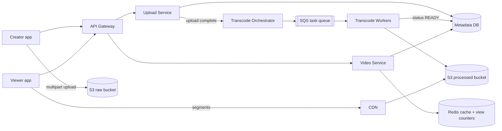
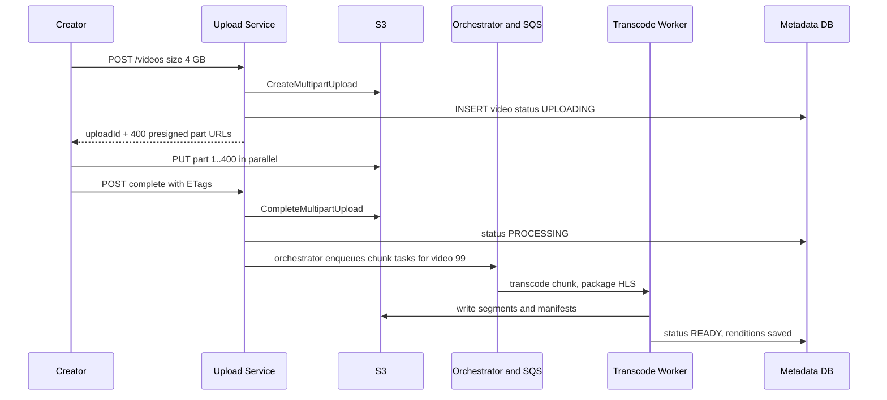
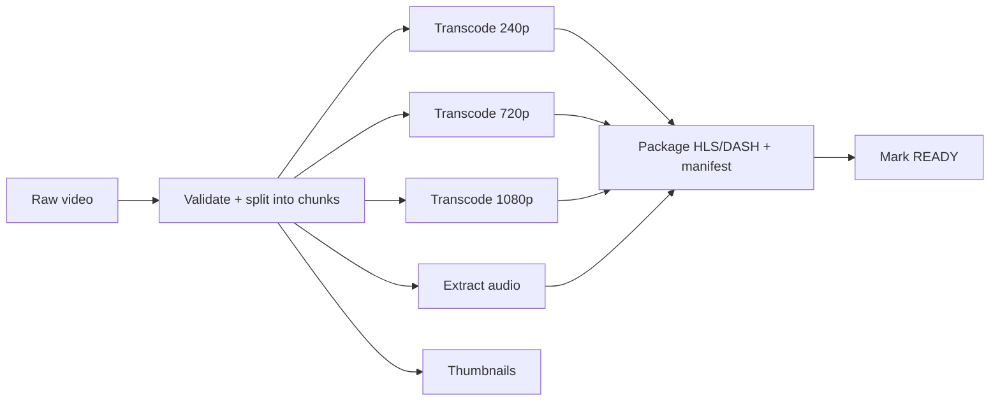

# Design YouTube / Netflix

**In one line:** creator uploads, system makes multiple resolutions, viewers watch without buffering. Core challenge: **big uploads, heavy transcoding, fast delivery of petabytes**.

**What the interviewer checks:** blob storage + CDN, async pipeline (queue + workers), adaptive streaming (HLS/DASH), read-heavy caching.

---

## Step 1: Clarify with the interviewer (3–5 min)

| You ask | Typical answer | Effect on design |
|---|---|---|
| "Scope: upload, processing, watch? Search, comments, recs?" | Upload + watch core, rest out | Focus on three flows |
| "Max video size?" | Up to 10 GB | Multipart + resumable upload |
| "How many uploads and views?" | 500 hours/min uploaded, 1B views/day | Read-heavy, CDN a must |
| "Live right after upload?" | A few minutes of delay is fine | Transcoding async |
| "Live streaming in scope?" | No | Only VOD |
| "Exact, real-time view count?" | Approximate, some delay is fine | Async counting |

> **Say:** "2 flows: upload + processing, and watch. Video bytes never pass through app servers: upload goes direct to S3, watch comes from the CDN."

## Step 2: Requirements

**Functional**
1. Creator uploads up to 10 GB, resumes if the network drops
2. Video ready in multiple resolutions (240p–4K) within minutes
3. Viewer watches, quality adapts to the network
4. Viewer sees metadata (title, thumbnail) + approximate view count

**Out of scope:** search, comments, recommendations, live streaming, monetization.

**Non-functional (in priority order)**
1. **Durability:** an uploaded video is never lost (S3, 11 nines)
2. **Playback latency:** start p95 < 2 sec, rebuffering < 1% of watch time
3. **Availability:** 99.99% for the watch path; upload/processing may degrade
4. **Scale:** 1B views/day, 500 hours uploaded/min, read:write > 100:1, global

**CAP:** watch path → availability (new video/count may be late). Strong consistency only for video status (`READY`) + upload record, one SQL row.

## Step 3: Estimation (only what changes the design)

- Upload: 500 hours/min × 1–2 GB/hour → **~1 PB raw/day**. Transcoded (5–6 resolutions) ~3x → S3, old raw to cold storage.
- Watch: 1B views/day ≈ **~12K starts/sec**. ~3.5M concurrent × 5 Mbps = **~15+ Tbps** → only a CDN.
- Metadata: ~12K QPS, one hot row for a viral video → cache.
- Transcode: 500 hours/min ÷ 10 sec chunks × ~6 resolutions ≈ **~18K tasks/sec** → SQS + autoscaling workers.

> **Say:** "The bottleneck is bandwidth and storage, not QPS. Blob storage + CDN at the centre; app servers only return metadata and URLs."

## Step 4: Core entities

- **User/Channel**: id, name, subscribers
- **Video**: id, channel_id, title, description, status (`UPLOADING`, `PROCESSING`, `READY`, `FAILED`), duration, created_at
- **VideoFile/Rendition**: video_id, resolution, codec, manifest_url, segment_prefix
- **Upload**: upload_id, video_id, parts_done, total_parts
- **ViewCount**: video_id, count (aggregated)

## Step 5: APIs

```http
POST /videos                {title, description, size}   → {videoId, uploadId, partUrls[]}
PUT  <presigned S3 part URL>                             → ETag   (client goes directly to S3)
POST /videos/{id}/complete  {uploadId, parts[{n, etag}]} → {status: PROCESSING}
GET  /videos/{id}                                        → metadata + manifestUrl
GET  <cdn>/videos/{id}/master.m3u8                       → HLS manifest
POST /videos/{id}/view      {watchedSec}                 → 202 Accepted
```

> **Say:** "The upload API only hands out pre-signed URLs; pushing 10 GB through an app server wastes bandwidth + memory."

## Step 6: High-level design

**v1:** API + SQL + S3, one ffmpeg worker, viewer reads from S3. Then:
- ~15 Tbps → CDN
- 18K tasks/sec + retries → SQS + worker fleet + orchestrator
- Hot metadata row, 12K views/sec → Redis



**FR mapping:** FR1 → Upload Service + S3 raw (pre-signed multipart), FR2 → Orchestrator + SQS + Workers + S3 processed, FR3 → CDN + HLS, FR4 → Video Service + Redis + Metadata DB.

**Why each component** (alternatives in Step 10):
- **Upload Service:** row + part URLs; bytes never pass through it.
- **S3:** 11 nines, cheap at PB/day.
- **Orchestrator + SQS + Workers:** retry, visibility timeout, DLQ built in; no replay needed → not Kafka.
- **Redis:** replicas don't save a viral hot key, a cache does. `INCR` ~100K ops/sec per node.
- **Upload vs Video Service:** uploads rare + heavy, watches 100x + latency-sensitive. In v1, one service.

## Step 7: Main flow: upload and processing



Watch: `GET /videos/{id}` → manifest URL → all segments from the CDN.

## Step 8: Data model & DB choice

```sql
videos(id PK, channel_id, title, description, status, duration_sec,
       raw_s3_key, created_at)
renditions(video_id, resolution, bitrate, codec, manifest_key,
           PRIMARY KEY(video_id, resolution))
uploads(upload_id PK, video_id, total_parts, status, expires_at)
view_counts(video_id PK, count, updated_at)
```

- **Metadata → MySQL/Postgres (sharded by video_id):** relations. YouTube: Vitess (sharded MySQL).
- **Video bytes → S3**, never blobs in the DB.
- **View counts → Redis**, flush every 30 sec to `view_counts`.

## Step 9: Deep dives (the interviewer will push here)

### 9.1 Big upload: pre-signed URL, multipart, resumable
**NFR:** durability + a 10 GB upload without restarting.
- **5–10 MB parts**, a pre-signed URL each, in parallel. Failure → retry only that part.
- **Resume:** `GET /uploads/{id}` → S3 `ListParts` → send the rest.
- Pre-signed URL: TTL 15–60 min, PUT on one key. Lifecycle rule: abort unfinished uploads after 7 days.
- **Trade-off:** complex client (parts, ETags, resume), zero server bandwidth.

### 9.2 Transcoding pipeline: DAG of tasks
**NFR:** live within minutes, ~18K tasks/sec.

- **Chunk (e.g. 10 sec)** × resolution = one task. Thousands of parallel workers → a 1-hour video in minutes.
- Orchestrator (Temporal/Step Functions) tracks the DAG, ready tasks go to SQS. Message deleted only after output is in S3. 3 failures → DLQ.
- **Idempotent** tasks: same input → same output key; retry after crash safely overwrites.
- 360p/720p first → live; 4K later.
- **Trade-off:** less efficient encoding at chunk boundaries + extra orchestrator, but minutes vs hours.

### 9.3 Adaptive bitrate: HLS/DASH
**NFR:** start < 2 sec, rebuffering < 1%.
- Each resolution cut into **2–6 sec segments**; master manifest (`master.m3u8`) lists all qualities.
- Player picks quality per segment by bandwidth (1080p on the metro, 240p in a tunnel).
- Segments are static → cache perfectly on the CDN.
- **Trade-off:** 5–6 copies, ~3x storage.

### 9.4 CDN: popular vs long-tail
**NFR:** ~15 Tbps, low latency globally.
- **Top ~10–20% of videos = ~80% of traffic** → pre-push to edges. Netflix: boxes inside ISPs (Open Connect).
- **Long-tail:** pull-based; origin shield so all edges don't hit S3 directly.
- **Trade-off:** first long-tail request is slow; the CDN bill is the biggest cost.

### 9.5 View counts
**NFR:** availability > accuracy; approximate, ~30 sec late is fine.
- `views+1` DB update per view → hot row.
- Redis `INCR views:{videoId}` (12K/sec, small load); a job batch-updates the DB every 30 sec.
- Fake-view filter: `SET seen:{user}:{video} NX EX 3600`; already set → don't count.
- **When Kafka:** analytics, recs, fraud ML need replay. Not now.
- **Trade-off:** Redis crash → views since the last flush are lost.

## Step 10: Decision table (what we chose, why, and what we did not)

| Decision | Why we chose it | What we did not choose, and why |
|---|---|---|
| **Pre-signed URL, direct S3 upload** | No bandwidth/memory on app servers, S3 scales | **Via app server:** chokes on 10 GB. **Sacrifice:** complex client, validation after upload |
| **Multipart + resumable** | Parallel parts, one part retried on failure | **Single PUT:** 5 GB limit, redo all. **Sacrifice:** tracking parts + ETags |
| **SQS + workers, chunk-level DAG** | ~18K tasks/sec, retry, visibility timeout, DLQ built in | **Kafka:** no replay needed, hand-built retry. **Sync transcode:** timeout. **Sacrifice:** extra orchestrator |
| **HLS/DASH segments** | Adaptive quality, CDN-friendly static files | **One big MP4:** no quality switch. **Sacrifice:** ~3x storage |
| **CDN for delivery** | ~15 Tbps, edge near the user | **From origin:** cost + latency. **Sacrifice:** big bill, long-tail misses |
| **SQL (sharded) for metadata** | Relations, moderate writes | **Cassandra/DynamoDB:** lose joins + status consistency. **Sacrifice:** manage Vitess sharding |
| **Redis cache + counters** | Hot metadata, 12K INCR/sec, ~1000x fewer DB writes | **DB increment:** hot row. **Kafka + stream:** overkill. **Sacrifice:** approximate, views lost on crash |

## Step 11: Failures & bottlenecks

| What failed | What happens | How to handle it |
|---|---|---|
| Upload stopped midway | Incomplete file | Resume via `ListParts`; lifecycle cleanup |
| Transcode worker crash | Task incomplete | Retry after visibility timeout, idempotent output |
| Corrupt/unsupported video | Pipeline fails | Validate first, `FAILED` + notify; repeat failures → DLQ |
| CDN miss storm (viral) | Load on origin | Origin shield + pre-warm |
| Metadata hot shard | Viral video reads | Redis + CDN response cache (short TTL) |
| Region down | No videos | Multi-CDN + S3 cross-region replication |

## Step 12: How to make it better (say this yourself at the end)

- **Per-title encoding** (Netflix): a bitrate ladder per video (cartoon low, action high), 20–30% bandwidth saved
- **AV1/VP9** only for popular videos: fewer bytes, higher transcode cost
- **Predictive pre-warming:** push region-wise from trending signals
- **Duplicate detection:** content hash/fingerprint → no re-transcode, copyright check (Content ID)
- **Storage tiering:** unwatched for 1 year → delete rare resolutions, transcode on demand

## Step 13: Likely follow-up questions

- "Network drops during a 10 GB upload?" → multipart, send only remaining parts (9.1)
- "How to make transcoding fast?" → chunks, parallel DAG (9.2)
- "Buffering on a slow network?" → HLS/DASH adaptive bitrate (9.3)
- "How to protect a private video on the CDN?" → short-expiry signed CDN URLs/cookies, DRM for paid content
- "Why not Kafka for the transcode queue?" → task distribution: per-task retry, visibility timeout, DLQ needed, not replay
- **Senior signal:** say it yourself: the cost is in CDN bandwidth and storage, not compute; a CDN miss storm on a viral video can hit the origin, so use an origin shield + request collapsing. And send a poison video (crashes every time) to the DLQ, or workers loop on it.

## 2-minute recap

> Bottleneck is bandwidth + storage, not QPS. Upload: pre-signed multipart, direct to S3, resumable. Complete → chunks, ~18K tasks/sec into SQS (retry + DLQ) → workers run the DAG → HLS/DASH segments + manifest in S3 → READY. Watch: metadata (sharded SQL + Redis) + manifest URL, segments from CDN, adaptive bitrate. Popular pre-pushed, long-tail pulled + origin shield. Views: Redis `INCR`, batch flush every 30 sec.

## Checklist

- [ ] I can explain the pre-signed URL + multipart + resumable upload flow
- [ ] I can draw the transcoding DAG (split, parallel transcode, package)
- [ ] I can explain how HLS/DASH adaptive bitrate works
- [ ] I can tell the popular vs long-tail strategy on the CDN
- [ ] I can explain why view counts are async and how they are aggregated
- [ ] I can show from the estimate that the bottleneck is bandwidth, not QPS
- [ ] I can draw the HLD diagram in 5 min
- [ ] I can say 3 trade-offs from the decision table without looking
