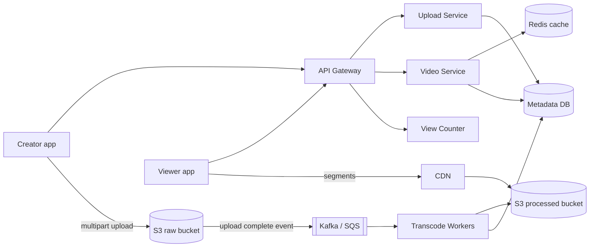
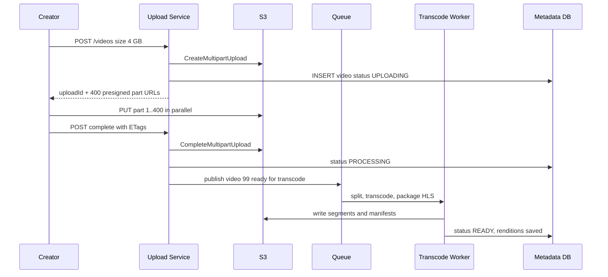
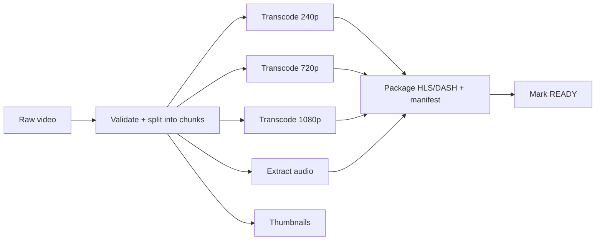

# Design YouTube / Netflix

**In one line:** a creator uploads a video, the system converts it into many resolutions, and viewers around the world watch it without buffering. The core challenge is **uploading big files, heavy transcoding, and delivering petabytes of video fast**.

**What the interviewer checks in this question:** correct use of blob storage + CDN, an async processing pipeline (queue + workers), adaptive streaming (HLS/DASH), and a caching strategy at read-heavy scale.

---

## Step 1: Clarify with the interviewer (3–5 min)

Ask these questions before you start the design:

| You ask | Typical answer | Effect on design |
|---|---|---|
| "Is upload, processing and watch in scope? Search, comments, recommendations?" | Upload + watch are core, the rest is out of scope | Focus on three flows |
| "What is the max video size?" | Up to 10 GB | Multipart + resumable upload |
| "How many uploads and views?" | 500 hours of video uploaded per min, 1B views/day | Very read-heavy, CDN is a must |
| "Should the video go live right after upload?" | A few minutes of delay is fine | Transcoding is async |
| "Is live streaming in scope?" | No | Only VOD (video on demand) |
| "Must the view count be exact and real-time?" | Some delay and an approximate number is fine | Async counting |

> **Say:** "I will design 2 core flows: upload + processing, and watch/streaming. Video bytes will never pass through my app servers. Upload goes directly to S3, and watch is served from the CDN."

## Step 2: Requirements

**Functional**
1. A creator can upload a video (a big file that resumes if the network drops midway)
2. The system processes the video into multiple resolutions (240p to 4K)
3. A viewer can watch the video, and quality changes on its own based on the network
4. Video metadata (title, description, thumbnail) and view count are shown

**Non-functional**
- **Availability > consistency:** it is fine if a view count or a new video shows up a bit late
- **Low latency:** video starts in < 2 sec, minimum buffering
- **Durability:** an uploaded video must never be lost
- **Scale:** read:write is more than ~100:1, global users

## Step 3: Estimation (only what changes the design)

- Upload: 500 hours/min. 1 hour of raw video ≈ 1–2 GB → **~1 PB raw/day**. Transcoded copies (5–6 resolutions) take ~3x storage. So we use a blob store like S3, and move old raw files to cold storage.
- Watch: 1B views/day ≈ **~12K video starts/sec**. Avg 5 Mbps × hundreds of thousands of concurrent viewers = **Tbps-level bandwidth**. Only a CDN can provide this.
- Metadata reads: metadata on every view → ~12K+ QPS. Serve from cache.

> **Say:** "The bottleneck is bandwidth and storage, not QPS. So the centre of the architecture is blob storage + CDN, and app servers only return metadata and URLs."

## Step 4: Core entities

- **User/Channel**: id, name, subscribers
- **Video**: id, channel_id, title, description, status (`UPLOADING`, `PROCESSING`, `READY`, `FAILED`), duration, created_at
- **VideoFile/Rendition**: video_id, resolution, codec, manifest_url, segment_prefix
- **Upload**: upload_id, video_id, parts_done, total_parts
- **ViewCount**: video_id, count (aggregated)

## Step 5: APIs

```http
POST /videos                {title, description, size}   → {videoId, uploadId, partUrls[]}
PUT  <presigned S3 part URL>                             → ETag   (client goes directly to S3)
POST /videos/{id}/complete  {uploadId, parts[{n, etag}]} → {status: PROCESSING}
GET  /videos/{id}                                        → metadata + manifestUrl
GET  <cdn>/videos/{id}/master.m3u8                       → HLS manifest
POST /videos/{id}/view      {watchedSec}                 → 202 Accepted
```

> **Say:** "The upload API only hands out pre-signed URLs. Passing a 10 GB file through an app server just wastes server bandwidth and memory."

## Step 6: High-level design



**Why each component:**
- **Upload Service:** creates the video row, starts the S3 multipart upload, and returns a pre-signed URL for each part.
- **S3 raw bucket:** the original file. Durable (11 nines) and cheap.
- **Queue + Transcode Workers:** heavy CPU work done async. Workers autoscale based on queue length.
- **S3 processed bucket + CDN:** HLS segments and manifests. Cached at the CDN edge, so less load on the origin.
- **Video Service + Redis:** metadata and manifest URL. Metadata of hot videos sits in the cache.
- **View Counter:** async aggregation of views, no DB write for every single view.

## Step 7: Main flow: upload and processing



The watch flow is simple: the client gets the manifest URL from `GET /videos/{id}`, then all segments come from the CDN. No video bytes reach the app server.

## Step 8: Data model & DB choice

```sql
videos(id PK, channel_id, title, description, status, duration_sec,
       raw_s3_key, created_at)
renditions(video_id, resolution, bitrate, codec, manifest_key,
           PRIMARY KEY(video_id, resolution))
uploads(upload_id PK, video_id, total_parts, status, expires_at)
view_counts(video_id PK, count, updated_at)
```

- **Metadata → MySQL/Postgres (sharded by video_id):** structured data with relations (channel, video, renditions). YouTube used Vitess (sharded MySQL).
- **Video bytes → S3:** never keep blobs in the DB.
- **View counts → Redis counters + periodic flush** to the DB, or Cassandra counters.

## Step 9: Deep dives (the interviewer will push here)

### 9.1 Big upload: pre-signed URL, multipart, resumable
- Split the file into **5–10 MB parts**. Each part gets its own pre-signed URL and parts upload in parallel. If one part fails, only that part is retried.
- **Resumable:** if the network drops, the client asks `GET /uploads/{id}` which parts are done (S3 `ListParts`) and sends the rest.
- The pre-signed URL has a short TTL (15–60 min) and allows PUT on only one key. Security stays intact.
- For unfinished uploads, add an S3 lifecycle rule: abort after 7 days.

### 9.2 Transcoding pipeline: DAG of tasks

- Split the video into **chunks (e.g. 10 sec)**. Each chunk × resolution is a separate task. Thousands of workers run in parallel, so a 1-hour video is ready in minutes.
- An orchestrator (like Temporal/Step Functions) tracks the DAG: which task is done and which needs a retry.
- Every task is **idempotent**: the same input gives the same output key. If a worker crashes, the task goes back to the queue, and overwriting is safe.
- Make 360p/720p ready first and put the video live, 4K can come later.

### 9.3 Adaptive bitrate: HLS/DASH
- Each resolution is cut into **2–6 sec segments**. The master manifest (`master.m3u8`) lists all qualities.
- The player measures bandwidth and picks a quality for each segment. 1080p on the metro, 240p in a tunnel, with no stopping.
- Segments are static files, so they cache perfectly on the CDN.

### 9.4 CDN: popular vs long-tail
- **Popular videos (top ~10–20%) = ~80% of traffic.** Pre-push these to CDN edges (like a new Netflix show before launch). Netflix puts its own boxes (Open Connect) inside ISPs.
- **Long-tail (old, rarely watched):** pull-based on the CDN, the first request comes from the origin. Add an origin shield layer so all edges don't hit S3 directly.
- Less popular resolutions of long-tail videos go to cold storage, or get transcoded on demand.

### 9.5 View counts
- Running `UPDATE videos SET views=views+1` on every view turns a viral video into a hot row.
- Send view events to Kafka. A stream processor aggregates them in 10–30 sec windows and batch-updates the DB. Show a near real-time count from a Redis counter.
- Fake view filtering (same IP/user again and again) also happens in this pipeline.

## Step 10: Decision table (what we chose, why, and what we did not)

| Decision | Why we chose it | What we did not choose, and why |
|---|---|---|
| **Pre-signed URL, direct S3 upload** | No bandwidth/memory used on app servers, S3 scales by itself | **Upload through the app server:** 10 GB files will choke the servers, extra hop |
| **Multipart + resumable** | Parallel parts, only one part retried on failure | **Single PUT:** 5 GB limit, if the network drops you redo everything |
| **Queue + workers, chunk-level DAG** | Async, autoscale, parallel, retry per task | **Sync transcode inside the upload request:** takes hours, request times out |
| **HLS/DASH segments** | Adaptive quality, CDN-friendly static files | **One big MP4 file:** no quality switch, buffering on slow networks |
| **CDN for delivery** | Tbps bandwidth, edge close to the user, low latency | **Serve from origin servers:** both bandwidth cost and latency are unacceptable |
| **SQL (sharded) for metadata** | Structured relations, moderate writes | **NoSQL only:** works, but you give up the benefit of joins/consistency. Never use a DB for the bytes |
| **Async batched view counts** | Avoids hot rows, 1000x fewer DB writes | **DB increment on every view:** lock contention on viral videos |

## Step 11: Failures & bottlenecks

| What failed | What happens | How to handle it |
|---|---|---|
| Upload stopped midway | Incomplete file | Resumable multipart, resume using `ListParts`. Clean up with a lifecycle rule |
| Transcode worker crash | Task left incomplete | Task runs again after the queue visibility timeout, idempotent output |
| Corrupt/unsupported video | Pipeline fails | Validate step first, status `FAILED`, notify the creator. Repeated failures go to a DLQ |
| CDN edge miss storm (viral video) | Load on the origin | Origin shield + pre-warming popular content |
| Metadata DB hot shard | Reads of one viral video | Redis cache + cache the metadata response on the CDN (short TTL) |
| Region down | Users can't get videos | Multi-CDN + S3 cross-region replication |

## Step 12: How to make it better (say this yourself at the end)

> "If I had more time, I would improve these:"
- **Per-title encoding** (Netflix style): a cartoon looks good at a low bitrate, action needs more. A separate bitrate ladder for each video saves 20–30% bandwidth
- **AV1/VP9 codecs** for popular videos: the same quality in fewer bytes (higher transcode cost, but only for top videos)
- **Predictive CDN pre-warming:** push content region-wise in advance based on trending signals
- **Duplicate upload detection:** use a content hash/fingerprint so the same video isn't transcoded again, plus a copyright check (Content ID)
- **Storage tiering:** for a video not watched in 1 year, delete rare resolutions and transcode on demand
- A separate low-latency HLS pipeline for live streaming

## Step 13: Likely follow-up questions

- "What if the network drops during a 10 GB upload?" → multipart, send only the remaining parts → Step 9.1
- "How will you make transcoding fast?" → split into chunks and run a parallel DAG → Step 9.2
- "How will you stop buffering on a slow network?" → HLS/DASH adaptive bitrate → Step 9.3
- "What if the CDN misses on a viral video?" → origin shield, request collapsing, pre-warm
- "Is the view count consistent?" → no, it is eventually consistent. Batched aggregation, a small delay is acceptable
- "If a video is private, how do you protect it on the CDN?" → signed CDN URLs/cookies with short expiry, DRM for paid content

## 2-minute recap

> In YouTube the bottleneck is bandwidth and storage, not QPS. Upload: the Upload Service creates the video row and returns pre-signed part URLs for an S3 multipart upload. The client sends parts directly to S3 in parallel, and it is resumable. On completion an event goes to the queue, and transcode workers split the video into chunks and run a DAG (each resolution, audio, thumbnails). Then they write HLS/DASH segments + manifest to S3 and set the status to READY. Watch: the Video Service returns metadata (sharded SQL + Redis) and the manifest URL, all segments come from the CDN, and the player changes quality with adaptive bitrate. Popular content is pre-pushed to the CDN, long-tail is pulled + origin shield. View counts are async and batched through Kafka.

## Checklist

- [ ] I can explain the pre-signed URL + multipart + resumable upload flow
- [ ] I can draw the transcoding DAG (split, parallel transcode, package)
- [ ] I can explain how HLS/DASH adaptive bitrate works
- [ ] I can tell the popular vs long-tail strategy on the CDN
- [ ] I can explain why view counts are async and how they are aggregated
- [ ] I can show from the estimate that the bottleneck is bandwidth, not QPS
- [ ] I can draw the HLD diagram in 5 min
- [ ] I can say 3 trade-offs from the decision table without looking
