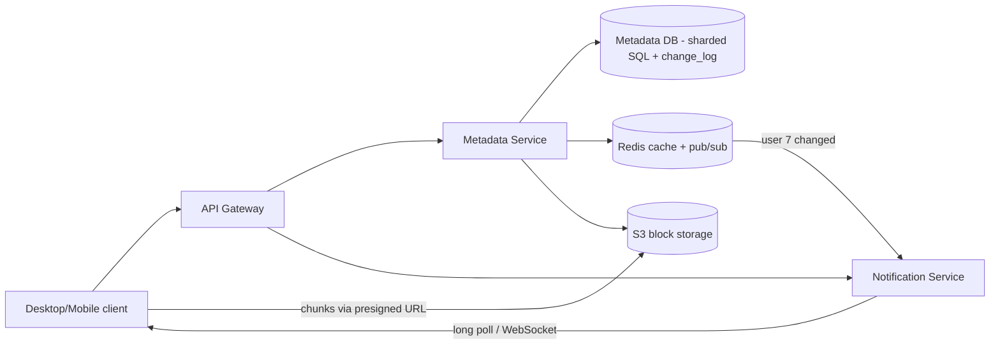
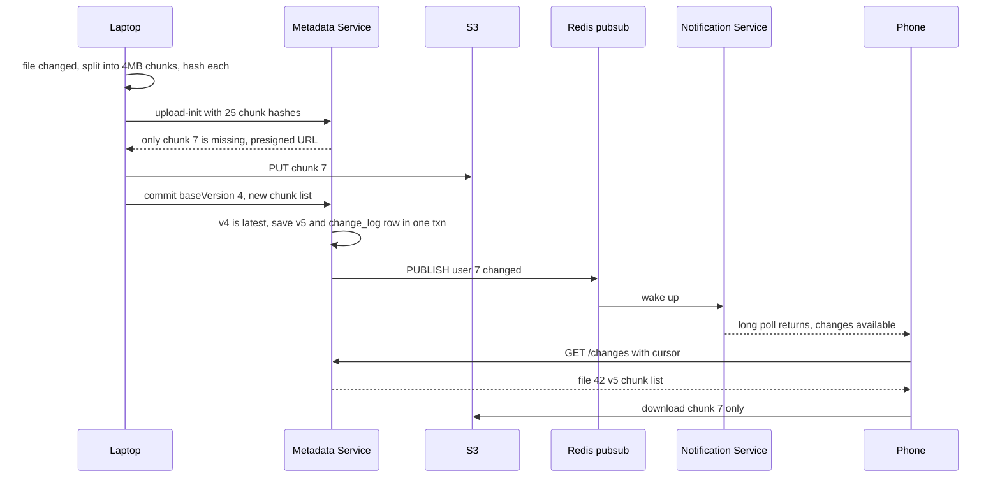
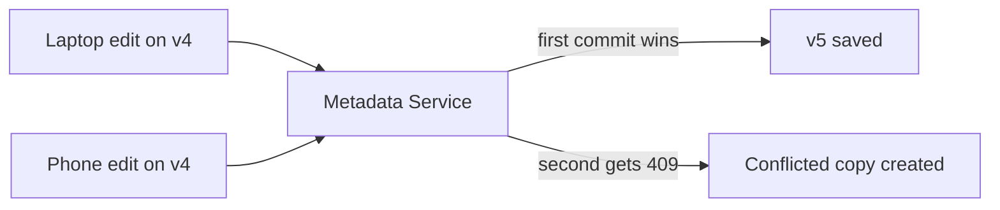

# Design Dropbox / Google Drive

**In one line:** a user uploads files, they sync to all of the user's devices (laptop, phone), and the user can share them with others. The core challenge is to **sync big files efficiently** (only the changed part), and to make sure no data is lost when **two devices edit at the same time**.

**What the interviewer checks in this question:** keeping metadata and file bytes separate, chunking + dedup, the sync protocol (notifications), conflict handling, and versioning.

---

## Step 1: Clarify with the interviewer (3–5 min)

Ask these questions before you start the design:

| You ask | Typical answer | Effect on design |
|---|---|---|
| "Is upload, download, multi-device sync and sharing in scope?" | Yes | 4 core flows |
| "Do we need real-time collaborative editing (like Google Docs)?" | No, only file sync | No OT/CRDT needed, a conflict copy is fine |
| "Max file size?" | Up to 50 GB | Chunking is a must |
| "How many users and how much data?" | 100M users, avg 10 GB/user | ~1 EB storage, dedup saves space |
| "How fast should sync show up?" | Within a few seconds | Push notification (long poll/WebSocket) |
| "How many days of version history?" | 30 days | Old chunks must be kept for 30 days |

> **Say:** "I will keep metadata (files, folders, versions, list of chunks) fully separate from the actual bytes (chunks). Metadata goes in strongly consistent SQL, bytes go in S3. For sync, change notifications are pushed to clients."

## Step 2: Requirements

**Functional (users should be able to)**
1. A user should be able to upload/download files (up to 50 GB), with resume
2. A change on one device should sync to the other devices on its own
3. A user should be able to share a file/folder (view/edit permission)
4. A user should be able to see old versions (30 days) and restore them

**Out of scope:** real-time collaborative editing (OT/CRDT), full-text search, previews, billing.

**Non-functional (in priority order)**
1. **Durability:** a file is never lost (11 nines, S3)
2. **Metadata consistency:** commit/rename/version are strongly consistent, no edit is silently lost
3. **Sync latency:** a change shows on other devices in < 5 sec. Bandwidth: only changed chunks
4. **Scale + availability:** 100M users, ~1 EB, ~2.5K commits/sec, 99.99% (with offline edits)

**CAP choice:** consistency for metadata (if a shard primary is down, that user's writes pause briefly, but conflicts are never resolved wrongly). Sync between devices is eventual: a notification can be late, and the cursor recovers it.

## Step 3: Estimation (only what changes the design)

- 100M users × 10 GB = **~1 EB**. Dedup (the same file with many users, like the same PDF) saves 20–30%.
- 4 MB chunks → 1 EB / 4 MB = **~250B chunks**. The chunk metadata table is huge, so it needs sharding.
- 20M daily active, each with ~10 file changes → **200M changes/day ≈ 2.5K/sec**. Notifications fan out to each user's 2–3 devices.

> **Say:** "Storage is at EB level, so bytes go in a blob store like S3 and dedup is necessary. Write QPS is moderate, so sharded SQL is fine for metadata."

## Step 4: Core entities

- **User**: id, email, quota_used
- **File**: id, owner_id, parent_folder_id, name, is_folder, latest_version, deleted
- **FileVersion**: file_id, version, chunk_hashes (ordered list), size, created_by_device, created_at
- **Chunk**: hash (SHA-256), s3_key, size, ref_count
- **Device**: id, user_id, last_cursor (how far it has synced)
- **Share/ACL**: file_id, user_id, role (`VIEWER`, `EDITOR`)

## Step 5: APIs

```http
POST /files/upload-init  {path, size, chunkHashes[]}    → {fileId, missingChunks[{hash, presignedUrl}]}
PUT  <presigned S3 URL>                                 → 200   (only missing chunks)
POST /files/{id}/commit  {baseVersion, chunkHashes[]}   → {version} or 409 conflict
GET  /files/{id}?version=5                              → {chunkHashes, presigned download URLs}
GET  /changes?cursor=abc123                             → {changes[], newCursor}   (long poll)
POST /files/{id}/share   {email, role}                  → 200
```

> **Say:** "The client first sends the chunk hashes. The server says which chunks it does not have. Only those get uploaded. This gives us both dedup and delta sync."

## Step 6: High-level design

**Start with a simple v1:** client → one Metadata Service → Postgres (files, versions, change_log) + S3 (chunks via pre-signed URLs). Devices poll `/changes?cursor=`. This meets all the FRs. Then: polling from 100M devices is wasted load → a long-poll Notification Service. ~1 EB and 250B chunk rows → sharded SQL. An ACL parent-chain walk on every request → a Redis cache.



**FR mapping:** FR1 → client chunking + pre-signed S3 + Metadata commit, FR2 → change_log + Notification Service + cursor, FR3 → `shares` ACL in the Metadata DB, FR4 → `file_versions` + S3 chunks.

**Why each component:**
- **Client (sync agent):** file watcher, chunking, hashing, and a local DB of the last synced state. The bandwidth NFR is met here.
- **Metadata Service + sharded SQL:** files, versions, chunk list, permissions; the consistency NFR. ~2.5K commits/sec is moderate for SQL; we shard only because of EB-scale row counts.
- **S3 block storage:** chunks by content hash (`chunks/<sha256>`). Durability NFR, cheap. No BLOBs in the DB.
- **change_log table (not Kafka):** write a per-user `seq` row in the same transaction as the commit. It is the source of truth for sync and also the outbox. Not Kafka, because it is ~2.5K events/sec with one real consumer (notifications); devices already replay through their cursor.
- **Redis pub/sub + Notification Service:** after a commit, `PUBLISH user:7`, and the node holding that user's long polls wakes up. A missed message is fine, the cursor recovers it. The simpler option, fixed polling: 100M devices × every 30 sec = ~3M useless req/sec.
- **Redis cache:** ACL parent chains and hot folder listings. The simpler option is read replicas, but a 5–10 level parent walk on every request is expensive on the DB.

## Step 7: Main flow: file edit and sync to another device



## Step 8: Data model & DB choice

```sql
files(id PK, owner_id, parent_id, name, is_folder, latest_version, deleted_at,
      UNIQUE(parent_id, name))
file_versions(file_id, version, size, chunk_hashes JSON, device_id, created_at,
      PRIMARY KEY(file_id, version))
chunks(hash PK, s3_key, size, ref_count)
shares(file_id, user_id, role, PRIMARY KEY(file_id, user_id))
change_log(user_id, seq, file_id, version, op, PRIMARY KEY(user_id, seq))
```

- **Metadata → MySQL/Postgres, sharded by owner_id (namespace):** all files of one user sit on one shard, so a folder move/rename is one transaction. This is what Dropbox did (Edgestore on MySQL).
- **Chunks → S3**, key = content hash. Same content = same key = automatic dedup.
- **change_log** has a monotonically increasing `seq` per user, written in the commit's transaction. A device's cursor is just the last `seq`.
- **The `chunks` table is sharded by hash** (250B rows), metadata by owner. So the `ref_count` update is not in the version commit's transaction; GC verifies again.

## Step 9: Deep dives (the interviewer will push here)

### 9.1 Chunking + dedup + delta sync
**NFR:** bandwidth (only changed chunks) + resumable 50 GB uploads.
- Split the file into **4 MB chunks** and take the SHA-256 of each chunk. A file version = an ordered list of chunks.
- One line changed in a 1 GB file → only 1 chunk (4 MB) is uploaded, not 1 GB.
- Dedup: in upload-init the server looks up the hash in the `chunks` table. If it exists, skip it. Even if another user uploaded the same file, skip it (cross-user dedup).
- **Problem with fixed-size chunks:** add 1 byte at the start of a file and all boundaries shift, so every chunk is new. Fix: **content-defined chunking** (rolling hash, Rabin fingerprint), which decides boundaries based on content.
- Security note: cross-user dedup can leak "whether someone has this file or not". In sensitive setups, use per-user dedup.
- **Trade-off:** client CPU (hashing) and a 250B-row chunk table, in exchange for bandwidth and storage savings.

### 9.2 Sync: how do devices find out?
**NFR:** a change reaches other devices in < 5 sec, and no data is missed even if a notification is.
- **Polling every 30 sec:** simple, but 100M devices × useless requests.
- **Long polling:** the client sends `GET /changes?cursor=X` and the server holds it until there is a change (max 60 sec). Dropbox uses this. Firewall-friendly.
- **WebSocket:** bi-directional, good for mobile/web.
- The notification only says "something changed". The client fetches the real data from `/changes` using its cursor. Even if a notification is missed, the next poll gets everything.
- An offline device that comes back fetches all changes from its last cursor.
- The wake-up signal goes through Redis pub/sub (fire-and-forget). A change in a shared folder publishes to every member user.
- **Trade-off:** we must hold millions of open long-poll connections (stateful Notification nodes), but there are 100x fewer requests than polling.

### 9.3 Conflict handling
**NFR:** no edit is silently lost.
- In the commit, the client sends `baseVersion` (the version it started editing from). This is **optimistic concurrency**.
- `UPDATE files SET latest_version=5 WHERE id=42 AND latest_version=4`. 0 rows → **409 conflict**.
- We don't lose data on conflict: the other person's file is saved as **"report (Vaibhav's conflicted copy).docx"**. The user merges it themselves.
- If you need real-time collaborative editing, that is a different design (OT/CRDT), covered in [Google Docs](../02-questions/t2-19-google-docs.md).
- **Trade-off:** the user must merge the conflicted copy by hand; no auto-merge.



### 9.4 Versioning, sharing, pre-signed URLs
**NFR:** durability + 30-day version history without doubling storage.
- **Versioning:** a new version = a new chunk list. Old chunks are reused, so versions are cheap. When `ref_count` hits 0 and 30 days pass, a garbage collector deletes the chunks.
- **Sharing:** ACL in the `shares` table. If a folder is shared, child files inherit the permission (walk the parent chain when checking, and cache it).
- **Pre-signed URLs:** download/upload always go directly to S3, with a short TTL (15 min). The Metadata Service hands out the URL only after a permission check. For a public link, use a share link with a random token.
- **Trade-off:** inherited ACL checks are expensive, hence the cache; revoking a permission must invalidate it.

## Step 10: Decision table (what we chose, why, and what we did not)

| Decision | Why we chose it | What we did not choose, and why |
|---|---|---|
| **Metadata and bytes separate** | Metadata is small and transactional. Bytes are big and cheap in a blob store | **Everything in one DB (BLOB column):** DB bloat, slow backups. **Sacrifice:** orphan chunks between two systems, needs GC |
| **4 MB chunks + SHA-256** | Delta sync, dedup, parallel and resumable upload | **Upload the whole file:** a 1-line change re-sends 1 GB. **Sacrifice:** client CPU + a huge chunk table |
| **Content hash as S3 key** | Same content stored once, dedup for free | **Random UUID keys:** 1000 copies of the same file. **Sacrifice:** cross-user dedup can leak file existence |
| **Sharded SQL for metadata** | Folder move/rename transaction, unique names, strong consistency | **Cassandra/DynamoDB:** no multi-row transactions, conflicting renames are hard. **Sacrifice:** extra work for cross-shard share/move |
| **change_log table + Redis pub/sub** for sync | ~2.5K commits/sec, cursor replay from the DB, cheap wake-ups | **Kafka:** one consumer, low volume, ops cost of another cluster. **Sacrifice:** if new consumers (search, audit) arrive we must move to Kafka |
| **Long poll + cursor** for sync | Near real-time, firewall-friendly, recover with the cursor if missed | **Fixed polling:** ~3M useless req/sec. **Push data only:** if missed, out of sync. **Sacrifice:** millions of open connections |
| **Optimistic concurrency + conflicted copy** | Data is never lost, no waiting on locks | **Last-write-wins:** work silently deleted. **File lock:** an offline device sits on the lock. **Sacrifice:** manual merge |
| **Pre-signed URLs** | Bytes don't pass through app servers | **Proxy through servers:** bandwidth bottleneck. **Sacrifice:** a leaked URL stays valid until TTL |

## Step 11: Failures & bottlenecks

| What failed | What happens | How to handle it |
|---|---|---|
| Upload stopped midway | Some chunks sent, no commit | No version is created until commit. On resume, send only the missing chunks |
| Chunks uploaded but commit failed | Orphan chunks in S3 | GC job: if not referenced by any version and older than 7 days, delete |
| Notification missed | Device didn't find out | Cursor-based `/changes`, the next long poll gets everything |
| Metadata shard down | That user's files are read-only/unavailable | Primary-replica, auto failover. Bytes are safe in S3 |
| Hot shared folder (company-wide) | Load on one shard, big fan-out | Read replicas + cache, batch the notifications |
| S3 region outage | Downloads fail | Cross-region replication, multi-AZ for durability |

## Step 12: How to make it better (say this yourself at the end)

> "If I had more time, I would improve these:"
- **Content-defined chunking** (rolling hash) so an insert in the middle of a file changes only 1–2 chunks
- **Compression** of chunks before upload (text files get 5–10x smaller)
- **LAN sync:** two laptops in the same office get chunks from each other, saving internet bandwidth
- **Cold storage tiering:** files not opened for 1 year go to S3 Glacier/IA, cost drops by 50%+
- **Client-side encryption** option for sensitive users (dedup becomes per-user)
- **Batch commits:** 1000 small files at once (an npm folder) in one API call

## Step 13: Likely follow-up questions

- "If 1 byte changes in a 1 GB file, how much is uploaded?" → only one 4 MB chunk → Step 9.1
- "Two devices edited the same file offline?" → baseVersion check, the second becomes a conflicted copy → Step 9.3
- "How does a device know something changed?" → long poll + cursor → Step 9.2
- "Is there a security risk with dedup?" → the hash leaks whether a file exists. Per-user dedup or convergent encryption
- "Is storage freed right away when a file is deleted?" → no, soft delete + 30-day version history, then ref_count GC
- "Folder rename with 100K files?" → change only the folder row's name, children are linked by `parent_id` so you don't touch them
- "Why no Kafka?" → ~2.5K commits/sec, one consumer. The change_log table is already a durable log; when consumers like search/audit arrive, go outbox → Kafka
- **Senior signal:** say it yourself: a company-wide shared folder becomes a hot shard and a fan-out problem (one commit → wake-ups for 10K users), and sharing/moving across shard boundaries needs a cross-shard transaction; so give shared folders their own namespace.

## 2-minute recap

> In Dropbox, metadata and bytes are separate. The client splits a file into 4 MB chunks and computes the SHA-256 of each chunk. It sends the hashes in upload-init, the server says which are missing, and only those go directly to S3 through pre-signed URLs (dedup + delta sync). On commit, the new chunk list becomes a new version, the `baseVersion` check gives optimistic concurrency, and a conflict creates a "conflicted copy". Metadata lives in sharded SQL (by owner) and is strongly consistent. Every commit writes a `change_log` row in the same transaction (no Kafka, only ~2.5K/sec and one consumer), and through Redis pub/sub the Notification Service wakes the other devices over long poll/WebSocket, and each device fetches changes with its cursor. Versions reuse old chunks, and GC works on ref_count. Sharing uses an ACL table, and downloads use short-TTL pre-signed URLs.

## Checklist

- [ ] I can explain why the metadata service and block storage are separate
- [ ] I can explain dedup and delta sync with chunking + content hash
- [ ] I can draw the long poll + cursor based sync flow
- [ ] I can tell how to detect a conflict with baseVersion and create a conflicted copy
- [ ] I can explain versioning and garbage collection (ref_count)
- [ ] I can tell the role of sharing permissions and pre-signed URLs
- [ ] I can draw the HLD diagram in 5 min
- [ ] I can say 3 trade-offs from the decision table without looking
