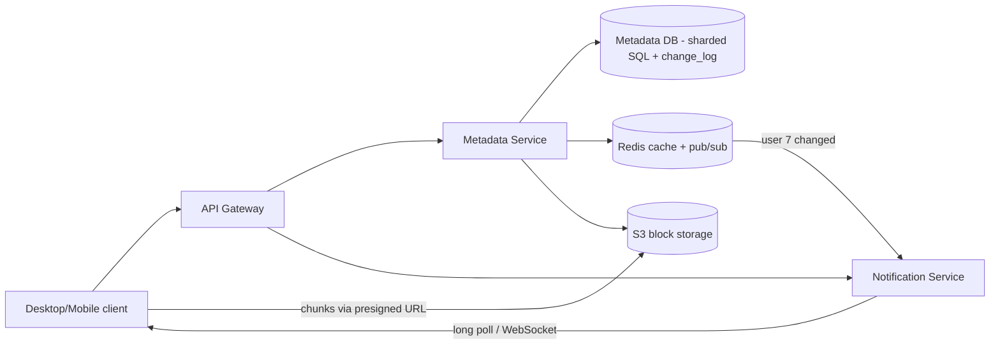
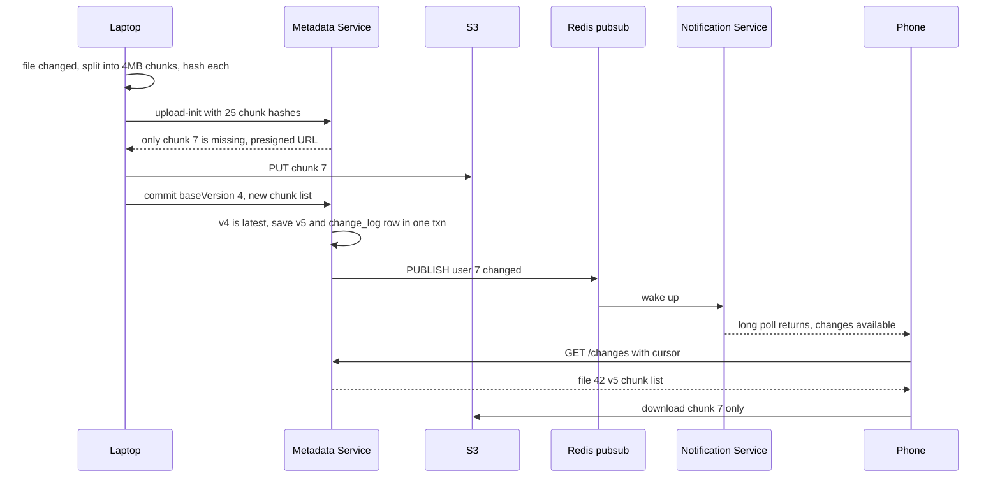
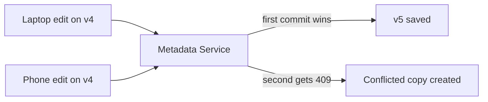

# Design Dropbox / Google Drive

**In one line:** upload files, sync to all devices, share. Core challenge: **sync big files efficiently** (only the changed part) and lose no data when **two devices edit at once**.

**What the interviewer checks:** metadata vs bytes separate, chunking + dedup, sync protocol (notifications), conflict handling, versioning.

---

## Step 1: Clarify with the interviewer (3–5 min)

| You ask | Typical answer | Effect on design |
|---|---|---|
| "Scope: upload, download, multi-device sync, sharing?" | Yes | 4 core flows |
| "Real-time collaborative editing (like Google Docs)?" | No, only file sync | No OT/CRDT, a conflict copy is fine |
| "Max file size?" | Up to 50 GB | Chunking is a must |
| "How many users and how much data?" | 100M users, avg 10 GB/user | ~1 EB storage, dedup saves space |
| "How fast should sync show up?" | Within a few seconds | Push (long poll/WebSocket) |
| "How many days of version history?" | 30 days | Keep old chunks 30 days |

> **Say:** "Metadata and bytes are separate: metadata in strongly consistent SQL, bytes in S3. For sync, change notifications are pushed."

## Step 2: Requirements

**Functional**
1. Upload/download files (up to 50 GB), with resume
2. A change on one device auto-syncs to the others
3. Share a file/folder (view/edit permission)
4. See and restore old versions (30 days)

**Out of scope:** real-time collaborative editing (OT/CRDT), full-text search, previews, billing.

**Non-functional (in priority order)**
1. **Durability:** a file is never lost (11 nines, S3)
2. **Metadata consistency:** commit/rename/version strong, no edit silently lost
3. **Sync latency:** other devices in < 5 sec. Bandwidth: only changed chunks
4. **Scale + availability:** 100M users, ~1 EB, ~2.5K commits/sec, 99.99% (with offline edits)

**CAP:** metadata → consistency (writes pause if the primary is down, but conflicts are never resolved wrongly). Device sync is eventual, cursor recovers.

## Step 3: Estimation (only what changes the design)

- 100M × 10 GB = **~1 EB**. Dedup (same PDF with many users) saves 20–30%.
- 1 EB / 4 MB = **~250B chunks** → sharded chunk table.
- 20M DAU × ~10 changes → **200M/day ≈ 2.5K/sec**, fan-out to 2–3 devices.

> **Say:** "Storage is EB level → bytes in a blob store + dedup. Write QPS is moderate → sharded SQL is fine for metadata."

## Step 4: Core entities

- **User**: id, email, quota_used
- **File**: id, owner_id, parent_folder_id, name, is_folder, latest_version, deleted
- **FileVersion**: file_id, version, chunk_hashes (ordered list), size, created_by_device, created_at
- **Chunk**: hash (SHA-256), s3_key, size, ref_count
- **Device**: id, user_id, last_cursor (how far it has synced)
- **Share/ACL**: file_id, user_id, role (`VIEWER`, `EDITOR`)

## Step 5: APIs

```http
POST /files/upload-init  {path, size, chunkHashes[]}    → {fileId, missingChunks[{hash, presignedUrl}]}
PUT  <presigned S3 URL>                                 → 200   (only missing chunks)
POST /files/{id}/commit  {baseVersion, chunkHashes[]}   → {version} or 409 conflict
GET  /files/{id}?version=5                              → {chunkHashes, presigned download URLs}
GET  /changes?cursor=abc123                             → {changes[], newCursor}   (long poll)
POST /files/{id}/share   {email, role}                  → 200
```

> **Say:** "The client sends hashes, the server says which are missing, only those are uploaded: dedup + delta sync together."

## Step 6: High-level design

**v1:** Metadata Service → Postgres + S3 (pre-signed), devices poll `/changes?cursor=`. Then:
- Polling from 100M devices → long-poll Notification Service
- ~1 EB, 250B chunk rows → sharded SQL
- ACL parent-chain walk on every request → Redis cache



**FR mapping:** FR1 → client chunking + pre-signed S3 + Metadata commit, FR2 → change_log + Notification Service + cursor, FR3 → `shares` ACL in the Metadata DB, FR4 → `file_versions` + S3 chunks.

**Why each component** (alternatives in Step 10):
- **Client (sync agent):** file watcher, chunking, hashing, local DB of the last synced state.
- **Metadata + sharded SQL:** sharding only for EB-scale rows.
- **change_log:** source of truth for sync + outbox.
- **Redis pub/sub + Notification Service:** `PUBLISH user:7` → the node holding the long poll wakes up. A miss is fine (cursor).
- **Redis cache:** ACL parent chain (5–10 levels) + hot folder listings.

## Step 7: Main flow: file edit and sync to another device



## Step 8: Data model & DB choice

```sql
files(id PK, owner_id, parent_id, name, is_folder, latest_version, deleted_at,
      UNIQUE(parent_id, name))
file_versions(file_id, version, size, chunk_hashes JSON, device_id, created_at,
      PRIMARY KEY(file_id, version))
chunks(hash PK, s3_key, size, ref_count)
shares(file_id, user_id, role, PRIMARY KEY(file_id, user_id))
change_log(user_id, seq, file_id, version, op, PRIMARY KEY(user_id, seq))
```

- **Metadata → MySQL/Postgres, sharded by owner_id (namespace):** move/rename on one shard, one transaction. Dropbox: Edgestore on MySQL.
- **Chunks → S3** (`chunks/<sha256>`) → automatic dedup.
- **change_log:** monotonic `seq` per user, in the commit's txn. Device cursor = last `seq`.
- **`chunks` sharded by hash** (250B rows), metadata by owner → `ref_count` not in the commit txn; GC re-verifies.

## Step 9: Deep dives (the interviewer will push here)

### 9.1 Chunking + dedup + delta sync
**NFR:** bandwidth (only changed chunks) + resumable 50 GB uploads.
- **4 MB chunks**, SHA-256 each. Version = ordered chunk list.
- One line changed in a 1 GB file → only 1 chunk uploaded. Hash already in `chunks` → skip (cross-user dedup too).
- **Fixed-size problem:** 1 byte added at the start → boundaries shift. Fix: **content-defined chunking** (Rabin rolling hash).
- **Security:** cross-user dedup leaks file existence; per-user dedup in sensitive setups.
- **Trade-off:** client CPU + 250B rows vs bandwidth + storage savings.

### 9.2 Sync: how do devices find out?
**NFR:** < 5 sec, no data missed even if a notification is.
- **Polling every 30 sec:** 100M × 30 sec = ~3M useless req/sec.
- **Long polling:** `GET /changes?cursor=X` held until a change (max 60 sec). Dropbox uses this; firewall-friendly. **WebSocket** for mobile/web.
- Notification only says "something changed"; data via cursor from `/changes`. Missed or offline → last cursor gets everything.
- Shared folder change → publish to every member.
- **Trade-off:** millions of open connections (stateful nodes), but 100x fewer requests.

### 9.3 Conflict handling
**NFR:** no edit is silently lost.
- Commit carries `baseVersion` (the version editing started from) → **optimistic concurrency**.
- `UPDATE files SET latest_version=5 WHERE id=42 AND latest_version=4`. 0 rows → **409 conflict**.
- On conflict the other file is saved as **"report (Vaibhav's conflicted copy).docx"**; the user merges by hand (trade-off: no auto-merge).
- Real-time collaborative editing (OT/CRDT) is a different design: [Google Docs](../02-questions/t2-19-google-docs.md).



### 9.4 Versioning, sharing, pre-signed URLs
**NFR:** durability + 30-day history without doubling storage.
- **Versioning:** new version = new chunk list, chunks reused → cheap. `ref_count` 0 + 30 days → GC.
- **Sharing:** `shares` ACL; children inherit (parent chain check, cached).
- **Pre-signed URLs:** direct to S3, TTL 15 min, after a permission check. Public link = random token.
- **Trade-off:** inherited ACL checks are expensive → cache; invalidate on revoke.

## Step 10: Decision table (what we chose, why, and what we did not)

| Decision | Why we chose it | What we did not choose, and why |
|---|---|---|
| **Metadata and bytes separate** | Metadata transactional, bytes cheap in blob store | **BLOB column:** DB bloat, slow backups. **Sacrifice:** orphan chunks, needs GC |
| **4 MB chunks + SHA-256** | Delta sync, dedup, parallel + resumable | **Whole file:** 1-line change re-sends 1 GB. **Sacrifice:** client CPU, huge chunk table |
| **Content hash as S3 key** | Same content stored once, free dedup | **Random UUID:** 1000 copies. **Sacrifice:** existence leak risk |
| **Sharded SQL for metadata** | Move/rename transaction, unique names, strong consistency | **Cassandra/DynamoDB:** no multi-row txn. **Sacrifice:** cross-shard share/move |
| **change_log table + Redis pub/sub** for sync | ~2.5K/sec, cursor replay, cheap wake-ups | **Kafka:** one consumer, extra ops. **Sacrifice:** new consumers (search, audit) → Kafka |
| **Long poll + cursor** for sync | Near real-time, firewall-friendly, cursor recovery | **Polling:** ~3M req/sec. **Push data:** miss = out of sync. **Sacrifice:** open conns |
| **Optimistic concurrency + conflicted copy** | Data never lost, no lock waits | **LWW:** silent data loss. **File lock:** offline device holds it. **Sacrifice:** manual merge |
| **Pre-signed URLs** | Bytes skip app servers | **Proxy:** bandwidth bottleneck. **Sacrifice:** leaked URL valid till TTL |

## Step 11: Failures & bottlenecks

| What failed | What happens | How to handle it |
|---|---|---|
| Upload stopped midway | No commit | No version created; resume sends missing chunks |
| Chunks uploaded, commit failed | Orphan chunks in S3 | GC: unreferenced + older than 7 days → delete |
| Notification missed | Device didn't find out | Cursor `/changes`, next long poll |
| Metadata shard down | Files read-only/unavailable | Primary-replica failover; bytes safe in S3 |
| Hot shared folder | Shard load, big fan-out | Replicas + cache, batch notifications |
| S3 region outage | Downloads fail | Cross-region replication, multi-AZ |

## Step 12: How to make it better (say this yourself at the end)

- **Content-defined chunking:** an insert in the middle changes only 1–2 chunks
- **Compression** before upload (text 5–10x smaller)
- **LAN sync:** laptops in the same office share chunks
- **Cold tiering:** unopened for 1 year → S3 Glacier/IA, 50%+ cheaper
- **Batch commits:** 1000 small files (an npm folder) in one API call

## Step 13: Likely follow-up questions

- "1 byte changed in a 1 GB file?" → only one 4 MB chunk (9.1)
- "Two devices edited the same file offline?" → baseVersion check, second becomes a conflicted copy (9.3)
- "Security risk with dedup?" → existence leak; per-user dedup or convergent encryption
- "Storage freed right away on delete?" → no: soft delete + 30-day history, then ref_count GC
- "Folder rename with 100K files?" → only the folder row; children linked by `parent_id`
- "Why no Kafka?" → ~2.5K/sec, one consumer, change_log is the durable log; new consumers → outbox → Kafka
- **Senior signal:** say it yourself: a company-wide shared folder becomes a hot shard and a fan-out problem (one commit → wake-ups for 10K users), and sharing/moving across shard boundaries needs a cross-shard transaction; so give shared folders their own namespace.

## 2-minute recap

> Metadata and bytes separate. 4 MB chunks + SHA-256 → only missing chunks go to S3 (dedup + delta sync). Commit = new version; `baseVersion` → 409 → conflicted copy. Metadata in sharded SQL (by owner). `change_log` row in the same txn; Redis pub/sub → long poll → changes via cursor. Versions reuse chunks, ref_count GC. ACL table, short-TTL pre-signed URLs.

## Checklist

- [ ] I can explain why the metadata service and block storage are separate
- [ ] I can explain dedup and delta sync with chunking + content hash
- [ ] I can draw the long poll + cursor based sync flow
- [ ] I can tell how to detect a conflict with baseVersion and create a conflicted copy
- [ ] I can explain versioning and garbage collection (ref_count)
- [ ] I can tell the role of sharing permissions and pre-signed URLs
- [ ] I can draw the HLD diagram in 5 min
- [ ] I can say 3 trade-offs from the decision table without looking
