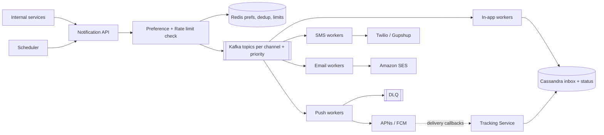
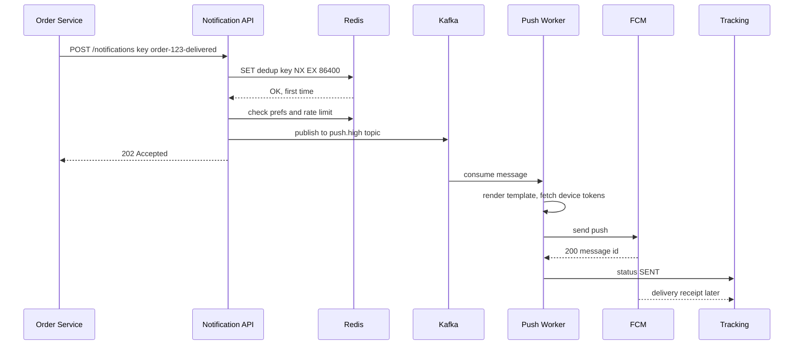
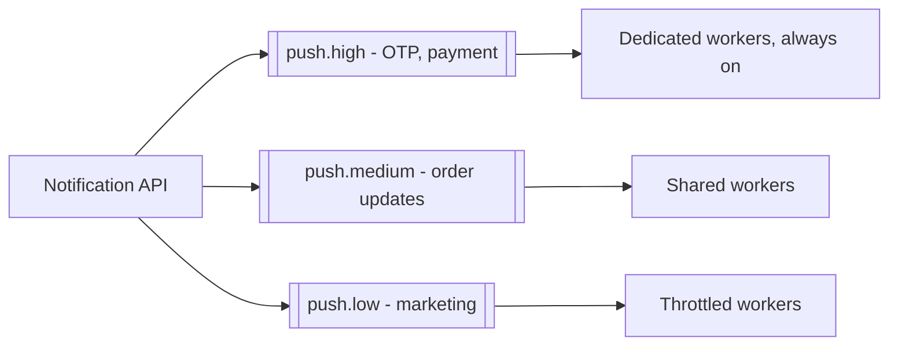

# Design a Notification System

**In one line:** other services (orders, payments, marketing) make one API call, and the system sends the user a push, SMS, email or in-app notification, while respecting the user's preferences and limits. The core challenge is that **no notification is missed, none is sent twice, and slow third-party providers don't slow down the whole system**.

**What the interviewer checks in this question:** an async queue-based design, per-channel isolation, retries + DLQ, idempotency, priority (OTP vs marketing), and handling third-party failures.

---

## Step 1: Clarify with the interviewer (3–5 min)

Ask these questions before you start the design:

| You ask | Typical answer | Effect on design |
|---|---|---|
| "Which channels? Push, SMS, email, in-app?" | All four | A separate queue + worker for each channel |
| "Both transactional (OTP, order update) and marketing?" | Yes | Priority queues, OTP goes first |
| "What is the scale?" | ~100M notifications/day, 10M at once for a campaign | Kafka + horizontal workers |
| "Delivery guarantee? Are duplicates OK?" | At-least-once, but the user must not see duplicates | Idempotency key + dedup |
| "User preferences and opt-out?" | Yes, and quiet hours too | Preference check in the pipeline |
| "Scheduled notifications?" | Yes, "send tomorrow at 9" | Scheduler component |

> **Say:** "I will design this as an async pipeline: the API validates the request and puts it in Kafka, and each channel's workers send to their provider (APNs, FCM, Twilio, SES). Transactional and marketing traffic run at different priorities."

## Step 2: Requirements

**Functional**
1. Internal services can send a notification through one API (single user or bulk/campaign)
2. Channels: push (iOS/Android), SMS, email, in-app
3. User preferences (opt-out, channel choice, quiet hours) and rate limits are respected
4. Templates, scheduling, and delivery status tracking (sent, delivered, opened)

**Non-functional**
- **Reliability:** no notification is lost (at-least-once)
- **No duplicates for user:** the same OTP is not sent twice
- **Low latency for transactional:** OTP within < 5 sec
- **Scale:** spiky (campaigns, IPL match end), isolation from third-party failures

## Step 3: Estimation (only what changes the design)

- 100M/day ≈ **~1.2K/sec avg**. Campaign: 10M in 10 min ≈ **~17K/sec peak**. So we need a queue as a buffer.
- Provider limits: SMS provider ~1K/sec, APNs/FCM high. **The provider decides the throughput, not us.** Workers must throttle to the provider's rate.
- Status events (sent/delivered/opened) are ~3x notifications → ~300M/day. Write-heavy, so a store like Cassandra.

> **Say:** "The bottleneck is not my servers, it is the third-party providers. So I will put a Kafka buffer in the middle, per-channel workers, and provider-wise rate limiting."

## Step 4: Core entities

- **Notification**: id, user_id, type, channel, priority, template_id, payload, idempotency_key, status, scheduled_at
- **Template**: id, channel, locale, subject, body (`"Hi {{name}}, order {{orderId}} delivered"`)
- **UserPreference**: user_id, channel, category (`OTP`, `ORDER`, `PROMO`), enabled, quiet_hours
- **DeviceToken**: user_id, platform (iOS/Android), token, last_active
- **DeliveryEvent**: notification_id, status (`QUEUED`, `SENT`, `DELIVERED`, `FAILED`, `OPENED`), provider, timestamp

## Step 5: APIs

```http
POST /notifications
     Header: Idempotency-Key: order-123-delivered
     {userId, type: ORDER_DELIVERED, channels: [push, sms],
      templateId, params: {orderId: 123}, priority: HIGH, sendAt?}
     → 202 {notificationId}
POST /notifications/bulk    {segmentId, templateId, sendAt}   → 202 {campaignId}
GET  /notifications/{id}                                      → status per channel
PUT  /users/{id}/preferences {category, channel, enabled}     → 200
GET  /users/{id}/inbox?cursor=...                             → in-app notifications
```

> **Say:** "The API returns 202 Accepted, because the actual sending is async. The caller does not have to wait for the provider's response."

## Step 6: High-level design



**Why each component:**
- **Notification API:** validates, checks idempotency, resolves the template, then puts the message in Kafka and returns 202.
- **Preference + Rate limit check:** opt-out, quiet hours, per-user limit (max 3 promos/day). Cached in Redis.
- **Kafka topics per channel:** if the SMS provider is down, only the SMS topic stops and push keeps running. Separate topics for priority.
- **Channel workers:** stateless, call the provider's SDK, have retry logic. Scale based on the provider's rate.
- **DLQ:** messages that fail again and again are kept aside for investigation/replay.
- **Tracking Service:** records provider callbacks (delivered, bounced) and opens/clicks.

## Step 7: Main flow: order delivered notification



## Step 8: Data model & DB choice

```sql
-- Postgres: low write, config type data
templates(id PK, channel, locale, version, subject, body)
user_preferences(user_id, category, channel, enabled, quiet_start, quiet_end,
                 PRIMARY KEY(user_id, category, channel))
device_tokens(user_id, token PK, platform, last_active)
```

```text
Cassandra (write-heavy, time-ordered):
notifications_by_user  PK user_id, CK created_at DESC → in-app inbox
delivery_events        PK notification_id, CK ts      → status history
```

- **Templates, preferences → Postgres + Redis cache:** small data, many reads.
- **Notification log, status, inbox → Cassandra:** 300M+ writes/day, partitioned by user, sorted by time.
- **Dedup keys, rate limit counters → Redis** with TTL.

## Step 9: Deep dives (the interviewer will push here)

### 9.1 Retries, backoff and DLQ
- The provider returned 5xx/timeout → **exponential backoff + jitter** (1s, 2s, 4s, 8s...), max 5 tries.
- Use separate **retry topics** for retries (`sms.retry.1m`, `sms.retry.10m`), so the main topic is not blocked.
- After 5 tries → **DLQ**. Alert + dashboard, replay after the fix.
- No retry on 4xx (invalid token, invalid number). Mark the token as inactive.
- **Circuit breaker:** if Twilio keeps failing → switch to a fallback provider (Gupshup/MSG91). That is why you keep an adapter interface in front of providers.

### 9.2 Idempotency and dedup
- Kafka is at-least-once. If a worker sends and then crashes before the commit → the message comes again.
- **API level:** store the caller's `Idempotency-Key` (e.g. `order-123-delivered`) in Redis with `SET NX EX 24h`. On a duplicate request, return the same notificationId.
- **Worker level:** check `sent:{notificationId}:{channel}` before sending. Set it after sending. A small window still remains, so many providers also accept an idempotency key, pass it to them.
- Exactly-once is impossible with a third party. Target: **effectively once** for the user.

### 9.3 Priority and rate limits

- A 10M marketing campaign must not block OTPs. Separate topics, separate consumer groups, and reserved workers for OTP.
- **Per-user rate limit:** max 3 promos/day, 1 per hour (Redis counter / sliding window). No limit on transactional.
- **Per-provider rate limit:** token bucket, don't send more than the SMS provider's 1K/sec limit, or it will block you.
- **Quiet hours:** hold promos from 10 pm to 8 am, put them in the scheduled queue.

### 9.4 Templates, scheduling, bulk fan-out
- **Templates:** versioned, per locale (Hindi, English). The worker fills in `{{name}}`. Templates change without a code deploy.
- **Scheduling:** a `send_at` index on the `scheduled_notifications` table. Every minute the scheduler picks up due rows and puts them into the API/Kafka. At very large scale, use time-bucketed partitions (by minute).
- **Bulk campaign:** split the segment (10M users) into small batches (1K), each batch is one Kafka message. Fan-out workers expand a batch into individual notifications. No single giant job.

### 9.5 Delivery tracking
- Worker: `QUEUED → SENT`. Provider callback/webhook: `DELIVERED`, `BOUNCED`. App/email pixel: `OPENED`, `CLICKED`.
- Events go Kafka → Cassandra + analytics warehouse. Campaign dashboard: sent vs delivered vs opened.
- On email bounces/spam complaints, put the address on a suppress list, or the SES account can get blocked.

## Step 10: Decision table (what we chose, why, and what we did not)

| Decision | Why we chose it | What we did not choose, and why |
|---|---|---|
| **Async API (202) + Kafka** | Caller is fast, spikes get buffered, replay is possible | **Sync provider call in API:** if Twilio is slow, Order Service is slow too, and everything falls over in a spike |
| **Topic per channel + priority** | One provider's outage does not stop other channels, OTP doesn't get stuck behind marketing | **One common queue:** head-of-line blocking, OTP 20 min late behind 10M promos |
| **Kafka** over plain SQS/RabbitMQ | High throughput, retention + replay, multiple consumers (tracking, analytics) | **RabbitMQ:** good per-message priority, but Kafka is better for replay and very high throughput. SQS also works if AWS-only |
| **Retry topics + backoff + DLQ** | Main flow is not blocked, poison messages kept aside | **Infinite inline retry:** the consumer gets stuck and the rest of the partition's traffic stops |
| **Idempotency key + Redis dedup** | No duplicates for the user even with at-least-once | **Relying on Kafka exactly-once:** a third-party call is not part of a Kafka transaction |
| **Cassandra** for logs/inbox | 300M+ writes/day, per-user time-ordered reads | **Postgres:** sharding burden at this many writes, and no need for relations |
| **Provider adapter + fallback** | Switch if one vendor is down/expensive | **Single hardcoded provider:** vendor outage = whole channel down |

## Step 11: Failures & bottlenecks

| What failed | What happens | How to handle it |
|---|---|---|
| SMS provider down | SMS fails | Circuit breaker → fallback provider. Hold in the retry topic |
| Worker crash after send, before commit | May send a duplicate | `sent:` dedup key + provider idempotency key |
| Campaign spike (10M) | Queue lag | Kafka buffer, low priority topic throttled, separate OTP workers |
| Invalid device tokens | Useless calls, provider warning | Mark token inactive on 4xx, cleanup job |
| Redis down | No dedup/rate limit check | Fail-open for transactional (send), fail-closed for marketing (hold) |
| Kafka broker down | Publish fails | Replication factor 3, `acks=all`. API retries with the same idempotency key |

## Step 12: How to make it better (say this yourself at the end)

> "If I had more time, I would improve these:"
- **Smart channel fallback:** if a push is not delivered/opened in 5 min, send an SMS (only for important types)
- **Send-time optimization:** send promos at the time the user usually opens the app, so the open rate goes up
- **Notification batching/digest:** instead of 10 notifications for 10 likes, "Rahul and 9 others liked this"
- **Cost optimization:** SMS is expensive, skip SMS when push is enabled
- **Multi-region workers** + region-wise providers (Indian SMS gateways in India, DLT compliance)
- **Observability:** alerts and an SLO dashboard on latency, failure rate and DLQ size per channel/provider

## Step 13: Likely follow-up questions

- "How do you make sure the user doesn't get the same notification twice?" → API idempotency key + worker dedup → Step 9.2
- "What if a provider is down?" → backoff retries, retry topics, DLQ, fallback provider → Step 9.1
- "Why won't OTP be late during a marketing blast?" → separate priority topics and dedicated workers → Step 9.3
- "What if the user opted out?" → preference check before sending, cached in Redis. Transactional (OTP) can't be opted out of
- "How will you send a campaign to 10M users?" → fan-out in batches, throttled low priority topic → Step 9.4
- "Is order preserved?" → if you need per-user ordering, Kafka key = userId, order is kept within one partition

## 2-minute recap

> A notification system is an async pipeline. Internal services call `POST /notifications` (with an Idempotency-Key). The API checks dedup (Redis `SET NX`), preferences, quiet hours and the per-user rate limit, puts the message in Kafka, and returns 202. Kafka has separate topics for each channel (push, SMS, email, in-app) and priority (high/medium/low), so one provider's outage or a marketing blast doesn't block OTPs. Stateless channel workers render the template and call APNs/FCM, Twilio, SES, staying inside the provider's rate limit. On failure: exponential backoff, retry topics, then DLQ, and a circuit breaker switches to a fallback provider. Status events go to Cassandra, and delivered/opened is tracked from provider callbacks. The scheduler puts due notifications into the pipeline, and campaigns fan out in batches.

## Checklist

- [ ] I can draw the HLD with channel-wise Kafka topics + workers in 5 min
- [ ] I can explain the flow of retries with backoff, retry topics and DLQ
- [ ] I can tell how an idempotency key + dedup stop duplicates
- [ ] I can explain OTP vs marketing priority isolation
- [ ] I can tell where preferences, quiet hours and rate limits are checked
- [ ] I can explain scheduling and bulk campaign fan-out
- [ ] I can tell the delivery tracking flow (sent, delivered, opened)
- [ ] I can say 3 trade-offs from the decision table without looking
