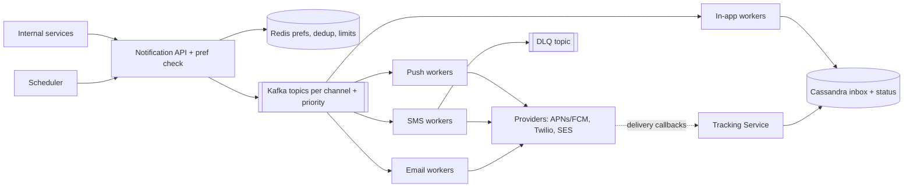
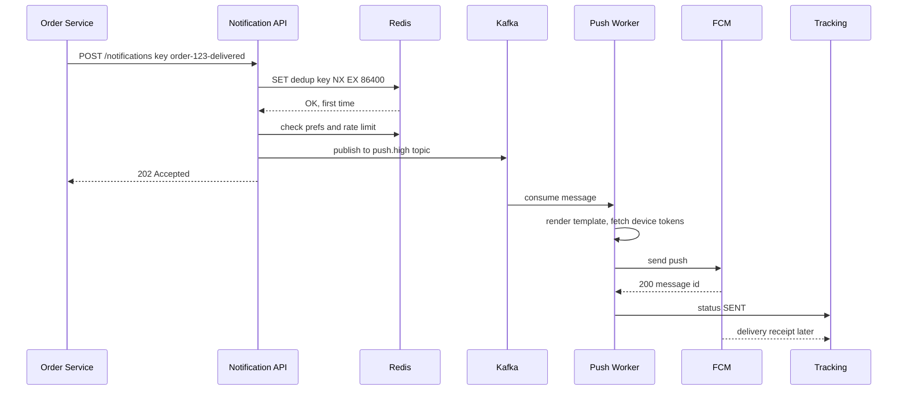
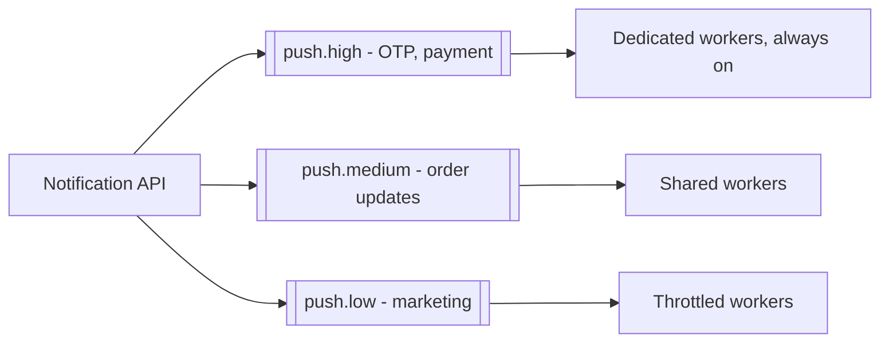

# Design a Notification System

**In one line:** services (orders, payments, marketing) call an API → the user gets a push, SMS, email or in-app notification, respecting preferences + limits. Core challenge: **no notification missed, none sent twice, slow providers don't slow the whole system**.

**What the interviewer checks:** async queue, channel isolation, retries + DLQ, idempotency, OTP vs marketing priority, provider failures.

---

## Step 1: Clarify with the interviewer (3–5 min)

| You ask | Typical answer | Effect on design |
|---|---|---|
| "Channels? Push, SMS, email, in-app?" | All four | Separate queue + worker per channel |
| "Both transactional (OTP, order) and marketing?" | Yes | Priority queues, OTP first |
| "Scale?" | ~100M/day, 10M at once for a campaign | Kafka + horizontal workers |
| "Delivery guarantee? Duplicates OK?" | At-least-once, but no duplicates for the user | Idempotency key + dedup |
| "Preferences and opt-out?" | Yes, quiet hours too | Preference check in the pipeline |
| "Scheduled notifications?" | Yes, "tomorrow at 9" | Scheduler |

> **Say:** "Async pipeline: API → Kafka → channel workers → providers (APNs, FCM, Twilio, SES). Transactional and marketing on separate priorities."

## Step 2: Requirements

**Functional**
1. Internal services send to a user or segment (campaign) via API, now or scheduled
2. Users get push (iOS/Android), SMS, email or in-app
3. Users set preferences (opt-out, channel, quiet hours); the system honours them + rate limits
4. Callers see delivery status (sent, delivered, opened)

**Out of scope:** template editor UI, A/B testing, provider internals (APNs/Twilio as black boxes).

**Non-functional (in priority order)**
1. **Reliability:** an accepted notification is never lost (at-least-once, durable queue)
2. **Transactional latency:** OTP p99 < 5 sec end-to-end, even during a campaign
3. **No duplicates:** effectively once
4. **Scale + isolation:** 100M/day, campaign peak ~17K/sec; one provider's outage must not stop other channels

**CAP:** availability: accept + queue even if a provider/Redis is down. Slightly stale prefs are fine; dedup is best-effort + provider idempotency.

## Step 3: Estimation (only what changes the design)

- 100M/day ≈ **~1.2K/sec avg**. Campaign: 10M in 10 min ≈ **~17K/sec peak** → queue buffer.
- SMS provider ~1K/sec, APNs/FCM high → **the provider decides throughput**, workers throttle.
- Status events ~3x → ~300M/day ≈ 3.5K/sec avg, **~50K/sec** in a campaign. Write-heavy + TTL → Cassandra.
- Peak: 17K/sec × ~2 channels + 3x status ≈ **~100K msgs/sec** + replay need → Kafka.

> **Say:** "The bottleneck is providers, not my servers: Kafka buffer, per-channel workers, provider-wise rate limiting."

## Step 4: Core entities

- **Notification**: id, user_id, type, channel, priority, template_id, payload, idempotency_key, status, scheduled_at
- **Template**: id, channel, locale, subject, body (`"Hi {{name}}, order {{orderId}} delivered"`)
- **UserPreference**: user_id, channel, category (`OTP`, `ORDER`, `PROMO`), enabled, quiet_hours
- **DeviceToken**: user_id, platform (iOS/Android), token, last_active
- **DeliveryEvent**: notification_id, status (`QUEUED`, `SENT`, `DELIVERED`, `FAILED`, `OPENED`), provider, timestamp

## Step 5: APIs

```http
POST /notifications
     Header: Idempotency-Key: order-123-delivered
     {userId, type: ORDER_DELIVERED, channels: [push, sms],
      templateId, params: {orderId: 123}, priority: HIGH, sendAt?}
     → 202 {notificationId}
POST /notifications/bulk    {segmentId, templateId, sendAt}   → 202 {campaignId}
GET  /notifications/{id}                                      → status per channel
PUT  /users/{id}/preferences {category, channel, enabled}     → 200
GET  /users/{id}/inbox?cursor=...                             → in-app notifications
```

> **Say:** "The API returns 202; sending is async, the caller doesn't wait for the provider."

## Step 6: High-level design

**v1:** API → Postgres `notifications` → cron worker; fine up to ~1K/sec. Then:
- 17K/sec spike, OTP isolation, SMS outage isolation → queue, topic per channel + priority, separate pools
- Dedup + rate limits → Redis
- ~50K status writes/sec → Cassandra



**FR mapping:** FR1 → API + Scheduler + Kafka, FR2 → channel workers + providers, FR3 → pref check + Redis + Postgres prefs, FR4 → Tracking Service + Cassandra.

**Why each component** (alternatives in Step 10):
- **API + pref check:** validation, idempotency, opt-out, quiet hours, per-user limit → Kafka → 202. No separate preference service.
- **Redis:** dedup, rate-limit counters, prefs cache; sub-ms (Postgres counters = hot rows).
- **Kafka:** 2 status consumers (Cassandra, analytics), replay after a buggy template. **Honest note:** ~1K/sec, no campaigns → SQS is simpler.
- **Channel workers:** stateless, throttled; separate pools = outage isolation.
- **Cassandra:** inbox with 90-day TTL.
- **Tracking Service:** provider webhooks (delivered, bounced) + opens/clicks; scales separately.

## Step 7: Main flow: order delivered notification



## Step 8: Data model & DB choice

```sql
-- Postgres: low write, config type data
templates(id PK, channel, locale, version, subject, body)
user_preferences(user_id, category, channel, enabled, quiet_start, quiet_end,
                 PRIMARY KEY(user_id, category, channel))
device_tokens(user_id, token PK, platform, last_active)
```

```text
Cassandra (write-heavy, time-ordered):
notifications_by_user  PK user_id, CK created_at DESC → in-app inbox
delivery_events        PK notification_id, CK ts      → status history
```

- **Templates, prefs → Postgres + Redis cache:** small data, read-heavy.
- **Log, status, inbox → Cassandra:** 300M+ writes/day.
- **Dedup keys, counters → Redis** with TTL.

## Step 9: Deep dives (the interviewer will push here)

### 9.1 Retries, backoff and DLQ
**NFR:** reliability + one provider's outage doesn't stop the rest.
- 5xx/timeout → **exponential backoff + jitter** (1s, 2s, 4s, 8s...), max 5 tries.
- **Retry topics** (`sms.retry.1m`, `sms.retry.10m`): the main topic isn't blocked; Kafka has no per-message delay.
- After 5 tries → **DLQ**, alert + dashboard, replay after the fix.
- 4xx (invalid token/number) → no retry, mark token inactive.
- **Circuit breaker:** Twilio failing → fallback (Gupshup/MSG91) via an adapter interface.
- **Trade-off:** extra topics; no ordering across retries.

### 9.2 Idempotency and dedup
**NFR:** effectively once.
- **API level:** `Idempotency-Key` (e.g. `order-123-delivered`) in Redis `SET NX EX 24h`; duplicate → same notificationId.
- **Worker level:** check `sent:{notificationId}:{channel}` before sending, set it after. Small window left → also pass the provider's idempotency key.
- **Trade-off:** Redis down → weaker dedup; for transactional, accept a duplicate risk, not a miss.

### 9.3 Priority and rate limits
**NFR:** OTP p99 < 5 sec, even during a campaign.

- Separate topics + consumer groups, reserved OTP workers.
- **Per-user limit:** max 3 promos/day, 1/hour (Redis counter / sliding window). No limit on transactional.
- **Per-provider limit:** token bucket, SMS ≤ 1K/sec.
- **Quiet hours:** hold promos 10 pm–8 am → scheduled queue.
- **Trade-off:** reserved OTP workers idle (cost) vs latency guarantee.

### 9.4 Templates, scheduling, bulk fan-out
**NFR:** a 10M campaign in 10 min (~17K/sec), without touching OTPs.
- **Templates:** versioned, per locale; worker fills `{{name}}`; change without a deploy.
- **Scheduling:** `send_at` index; scheduler picks due rows every minute. At large scale, minute-bucketed partitions.
- **Bulk:** 10M → 1K batches, each one Kafka message → fan-out workers expand.
- **Trade-off:** minute granularity → ±1 min jitter on `sendAt`.

### 9.5 Delivery tracking
**NFR:** status is eventual (a few seconds late is fine).
- `QUEUED → SENT` (worker), `DELIVERED`/`BOUNCED` (webhook), `OPENED`/`CLICKED` (pixel/app).
- Events Kafka → Cassandra + warehouse (campaign dashboard).
- Bounce/spam complaint → suppress list, or the SES account gets blocked.
- **Trade-off:** `OPENED` is approximate (clients block pixels).

## Step 10: Decision table (what we chose, why, and what we did not)

| Decision | Why we chose it | What we did not choose, and why |
|---|---|---|
| **Async API (202) + queue** | Fast caller, spikes buffered | **Sync call:** slow Twilio = slow Order Service. **Sacrifice:** status via poll/webhook |
| **Topic per channel + priority** | Outage isolation, OTP not behind marketing | **One common queue:** head-of-line blocking, OTP 20 min late. **Sacrifice:** more topics + pools |
| **Kafka** over SQS/RabbitMQ | ~100K msgs/sec, 2 status consumers, replay | **SQS:** built-in retry/DLQ, better at ~1K/sec. **RabbitMQ:** no replay. **Sacrifice:** hand-built retry topics, ops |
| **Retry topics + backoff + DLQ** | Main flow not blocked, poison aside | **Infinite inline retry:** partition stalls. **Sacrifice:** ordering lost on retry |
| **Idempotency key + Redis dedup** | No user duplicates despite at-least-once | **Kafka exactly-once:** third-party call not in the txn. **Sacrifice:** Redis dependency, small window |
| **Cassandra** for logs/inbox | ~50K writes/sec, time-ordered, TTL | **Postgres:** sharding burden. **Sacrifice:** no ad-hoc queries |
| **Provider adapter + fallback** | Switch if a vendor is down/expensive | **Single provider:** outage = channel down. **Sacrifice:** maintain 2 vendors |

## Step 11: Failures & bottlenecks

| What failed | What happens | How to handle it |
|---|---|---|
| SMS provider down | SMS fails | Circuit breaker → fallback; hold in retry topic |
| Worker crash after send, before commit | Duplicate | `sent:` dedup key + provider idempotency key |
| Campaign spike (10M) | Queue lag | Kafka buffer, low topic throttled |
| Invalid device tokens | Useless calls | Mark inactive on 4xx, cleanup job |
| Redis down | No dedup/rate limit | Transactional fail-open (send), marketing fail-closed (hold) |
| Kafka broker down | Publish fails | RF 3, `acks=all`; retry with same idempotency key |

## Step 12: How to make it better (say this yourself at the end)

- **Smart fallback:** important push not delivered/opened in 5 min → SMS
- **Send-time optimization:** promo when the user usually opens the app
- **Digest:** instead of 10 likes, "Rahul and 9 others liked this"
- **Cost:** skip SMS when push is enabled
- **Multi-region workers** + region-wise providers (Indian SMS gateways in India, DLT compliance)

## Step 13: Likely follow-up questions

- "No duplicate notifications?" → API idempotency key + worker dedup (9.2)
- "Provider down?" → backoff, retry topics, DLQ, fallback provider (9.1)
- "Why won't OTP be late in a marketing blast?" → separate priority topics + dedicated workers (9.3)
- "User opted out?" → cached preference check before sending; OTP can't be opted out of
- "Is order preserved?" → for per-user ordering, Kafka key = userId
- "Why Kafka, not SQS?" → ~100K msgs/sec peak, 2 status consumers + replay; SQS at ~1K/sec
- **Senior signal:** say it yourself: the real bottleneck is the provider rate limit (SMS ~1K/sec), not our servers; a 10M SMS campaign takes ~3 hours. So use a per-provider token bucket, tell the caller the campaign ETA, and decide the fail-open/closed policy for a Redis outage up front.

## 2-minute recap

> API (Idempotency-Key): Redis dedup, prefs, quiet hours, limits → Kafka → 202. Kafka: ~100K msgs/sec peak, replay (SQS at ~1K/sec). Topics per channel × priority → OTP isolated. Workers call providers within rate limits. Failure → backoff, retry topics, DLQ, fallback provider. Status in Cassandra, delivered/opened from callbacks. Scheduler + batched campaign fan-out.

## Checklist

- [ ] I can draw the HLD with channel-wise Kafka topics + workers in 5 min
- [ ] I can explain the flow of retries with backoff, retry topics and DLQ
- [ ] I can tell how an idempotency key + dedup stop duplicates
- [ ] I can explain OTP vs marketing priority isolation
- [ ] I can tell where preferences, quiet hours and rate limits are checked
- [ ] I can explain scheduling and bulk campaign fan-out
- [ ] I can tell the delivery tracking flow (sent, delivered, opened)
- [ ] I can say 3 trade-offs from the decision table without looking
