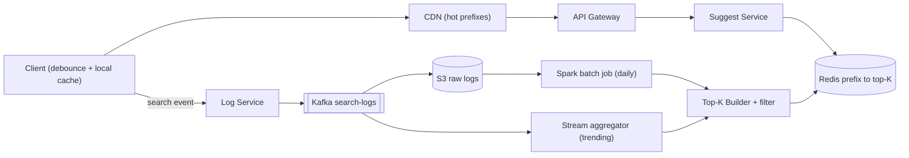
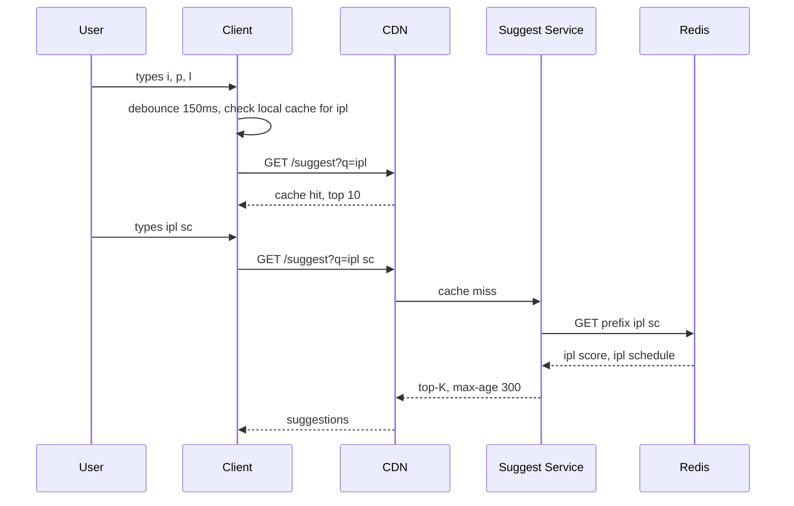

# Design Typeahead / Autocomplete

**In one line:** a user types "ipl" in the search box, and on every keystroke the **top 5–10 suggestions show up within 100ms** ("ipl score", "ipl 2026 schedule"). The core challenge is to keep the read path very fast, and to keep suggestions fresh based on popularity.

**What the interviewer checks in this question:** precomputing the read path (nothing heavy at query time), the trade-off between a trie and a prefix → top-K store, the data collection pipeline, and caching layers (client, CDN, server).

---

## Step 1: Clarify with the interviewer (3–5 min)

| You ask | Typical answer | Effect on design |
|---|---|---|
| "What are suggestions based on? Only popularity (search frequency)?" | Yes, popularity | Ranking = frequency, with a recency weight |
| "How many suggestions to show?" | Top 5–10 | Store only the top-K for each prefix, not the full list |
| "Latency target?" | < 100ms end-to-end | No sorting at query time, everything is precomputed |
| "How fresh must it be? How fast should a trending query show up?" | Daily is fine for normal, ~15 min for trending | Batch pipeline + a small stream layer |
| "Only prefix match, or typo/spell correction too?" | Only prefix, English lowercase | Simple prefix key, fuzzy is out of scope |
| "Do we need personalization?" | Basic, optional | Global top-K + a small merge with user history |
| "Scale?" | ~100M DAU, ~10 searches per user | Very high read QPS, caching is necessary |

> **Say:** "I will design this in two separate parts: a super-fast read path that serves precomputed top-K, and an offline data pipeline that builds top-K from search logs. There will be no ranking or sorting at query time."

## Step 2: Requirements

**Functional**
1. Users should be able to type a prefix and see the top 5–10 suggestions, sorted by popularity
2. Users should see trending queries in suggestions within ~15 min (the rest update daily)
3. Users should never be suggested offensive/blocked terms
4. (Optional) Logged-in users should be able to see their own recent searches at the top

**Out of scope:** typo/spell correction, multi-language, the search results page, ads.

**Non-functional (in priority order)**
1. **Latency:** p99 < 100ms end-to-end, server side p99 < 10ms
2. **Availability:** 99.99% for suggest reads. On failure return an empty list, search still works
3. **Freshness (eventual):** trending ≤ 15 min, the rest ≤ 24 hr
4. **Scale:** 100M DAU, ~46K QPS avg / 150K peak reads, ~12K search events/sec of writes (async)

**CAP choice:** AP. A slightly stale suggestion is fine, a dead suggestion box is not. So replicas + caches, no strong consistency anywhere.

## Step 3: Estimation (only what changes the design)

- 100M DAU × 10 searches × ~6 keystrokes (~4 requests after debounce) → **~4B requests/day ≈ 46K QPS** avg, peak ~150K QPS. So we need multiple cache layers.
- Unique queries ~100M. Prefixes (up to max 20 chars) ~1B keys. Each key holds top 10 × ~30 bytes = 300 bytes → **~300 GB**. That won't fit on one machine, so we need **sharding**. But the top prefixes alone (which bring 90% of traffic) are very small and will fit in cache.
- Logs: 1B searches/day ≈ **12K events/sec** avg (~35K peak) × 50 bytes = **50 GB/day**. Each search touches ~20 prefixes, so live counters = ~250K+ writes/sec. So batch aggregation (Spark), not live counting.

> **Say:** "Read QPS is very high and the data is GB scale, so I will compute the answer for every prefix in advance and keep it in a KV store. A query becomes an O(1) lookup."

## Step 4: Core entities

- **Query log**: query_text, user_id, timestamp, region
- **Query stats**: query_text, count, last_seen (aggregated)
- **Prefix entry**: prefix → list of (query, score), max K
- **Blocklist**: offensive terms / patterns
- **User history** (optional): user_id → recent queries

## Step 5: APIs

```http
GET /suggest?q=ipl%20sc&limit=10&lang=en     → ["ipl score", "ipl schedule", ...]
    Response header: Cache-Control: public, max-age=300

POST /log/search  {query, userId, ts}         → 202 Accepted (async, fire-and-forget)
```

> **Say:** "The suggest API is a GET and is cacheable, so both the browser and the CDN can cache it. Logging is a separate async endpoint, so it won't slow down the read path."

## Step 6: High-level design

**Start with a simple v1:** Client → Suggest Service → one Postgres table `query_stats(query, count)` queried with `LIKE 'ipl%' ORDER BY count DESC LIMIT 10`, and `count+1` on every search. At small scale this covers FR1–FR3. The numbers break it: 150K peak QPS + p99 100ms → precomputed top-K in Redis + CDN. ~300 GB of prefix data → sharding. 12K–35K events/sec that two consumers need (archive + trending) → Kafka. FR2's 15-min trending → a stream aggregator.



**Why each component:**
- **Client debounce + cache (NFR latency):** 150ms debounce, and if "ip" is in the local cache, don't ask again. A call on every keystroke means ~1.5x QPS.
- **CDN (150K peak QPS):** short prefixes ("a", "ip", "sw") are the same for all users. A 5 min cache keeps 50%+ of traffic off the origin. A server-side cache alone doesn't save the network hop.
- **Suggest Service:** stateless. Redis lookup, serve-time blocklist, optional personalization merge.
- **Redis prefix → top-K (p99 100ms):** O(1), sub-ms, sharded by prefix hash. A DB `LIKE` + sort per keystroke can't make 100ms. If RAM cost hurts, DynamoDB (~5ms) also works.
- **Kafka (FR2):** ~12K events/sec, so throughput alone is not the reason. The reason: two independent consumers (S3 archiver + Flink trending) and 7-day replay, so we can recount after an aggregation bug. The simpler option (Log Service writes batch files straight to S3) is enough for daily, but gives no 15-min trending.
- **Spark batch (FR2 daily):** 50 GB/day, decayed counts over 7–30 days, generating ~1B prefix keys.
- **Stream aggregator Flink (FR2 trending):** 15-min sliding-window spikes. Simpler option: a Spark micro-batch every 15 min, with a bit more lag.
- **Top-K Builder:** top-K per prefix, blocklist filter, versioned bulk load.

**Mapping:** FR1 → Client, CDN, Suggest Service, Redis. FR2 → Log Service, Kafka, Spark, Flink, Builder. FR3 → Builder filter + serve-time blocklist. FR4 → Suggest Service + per-user Redis list.

## Step 7: Main flow: user types "ipl"



**Rebuild flow:** Kafka → S3 → Spark daily count → Top-K Builder takes the top 10 for each prefix → writes new Redis keys with a version (`v42:prefix:ipl`) → flips the pointer `current_version = 42`. Atomic switch, so half-built data is never served.

## Step 8: Data model & DB choice

```text
Redis / KV:
  key   = "v42:p:ipl sc"
  value = [["ipl score", 98123], ["ipl schedule", 55120], ...]   (max 10)

query_stats (Spark output, Parquet on S3):
  query_text, count_7d_decayed, last_seen, region
```

- **Read store:** Redis cluster (or DynamoDB / Cassandra if the data is bigger than RAM). Simple key → value, no joins.
- **Raw logs:** S3 (cheap, perfect for batch).
- Keep the score in the value too, so personalization merge and trending merge can work.

## Step 9: Deep dives (the interviewer will push here)

### 9.1 Trie vs precomputed prefix → top-K
**NFR:** p99 < 100ms, ~300 GB of data.
- **Trie with top-K per node:** each node caches the top 10 for that prefix. Lookup = walk the length of the prefix = O(L). Compact in memory (shared prefixes). But a trie is an in-memory structure, hard to distribute and update.
- **Precomputed prefix → top-K in KV:** each prefix is a key. Lookup O(1). Easy to shard, replicate and cache. More memory (prefixes repeat), but storage is cheap.

> **Say:** "Conceptually this is still a trie with top-K at each node. I flatten it into a KV so I get sharding, replication and CDN caching for free. The builder can build a trie offline and dump the output into the KV."

To save memory: max prefix length 20–25 chars, and don't store rare prefixes (count < threshold).

**Trade-off:** O(1) reads and free sharding, at the cost of more memory because prefixes repeat.

### 9.2 Data collection pipeline and freshness
**NFR:** trending ≤ 15 min, the rest ≤ 24 hr.
- The client sends an event on every search submit → Log Service → Kafka.
- **Batch (daily):** Spark counts over the last 7–30 days of logs with **time decay** (`score = Σ count × 0.9^days_ago`), so old trends slowly go down.
- **Stream (15 min):** Flink detects a sudden spike in a sliding window (count in last 15 min >> normal). Update only the prefixes of these trending queries, not a full rebuild.
- The builder merges the batch top-K and trending for each prefix.

**Trade-off:** we maintain two pipelines (batch + stream), in return for a cheap accurate batch and fast trending.

### 9.3 Latency < 100ms: caching layers
**NFR:** p99 < 100ms, 150K peak QPS.
1. **Client:** 150ms debounce, a local LRU cache, and prefetch "ipl" results along with "ip" in one response.
2. **CDN:** 1–3 char prefixes are the hottest. With `max-age=300` the CDN serves them.
3. **Suggest service in-memory cache:** the top 100K prefixes in the service's RAM.
4. **Redis:** everything else, sub-ms.

The network is the biggest part of latency, so deploy multi-region and serve from the nearest region.

**Trade-off:** CDN/client caches can be up to 5 min stale, in return for 50%+ less origin load.

### 9.4 Sharding by prefix
**NFR:** scale (~300 GB) + 99.99% availability.
- **Range by first char** ("a–c" on one shard): simple, but it will skew ("s" is huge, "x" is small).
- **Hash of full prefix** (consistent hashing): even load. One request needs just one key, so no range query is needed. Choose this.
- Replicate hot prefixes ("i", "ip") + CDN/local cache, so one shard doesn't take all the load.

**Trade-off:** hash sharding gives up range scans, but we only need single-key lookups.

### 9.5 Personalization and offensive filter (brief)
**NFR:** FR3 is never violated, and personalization stays inside the latency budget.
- **Personalization:** the user's last 50 searches in a small Redis list. The Suggest Service merges the global top-K with user history (entries that match the prefix). A personalized response is not cached on the CDN, so do this only for logged-in users, and the global part is still cached.
- **Offensive filter:** filter at the builder stage with a blocklist + ML classifier (offline, so cheap). Also a fast blocklist check at serve time, so a newly blocked term goes away at once without a rebuild.

**Trade-off:** personalized responses are not CDN-cached, so logged-in traffic hits the origin more.

## Step 10: Decision table (what we chose, why, and what we did not)

| Decision | Why we chose it | What we did not choose, and why |
|---|---|---|
| **Precomputed prefix → top-K in Redis/KV** | O(1) lookup, easy sharding + replication, CDN friendly | **Live trie in app memory:** 300 GB doesn't fit on one box, hard to update. **DB `LIKE 'ipl%' ORDER BY count`:** scan + sort, impossible in 100ms. Sacrifice: the cost of ~300 GB of RAM |
| **Offline batch + small stream layer** | Batch is accurate and cheap, stream only for trending | **Live counter on every search:** ~20 prefixes × 12K/sec = 250K+ writes/sec, hot keys, sorting on the read path. Sacrifice: two pipelines to maintain |
| **Kafka for search logs** | Two consumers (archiver + Flink), 7-day replay | **Log Service → S3 files directly:** simpler, but no 15-min trending. **SQS:** one message goes to one consumer, no replay. Sacrifice: operating a Kafka cluster |
| **Client debounce + CDN cache** | 60–80% of requests never reach the origin | **Server call on every keystroke:** 3–4x QPS, old responses race. Sacrifice: up to 5 min stale suggestions |
| **Hash-based sharding** | Even load, single-key lookup | **Range by first letter:** "s" vs "x" skew, hot shard. Sacrifice: no range scans |
| **Versioned rebuild + pointer flip** | Atomic switch, easy rollback | **In-place overwrite:** half-old data during a rebuild. Sacrifice: 2x storage during the rebuild |
| **No Elasticsearch completion suggester** | KV is cheaper and faster for fixed top-K | **Elasticsearch:** good if you need fuzzy, but at this scale it is costly and has higher latency per keystroke |

## Step 11: Failures & bottlenecks

| What failed | What happens | How to handle it |
|---|---|---|
| Redis shard down | No suggestions for some prefixes | Replica failover. Until then the CDN/local cache serves. Return an empty list, not an error |
| Batch job fails | Suggestions go stale | The old version keeps being served. Alert + retry |
| Bad rebuild (wrong data) | Wrong suggestions | Roll back the version pointer to the old version |
| Hot prefix ("i") | Load on one shard | CDN + in-memory cache + replicas |
| Kafka lag | Trending is late | Acceptable. Autoscale consumers |
| Offensive term leak | Brand damage | Update the serve-time blocklist right away, CDN purge |

## Step 12: How to make it better (say this yourself at the end)

> "If I had more time, I would improve these:"
- **Fuzzy / typo tolerance:** "iplsc" → "ipl score". Precompute edit distance 1 variants offline, or use a small Elasticsearch fallback.
- **Multi-language + region-wise top-K:** put the region in the key (`in:ipl`), because trends in Mumbai and the US are different.
- **ML ranking:** besides frequency, use CTR, freshness and user context as features. Offline model, score stored in the KV.
- **Abuse protection:** bots make fake searches to push a term into trending. Per-user dedup and rate limits on logging.

## Step 13: Likely follow-up questions

- "Why not use a trie directly?" → Conceptually it is a trie, but flattening it into a KV makes it easier to distribute and cache (Step 9.1)
- "How long until a new trending term shows up?" → ~15 min through the stream layer, the rest through the daily batch
- "How do you fit 300 GB of data in RAM?" → Shard it, drop rare prefixes, or use a disk-based KV (RocksDB/DynamoDB) + hot prefix cache
- "Different suggestions for one user?" → Global top-K + user history merge, the personalized part is not cached on the CDN
- "Need to remove an offensive term right away?" → Serve-time blocklist + CDN purge, filter it permanently in the next rebuild
- **Senior signal:** raise on your own that hot short prefixes ("i", "ip") create a hot shard and a stampede on CDN misses, and that one bad rebuild can push wrong/offensive suggestions across the product. So request coalescing + replicas, and sanity checks on every rebuild + one-step version rollback.

## 2-minute recap

> Typeahead is extremely read-heavy and must answer within 100ms, so nothing is computed on the read path. We compute the top-K for every prefix in advance and keep it in Redis/KV (conceptually a trie with top-K per node, but flattened into a KV). Lookup is O(1). Shard by prefix hash, and use CDN + in-memory cache for hot prefixes. The client does a 150ms debounce and local caching. Write side: search logs (~12K/sec) → Kafka (two consumers + replay) → S3 → Spark daily batch (time decay) + Flink 15-min trending → Top-K Builder (blocklist filter) → versioned KV keys and an atomic pointer flip. Personalization = global top-K + user history merge. Offensive terms are filtered in the builder, and there is a blocklist at serve time too.

## Checklist

- [ ] I can ask the clarifying questions (K, latency, freshness, personalization) without looking
- [ ] I can explain the trade-off between a trie and a prefix → top-K KV
- [ ] I can draw the data pipeline (logs → Kafka → batch/stream → rebuild)
- [ ] I can tell the 4 caching layers for 100ms latency
- [ ] I can explain prefix sharding and hot prefix handling
- [ ] I can explain the versioned rebuild and atomic pointer flip
- [ ] I can tell the approach for personalization and the offensive filter
- [ ] I can say 3 trade-offs from the decision table without looking
