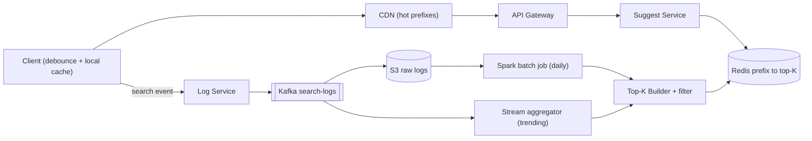
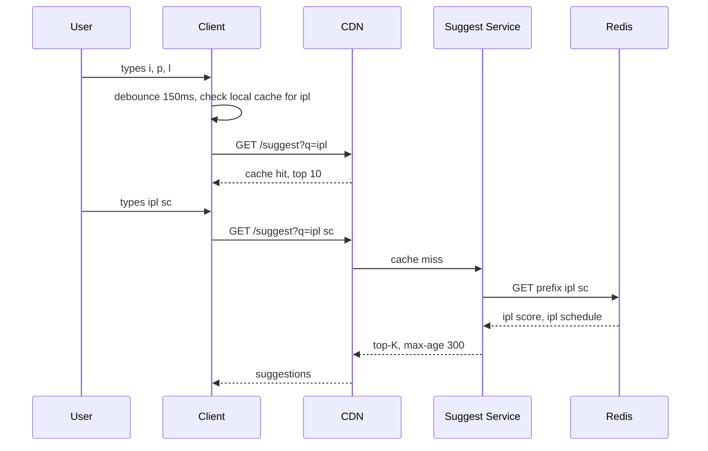

# Design Typeahead / Autocomplete

**In one line:** type "ipl" → every keystroke shows the **top 5–10 suggestions within 100ms** ("ipl score", "ipl 2026 schedule"). Challenge: a fast read path + suggestions kept fresh by popularity.

**What the interviewer checks in this question:** precomputed read path, trie vs prefix → top-K, data pipeline, caching layers.

---

## Step 1: Clarify with the interviewer (3–5 min)

| You ask | Typical answer | Effect on design |
|---|---|---|
| "Suggestions by popularity only?" | Yes, popularity | Ranking = frequency + recency weight |
| "How many suggestions?" | Top 5–10 | Store only top-K per prefix |
| "Latency target?" | < 100ms end-to-end | All precomputed, no sorting at query time |
| "How fast must trending show up?" | Normal daily, trending ~15 min | Batch pipeline + small stream layer |
| "Typo/spell correction too?" | Prefix only, English lowercase | Simple prefix key, fuzzy out of scope |
| "Personalization?" | Basic, optional | Global top-K + user history merge |
| "Scale?" | ~100M DAU, ~10 searches/user | High read QPS → caching |

> **Say:** "Two parts: a fast read path serving precomputed top-K, and an offline pipeline building top-K from logs. No sorting at query time."

## Step 2: Requirements

**Functional**
1. Prefix → top 5–10 suggestions, sorted by popularity
2. Trending shows up within ~15 min (the rest daily)
3. Offensive/blocked terms are never suggested
4. (Optional) Logged-in users see their recent searches at the top

**Out of scope:** typo/spell correction, multi-language, the search results page, ads.

**Non-functional (in priority order)**
1. **Latency:** p99 < 100ms end-to-end, server p99 < 10ms
2. **Availability:** 99.99% for reads. On failure → empty list, search still works
3. **Freshness (eventual):** trending ≤ 15 min, the rest ≤ 24 hr
4. **Scale:** 100M DAU, ~46K QPS avg / 150K peak reads, ~12K search events/sec of writes (async)

**CAP choice:** AP. A stale suggestion is fine, a dead box is not → replicas + caches.

## Step 3: Estimation (only what changes the design)

- 100M DAU × 10 searches × ~6 keystrokes (~4 requests after debounce) → **~4B requests/day ≈ 46K QPS** avg, peak ~150K → multiple cache layers.
- ~100M unique queries, ~1B prefix keys (max 20 chars). Key = top 10 × ~30 bytes = 300 bytes → **~300 GB** → **sharding**. Top prefixes (90% of traffic) fit in cache.
- Logs: 1B searches/day ≈ **12K events/sec** avg (~35K peak) × 50 bytes = **50 GB/day**. Each search touches ~20 prefixes → live counters = 250K+ writes/sec → batch aggregation (Spark).

> **Say:** "High read QPS, GB-scale data → precompute every prefix into a KV. A query is an O(1) lookup."

## Step 4: Core entities

- **Query log**: query_text, user_id, timestamp, region
- **Query stats**: query_text, count, last_seen (aggregated)
- **Prefix entry**: prefix → list of (query, score), max K
- **Blocklist**: offensive terms / patterns
- **User history** (optional): user_id → recent queries

## Step 5: APIs

```http
GET /suggest?q=ipl%20sc&limit=10&lang=en     → ["ipl score", "ipl schedule", ...]
    Response header: Cache-Control: public, max-age=300

POST /log/search  {query, userId, ts}         → 202 Accepted (async, fire-and-forget)
```


> **Say:** "Suggest is a cacheable GET (browser + CDN); logging is a separate async endpoint."

## Step 6: High-level design

**Simple v1:** Postgres `query_stats(query, count)` with `LIKE 'ipl%' ORDER BY count DESC LIMIT 10`, `count+1` on every search. Fine for FR1–FR3 at small scale. What breaks it:
- 150K peak QPS + p99 100ms → precomputed top-K in Redis + CDN
- ~300 GB of prefix data → sharding
- 12K–35K events/sec, two consumers (archive + trending) → Kafka
- FR2's 15-min trending → stream aggregator




**Why each component:**
- **Client debounce + cache:** 150ms debounce + local cache, otherwise ~1.5x QPS.
- **CDN (150K peak):** short prefixes ("a", "ip", "sw") are the same for everyone, 5 min cache → 50%+ of traffic never hits origin. A server cache doesn't save the network hop.
- **Suggest Service:** stateless. Redis lookup, serve-time blocklist, personalization merge.
- **Redis (p99 100ms):** O(1), sub-ms, sharded by prefix hash. RAM too costly → DynamoDB (~5ms).
- **Kafka (FR2):** not for throughput (~12K/sec); two consumers (S3 archiver + Flink) + 7-day replay (recount after a bug).
- **Spark batch (daily):** 50 GB/day, decayed counts over 7–30 days, ~1B prefix keys.
- **Flink (trending):** 15-min sliding window. Alternative: Spark micro-batch every 15 min, more lag.
- **Top-K Builder:** top-K per prefix, blocklist filter, versioned bulk load.

**Mapping:** FR1 → Client, CDN, Suggest Service, Redis. FR2 → Log Service, Kafka, Spark, Flink, Builder. FR3 → Builder filter + serve-time blocklist. FR4 → Suggest Service + per-user Redis list.

## Step 7: Main flow: user types "ipl"




**Rebuild flow:** Kafka → S3 → Spark daily → Builder top 10 per prefix → versioned keys (`v42:prefix:ipl`) → pointer flip `current_version = 42`. Atomic.

## Step 8: Data model & DB choice

```text
Redis / KV:
  key   = "v42:p:ipl sc"
  value = [["ipl score", 98123], ["ipl schedule", 55120], ...]   (max 10)

query_stats (Spark output, Parquet on S3):
  query_text, count_7d_decayed, last_seen, region
```


- **Read store:** Redis cluster (bigger than RAM → DynamoDB / Cassandra). Key → value, no joins.
- **Raw logs:** S3 (cheap, batch).
- Score in the value → personalization + trending merges.

## Step 9: Deep dives (the interviewer will push here)

### 9.1 Trie vs precomputed prefix → top-K
**NFR:** p99 < 100ms, ~300 GB.
- **Trie, top-K per node:** O(L), compact, but hard to distribute/update.
- **Prefix → top-K in KV:** O(1), easy to shard/replicate/cache, more memory (prefixes repeat).

> **Say:** "Conceptually it's a trie with top-K per node; I flatten it into a KV so sharding, replication and CDN caching come free."

Save memory: max prefix 20–25 chars, drop rare prefixes (count < threshold).

**Trade-off:** O(1) reads + free sharding vs more memory.

### 9.2 Data collection pipeline and freshness
**NFR:** trending ≤ 15 min, the rest ≤ 24 hr.
- Search submit → event → Log Service → Kafka.
- **Batch (daily):** Spark over the last 7–30 days, **time decay** `score = Σ count × 0.9^days_ago` → old trends fade.
- **Stream (15 min):** Flink sliding-window spike (last 15 min >> normal) → update only those prefixes, no full rebuild.
- The builder merges batch + trending.

**Trade-off:** two pipelines vs cheap batch + fast trending.

### 9.3 Latency < 100ms: caching layers
**NFR:** p99 < 100ms, 150K peak QPS.
1. **Client:** 150ms debounce, local LRU, prefetch "ipl" in the "ip" response.
2. **CDN:** 1–3 char prefixes are hottest, `max-age=300`.
3. **Service in-memory:** top 100K prefixes in RAM.
4. **Redis:** everything else, sub-ms.

Network latency → multi-region, nearest region.

**Trade-off:** 5 min stale vs 50%+ less origin load.

### 9.4 Sharding by prefix
**NFR:** ~300 GB + 99.99% availability.
- **Range by first char** ("a–c"): simple, but skewed ("s" huge, "x" small).
- **Hash of full prefix** (consistent hashing): even load, each request needs one key. **Choose this.**
- Hot prefixes ("i", "ip") → replicas + CDN/local cache.

**Trade-off:** no range scans, and none needed.

### 9.5 Personalization and offensive filter (brief)
**NFR:** FR3 never violated, personalization within the latency budget.
- **Personalization:** last 50 searches in a Redis list; merge global top-K + matching history. Not CDN-cached → logged-in users only, the global part stays cached.
- **Offensive filter:** blocklist + ML classifier in the builder (offline, cheap). Serve-time blocklist → a new term disappears at once, no rebuild.

**Trade-off:** more logged-in traffic hits origin.

## Step 10: Decision table (what we chose, why, and what we did not)

| Decision | Why we chose it | What we did not choose, and why |
|---|---|---|
| **Prefix → top-K in Redis/KV** | O(1), shardable, CDN friendly | **Live trie:** 300 GB won't fit one box. **DB `LIKE` + sort:** impossible in 100ms. Sacrifice: ~300 GB RAM |
| **Batch + small stream layer** | Batch accurate + cheap, stream only for trending | **Live counter:** 250K+ writes/sec, hot keys. Sacrifice: two pipelines |
| **Kafka for search logs** | Two consumers, 7-day replay | **S3 files:** no 15-min trending. **SQS:** one consumer, no replay. Sacrifice: Kafka ops |
| **Client debounce + CDN cache** | 60–80% of requests never reach origin | **Call per keystroke:** 3–4x QPS, responses race. Sacrifice: 5 min stale |
| **Hash-based sharding** | Even load, single-key lookup | **Range by first letter:** "s" vs "x" skew. Sacrifice: no range scans |
| **Versioned rebuild + pointer flip** | Atomic switch, easy rollback | **In-place overwrite:** half-old data. Sacrifice: 2x storage during rebuild |
| **No Elasticsearch suggester** | KV cheaper + faster for fixed top-K | **Elasticsearch:** good for fuzzy, costly + slow per keystroke |

## Step 11: Failures & bottlenecks

| What failed | What happens | How to handle it |
|---|---|---|
| Redis shard down | No suggestions for some prefixes | Replica failover + CDN/local cache. Empty list, not an error |
| Batch job fails | Suggestions go stale | Old version keeps serving. Alert + retry |
| Bad rebuild | Wrong suggestions | Roll back the version pointer |
| Kafka lag | Trending is late | Acceptable, autoscale consumers |
| Offensive term leak | Brand damage | Serve-time blocklist + CDN purge (9.5) |

## Step 12: How to make it better (say this yourself at the end)

- **Fuzzy / typo:** "iplsc" → "ipl score". Edit-distance-1 variants offline, or Elasticsearch fallback.
- **Region-wise top-K + multi-language:** region in the key (`in:ipl`), Mumbai vs US trends differ.
- **ML ranking:** CTR, freshness, user context → offline model, score in the KV.
- **Abuse:** bots fake trending → per-user dedup + logging rate limit.

## Step 13: Likely follow-up questions

- "How soon does a trending term show?" → ~15 min via stream, the rest via daily batch
- "300 GB in RAM?" → Shard, drop rare prefixes, or disk KV (RocksDB/DynamoDB) + hot cache
- "User-specific suggestions?" → Global top-K + history merge, personalized part not CDN-cached
- **Senior signal:** raise on your own: hot short prefixes ("i", "ip") → hot shard + stampede on CDN miss; one bad rebuild → wrong/offensive suggestions across the product. Fix: request coalescing + replicas, rebuild sanity checks + one-step version rollback.

## 2-minute recap

> Read-heavy, 100ms → nothing computed on the read path. Precompute every prefix's top-K into Redis/KV (flattened trie), O(1). Prefix-hash sharding, CDN + in-memory cache, client 150ms debounce. Write: logs (~12K/sec) → Kafka → S3 → Spark daily (decay) + Flink 15-min trending → Builder (blocklist) → versioned keys + pointer flip. Personalization = global top-K + history merge.

## Checklist

- [ ] I can ask the clarifying questions (K, latency, freshness, personalization) without looking
- [ ] I can explain the trade-off between a trie and a prefix → top-K KV
- [ ] I can draw the data pipeline (logs → Kafka → batch/stream → rebuild)
- [ ] I can tell the 4 caching layers for 100ms latency
- [ ] I can explain prefix sharding and hot prefix handling
- [ ] I can explain the versioned rebuild and atomic pointer flip
- [ ] I can tell the approach for personalization and the offensive filter
- [ ] I can say 3 trade-offs from the decision table without looking
