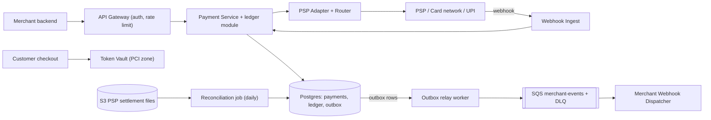
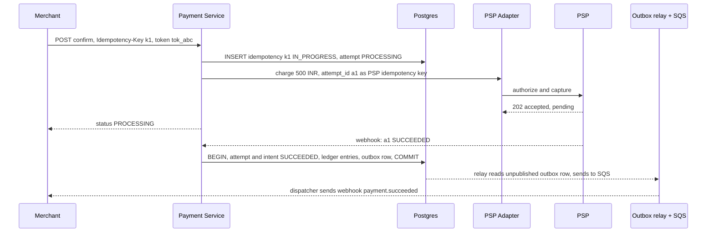
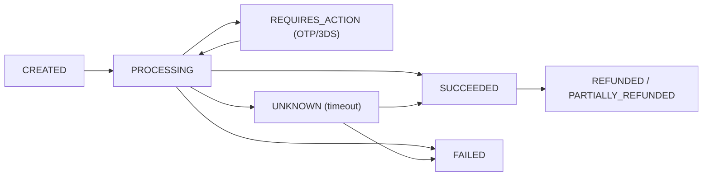
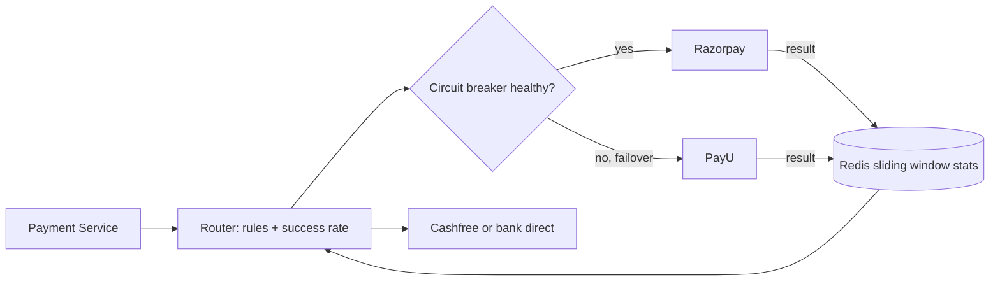

# Design a Payment System (Razorpay / Stripe)

**In one line:** a merchant's (Swiggy) customer pays by card/UPI/netbanking → we collect via the PSP → record in a ledger → settle to the merchant. Challenge: **money is never charged twice and never lost**, even after crashes/retries.

**What the interviewer checks in this question:** idempotency, strong consistency, state machine, async PSP (webhooks), ledger, reconciliation.

---

## Step 1: Clarify with the interviewer (3–5 min)

| You ask | Typical answer | Effect on design |
|---|---|---|
| "Gateway or an e-commerce payment module?" | Gateway: merchant pay-in | Merchant APIs, webhooks, settlement |
| "Process cards/UPI ourselves or via PSP/acquirer?" | External PSP / bank | PSP adapter, async callbacks |
| "Do we store card data?" | No, tokenization | Small PCI scope, separate vault |
| "Refunds, payouts in scope?" | Refunds yes, payouts brief | Reverse entries in the ledger |
| "OK if money shows wrong?" | Not at all | SQL + ACID, consistency > availability |
| "Scale?" | ~10M payments/day, 10x at sales | Moderate writes, merchant sharding later |
| "Multi-currency, fraud?" | Brief / out of scope | Mention and move on |

> **Say:** "Correctness first: idempotent writes, a payment state machine, a double-entry ledger, and reconciliation to catch PSP mismatches."

## Step 2: Requirements

**Functional**
1. Merchant creates a payment intent, gets status via API + webhook
2. Customer pays by card/UPI/netbanking (through a PSP)
3. Merchant issues full/partial refunds
4. Finance/ops see every money movement in a ledger, reconcile daily with the PSP

**Out of scope:** fraud engine, FX, payout details, our own acquiring.

**Non-functional (in priority order)**
1. **Correctness:** exactly-once effect (no double charge), ledger debit = credit
2. **Consistency:** state + ledger strong; webhooks, analytics eventual (seconds)
3. **Durability + audit:** entries immutable, never deleted
4. **Availability:** 99.99% create/confirm, fail-safe when in doubt (don't charge)
5. **Latency + scale:** API p99 < 300 ms (excluding PSP time), 10M payments/day, peak ~1.2K TPS
6. **Security:** PCI DSS, card data tokenized

**CAP choice:** state + ledger are CP. Failing during a partition (idempotent retry is safe) > a wrong balance.

## Step 3: Estimation (only what changes the design)

- 10M payments/day ≈ **115 TPS** avg, sale peak 10x ≈ **1,200 TPS**. ~5–10 DB writes/payment (intent, attempts, ledger, outbox) → ~10K writes/sec peak → one large Postgres primary is enough, `merchant_id` sharding later.
- Ledger: 10M × 4 = 40M rows/day, ~15B/year. Append-only, monthly partitions.
- PSP latency 1–5 sec, sometimes 30 sec+ → **async flow + webhooks**, no sync wait.

> **Say:** "Throughput is small, no NoSQL/Kafka needed. The problem is correctness → SQL with ACID."

## Step 4: Core entities

- **Merchant**: id, api_keys, webhook_url, settlement account
- **PaymentIntent**: id, merchant_id, amount, currency, order_id, status, idempotency_key
- **PaymentAttempt**: id, intent_id, method, psp, psp_reference, status (one intent, multiple attempts)
- **LedgerEntry**: id, txn_id, account_id, debit/credit, amount, created_at (immutable)
- **Account** (ledger): customer_receivable, merchant_payable, psp_clearing, fees
- **Refund**: id, intent_id, amount, status
- **IdempotencyRecord**: key, merchant_id, request_hash, response, status

## Step 5: APIs

```http
POST /v1/payment_intents   {amount, currency, orderId}     → {intentId, clientSecret, status: CREATED}
     Header: Idempotency-Key: <uuid>
POST /v1/payment_intents/{id}/confirm  {paymentMethodToken} → {status: PROCESSING | REQUIRES_ACTION}
     Header: Idempotency-Key: <uuid>
GET  /v1/payment_intents/{id}                               → {status, amount, attempts}
POST /v1/refunds  {intentId, amount}                        → {refundId, status}
POST /internal/psp/webhook  (PSP → us, signed)              → 200
Outgoing: POST merchant.webhook_url {event: payment.succeeded, intentId}  (HMAC signed)
```

> **Say:** "Create and confirm are separate (3DS/OTP or UPI approval happens in between). Idempotency-Key is mandatory on every mutating API."

## Step 6: High-level design

**Simple v1:** Payment Service → one Postgres → sync call to one PSP; FR1–FR3 work. Then: PCI → Vault. PSP 1–30 sec → async + webhooks + poller. Webhook retries for 72 hr → outbox + SQS. 99.99% → multi-PSP router. FR4 → recon job. 1.2K TPS → one primary is enough.



**Why each component:**
- **Token Vault (security):** the card number lives only here (separate PCI network), the rest sees `tok_abc`.
- **Payment Service + ledger module:** state machine, idempotency, ledger entries **in the same transaction** that marks the intent SUCCEEDED (a separate service → a crash can leave "SUCCEEDED, ledger missing"). Split when volume (~15B rows/yr) forces it, via outbox + unique `txn_id`.
- **Postgres (~10K writes/sec peak):** ACID + unique constraints.
- **PSP Adapter + Router (FR2, 99.99%):** common interface, success-rate routing + failover (9.7).
- **Webhook Ingest:** verify signature, dedup on `psp_event_id`, return 200 fast. Separate → a sale-peak burst doesn't slow the merchant API.
- **Outbox relay + SQS:** ~2–3K msgs/sec, one consumer, per-message retry + DLQ. Kafka when 4–5 consumers (fraud, analytics) need it.
- **Reconciliation job (FR4):** daily cron, settlement file vs ledger.

**Mapping:** FR1 → Payment Service, Postgres, outbox/SQS/Dispatcher. FR2 → Vault, PSP Adapter, Webhook Ingest. FR3 → ledger reverse entries. FR4 → ledger + Recon.

## Step 7: Main flow: card payment



Webhook missed → **status poller** calls `GET status(a1)` every 1–5 min.

## Step 8: Data model & DB choice

```sql
payment_intents(id PK, merchant_id, amount BIGINT, currency, status, order_id,
                UNIQUE(merchant_id, idempotency_key), version, created_at)
payment_attempts(id PK, intent_id FK, psp, psp_ref UNIQUE, status, created_at)
idempotency_keys(merchant_id, key, request_hash, response_json, status, PRIMARY KEY(merchant_id, key))
ledger_entries(id PK, txn_id, account_id, direction DEBIT|CREDIT, amount BIGINT, created_at)
  -- rule: SUM(debit) = SUM(credit) per txn_id, rows never UPDATE or DELETE
outbox(id PK, aggregate_id, event_type, payload, published BOOL)
```

- **Postgres** (or MySQL). Money as **BIGINT in paise** (₹500 = 50000), never float.
- Ledger in the same DB (one transaction, monthly partitions). Primary too small → shard by `merchant_id`.
- Relay: `published=false` → SQS → mark. May resend after a crash → dispatcher dedups by event id.

## Step 9: Deep dives (the interviewer will push here)

### 9.1 Idempotency: how will you stop a double charge?
**NFR:** exactly-once effect.
1. `Idempotency-Key` → unique insert on `(merchant_id, key)`. Success → process, save the response at the end.
2. Unique violation → `IN_PROGRESS` = 409 "retry later", `DONE` = **saved response**, different body hash = 422.
3. Send `attempt_id` to the PSP as its idempotency key → a retry won't double charge at the PSP.
4. Duplicate webhooks: `psp_event_id` unique, idempotent transitions (SUCCEEDED → SUCCEEDED is a no-op).

> **Say:** "Exactly-once delivery is impossible. At-least-once retries + idempotent processing = exactly-once **effect**."

**Trade-off:** an extra write per request, keys stored 24 hr–7 days.

### 9.2 Payment state machine
**NFR:** correctness under timeouts.

- Only allowed edges: `UPDATE ... SET status='SUCCEEDED' WHERE id=? AND status IN ('PROCESSING','UNKNOWN')`. Optimistic, race-safe.
- **UNKNOWN** matters most: timeout ≠ failure. Poller/recon resolves it; no new charge until then.

**Trade-off:** UNKNOWN can take minutes to resolve, the customer sees "processing".

### 9.3 Double-entry ledger
**NFR:** the ledger is never wrong + audit.
- Every money movement = a **txn**, ≥2 entries, debit sum = credit sum.
- Success: `debit psp_clearing 500, credit merchant_payable 490, credit fees_revenue 10`.
- Refund: reverse entries, never edit old ones → audit trail.
- Balance = sum of entries (or a materialized table, same transaction).
- Nightly check: txn debit = credit, system total zero, else alert.

### 9.4 Saga across Order and Payment
**NFR:** consistency across services, without 2PC.
Order (Swiggy) and Payment are separate services, no single DB transaction.
- **Choreography:** Order `PENDING_PAYMENT` → payment succeeded → `CONFIRMED`. Failed → `CANCELLED`.
- Order confirm fails (restaurant closed) → **compensation = refund**.
- Events via **outbox** (→ SQS → webhook → Order Service): commit + event both happen or neither. No 2PC (PSP doesn't support it, blocking).

**Trade-off:** we must write compensation logic.

### 9.5 Reconciliation
**NFR:** money is never lost.
- Daily PSP settlement file (SFTP/API → S3), each row matched by `psp_ref` to attempts + ledger.
- Buckets: **matched**; **we have it, PSP doesn't** (an UNKNOWN that failed); **PSP has it, we don't** (missed webhook → SUCCEEDED or auto refund).
- Amount mismatch → manual ops queue (last safety net).

**Trade-off:** mismatches caught at T+1, not real time.

### 9.6 PCI and tokenization
**NFR:** PCI DSS.
- Card number goes from checkout straight to the **Vault** (iframe/SDK), not even to the merchant server.
- HSM encrypt → `tok_abc`. Everything else uses the token, PCI audit covers only the vault.
- Network tokenization (Visa/Mastercard) + RBI card-on-file rules live here too.

### 9.7 Multiple payment gateways: routing (like Juspay)
**NFR:** 99.99% availability + success rate.
Big merchants (Swiggy, Flipkart): an **orchestration layer** picks the best route per payment among Razorpay / PayU / Cashfree / bank direct.

- **Inputs:** method, issuer bank, card network, UPI app (PhonePe/GPay), amount. Score = **success rate** (top weight) + **cost** (MDR) + **health**. Merchant rules: "HDFC credit → PayU", "₹1 lakh+ → bank direct".
- **Success rate:** **sliding window** (5–15 min) per `(psp, bank, method)`, per-minute Redis counters → all routers see the same stats (~1.2K updates/sec). Redis down → static rules. Low traffic → global average; ~5% exploration.
- **Circuit breaker:** success rate drops / timeouts → **OPEN** (other PSP) → **HALF_OPEN** (a little traffic) → CLOSED.
- **Retry on another PSP only when safe:**
  - Safe: a clear **FAILED** (decline, connection refused, never reached the PSP) → new `PaymentAttempt` + attempt_id.
  - Unsafe: **timeout / UNKNOWN** → retry = **double debit** risk. Resolve first.
  - One intent = at most one `PROCESSING` attempt (DB constraint), one SUCCEEDED. Two successes → auto refund the second.
- **Own vault is a must:** a card in a PSP's vault works only on that PSP; own vault / network tokens → any PSP.



> **Say:** "The router picks a PSP by success rate, cost and health; retry on another PSP only on a definite failure, never on a timeout."

**Trade-off:** each PSP also brings a contract + settlement file.

## Step 10: Decision table (what we chose, why, and what we did not)

| Decision | Why we chose it | What we did not choose, and why |
|---|---|---|
| **Postgres (ACID), ledger in same DB** | Ledger + status in one commit, ~10K writes/sec | **Cassandra/DynamoDB:** weak transactions. **Separate Ledger Service:** distributed write. Sacrifice: primary write limit |
| **Idempotency key table** | Same result on retry | **Trust the client:** retries happen on timeouts. Sacrifice: extra write |
| **Double-entry append-only ledger** | Every rupee traceable, auditable | **Only a `balance` column:** no history. Sacrifice: 3–4x rows |
| **Saga + outbox** | Decoupled, recover via compensation | **2PC/XA:** PSP doesn't support it, blocking, coordinator SPOF. Sacrifice: seconds eventual |
| **Outbox relay → SQS** | ~2–3K msgs/sec, retry + DLQ built in | **Kafka:** overkill, no per-message retry. **HTTP after commit:** event lost on crash. Sacrifice: ~1 sec delay |
| **Async PSP + webhooks + poller** | Slow PSP doesn't block threads | **Sync 30 sec wait:** threads run out. Sacrifice: merchant handles PROCESSING |
| **Token vault** | PCI scope is one small service | **Card data in main DB:** whole system in PCI scope. Sacrifice: extra hop + HSM |
| **Explicit UNKNOWN state** | No wrong assumption on timeout | **Timeout = FAILED:** retry double charges. Sacrifice: minutes pending |
| **Multi-PSP routing (Redis stats)** | Failover, success rate + cost | **Single PSP:** its outage = ours. **Per-instance stats:** views differ. Sacrifice: many integrations |

## Step 11: Failures & bottlenecks

| What failed | What happens | How to handle it |
|---|---|---|
| PSP timeout | Unknown if charged | UNKNOWN, poller + recon (9.2) |
| Webhook missed | Money taken, status PROCESSING | Status poller + daily recon |
| Payment Service crash | Half-done state | Transaction + outbox, resume from `IN_PROGRESS` |
| Merchant endpoint down | Update not delivered | SQS backoff 24–72 hrs → DLQ, merchant polls GET |
| Outbox relay down | Webhooks late, money safe | Resume from `published=false`, lag alert |
| Ledger imbalance | Money mismatch | Nightly invariant check, alert, ops queue |

## Step 12: How to make it better (say this yourself at the end)

- **Fraud engine:** velocity, device fingerprint, ML score before confirm.
- **Multi-region active-passive:** ledger in one primary region, sync replica in DR.
- **Dedicated immutable ledger store** (TigerBeetle / QLDB style) as scale grows.
- **ML routing:** bandit model, per-payment PSP success probability.

## Step 13: Likely follow-up questions

- "How do you get exactly-once?" → At-least-once + idempotent consumers + unique constraints = exactly-once effect
- "Mistake in the ledger?" → Never edit, add a reversal entry
- "Why not float for money?" → Rounding errors; smallest unit as BIGINT
- **Senior signal:** raise on your own: the biggest risk is a double debit on PSP timeout (UNKNOWN, no cross-PSP retry); at sale peak the balance row of a global account like `psp_clearing` gets hot. Fix: append-only entries + periodic rollup, alert on per-PSP UNKNOWN count.

## 2-minute recap

> Postgres ACID. Idempotency-Key on create + confirm (`(merchant_id, key)` unique). State machine, timeout → UNKNOWN. attempt_id as the PSP's key; result via webhook (dedup) + poller. Double-entry ledger in the same transaction as the status. Outbox → SQS → merchant webhooks. Order saga, failure → refund. Daily recon. Card data only in the vault.

## Checklist

- [ ] I can explain the payment intent create + confirm flow without looking
- [ ] I can explain the full idempotency key logic (IN_PROGRESS, DONE, hash mismatch)
- [ ] I can tell the payment state machine and the role of the UNKNOWN state
- [ ] I can write a double-entry ledger example with entries
- [ ] I can explain keeping order and payment consistent with saga + outbox
- [ ] I can tell the three mismatch buckets of reconciliation
- [ ] I can explain how tokenization makes the PCI scope smaller
- [ ] I can tell the trade-off of why SQL and why not 2PC
