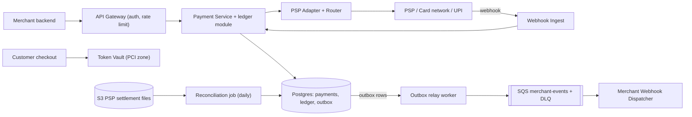
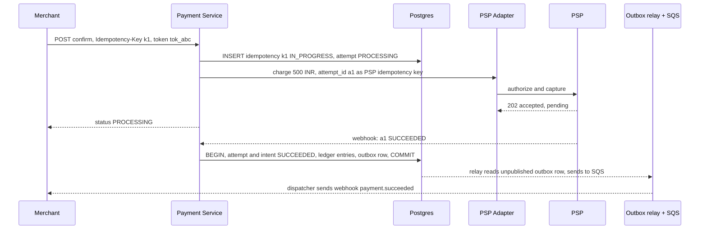
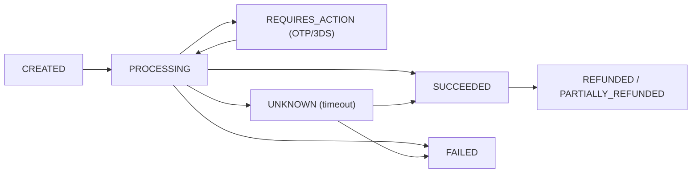
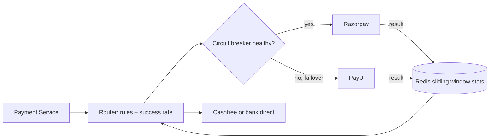

# Design a Payment System (Razorpay / Stripe)

**In one line:** a merchant (Swiggy) takes money from its customer, we collect the money from the bank/PSP through card/UPI/netbanking, record it in a ledger, and later settle it to the merchant. The core challenge is that **money is never charged twice and never lost**, no matter what happens with the network, retries or crashes.

**What the interviewer checks in this question:** idempotency, strong consistency, the payment state machine, working async (webhooks) with an external PSP, correct ledger design, and reconciliation.

---

## Step 1: Clarify with the interviewer (3–5 min)

| You ask | Typical answer | Effect on design |
|---|---|---|
| "Are we building a payment gateway (Razorpay) or the payment module of an e-commerce app?" | Gateway-like: pay-in for merchants | Merchant APIs, webhooks to merchant, settlement |
| "Will we process cards/UPI ourselves or use a PSP/acquirer bank?" | External PSP / bank | PSP adapter layer, async callbacks |
| "Will we store card data?" | No, tokenization | Small PCI scope, separate vault |
| "Are refunds and payouts in scope?" | Refunds yes, payouts brief | Reverse entries in the ledger |
| "How much consistency? Is it OK if money shows wrong?" | Not at all | SQL + ACID, consistency > availability |
| "Scale?" | ~10M payments/day, 10x during festive sales | Moderate write load, shard by merchant later |
| "Multi-currency, fraud detection?" | Brief / out of scope | Mention it and move on |

> **Say:** "In this system, correctness comes first. I will keep every write idempotent, run each payment through a state machine, record money in a double-entry ledger, and have reconciliation to catch mismatches with the PSP."

## Step 2: Requirements

**Functional**
1. Merchants should be able to create a payment intent and learn its status via API + webhook
2. Customers should be able to pay by card/UPI/netbanking (we charge through a PSP)
3. Merchants should be able to issue full/partial refunds
4. Finance/ops should be able to see every money movement in a ledger and reconcile daily with the PSP

**Out of scope:** fraud engine, multi-currency FX, merchant payout details, our own card network/acquiring.

**Non-functional (in priority order)**
1. **Correctness:** exactly-once effect (never a double charge), ledger debit = credit always
2. **Consistency:** strong for payment state + ledger. Eventual (seconds) for merchant webhooks and analytics
3. **Durability + audit:** entries are immutable, history is never deleted
4. **Availability:** 99.99% for the create/confirm API, but fail-safe when in doubt (don't charge)
5. **Latency + scale:** API p99 < 300 ms (excluding PSP time), 10M payments/day, peak ~1.2K TPS
6. **Security:** PCI DSS, card data tokenized

**CAP choice:** CP for payment state and the ledger. During a partition, failing the request (the merchant retries, safely, with the idempotency key) is better than a wrong balance.

## Step 3: Estimation (only what changes the design)

- 10M payments/day ≈ **115 TPS** avg, sale peak 10x ≈ **1,200 TPS**. Each payment makes ~5–10 DB writes (intent, attempts, ledger, outbox) → ~10K writes/sec at peak. One large Postgres primary handles this, with `merchant_id` sharding later.
- Ledger entries: 10M × 4 = 40M rows/day, ~15B/year. Append-only, partition by month.
- PSP latency is 1–5 sec, sometimes 30 sec+. So we use an **async flow + webhooks**, no synchronous wait.

> **Say:** "Throughput is not very large, so there is no need for NoSQL or Kafka. The problem is correctness, so I will choose SQL with ACID."

## Step 4: Core entities

- **Merchant**: id, api_keys, webhook_url, settlement account
- **PaymentIntent**: id, merchant_id, amount, currency, order_id, status, idempotency_key
- **PaymentAttempt**: id, intent_id, method, psp, psp_reference, status (one intent can have multiple attempts)
- **LedgerEntry**: id, txn_id, account_id, debit/credit, amount, created_at (immutable)
- **Account** (ledger): customer_receivable, merchant_payable, psp_clearing, fees
- **Refund**: id, intent_id, amount, status
- **IdempotencyRecord**: key, merchant_id, request_hash, response, status

## Step 5: APIs

```http
POST /v1/payment_intents   {amount, currency, orderId}     → {intentId, clientSecret, status: CREATED}
     Header: Idempotency-Key: <uuid>
POST /v1/payment_intents/{id}/confirm  {paymentMethodToken} → {status: PROCESSING | REQUIRES_ACTION}
     Header: Idempotency-Key: <uuid>
GET  /v1/payment_intents/{id}                               → {status, amount, attempts}
POST /v1/refunds  {intentId, amount}                        → {refundId, status}
POST /internal/psp/webhook  (PSP → us, signed)              → 200
Outgoing: POST merchant.webhook_url {event: payment.succeeded, intentId}  (HMAC signed)
```

> **Say:** "Create and confirm are separate, because the customer has to approve 3DS/OTP or approve in the UPI app. An Idempotency-Key is mandatory on every mutating API."

## Step 6: High-level design

**Start with a simple v1:** Merchant → Payment Service → one Postgres (intents, attempts, idempotency, ledger) → a synchronous call to one PSP. This covers FR1–FR3. Then requirements add pieces: PCI → Token Vault. PSP latency of 1–30 sec → async + webhooks + poller. Merchant webhooks retried for 72 hr → outbox + SQS. 99.99% (one PSP's outage = our outage) → multi-PSP router. FR4 → a daily recon job. For 1.2K TPS at peak, one Postgres primary is enough.



**Why each component:**
- **Token Vault (NFR security):** the card number only lands here (a separate PCI network), the rest of the system sees `tok_abc`. Card data in the main DB = the whole system in PCI scope.
- **Payment Service + ledger module (FR1–FR4):** state machine, idempotency, and ledger entries written **in the same DB transaction** that marks the intent SUCCEEDED. No separate Ledger Service: a crash could leave "payment SUCCEEDED, ledger missing". Split it only when ledger volume (~15B rows/yr) or team size forces it, and then via outbox + a unique `txn_id`.
- **Postgres (NFR consistency, ~10K writes/sec peak):** ACID, unique constraints. Cassandra/DynamoDB are not needed at this scale.
- **PSP Adapter + Router (FR2, 99.99%):** each PSP has a different API, a common interface, success-rate routing and failover (Step 9.7).
- **Webhook Ingest (FR2):** verify the signature, dedup on `psp_event_id`, return 200 fast. It could be an endpoint of the Payment Service, it is separate so a sale-peak webhook burst doesn't slow the merchant API.
- **Outbox relay + SQS (FR1 webhooks):** ~1.2K payments/sec × ~2 events = ~2–3K msgs/sec, with one main consumer that needs per-message retry, backoff and a DLQ. SQS gives exactly that. **Not Kafka:** low throughput, no replay needed (the outbox table is the history), and Kafka has no per-message retry/DLQ. Bring Kafka in when 4–5 internal consumers (fraud, analytics) want the same stream.
- **Reconciliation job (FR4):** a daily batch, settlement file vs ledger. A cron job, not an always-on service.

**Mapping:** FR1 → Payment Service, Postgres, outbox + SQS + Dispatcher. FR2 → Vault, PSP Adapter, Webhook Ingest. FR3 → Payment Service + ledger reverse entries. FR4 → ledger tables + Recon job.

## Step 7: Main flow: card payment



If the webhook does not arrive, a **status poller** asks the PSP `GET status(a1)` every 1–5 min.

## Step 8: Data model & DB choice

```sql
payment_intents(id PK, merchant_id, amount BIGINT, currency, status, order_id,
                UNIQUE(merchant_id, idempotency_key), version, created_at)
payment_attempts(id PK, intent_id FK, psp, psp_ref UNIQUE, status, created_at)
idempotency_keys(merchant_id, key, request_hash, response_json, status, PRIMARY KEY(merchant_id, key))
ledger_entries(id PK, txn_id, account_id, direction DEBIT|CREDIT, amount BIGINT, created_at)
  -- rule: SUM(debit) = SUM(credit) per txn_id, rows never UPDATE or DELETE
outbox(id PK, aggregate_id, event_type, payload, published BOOL)
```

- **Postgres** (or MySQL): ACID, unique constraints, transactions. Always store money as **BIGINT in paise** (₹500 = 50000), never as float.
- Ledger tables live in the same Postgres (one transaction, monthly partitions). Shard by `merchant_id` when one primary is not enough.
- The outbox relay picks `published=false` rows, sends them to SQS, then marks them. After a crash it may resend, so the dispatcher dedups by event id.

## Step 9: Deep dives (the interviewer will push here)

### 9.1 Idempotency: how will you stop a double charge?
**NFR:** exactly-once effect.
1. The merchant sends an `Idempotency-Key` with every request. We do a unique insert on `(merchant_id, key)`.
2. Insert succeeds → a new request, process it, and save the response at the end.
3. Unique violation → the key came before. If it is `IN_PROGRESS`, return 409 "retry later". If it is `DONE`, **return the saved response**. If the hash of the request body is different, return 422.
4. Also send our `attempt_id` to the PSP as its idempotency key. Our retry will not double charge at the PSP.
5. Webhooks arrive as duplicates: keep `psp_event_id` unique, and make state transitions idempotent (SUCCEEDED → SUCCEEDED is a no-op).

> **Say:** "Exactly-once delivery is not possible over a network. I get an exactly-once **effect** from at-least-once retries + idempotent processing."

**Trade-off:** one extra write per mutating request, and storing keys for 24 hr–7 days.

### 9.2 Payment state machine
**NFR:** correctness under timeouts.

- Transitions happen only on allowed edges. Update like this: `UPDATE ... SET status='SUCCEEDED' WHERE id=? AND status IN ('PROCESSING','UNKNOWN')`. Optimistic and race-safe.
- **UNKNOWN** is the most important state: on a PSP timeout we cannot assume it failed. The poller/reconciliation will resolve it. Don't let the customer be charged again until UNKNOWN is resolved.

**Trade-off:** resolving UNKNOWN can take minutes, and the customer sees "processing".

### 9.3 Double-entry ledger
**NFR:** the ledger is never wrong + audit.
- Every money movement is a **txn** with at least 2 entries: one debit, one credit, with equal sums.
- Payment success: `debit psp_clearing 500, credit merchant_payable 490, credit fees_revenue 10`.
- Refund: reverse entries, the old entry is never edited. This gives an audit trail.
- Balance = sum of entries (or a materialized balance table updated in the same transaction).
- Nightly check: every txn has debit = credit, and the system-wide total is zero. Mismatch = alert.

**Trade-off:** 3–4 rows per payment (~15B/yr), and balance = a sum or a separate materialized table.

### 9.4 Saga across Order and Payment
**NFR:** consistency across services without 2PC.
The Order Service (Swiggy) and Payment are separate services, so a single DB transaction is not possible.
- **Choreography saga:** Order `PENDING_PAYMENT` → Payment succeeded event → Order `CONFIRMED`. Payment fails → Order `CANCELLED`.
- If the order confirm fails (restaurant closed) → trigger **compensation = refund**.
- Events leave through the **outbox pattern** (outbox → SQS → merchant webhook → Order Service), so the DB commit and the event either both happen or neither does. No 2PC, because the PSP doesn't support 2PC and it is blocking.

**Trade-off:** order and payment are eventual for a few seconds, and we must write compensation logic.

### 9.5 Reconciliation
**NFR:** money is never lost.
- The PSP/bank gives a settlement file every day (SFTP/API → S3).
- The recon job matches each row of the file with our attempts and ledger by `psp_ref`.
- Three buckets: **matched**, **we have it, PSP doesn't** (an UNKNOWN that actually failed), **PSP has it, we don't** (missed webhook → mark SUCCEEDED, or auto refund).
- Amount mismatch → manual ops queue. This is the last safety net.

**Trade-off:** mismatches are caught at T+1, not in real time.

### 9.6 PCI and tokenization
**NFR:** PCI DSS.
- The card number goes from the checkout page directly to the **Vault** (iframe/SDK), not even to the merchant server.
- The vault encrypts it (HSM keys) and returns `tok_abc`. The Payment Service only uses the token. The PCI audit covers only the vault.
- This same layer handles network tokenization (Visa/Mastercard tokens) and RBI card-on-file rules.

**Trade-off:** the vault is one more critical hop, plus HSM cost.

### 9.7 Multiple payment gateways: routing (like Juspay)
**NFR:** 99.99% availability + success rate.
Big merchants (Swiggy, Flipkart) don't depend on one PSP. An **orchestration layer** picks the best route for each payment between Razorpay, PayU, Cashfree and direct bank integrations.

- **Routing rules:** inputs for each attempt: method (card/UPI/netbanking), issuer bank, card network, UPI app (PhonePe/GPay), amount. Score = **success rate** (biggest weight) + **cost** (MDR fee) + **health** (latency, error rate). Merchant rules too: "HDFC credit cards → PayU", "₹1 lakh+ → bank direct".
- **Real-time success rate:** for each `(psp, bank, method)`, success/total counts in a **sliding window** (last 5–15 min), as time-bucketed counters in Redis (one bucket per minute). Redis so that all router instances see the same stats (~1.2K updates/sec). It is not a source of truth: if it is down, fall back to static rules. Low-traffic combos use the global average, and ~5% exploration traffic goes to other PSPs.
- **Automatic failover (circuit breaker):** if a PSP's success rate drops below a threshold or timeouts rise → circuit **OPEN**, new traffic goes to another PSP. After a while, **HALF_OPEN**: send a little traffic to check, and if it is fine, CLOSED.
- **Retry on another PSP only when it is safe:**
  - Safe: the PSP gave a clear **FAILED** (decline, connection refused, the request never reached the PSP). Create a new `PaymentAttempt` with a new attempt_id and send it to another PSP.
  - Unsafe: **timeout / UNKNOWN**. The first PSP may already have charged. Retrying on another PSP here = **double debit**. First poll/resolve the status.
  - Only one attempt per intent can be `PROCESSING` (DB constraint), and an intent becomes SUCCEEDED only once. If two successes come by mistake, auto refund the second one.
- **Own vault is a must:** a card saved in a PSP's vault works only on that PSP. With your own vault (or network tokens), any PSP can be chosen.



> **Say:** "The router picks a PSP based on success rate, cost and health. A retry on another PSP happens only on a definite failure, not on a timeout, because there is a double debit risk there."

**Trade-off:** several PSP integrations, contracts and settlement files to maintain.

## Step 10: Decision table (what we chose, why, and what we did not)

| Decision | Why we chose it | What we did not choose, and why |
|---|---|---|
| **Postgres (SQL, ACID), ledger in the same DB** | Transactions, unique constraints, ledger + status in one commit. ~10K writes/sec peak | **Cassandra/DynamoDB:** weak multi-row transactions and constraints. **Separate Ledger Service:** a distributed write. Sacrifice: write limit of one primary, merchant sharding later |
| **Idempotency key table** | Same result on retry, no double charge | **Trusting the client:** retries will happen on timeouts. Sacrifice: an extra write per request |
| **Double-entry append-only ledger** | Every rupee traceable, auditable, errors get caught | **Only updating a `balance` column:** no history. Sacrifice: 3–4x rows |
| **Saga + outbox** | Services decoupled, recover with compensation | **2PC/XA:** PSP doesn't support it, blocking, coordinator SPOF. Sacrifice: a few seconds of eventual consistency |
| **Outbox relay → SQS for merchant webhooks** | ~2–3K msgs/sec, per-message retry + DLQ built in | **Kafka:** overkill at this volume, no replay needed, no per-message retry. **Direct HTTP call after commit:** event lost on a crash. Sacrifice: ~1 sec delay from the relay |
| **Async PSP + webhooks + poller** | Threads don't block even if the PSP is slow | **Synchronous wait of 30 sec:** threads run out, state unclear on timeout. Sacrifice: the merchant must handle PROCESSING |
| **Token vault** | PCI scope is only one small service | **Card data in the main DB:** whole system in PCI scope. Sacrifice: extra hop + HSM cost |
| **Explicit UNKNOWN state** | No wrong assumption on timeout | **Timeout = FAILED:** a retry double charges. Sacrifice: some payments pending for minutes |
| **Multi-PSP routing (Redis window stats)** | Failover, better success rate and cost | **Single PSP:** its outage = our outage. **Per-instance in-memory stats:** instances disagree. Sacrifice: many integrations to maintain |

## Step 11: Failures & bottlenecks

| What failed | What happens | How to handle it |
|---|---|---|
| PSP timeout | Don't know if it was charged or not | UNKNOWN state, poller + recon resolve it, safe retry with the PSP idempotency key |
| Webhook missed | Money taken, status PROCESSING | Status poller + daily reconciliation |
| Duplicate webhook | Risk of double ledger entry | `psp_event_id` unique, idempotent transition |
| Payment Service crash midway | Half-done state | DB transaction + outbox, resume from the idempotency record `IN_PROGRESS` |
| PSP down | Payments fail | PSP Adapter routes to another PSP (smart routing by success rate) |
| Merchant webhook endpoint down | Merchant gets no update | Exponential backoff retries from SQS for 24–72 hrs, then DLQ, merchant can poll with the GET API |
| Outbox relay down | Webhooks late, money safe | Resume from `published=false` rows, alert on lag |
| Ledger imbalance | Money mismatch | Nightly invariant check, alert, ops queue |

## Step 12: How to make it better (say this yourself at the end)

> "If I had more time, I would improve these:"
- **Fraud/risk engine:** velocity checks, device fingerprint, ML score before confirm.
- **Multi-region active-passive:** the ledger in one primary region (consistency), with a sync replica in the DR region.
- **Move the ledger to a dedicated immutable store** (like TigerBeetle or QLDB style) as scale grows.
- **ML-based routing:** a bandit model on top of the sliding-window rules that predicts each PSP's success probability per payment.

## Step 13: Likely follow-up questions

- "The client retried, how was there no double charge?" → Idempotency key + attempt_id key at the PSP (Step 9.1)
- "The PSP timed out, now what?" → UNKNOWN state, poll it, no blind retry
- "How do you get exactly-once?" → At-least-once + idempotent consumers + unique constraints = exactly-once effect
- "Consistency between order and payment?" → Saga with outbox, compensation = refund
- "What if there is a mistake in the ledger?" → Don't edit the entry, add a reversal entry
- "Why not float for money?" → Rounding errors. Store the smallest unit as BIGINT
- "Where is card data stored?" → Only in the vault, encrypted, everything else uses tokens
- **Senior signal:** raise on your own that the biggest risk is a double debit on PSP timeout (UNKNOWN, no cross-PSP retry), and that at sale peak the materialized balance row of a global ledger account like `psp_clearing` becomes hot. So append-only entries + a periodic balance rollup, and an alert on per-PSP UNKNOWN count.

## 2-minute recap

> In a payment system correctness comes first, so we use Postgres with ACID. The merchant creates an intent and then confirms it, both with an Idempotency-Key enforced by a unique `(merchant_id, key)`. A payment is a state machine (CREATED → PROCESSING → SUCCEEDED/FAILED, and UNKNOWN on timeout). Our attempt_id goes to the PSP as its idempotency key. The PSP result comes async through a webhook, deduped by event id, with a poller as backup. Every money movement goes into a double-entry append-only ledger, in the same transaction as the status update. Outbox row → relay → SQS → merchant webhooks (retry + DLQ). No Kafka, because it is ~2–3K events/sec with one main consumer. A saga with the order, with refund as compensation on failure. Daily reconciliation compares the PSP settlement file with the ledger. Card data lives only in the token vault (PCI).

## Checklist

- [ ] I can explain the payment intent create + confirm flow without looking
- [ ] I can explain the full idempotency key logic (IN_PROGRESS, DONE, hash mismatch)
- [ ] I can tell the payment state machine and the role of the UNKNOWN state
- [ ] I can write a double-entry ledger example with entries
- [ ] I can explain keeping order and payment consistent with saga + outbox
- [ ] I can tell the three mismatch buckets of reconciliation
- [ ] I can explain how tokenization makes the PCI scope smaller
- [ ] I can tell the trade-off of why SQL and why not 2PC
