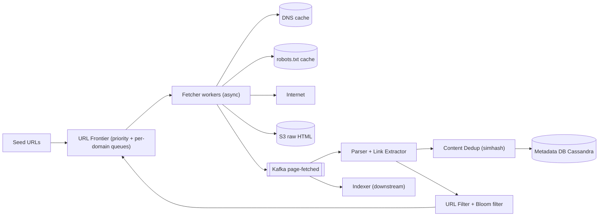
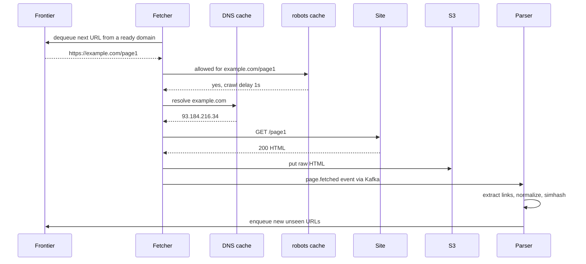
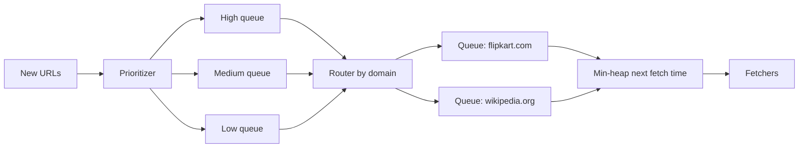

# Design a Web Crawler

**In one line:** start from a few seed URLs, download pages from the internet, extract their links, and keep crawling further, so that **1B pages** can be stored for a search engine (Google) or a data pipeline. The core challenge is to do such a big crawl **fast, politely and without duplicates**.

**What the interviewer checks in this question:** URL frontier design (priority + politeness), dedup (URL and content), scale estimation, and handling crawler traps / failures.

---

## Step 1: Clarify with the interviewer (3–5 min)

| You ask | Typical answer | Effect on design |
|---|---|---|
| "What is the purpose? Search indexing or some specific data?" | Search engine indexing | Only HTML, store the full page |
| "How many pages and in how much time?" | 1B pages, in ~1 month | Throughput ≈ 400 pages/sec, distributed fetchers |
| "Only HTML, or images/PDF too?" | Only HTML | Content-type filter |
| "Must we follow robots.txt? Politeness?" | Yes, required | Per-domain queue + delay |
| "Do we recrawl? Freshness?" | Yes, popular pages sooner | Priority + recrawl scheduler |
| "JavaScript-rendered pages?" | Out of scope / brief | Mention a headless browser |
| "Do we handle duplicate content?" | Yes | Hash/simhash dedup |

> **Say:** "I will design the crawler as a pipeline: frontier → fetch → parse → dedup → store, with links going back into the frontier. Two things matter most: politeness (don't overload any site) and dedup (don't do the same thing twice)."

## Step 2: Requirements

**Functional**
1. Start from seed URLs and fetch pages
2. Parse HTML, extract new links and put them in the frontier
3. Store raw HTML + metadata (for the indexer)
4. Follow robots.txt and crawl-delay
5. Recrawl pages periodically

**Non-functional**
- **Scale:** 1B pages, horizontally scalable
- **Politeness:** max ~1 request/sec per domain (or the crawl-delay from robots.txt)
- **Robustness:** no crashes from bad HTML, timeouts, traps, server errors
- **Efficiency:** skip duplicate URLs and duplicate content
- **Extensibility:** new content types / processors can be plugged in

## Step 3: Estimation (only what changes the design)

- 1B pages / 30 days ≈ 33M/day ≈ **~400 pages/sec** avg, peak ~1,000/sec.
- Avg page 100 KB → **100 TB** of raw HTML. ~25 TB after compression. So a blob store like S3.
- One fetch takes ~500ms–2s (network bound). One machine handles ~500 concurrent async connections → ~300 pages/sec. **~5–10 fetcher machines** are enough, 20 for safety.
- URL dedup: 1B+ URLs (and ~10B seen links). An exact set needs 10B × 50 bytes = 500 GB. A **Bloom filter** (1% false positive) ≈ 10 bits/URL → ~12 GB. It fits in RAM.
- Bandwidth: 400 × 100 KB = **40 MB/s ≈ 320 Mbps**.

> **Say:** "The bottleneck is not CPU, it is network and politeness. So I use async I/O fetchers, and a Bloom filter for URL dedup because the exact set is too big."

## Step 4: Core entities

- **URL record**: url, url_hash, domain, priority, last_crawled_at, next_crawl_at, status, depth
- **Page**: url_hash, s3_path, content_hash, simhash, http_status, fetched_at
- **Domain**: domain, robots_rules, crawl_delay, last_fetch_at, ip
- **Frontier item**: url, priority, domain (in the queue)

## Step 5: APIs

The crawler is an internal system with no public API. Internal interfaces:

```http
POST /seeds            {urls: [...]}                  → 202 (add to frontier)
GET  /crawl/status     ?url=https://example.com/a      → {lastCrawled, status, s3Path}
POST /crawl/priority   {domain, boost}                 → 200 (news sites boost)

Event: page.fetched  {urlHash, s3Path, contentHash}    → Kafka topic for indexer
```

> **Say:** "There is no outside user, so I will focus on the contracts between components: the frontier's enqueue/dequeue and the page.fetched event."

## Step 6: High-level design



**Why each component:**
- **URL Frontier:** what to crawl and when. Priority (important pages first) + politeness (only one fetch per domain at a time).
- **Fetcher workers:** async HTTP (thousands of connections on one machine). Timeout, max size (e.g. 5 MB), redirect limit.
- **DNS cache:** a DNS lookup can take 10–200ms and becomes a bottleneck. Local cache with TTL.
- **robots.txt cache:** fetch each domain's robots.txt once and cache it for ~24 hr.
- **S3:** cheap and durable for 100 TB of raw HTML.
- **Kafka:** decouples fetch and parse. If the parser is slow, the fetcher doesn't stop.
- **Parser:** extracts links from HTML, makes relative URLs absolute, normalizes them.
- **URL Filter + Bloom:** removes URLs that are already seen, blocked, or trap-like.
- **Content Dedup:** the same/near-same content is not stored/indexed again.
- **Metadata DB (Cassandra):** billions of URL records, write-heavy, simple key lookups.

## Step 7: Main flow: crawling one URL



## Step 8: Data model & DB choice

```text
url_records (Cassandra, partition key = url_hash):
  url_hash, url, domain, priority, depth, status, last_crawled_at, next_crawl_at, content_hash

domains (Cassandra / Redis):
  domain, robots_txt, crawl_delay_ms, next_allowed_fetch_at

S3 layout:
  s3://crawl/2026/10/03/<url_hash>.html.gz
```

- **Cassandra:** billions of rows, write-heavy (update on every crawl), lookup by key. No joins needed.
- **S3:** raw content. Write it in batches into big WARC files (small files are expensive on S3).
- **Bloom filter:** Redis (RedisBloom) or in-memory on each frontier node, with periodic checkpoints.

## Step 9: Deep dives (the interviewer will push here)

### 9.1 URL Frontier: priority + politeness
Two levels of queues (Mercator design):
1. **Front queues (priority):** put each URL into high/medium/low queues based on its priority score (PageRank, domain importance, freshness need). The selector picks from the high queue more often.
2. **Back queues (politeness):** each domain has its own FIFO queue. A **min-heap** keeps `(next_allowed_time, domain)`. The fetcher takes the domain whose time has come from the heap, fetches one URL, and sets `next_allowed_time = now + crawl_delay`.



- Distribute: shard the frontier by the **hash of the domain**. A domain always lives on one node, so politeness is enforced locally and no distributed lock is needed.
- The frontier is very big (billions of URLs), so queues are disk-backed (RocksDB/Kafka), with only the head in memory.

### 9.2 URL dedup: Bloom filter
- First **normalize**: lowercase the host, remove the default port, remove the fragment (`#...`), sort query params, remove tracking params (`utm_*`).
- Then `bloom.mightContain(url)`. Not there → definitely new, enqueue it. There → maybe seen, skip it.
- A false positive means some new URLs will be missed (~1%). That is acceptable for a crawler. There is never a false negative.
- If you need an exact check, look it up in Cassandra on a Bloom positive (two-step).

### 9.3 Content dedup: hash and simhash
- **Exact duplicate:** SHA-256 / MD5 of the body. If the same hash already exists → don't store it, just link the URL to the canonical one. ~30% of pages on the web are duplicates/mirrors.
- **Near duplicate:** the same article with different ads/timestamp. **SimHash** (64-bit fingerprint): fingerprints of similar docs differ in only a few bits. Hamming distance ≤ 3 → treat as a duplicate.
- Also respect `<link rel="canonical">`.

### 9.4 Crawler traps and bad sites
- **Infinite URLs:** calendars (`/2026/10/04`, `/2026/10/05`...), session IDs, `?page=1..∞`. To stop them: **max depth** per domain, **max URL length** (~2,000 chars), **max pages per domain** per crawl cycle, and detect repeating path segments (`/a/b/a/b/a/b`).
- **Spider traps / slow servers:** strict timeout (10s), max response size, and back off a domain if its error rate is high.
- A blocklist for spam/malicious domains.

### 9.5 Recrawl and freshness
- Each URL has a `next_crawl_at`. A news homepage every 15 min, a blog post every month.
- **Adaptive:** if the content_hash is the same on recrawl → double the interval. If it changed → halve the interval.
- **Conditional GET** (`If-Modified-Since`, `ETag`) → 304 Not Modified, which saves bandwidth.
- The scheduler puts due URLs back into the frontier with a priority. Sitemaps (`lastmod` in `sitemap.xml`) also give signals.

## Step 10: Decision table (what we chose, why, and what we did not)

| Decision | Why we chose it | What we did not choose, and why |
|---|---|---|
| **Two-level frontier (priority + per-domain queues)** | Important pages first, and politeness is guaranteed | **Single FIFO queue:** thousands of URLs from one domain line up, hammering the site, and no priority |
| **Shard frontier by domain hash** | A domain's politeness lives on one node, no lock | **Shard by URL hash:** a domain's URLs spread across all nodes, needing a distributed lock/rate limit for politeness |
| **Bloom filter for URL seen** | 10B URLs in ~12 GB, O(1) | **Exact hash set:** ~500 GB RAM. **DB lookup on every link:** billions of reads, slow |
| **SimHash for near-dup** | Catches duplicates even when ads/timestamps differ | **Only exact hash:** misses near duplicates, wastes storage and index |
| **S3 for raw HTML** | 100 TB cheap and durable, the indexer can read it in batch | **HTML blob in a database:** costly, DB bloat, slow scans |
| **Cassandra for URL metadata** | Write-heavy, billions of rows, key lookups | **Postgres:** manual sharding at this scale and limited write throughput. No need for transactions |
| **Kafka between fetch and parse** | Decoupling, backpressure, replay | **Parse inside the fetcher:** if the parser is slow or crashes, fetching stops |

## Step 11: Failures & bottlenecks

| What failed | What happens | How to handle it |
|---|---|---|
| Fetcher machine crash | In-flight URLs lost | Lease/visibility timeout in the frontier. If no ack comes, the URL goes back to the queue |
| DNS slow / down | Fetches stop | Local DNS cache, multiple resolvers, prefetch DNS when the URL is enqueued |
| Site 5xx / timeout | Retries put more pressure on the site | Exponential backoff per domain, max 3 retries, then low priority |
| Crawler trap | Frontier fills up with one domain | Max depth, max pages per domain, URL pattern detection |
| Frontier node down | Its domains are not crawled | Disk-backed queues + replica, reassign domains with consistent hashing |
| Bloom filter lost | Duplicate crawls | Periodic snapshot to S3, reload on restart |
| Hot domain (wikipedia) | One queue gets very long | Stay within politeness, but use multiple IPs/connections if allowed |

## Step 12: How to make it better (say this yourself at the end)

> "If I had more time, I would improve these:"
- **JS rendering:** a headless Chrome pool for SPA sites, only for domains where the HTML comes back empty (it is expensive).
- **Geo-distributed fetchers:** fetch from near the site's region, lower latency and bandwidth.
- **Smarter priority:** ML-based crawl scheduling from PageRank + click data + change rate.
- **WARC format + compaction:** pack small pages into big files to cut S3 cost.
- **Observability:** dashboards for pages/sec, per-domain error rate, frontier size, dedup ratio.
- **Ethics/legal:** sitemap-first crawling, opt-out handling, filters for PII.

## Step 13: Likely follow-up questions

- "How will you avoid overloading a site?" → Per-domain back queue + min-heap next_allowed_time + robots crawl-delay (Step 9.1)
- "How do you avoid crawling the same URL again?" → Normalize + Bloom filter (Step 9.2)
- "Isn't the Bloom filter's false positive a problem?" → ~1% of new URLs will be missed, acceptable for a crawler, and there is never a false negative
- "Duplicate content from mirror sites?" → SHA hash for exact, SimHash for near-dup
- "Infinite calendar pages?" → Max depth, max pages per domain, URL length limit
- "How many machines do we need?" → ~400 pages/sec, one async fetcher does ~300/sec, so 5–10 + headroom
- "What if a page is updated?" → Adaptive recrawl + conditional GET

## 2-minute recap

> A crawler is a pipeline: seed URLs → frontier → fetchers → S3 → Kafka → parser → dedup → back to the frontier. 1B pages/month ≈ 400 pages/sec, 100 TB of HTML, and the bottleneck is network and politeness. The frontier has two levels: priority queues (important first) and per-domain back queues with a min-heap (crawl-delay per domain). The frontier is sharded by domain hash, so politeness stays local. DNS and robots.txt are cached. URL dedup is normalize + Bloom filter (~12 GB), content dedup is SHA hash + SimHash. For traps: max depth, max URL length, max pages per domain. Metadata in Cassandra, raw HTML in S3. Recrawl uses adaptive intervals + conditional GET.

## Checklist

- [ ] I can estimate throughput, storage and machines for 1B pages without looking
- [ ] I can draw the two-level URL frontier (priority + politeness) diagram
- [ ] I can tell the reason for sharding the frontier by domain
- [ ] I can explain URL normalization and Bloom filter dedup
- [ ] I can tell the difference between exact hash and SimHash content dedup
- [ ] I can say 3 defenses against crawler traps
- [ ] I can explain recrawl freshness (adaptive interval, conditional GET)
- [ ] I can say 3 trade-offs from the decision table without looking
